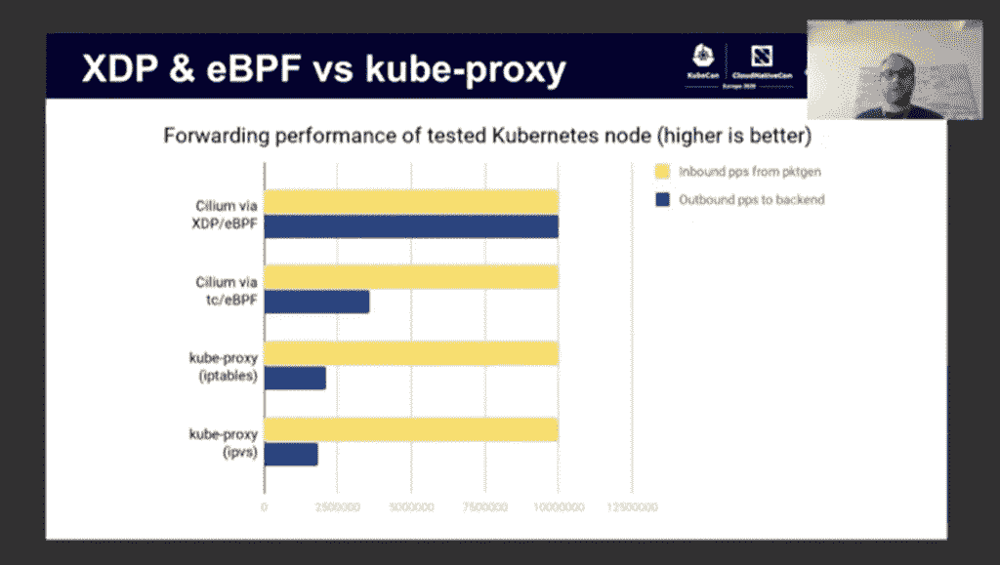

# eBPF 如何将 Linux 变成可编程内核

> 原文：<https://thenewstack.io/how-ebpf-turns-linux-into-a-programmable-kernel/>

在最近的 [KubeCon + CloudNativeCon EU](https://thenewstack.io/kubecon-eu-cloud-native-developers-now-an-army-6-5-million-strong/) 虚拟会议期间的[技术会议上，](https://www.youtube.com/watch?v=99jUcLt3rSk) [Cilium](https://cilium.io/) 的 Linux 内核工程师 [Daniel Borkmann](http://borkmann.ch/) 认为，鉴于[扩展的 Berkeley 包过滤器](https://ebpf.io/) (eBPF)的全部承诺，Linux 内核可以看到其操作方式的根本转变。

尽管最初的目标[是为了更好的内核监控](https://thenewstack.io/linux-technology-for-the-new-year-ebpf/)，但这种原始 BPF 的内存映射扩展可以在内核空间内运行任何沙盒程序，而无需更改内核源代码或加载模块。这代表了一种全新的、可能更快、更安全的使用 Linux 内核的方式。实际上，eBPF 为开发人员提供了一种将他们自己的程序添加到内核本身的方法。

博克曼甚至预测，Linux 内核可能会演变成一个“eBPF 驱动的微内核”，一个具有最小内置功能的微小核心内核。所有其他功能，包括最终用户自定义的功能，都是 eBPF 功能。

例如，有一天，Kubernetes 将基于底层工作负载，在数据中心或小型 edge 系统中提供一组定制的内核扩展。如今，使用 eBPF，Cilium 为 Kubernetes 提供了一个容器网络接口(CNI ),它可以强制执行网络流量规则，提供负载平衡，并且可以被 Cilium 证明是一个更快的替代 KubeProxy。哈勃[项目](https://cilium.io/blog/2019/11/19/announcing-hubble/)[建立在这项工作](https://www.youtube.com/watch?v=8WCbGSCyDSo&t=1382s)的基础上，提供 Kubernetes 的可观测性，同样使用 eBPF。

博克曼回忆说，当 2013 年升级首次提供给内核管理员时，它被拒绝，因为它是一个大补丁炸弹。考虑到这一点，eBPF 的设计者后退一步，开始增量地、显著地升级内核现有的 BPF。他们大幅扩展了指令集，用一个新的解释器替换掉了解释器，并添加了一个验证器来确保代码对于内核来说是正确的。因此，eBPF 现在完全是内核本身中的一个虚拟机。

今天，通过脸书的每个包裹都由 eBPF 处理。Borkmann 说，Cloudflare 也在很大程度上部署了它。网飞已经开始使用 eBPF T1 在内核中安全地运行它的程序，网飞内核工程师 T2 称之为 T4 对 50 年内核模型 T5 的根本改变在 eBPF 的基础上，微软 Azure 首席技术官 Mark Russinovich 正在为他引以为豪的 Linux Sysmon 监控程序编写一个版本。

使用 [eBPF](https://man7.org/linux/man-pages/man2/bpf.2.html) ，开发人员用 C 的子集编写代码，这些代码被编译成 BPF 字节码，以便在 BPF 虚拟机上运行。软件工程师 [Liz Rice](https://www.lizrice.com/) 在 Dockercon 2019 她的 eBPF 演讲中解释说，在对代码进行安全检查后，即时编译器会将字节码转换为特定于架构的机器代码。另一个项目，BPF 编译器集合(BCC ),正在为 Python 开发一个语言包装器，使其更容易编码成 BPF。

然后，成功编译的机器码被附加到内核的代码路径上，当被遍历时，执行任何附加的 eBPF 程序。所有用户都可以通过共享内存映射来访问状态。

启动 eBPF 功能需要某种事件、网络数据包的到达、来自跟踪点的数据点或来自应用程序的信号。Rice 指出，eBPF 优于标准用户空间函数的一个优点是，它可以根据流经内核的数据包内容或其他数据位做出逻辑决策。每个函数被限制在 4096 条指令以内，尽管通过将较小的函数链接在一起可以创建更大的函数。

[https://www.youtube.com/embed/99jUcLt3rSk?feature=oembed](https://www.youtube.com/embed/99jUcLt3rSk?feature=oembed)

视频

[https://www.youtube.com/embed/4SiWL5tULnQ?start=520&feature=oembed](https://www.youtube.com/embed/4SiWL5tULnQ?start=520&feature=oembed)

视频

[https://www.youtube.com/embed/8WCbGSCyDSo?start=1382&feature=oembed](https://www.youtube.com/embed/8WCbGSCyDSo?start=1382&feature=oembed)

视频

<svg xmlns:xlink="http://www.w3.org/1999/xlink" viewBox="0 0 68 31" version="1.1"><title>Group</title> <desc>Created with Sketch.</desc></svg>