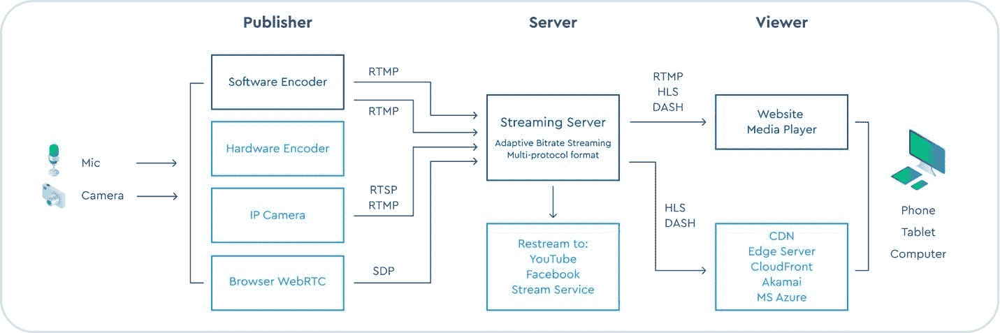

# 边缘计算如何让流媒体完美无瑕

> 原文：<https://thenewstack.io/how-edge-computing-makes-streaming-flawless/>

 [那仁·穆西亚

那仁领导考克斯通信公司的边缘云服务考克斯边缘的战略和业务设计职能。他在业务和增长战略、上市规划、营销战略和产品开发方面拥有多年的经验。在 Cox Edge，他负责推动增长、战略规划、确定机会空间、建立战略合作伙伴关系和 GTM 战略。](https://www.linkedin.com/in/naren-muthiah-240a934/) 

现在是晚上。你穿上潜水服，进入笼子，恐惧和兴奋的混合物在你的血管中流动。这是你作为深海探险者的第一个晚上，当笼子下降到寒冷黑暗的海里时，你不禁注意到有些事情不太对劲。当笼子下降 100 米时，你打开头盔的手电筒，上下左右旋转相机，获得周围 360 度的视野。

就在你的眼睛适应海浪下的世界时，你不希望看到的东西出现在你面前，一只大白鲨。它全速冲向你的笼子，没有任何警告。你失去了平衡。你的手臂滑过栅栏。鲨鱼强有力的下颚张开，咬住你裸露的前臂。

你尖叫。笼子在剧烈的颤抖，鲨鱼还在试图钳住你的手臂。然而，奇迹般的是，你真正的手臂没事，真正的你远离那条鲨鱼的魔爪。一切都是一样的，除了你不是真的在水里的笼子里。你在一个 360 度的电子游戏中。

欢迎来到沉浸式互动媒体的世界。这些下一代应用将虚拟体验带入生活，为此，先进的技术支持是必要的。这就是边缘计算产生重大影响的地方。360 是一种视频格式，与传统视频不同，它可以捕捉你周围的内容。它允许观众从各个角度探索环境——前面、后面、侧面、上面、下面和周围。因此，你可以探索环境的一个方面，而摄像师在那个时间点不一定关注这个方面。

媒体制作工具、智能设备和高速互联网的广泛使用促进了沉浸式互动技术的发展，如 360 度视频、互动多视图流、虚拟视图生成和视图切换。这些应用不能容忍延迟，并且需要实时响应来维持用户的体验质量(QoE)。它们也非常需要带宽，导致带宽成本和能耗不断攀升。

## 边缘计算优势

由于视频流量占所有互联网流量的 80%以上，直播流量占下游互联网流量的 60%以上，因此必须解决带宽利用率以及不断攀升的带宽和能源成本带来的挑战。

边缘计算可以帮助降低延迟和带宽成本，使处理和存储离用户更近，从而提高实时流媒体性能。

### **直播架构**

接下来，让我们从高层次了解一种可能的直播架构。

摄像头和麦克风将数据发送到编码器，编码器将数据发布到流媒体服务器(源服务器)。今天，观众直接从流(源)服务器获取流。这使流面临互联网拥塞，从而增加延迟和响应时间，同时降低 QoE。

借助边缘计算，流媒体服务器遍布世界各地。它们从源服务器接收流，并将用户连接到离他们最近的边缘服务器。领先的云提供商在全球的最后一英里数据中心配置边缘服务器，作为其内容交付网络(CDN)服务的一部分。内容提供商将流传送到离用户最近的边缘服务器。因为数据直接从边缘服务器流向用户，所以可以减少延迟和响应时间。

让我们看几个边缘计算如何帮助交互式媒体和视频流的使用案例。

**多视图流**

这包括从不同视点的多个摄像机同时捕获的多个视频流。它们使观众能够从不同的角度观看视频或现场活动。

多视图视频可以通过两种方式进行转码:

*   作为单个视频，使用多视图视频编码(MVC)，因此用户可以切换到任何可用的视图。
*   或者对每个流进行单独编码，以切换到视频中的特定视图或可用视图的子集。这种类型的转码称为交互式多视图视频流(IMVS)。

**MVC**

使用 MVC，用户不会体验到任何切换延迟，因为所有视图都编码在一个视频中。然而，这确实增加了视频的大小，导致高质量流传输的更高带宽使用。资源受限的智能手机和其他电池供电设备无法满足这些需求。

**IMVS**

交互式多视图流(IMVS)消耗更少的带宽，因为有限数量的单个流被发送给用户。

在 IMVS 中，每个视图都是单独编码和流式传输的，这是 MVC 的一个明显优势。然而，在 IMVS 的情况下，流是从内容提供商的源服务器获取的，这增加了延迟，因为在最终用户和源服务器之间有更多的跳跃。对于直播视频来说，这可能是一个障碍。

此外，如果源的比特率高于用户端可用的网络吞吐量，质量将受到影响，尤其是在直播视频的情况下。

提供商可以使用 edge 技术来帮助解决高带宽使用率、切换延迟和特定比特率编码等问题。

## **边缘计算和媒体流**

由于边缘网络通常离用户更少的跳跃，所请求的视图可以以最小的延迟从边缘服务器流出。与直接从内容提供商流式传输相比，这可以减少等待时间。

此外，如果由于带宽和 CPU 容量有限，边缘的流媒体内容的比特率高于用户可以处理的比特率，边缘服务器可以立即将较高比特率的视图转码为较低的视图，从而提高用户的体验质量。

来自边缘的单个流也可以服务于多个用户，从而减少与从可能有多跳距离的服务器向用户进行流传输相关的互联网带宽成本。

自由视角视频由 MVC 视频生成，允许用户交互地改变视角和方向。每个视图可以是由摄像机捕获的真实视图，也可以是由相邻视图和相关信息生成的虚拟视图。可以为 2D 和 3D 视频生成自由视图流，并且通常在用户端完成。

然而，增加的带宽需求，加上生成虚拟视图所需的额外资源，会使轻量级的电池供电的用户设备不堪重负。这会导致视图生成延迟，对最终用户 QoE 产生负面影响。

借助边缘计算，提供商可以将虚拟视图生成卸载到边缘服务器。虚拟视图的生成也可以根据边缘或客户端的带宽和资源进行调整。

随着互联网上直播视频流数量的增加以及边缘计算为交互式媒体和视频流平台带来的性能优势，加入边缘计算潮流可能是内容和 CDN 提供商的合理选择。

<svg xmlns:xlink="http://www.w3.org/1999/xlink" viewBox="0 0 68 31" version="1.1"><title>Group</title> <desc>Created with Sketch.</desc></svg>