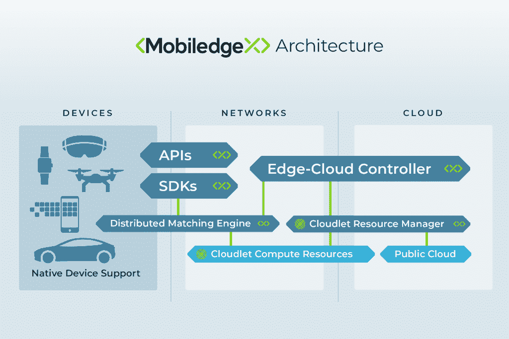
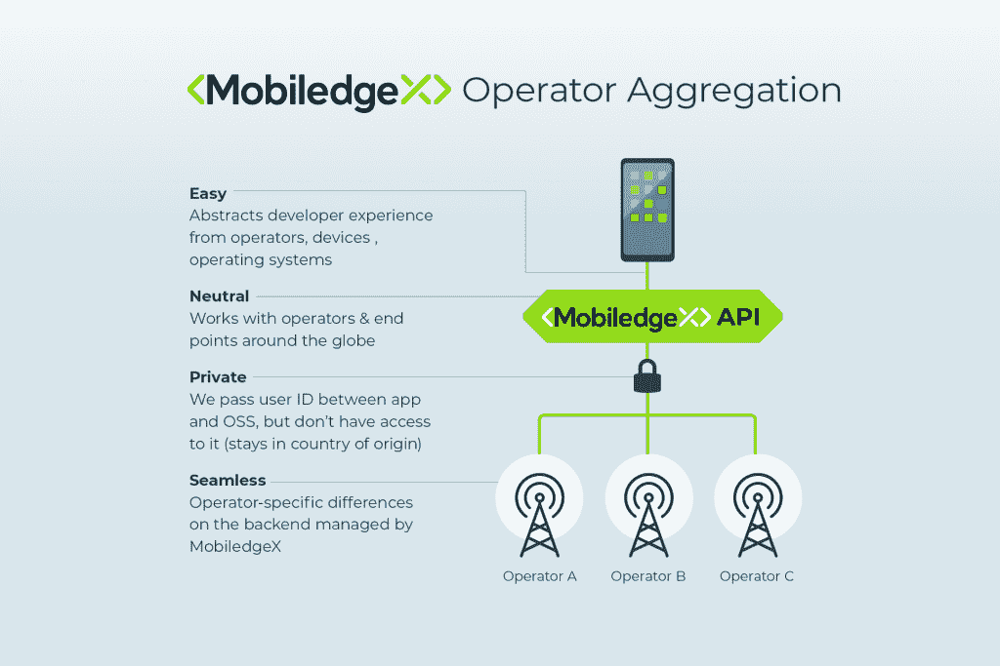

# 边缘计算将如何兑现 5G 的承诺

> 原文：<https://thenewstack.io/how-edge-computing-will-deliver-on-the-promise-of-5g/>

前几年在巴塞罗那世界移动通信大会(移动消费电子的顶级世界大会)上，关注的主题是让下一个 10 亿人上网。在今年的活动中，你走一分钟都会有人吹捧 5G 的承诺，5G 是下一代蜂窝移动通信，有望带来更高的数据速率、更低的延迟和大规模设备连接。

唯一的问题是，对于普通消费者来说，5G 并没有那么激动人心。借助 4G 甚至 3G 连接，我们几乎可以实现我们所能想象的一切。此外，大多数提供商、电话和本地基础设施仍然不支持它。当你走过所有浮华的展台和搭配运动鞋的西装时，5G 开始感觉像是一项损失的投资。

那是因为它不是为我们准备的。像大多数技术进步一样，工业将会是第一位的。5G 的承诺在于成群的无人机和自动驾驶汽车。它是在轻量级工业可穿戴设备中快速处理关键信息。是在机器人身上。是的，它就在我们一直期待的增强现实游戏《哈利·波特:巫师联合》中

5G 的承诺最有可能在边缘实现，从会议营销到现实世界的可行性。事实上，4G 已经可以提供类似 5G 的边缘计算体验。

## 边缘计算入门

那么边缘计算到底是什么？“边缘是任何接近用户的东西，” [MobiledgeX](https://mobiledgex.com/) 的首席技术官 Sunay Tripathi 说，该公司最近与德国电信合作进行了全球首个公共移动边缘网络部署。

这可能是你家里的设备，如 Apple TV 或 Alexa，也可能是街对面为你的邻居服务的服务器。对他来说，这是你的家庭互联网连接世界的方式。

特里帕蒂说，“让它在本地，尽可能靠近用户，减轻公共云的压力。”MobiledgeX 专注于设备移动性和利用附近的边缘服务器。

Tripathi 解释说“你有什么样的设备并不重要。最近的通勤方式。”

他说，MobiledgeX 利用运营商已经在网络上进行的数万亿投资来支持现有网络上用户之间低于 30 毫秒的通信——任何高于 30 毫秒的通信都会有滞后，这将对性能产生负面影响。

当 5G 可用时，速度可能会降至 10 到 20 毫秒。MobiledgeX 会自动搜索网络中尚未超额订阅的位置。

“如果你是一名移动用户，无论是一组汽车、卡车还是无人机，你都可以连接到最近的发射塔，我们会连接到你附近的基础设施。我们不会改变开发人员的工作流程，”Tripathi 说。

MobiledgeX 仍然部署在云中，在后端使用基于 lambda 的容器对其进行流式传输。

使用 MobiledgeX，开发人员只需为他们使用的东西付费，而它会自动找到最近的边缘计算机位置，在这段短时间内为用户提供服务。

Tripathi 举了一个 15 分钟沉浸式视频游戏的例子。设备和/或游戏开发人员通过边缘进行连接，但在这短暂的时间内，开发人员只需要在公共云中使用一个 CPU，而不是购买两到三个月的 CPU。

在传统的连接路径中，如果你在 10，000 个地点有 10，000 个用户，你必须支付 10，000 倍的费用。“公共云的部署不再是静态的，而是更加动态的，有更多的共享，”Tripathi 说。

## 5G 将真正发挥作用

Tripathi 表示，MobiledgeX 的第一年一直在缩小用例的范围，如机器人 3D 绘制空间地图以帮助工人提高生产力，或者需要在多个设备上实时处理大量数据的丰富视频流。

他继续说，需要在边缘进行 5G 处理，以追求更自然的界面趋势，这种界面将视频和音频——“我们可以看到和感觉到的东西”——与更轻的设备结合起来。

“数字世界正在走向这样一个地方，如果你从客户端看，我们越来越不使用键盘，但是，如果你从后端看，它仍然是为更多的键盘和静态应用而设计的，”特里帕蒂说

如果您正在以一种要求更多处理需求的方式处理大量音频和视频，那么您需要边缘计算。然而，当需要更小的设备时，这也是必要的。

与此相呼应的是， [1000 Realities](http://1000realities.io/) 的联合创始人 Justyna Janicka 告诉新堆栈，微软的混合现实耳机 [HoloLens](https://www.microsoft.com/en-us/hololens) 对于实际的工业物联网(IIoT)应用来说过于庞大。在相邻的图片中，她展示了如何将 MobiledgeX 上运行的 1000 Realities 应用程序与 5G 相结合，使更轻便的智能眼镜能够使用增强现实来快速扫描数据中心服务器的温度。没有 5G 的边缘计算，这样一个轻量级的设备无法处理这种处理速度。

当您有许多用户并且想要创建丰富的多媒体体验时，边缘计算具有成本效益和 CPU 效益，在这种情况下，您不能将负载降至 3G。

## 边缘将推动 5G 的发展(以及应用开发者的利润)

5G 的第一个广泛使用案例是增强现实发电站 Pokemon Go。数百名怪物捕手会聚集在公园里，破坏附近所有人的手机信号。与发射塔连接的 4G 网络根本不具备在众多设备上播放流媒体视频和增强现实的带宽。

德国处于 5G 的前沿，德国电信已经进行了巨额投资。到 2020 年，我们将看到世界上相当多的主要城市拥有 5G 连接，尽管到那时手机是否会赶上仍有待观察。

目前，在西方世界一些最拥挤的地方——纽约时代广场或伦敦金丝雀码头金融区——公共云上的用户太多了，每个人都因为网络跟不上而被降到 2G。

发生这种情况是因为一切都连接到公共云，而典型的服务提供商只有大约三到四个对等点——它们允许用户之间的信息交换。想象一下，如果 100 个人在一个增强现实版的两周游戏中一决高下。

Tripathi 认为，在设备和边缘之间，有足够的带宽来实现视频内容和沉浸式体验上的多点设备到设备的交互。

他还认为，我们将很快看到收入模式从最大的云提供商转向提供基础设施和拥有应用程序的人

“目前，云提供商赚的钱不成比例，因为每个人都必须生活在公共云中，”Tripathi 说。

他继续说，基础设施支出已经完成，云运营商已经在使用它。边缘计算将让每个人都能更有效地使用它。

Tripathi 表示，从这种向边缘发展的趋势中受益最大的公司是许多拥有 40 到 100 名开发人员的小型应用开发公司。

“小公司并没有意识到 edge 正在形成，他们实际上可以构建自己的应用程序来支持 edge，并获得一整套其他的客户和体验，”他说，希望他可以提高这种意识。

这些开发者认为他们不能在 4G 带宽上制作丰富的视频。Edge 已经可以在今天的 4G 网络上部署，这实际上使开发人员能够提供类似 5G 的功能，包括丰富的视频交互。

“最难的是接触这些小开发商。他们只需要知道 edge 的存在，以及构建它需要什么——我们[已经]有稳定的软件和 edge 位置，”Tripathi 说。

虽然今年的世界移动通信大会对 5G 的普遍承诺感觉有点遥远，但边缘计算无疑可以帮助应用程序开发者实现这一承诺。

## 边缘计算将如何扩展 5G

那么，边缘计算将如何帮助 5G 实现规模化？

对于 Tripathi 来说，他认为这很简单，因为到 2019 年底，我们将看到超过 200 亿台设备连接起来，并大规模分布在世界各地。前几十亿是我们无处不在的智能手机，但其余的将由联网可穿戴设备、车辆和无人机主导。突然间，基础设施将不得不处理分布在 10，000 个地点的 10 亿多台设备。

不仅仅是大约 70%的人生活在城市，边缘计算还可以用于在农村社区使用更小、更高效的本地化服务器将下一个 10 亿人连接到网络上。

在接下来的十年里，Tripathi 认为边缘计算的影响力是公共云过去十年的十倍。他说，边缘计算将能够在更多的分布式位置和架构上每秒处理更多的客户端，处理两倍的规模。

在第一次采访时，德国大约有 5 名应用程序开发人员和 8，000 名用户在使用它。一周后，当我们在世界移动通信大会上面对面时，他们已经有了数百万用户，包括在会议场所周围设置的三台边缘服务器和在主要城市设置的几十台服务器。

美国是一个独特的使用案例，因为大多数国家都认为手机信号塔至少部分归公众所有。在美国，既不是服务提供商，也不是政府，主要是第三方私人企业皇冠城堡和美国塔在运营。

MobiledgeX 正在与新的堆栈赞助商 [Packet](https://www.packet.com/) 合作，他们正在这些塔上建立裸机基础设施。

“到下一届世界移动通信大会，我们在欧洲肯定会有更大的优势，在美国的优势将开始形成，”Tripathi 说。

“对于开发者社区来说，世界是一个全球化的市场。当美国和世界其他地区推出 edge 时，你可以从德国开始受益。”

**<svg xmlns:xlink="http://www.w3.org/1999/xlink" viewBox="0 0 68 31" version="1.1"><title>Group</title> <desc>Created with Sketch.</desc></svg>**