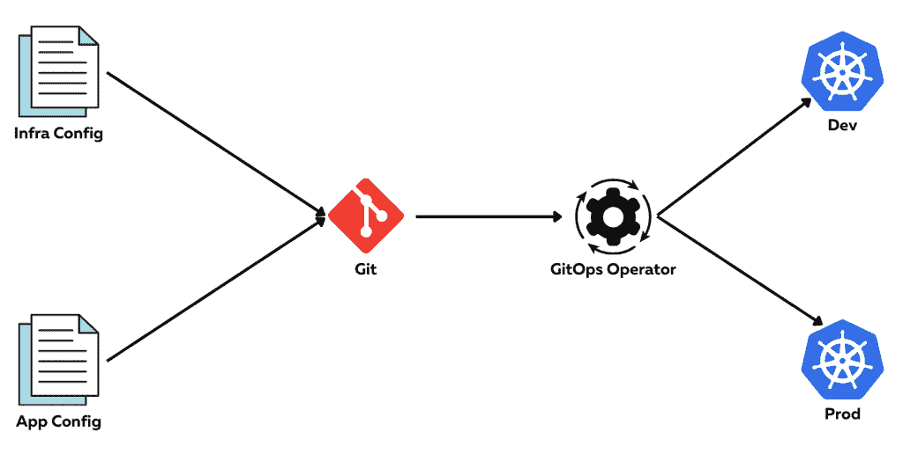

# 企业如何从 GitOps 中获益

> 原文：<https://thenewstack.io/how-enterprises-can-benefit-from-gitops/>

 [帕万·贝拉加蒂

帕万·贝拉加蒂(Pavan Belagatti)是全球 DevOps 的影响者、科技作家和讲故事者。目前，他是 Harness.io.](https://www.linkedin.com/in/pavan-belagatti-growthmarketer/) 的开发者倡导者

随着企业变得更加软件驱动和数字化，他们转向软件交付和数字化转型来推动增长。在这个数字时代，软件是企业各个方面的核心。开发人员成为焦点，而软件驱动组织的成长。因此，组织需要选择正确的技术、工具和实践来帮助他们的开发人员更好地工作。

公司已经接受了代码审查和代码优化的想法(这是代码审查的下一个阶段),以帮助开发人员编写更好的代码。同样，他们还采用了 DevOps 和其他云原生最佳实践，以使整个软件部署过程非常顺利。 [GitOps](https://harness.io/blog/devops/what-is-gitops/) 是该行业的新成员，使软件部署变得容易。这也是近年来在软件开发市场上流行的一个术语。本文探讨了 GitOps 的概念。

## 什么是 GitOps:详细介绍

“GitOps”一词是由 Weaveworks 的亚历克西斯·理查森在 2017 年创造的。 [GitOps](https://thenewstack.io/what-is-gitops-and-why-it-might-be-the-next-big-thing-for-devops/) 是一种云原生方法，旨在通过使用 [git 开源版本控制系统](https://thenewstack.io/tutorial-git-for-absolutely-everyone/)作为单一事实来源，利用推/拉机制的力量来加快软件部署过程。它提高了 Kubernetes 相关部署的 CI/CD，并以简单的方式管理基础设施。它采用更全面的方法来管理代码，从而更容易跟踪代码变更。

它是传统实践 [CI/CD](https://harness.io/blog/devops/what-is-ci-cd/) (持续集成和持续交付)的发展，旨在自动化整个部署流程。Git 被用作所有基础设施和应用程序代码变更的唯一真实来源。GitOps 为基础设施创建了一个自动化部署管道。目标是让开发人员在不了解底层系统的情况下就基础设施变更进行协作成为可能。这样，开发人员可以在自己的环境中处理代码，而不用担心影响生产系统。

简而言之，GitOps 是一个 [DevOps](https://thenewstack.io/category/devops/) 实践，用于提供对生产环境的可见性。它提供了对生产环境所做更改的审核跟踪，这在故障排除过程中很有帮助。这也使得确定何时由谁进行了更改变得更加容易。GitOps 还提供了一种简单的方法来回滚任何可能导致生产问题的更改。

很多人可能会问，“GitOps 和 DevOps 有什么不同？”下面是一个比较图表，不言自明。

## GitOps 和 CI/CD:携手并进

鉴于当今软件开发的灵活性和敏捷性，大多数软件公司采用[连续交付](https://thenewstack.io/category/ci-cd/) (CD)模型是有意义的。软件开发已经变得持续，能够快速发布软件，迭代产品和服务以尽早发现缺陷，并根据需要扩展服务。重要的是要记住，任何软件开发方法都是一个连续的过程。即使当您采用更传统的软件开发模型时，您仍然在参与每个新版本的持续软件开发。为了保持软件开发过程的灵活性和一致性，您需要采用集成的软件交付模型，该模型无缝集成了软件开发的不同阶段。

持续集成和持续部署是迭代软件开发的关键支柱。这种方法包括在每次将代码推送到存储库时自动测试代码的过程，以及在每次准备发布新代码时自动合并来自不同开发人员的代码的过程。其结果是软件代码更快速的迭代和更简化的开发过程，导致更少的错误和更频繁的发布。

随着像 [Kubernetes](https://thenewstack.io/category/kubernetes/) 这样的云原生平台的出现和流行，GitOps 正在成为部署应用的默认方法。开发人员发现使用 GitOps 很有帮助，也很容易，因为它简单明了，学习曲线也很短。一种类似代理的技术将跟踪这些变化，如果实际状态和期望状态有任何差异，它将调整这些变化以满足期望状态——因此系统总是按照指定的方式运行。

GitOps 通过简单的拉取方法简化了管道管理。如果您在一个围绕软件修订的环境中工作，您肯定以前听说过“管道管理”这个术语。简而言之，连续交付管道是一系列旨在帮助开发人员频繁、可靠地发布代码的过程，这甚至可以通过 GitOps 进一步简化。

## 为什么 GitOps 很重要？

部署代码/软件的过程通常被认为是手工的，但现在不是了！迭代代码和部署代码不是开发人员喜欢手动做的事情，手动做是枯燥、耗时和乏味的。开发人员喜欢让他们的工作变得简单的超快的东西、工具和方法。使用 GitOps，部署软件、维护软件和跟踪软件的整个过程都变得很容易。

不仅如此，GitOps 不需要开发者学习另一个闪亮的新工具；它广泛使用 g it，开发人员已经是使用 git 的专家了。Git 及其健壮的扩展生态系统为开发人员提供了一种更有效的管理代码的方式。通过简单的拉/同步就可以看到所做的更改。GitOps 使配置管理和软件部署更加容易；这是开发人员喜欢做的事情，而不是乏味的硬编码配置和脚本。

## 如何开始使用 GitOps

对于一些人来说，GitOps 可能相对较新，可能需要一些指导。我们对 GitOps 在 [Harness](https://harness.io/) 的做法非常乐观，我们的工程师正在为您提供卓越的 GitOps 体验。由于 Harness 已经以其现代化的连续交付平台而闻名，我们知道如何优化工作流和管道来简化您的软件开发活动。

对于已经采用微服务和 DevOps 实践的公司来说，GitOps 是一个额外的优势。手动 CI/CD 和利用脚本来自动化管道花费了开发人员大量的时间和精力。因此，采用 GitOps 方法将解放您的开发人员，让他们专注于重要的事情。

我们假设你正在使用一个源代码控制管理系统，比如你的代码库所在的 GitHub，并且在用 Docker 练习容器化。下一步显然是使用像 Kubernetes 这样的编排系统来管理和部署您的应用程序，因为 [GitOps 与 Kubernetes](https://harness.io/gitops-beta/) 配合得很好。Kubernetes 通常被描述为一个声明性系统，我们通过 YAML 文件来指定事物。

GitOps 扫视并扫描我们的源代码控制库，在那里有我们的清单文件，并将其与生产中应该运行的文件进行比较。然后，如果清单文件中的某些内容发生了变化，或者发现了任何差异，它就会提取并开始同步这些变化，以保持实际状态和期望状态完全相同。通过这种方式，GitHub 成为了唯一的真相来源。使用 GitOps 的最终目标是以声明的方式管理整个系统和配置，而不仅仅是应用程序。

## 结论

随着越来越多的社区支持这种新方法，GitOps 继续获得牵引力，预计它将成为与 Kubernetes 合作的公司的标准部署实践。GitOps 让开发人员对他们的代码有更多的控制，并有助于加快部署。随着 Kubernetes 的迅速普及，GitOps 因祸得福，帮助企业以更简单的方式部署他们的软件。

让我们停止吧！

<svg xmlns:xlink="http://www.w3.org/1999/xlink" viewBox="0 0 68 31" version="1.1"><title>Group</title> <desc>Created with Sketch.</desc></svg>