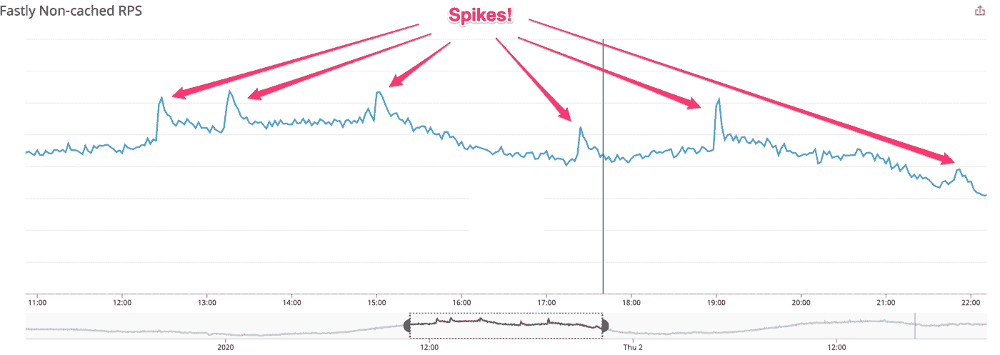

# Expedia 如何应对超级碗规模的流量高峰

> 原文：<https://thenewstack.io/how-expedia-prepped-for-superbowl-sized-spikes-of-traffic/>

在线旅行社 [Expedia](https://www.expedia.com/) 制作了 2022 年超级碗广告，目标是管理“流量激增”， [Juliette Howland](https://www.linkedin.com/in/jshowland/) 在她最近的[博客帖子](https://medium.com/expedia-group-tech/how-vrbo-and-expedia-lodging-prepared-for-2022s-super-bowl-lvi-984e8d4f2faa)中描述道。Howland 指出，可能发生的最糟糕的事情是经历“巨大的花费和努力”做好准备，然后发现“站点不能处理它”

为了应对潜在的激增，Expedia 遵循了一个类似的模式，在线度假租赁服务[Vrbo](https://www.vrbo.com/?k_clickid=CjwKCAjwqauVBhBGEiwAXOepkbdbEUN5j4fhNnsveR9iNqtrMQKt1bn1R0D8MRnQ2tEf-nf3laUyphoCL7oQAvD_BwE&ds_cid=71700000085605868&ds_kids=p65271459358&ds_kid=43700065271459358&ksprof_id=700000001561967&ksdevice=c&ktarget=kwd-13405466&kloct=&klocf=9004402&ds_aid=58700007275280782&ha_t=:g:&gclid=CjwKCAjwqauVBhBGEiwAXOepkbdbEUN5j4fhNnsveR9iNqtrMQKt1bn1R0D8MRnQ2tEf-nf3laUyphoCL7oQAvD_BwE&gclsrc=aw.ds)(Expedia 集团的[的一部分)已经发现多年来它自己的柑橘碗赞助是有效的。](https://www.expediagroup.com/home/default.aspx)

Vrbo 经历的是流量峰值非常快，从基础到峰值大约需要 1-2 分钟，而下降的时间稍长，为 5-15 分钟。由于自动缩放不会那么快发生，开发人员必须想出替代方案来应对这些峰值。

由于广告投放及其时机的波动性很大，除了关于广告本身、行动号召和时机的一般高层次信息之外，工程团队很难获得更多细节。然后，团队根据提供的信息做出决策，并在收到更多信息时做出调整。

为了做到这一点，团队必须“计划、准备和监控”大型广告活动/赞助。他们通过赛前测试和老式的工作人员点名来做到这一点。

## **测试**

Expedia 住宿页面上的峰值容量测试(pct)始于 2021 年春天，为一个不相关的项目做准备，并计划从 2022 年 1 月到 3 月初暂停，因为这几个月是 Vrbo 的历史高峰流量时间(Expedia 和 Vrbo 之间有共享服务)。随着超级碗广告的消息在 2021 年 11 月到达开发团队，决定在 2022 年初恢复 PCTs。

与 Vrbo 相比，Expedia 的 pct 仍处于早期阶段，包括一些最初的 GET 请求和几个 POST 请求，这些请求针对的是来自 Hotels.com 的最高流量和最有可能增加流量的页面。

为了模拟进入“旺季”时逐渐增加的流量，Expedia 开发人员进行了负载测试，包括逐渐增加流量 60 分钟，然后保持 30 分钟。

第一次估计的运行时间引起了工程团队的关注，因为据透露，除了官方的超级碗广告外，还有一个新的 Vrbo 活动在超级碗周日亮相。

由于没有发布具体的运行时间，工程师们不得不为最大的挑战做准备:如果广告在同一时间运行，共享服务将受到比平时高得多的流量的冲击。

开发人员开始运行“串联测试”，这意味着同时执行 Vrbo 和 Expedia 住宿 pct。为了开始串联测试，Expedia 的流量是基于其他品牌过去超级碗广告的行业报告。Vrbo 使用了 2019 年至 2020 年柑橘碗的信息。

超级碗周日之前不久，官方公布了运行时间。Expedia 的广告计划在 Q1 播放，那里有大量观众要求进行更多的尖峰测试。Vrbo 广告将全部在赛前节目中播放，观众数量较少，这意味着不再需要尖峰测试。

由于自动缩放的速度不足以处理这些突发事件，工程团队的第一个想法是让所有团队尽可能多地进行预缩放。在发现他们达到了[亚马逊网络服务](https://aws.amazon.com/?utm_content=inline-mention)实例的上限后，他们在超级碗之前的最后几天进行了一些自动缩放和预缩放测试，以找到“最佳点”，在那里他们不会将实例推到崩溃的边缘，但仍然可以处理流量峰值。

## **点名**

点名的想法在 2020 年首次引入柑橘碗；由于可以立即采取行动，它帮助 Expedia 集团避免了停机。点名的基本意思是全体人员准备就绪，或者万一出了差错，所有可用的工程师随时待命。

让工程师在计算机旁准备好，可以消除等待开发人员到计算机前准备响应时的任何时间损失。如果当天早些时候不需要点名，当天晚些时候就取消点名。

由于 Expedia 集团在全球各地都有团队，因此在广告时段和周边时段，如果网站出现故障或在某个地方出现故障，总会有人主动监控网站和网站流量。

## **总之**

Expedia 团队的流量增加了，服务没有中断，用户体验也没有下降。关于如何为下一个高峰做准备，我们学到了“宝贵的经验”。

<svg xmlns:xlink="http://www.w3.org/1999/xlink" viewBox="0 0 68 31" version="1.1"><title>Group</title> <desc>Created with Sketch.</desc></svg>