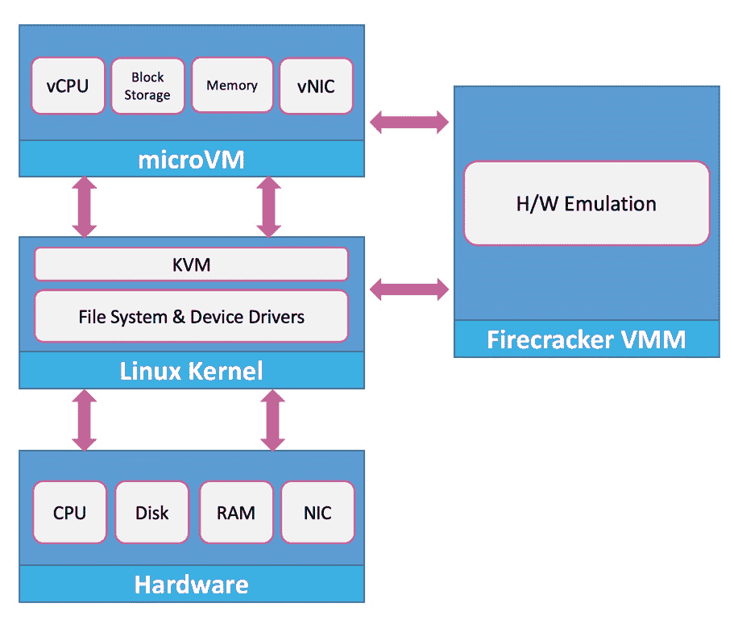

# 鞭炮如何点燃现代基础设施

> 原文：<https://thenewstack.io/how-firecracker-is-going-to-set-modern-infrastructure-on-fire/>

12 月 8 日更新，纳入了主题专家的意见。

上周 AWS re:Invent 发布的最令人兴奋的消息之一是鞭炮——这是一个开源项目，提供了容器的速度和虚拟机的安全性。这与亚马逊用于 AWS Lambda 和 AWS Fargate 的技术相同，它有可能颠覆当前的容器和无服务器技术。

作为一个对现代基础设施的发展有浓厚兴趣的人，我对鞭炮很感兴趣。我一从 re:Invent 回来，做的第一件事就是安装运行软件。看到我自己的 MacBook Pro 运行 100+微卷非常令人满意。我将带您完成在您的环境中设置它的步骤，而不需要在 EC2 中提供 i3.metal 实例。

## 容器与鞭炮

简单来说，[鞭炮是一个虚拟机管理器](https://github.com/firecracker-microvm) (VMM)，专门为运行瞬态和短命进程而设计。换句话说，它针对需要更快冷启动和更高密度的运行功能和无服务器工作负载进行了优化。

为什么不能用容器？当然，容器可以用于将功能作为服务来交付。但是真正的权衡是虚拟机提供的隔离。LXC 和 Docker 肯定比成熟的虚拟机更快更轻。但是，由于宽松的隔离级别，容器被认为不如虚拟机安全。此外，Docker 图像的大小可能会对函数的启动时间产生负面影响。

为了解决安全问题，平台公司如微软和 VMware 提倡每个容器一个虚拟机的架构。微软的 Hyper-V 容器和 VMware 的 vSphere 集成容器就是这种设计的例子。英特尔最近将其 Clear Containers 项目与 OpenStack 合并，用于 Kata Containers 计划，该计划遵循单虚拟机容器的相同方法。所有这些都是为了让容器和虚拟机两全其美。

在公共云上，我们以 Hyper.sh、Azure 容器实例、AWS Fargate 和 Google Cloud 无服务器容器的形式提供了这种架构的示例。

但是这些尝试都没有接近 AWS Lambda 的启动和执行速度。另一方面，有多个无服务器项目，如 Apache OpenWhisk、Kubeless、Project Fn、裂变，都是基于容器基础设施构建的。它们面临着与单虚拟机容器相同的挑战。

我个人认为容器和无服务器技术是相互正交的。它们旨在解决一系列非常不同的问题。从长远来看，试图交付基于容器的无服务器基础设施可能不是一个可行的选择。

所有基于容器实现无服务器的项目都应该全心全意地拥抱鞭炮。它很好地补充了容器，最棒的是它可以由 Kubernetes 管理。我们将在本系列的后面部分探讨这个想法。

## 鞭炮的幕后

爆竹采取了一种完全不同的隔离方式。它利用了 KVM 的加速，KVM 内置于 4.14 或更高版本的每个 Linux 内核中。KVM(内核虚拟机)是一种第 1 类虚拟机管理程序，它与英特尔和 AMD 提供的硬件虚拟化功能协同工作。

鞭炮值得关注的原因是它走了一条中间道路，将容器的速度与虚拟机的安全性结合起来。

在一个典型的基于 Linux 的虚拟化场景中，KVM 由另一个名为 QEMU 的虚拟机管理程序补充，该虚拟机管理程序模拟虚拟资源，如磁盘、网络、VGA、PCI、USB 和运行在 VM 中的来宾操作系统的串行/并行端口。QEMU 是运行在用户空间中的第二类虚拟机管理程序，它能够自己提供虚拟化。但是它必须翻译每一个需要在特权模式下运行的系统调用。这种转换将显著降低用户体验和虚拟机的整体性能。

QEMU 不负责特权系统调用的翻译和仿真，而是依靠 KVM 来加速这些调用，直到物理 CPU，它已经以英特尔 VT-x 的形式支持英特尔的硬件辅助虚拟化。这种架构是当今虚拟机管理程序和虚拟化技术中常见的架构。

正如您可以清楚看到的，在向客户操作系统提供更快的虚拟化方面，有三个参与者— QEMU、KVM 和硬件扩展。

鞭炮最有趣的部分来了——它简单地取代 QEMU 成为一个极简的虚拟机管理器，提供客户所需的最关键的虚拟资源。其余两层(KVM 和硬件辅助虚拟化)保持不变，提供加速。鞭炮运行在用户空间，同时与嵌入内核的 KVM 对话。

如果您刚刚阅读的内容听起来很吸引人，那么您应该探索英特尔环形架构的主题、Xen 虚拟机管理程序的发展、1 类和 2 类虚拟机管理程序的区别、准虚拟化与硬件辅助虚拟化、构建 KVM 的动机以及促使英特尔和 AMD 实现硬件辅助虚拟化的因素。

不幸的是，仅仅一篇文章就涵盖了很多内容。但当你彻底理解了进化，就会让你体会到鞭炮队所付出的努力。

根据官方的 FAQ，bracket 是 QEMU 的一个云原生替代方案，专门用于安全高效地运行容器，仅此而已。它为客户操作系统提供了所需的最小设备模型，同时排除了不必要的功能(只有 4 个模拟设备:虚拟网络、虚拟块、串行控制台和仅用于停止 microVM 的单键键盘控制器)。这一点，加上简化的内核加载过程，使启动时间少于 125 毫秒，并减少了内存占用。

鞭炮发射的微伏极其短暂。你只能通过 UART/串行控制台访问它们，因为它们甚至不运行 SSH。除了串行控制台，这些微型计算机还可以连接到虚拟网卡、块设备和单键键盘。这差不多就是您可以附加到虚拟机的内容。VMM 的这种简约设计使得鞭炮速度极快。根据官方说法，鞭炮在不到 125 毫秒内启动用户空间或应用程序代码，并支持每台主机每秒 150 微瓦的微瓦创建速率。

鞭炮进程通过一个 UNIX 套接字公开 REST API，这可以用来管理一个 microVM 的生命周期。该架构非常类似于 Docker 引擎，用于展示控制平面 API。虽然还没有 CLI，但是 cURL 可以用来将有效负载发送到 bargade REST 端点。

每个 microVM 作为主机操作系统中的一个进程运行，它与一个专用的套接字和 API 端点相关联。虚拟机还在众所周知的端点支持类似 EC2 的元数据，可用于服务发现和将任意数据存储为键值对。

AWS 包含了一个狱卒，它通过 cgroup、namespace 和 seccomp 隔离来提供额外的安全边界，从而保护 microVMs。

用 RUST 语言编写的鞭炮目前只能在英特尔处理器上运行，并支持 AMD 和 ARM。当它移植到 ARM 时，我可以看到这项技术如何改变物联网部署的面貌。Raspberry Pi 等业余设备和运行 ARM Cortex 处理器的工业级设备将运行包含代码的 microVMs，以从传感器获取数据或控制执行器。这将从根本上改变当今处理物联网和边缘计算的方式。

在下一期文章中，我将向您介绍设置和配置鞭炮的步骤以及路线图的概述。

<svg xmlns:xlink="http://www.w3.org/1999/xlink" viewBox="0 0 68 31" version="1.1"><title>Group</title> <desc>Created with Sketch.</desc></svg>