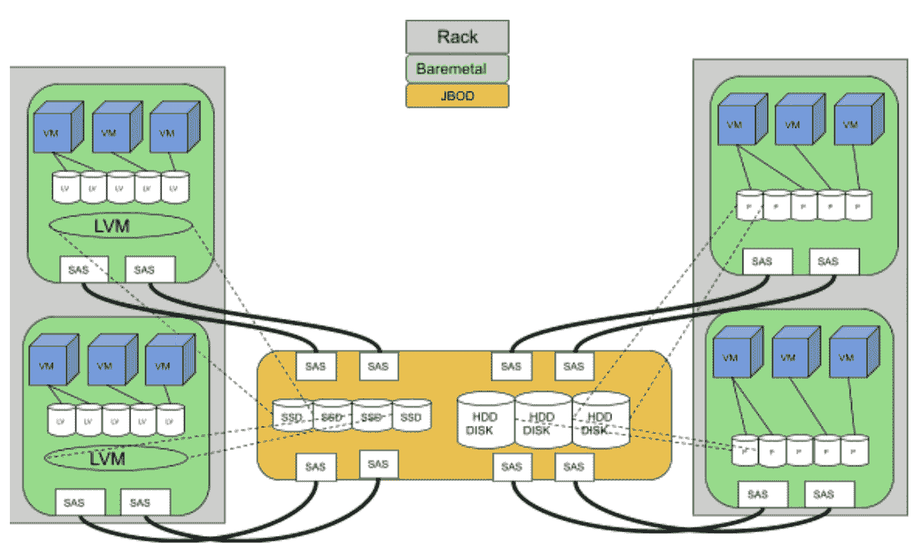
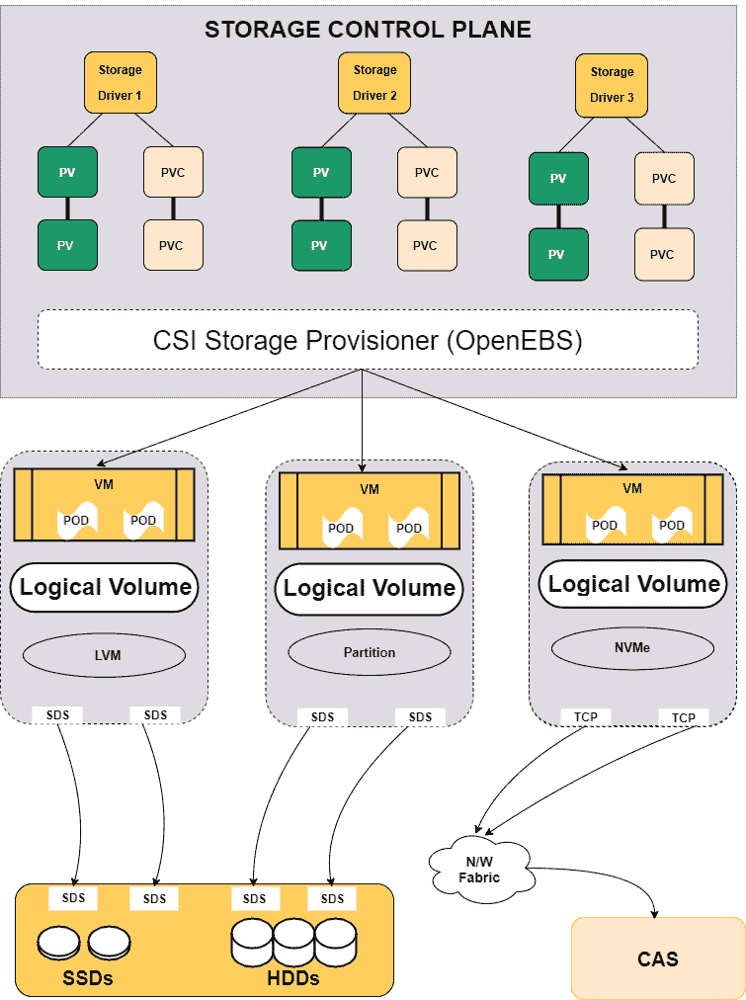

# Flipkart 如何利用 OpenEBS 在 Kubernetes 上进行存储

> 原文：<https://thenewstack.io/how-flipkart-leveraged-openebs-for-storage-on-kubernetes/>

 [埃文·鲍威尔

埃文是 MayaData 的首席执行官。](https://www.linkedin.com/in/epowell/) 

Flipkart 是印度领先的电子商务公司，也是全球发展最快的大型电子商务公司之一。通过各种收购和产品合作，该公司已经发展成为次大陆最大的在线零售商，每天处理数十万笔交易。Flipkart 占据了印度在线零售市场约 40%的份额，它采用企业对消费者的销售模式，每天产生大量数据。

尽管 Flipkart 的核心业务属于零售领域，但它的成功很大程度上是基于新兴技术。从一开始，它就是印度科技创业成功的典范。在采用各种先进技术来支持其业务功能的同时，Flipkart 的团队试图探索 Kubernetes，以确保其有状态应用程序的最佳硬件利用率。

本文基于 Flipkart 的工程师在 5 月 3 日 Kubernetes 日的 KubeCon EU 共址活动数据上的演讲。他们谈到了他们的 Kubernetes 采用之旅、挑战、经验教训，以及他们如何利用 MayaData 的 OpenEBS 在 Kubernetes 和其他 MayaData 软件上进行存储，以帮助进行整体管理。你可以在这里观看完整的会议:

[https://www.youtube.com/embed/D77FLwUN9Oo?start=2&feature=oembed](https://www.youtube.com/embed/D77FLwUN9Oo?start=2&feature=oembed)

视频

## Flipkart 基础设施

所有 Flipkart 服务都部署在分布在两个数据中心的自我管理私有云上，另外一个数据中心正在建设中。在 Kubernetes 之前，这些服务只能在裸机服务器基础设施中的虚拟机上运行。这两个数据中心都拥有略超过 20，000 台裸机，实施超过 75，000 台虚拟机。该平台采用 Just a Bunch of Disks (JBOD)存储架构来存储和管理交易期间生成的数据。选择 JBOD 主要是因为它宽敞、坚固、速度快，足以满足 Flipkart 大数据和其他应用程序的存储需求。

平台团队支持 Flipkart 中的所有业务部门和产品，从搜索对寻找产品感兴趣的用户，到向消费者收费，到帮助产品选择和设计的分析，等等。在任何给定时间，Flipkart 都有几十种不同的有状态工作负载在生产，包括各种类型的关系数据库、NoSQL 数据库、日志记录、机器学习、缓存以及将 Kafka 和 Pulsar 等不同数据源结合在一起的解决方案。在 Flipkart 内部开发以数据为中心的产品的工程师是快速创新和公司发展的核心。他们的生产力可以为购物者带来更好的体验，让销售和其他团队做出更好的决策，并提高运营效率。

下图是采用虚拟化和逻辑卷管理器(LVM)为 Flipkart 数据中心供电的 SAS 连接 JBOD 的拓扑。正如工程师们解释的那样，选择这种拓扑结构是因为易于扩展、使用熟悉的组件以及能够访问底层组件的商品市场。

Flipkart 存储拓扑的表示

## Flipkart 有状态应用的 Kubernetes

### 为什么是 Kubernetes？

Flipkart 的技术团队开始调查 Kubernetes 在所有重要工作负载中的使用情况，包括他们在 2019 年和 2020 年的几十个有状态工作负载。虽然他们在使用 Kubernetes 获取数据方面取得了成功，但他们的经验在很多方面都是有益的。

首席工程师预计，用 Kubernetes 协调 Flipkart 的有状态应用程序的好处包括更容易部署、部署和操作环境之间的一致性、增加跨环境和其他环境的可移植性。他们提到的其他因素有:

*   Kubernetes 使应用程序之间的资源分配无缝，从而优化了硬件利用率，从而提高了日益稀缺的数据中心空间和电力的利用率
*   Kubernetes 使用状态集、副本集和部署来确保每个工作负载所需的容错性、可伸缩性和可用性。
*   由于通过存储类使用了简单的声明性意图，开发人员和数据科学家的工作效率得到了提高，这些存储类抽象出了交付所需存储功能所必需的工作。此外，由于 Flipkart 没有采用共享存储模式，每个小团队和工作负载都是自主的，无需担心共享依赖性，例如共享存储的爆炸半径更大，或者负载过重的共享存储性能不可预测地下降的风险。

### 移民的挑战

Flipkart 报告称，已经有超过 20%的有状态工作负载在 Kubernetes 上运行。许多预期的好处正在实现，包括增加密度，以及开发人员和数据科学家的生产力。还有一些意想不到的好处已经实现，由于更大比例的环境是由常见的开源项目，如 Kubernetes 和 OpenEBS，除了 LVM，从而确保招聘和培训成本是可控的，而不是使用定制或专有系统。尽管如此，Flipkart 解释说，它已经战胜了以下挑战:

*   **专业知识和入门:**Flipkart 有状态迁移中最大的挑战之一是移植运行工作负载的团队的专业知识，也就是说，让使用 Kubernetes 平台运行工作负载的团队熟悉如何配置和改进他们的工作负载操作符，以及如何在 Kubernetes 上操作他们的工作负载
*   **工作负载迁移:**大多数实时工作负载需要基于拷贝的迁移来移动底层数据，这非常耗时，并且缓冲区容量的缺乏可能会导致关键应用程序停机，或者导致需要增加可用容量，从而降低了原本会使用容量的额外工作负载的使用速度。
*   **备份工具:**迁移到 Kubernetes 还需要对现有的备份工具进行大量的重新配置，以适应容器化的设置。
*   **可变性:**许多工作负载被安置在它们特定的环境中，从某种意义上说，它们知道预期的性能。迁移给所获得的性能带来了可变性，并突出了增加工作负载特征和扩展底层 OpenEBS 以使用基于服务质量(QoS)的调度的需求。

### 迁移阶段

Flipkart 的工作负载迁移包括三个阶段:

*   ****本地持久卷:**** 为了保持数据路径性能，本地 PV 卷用于持久化。除了保持数据路径现状之外，本地持久卷的使用还确保了在深入理解 Linux LVM 方面的巨大投资得到最大程度的利用。
*   **容器附加存储(CAS):** 通过让开发人员将存储实体视为微服务，CAS 阶段的使用允许永久卷和底层存储硬件之间的清晰分离。这使得有状态工作负载更快、更易移植，从而简化了迁移。
*   **部署为半共享存储的容器附加存储:**此阶段允许存储管理软件与底层硬件完全分离。这使得无需添加/移除硬件即可自动扩展存储容量。在此体系结构中，还支持持久卷的复制、高效的数据加密和压缩。

## OpenEBS 针对 CAS 和半共享 CAS 存储的 CSI 兼容本地 PV 合作伙伴关系

Flipkart 选择了由 MayaData 开发的 [OpenEBS，](https://mayadata.io/openebs-support)来帮助将数据和有状态工作负载迁移到 Kubernetes，并提高这些工作负载的易用性和运行效率。Flipkart 还与 [MayaData](https://mayadata.io/?utm_content=inline-mention) 合作，为 OpenEBS 添加额外的功能，以改善多租户和多池支持，增强对 HDD 设备的支持，以及存储容量和 QoS 感知的 pod 调度。

借助 OpenEBS 作为 CSI 连接的容器连接存储，Flipkart 获得了支持状态工作负载的灵活、完全可扩展的挂载存储。

## 当前状态

Flipkart 在 2020 年开始了它的有状态迁移之旅，带来了上面提到的好处，包括提高了硬件利用率。在撰写本文时，团队和来自不同业务部门和应用程序的最终用户已经将大约 20%的有状态堆栈转移到 Kubernetes，目标是在 9 月前将整个堆栈转移。

目前在 Flipkart 的 Kubernetes 上运行的首批工作负载包括:

*   TiDB 或钛数据库。TiDB 将 SQL 数据库的 ACID 特性与灵活的可伸缩性、高可用性和强一致性相结合。在 Kubernetes 中部署 TiDB 允许灵活的存储资源配置、声明式部署和自动化管理。数据库适应 Kubernetes 生态系统，允许通过复制实现容错。Kubernetes 还通过自动伸缩和故障转移简化了 TiDB 集群的管理。
*   该平台上运行的另一个早期工作负载是 Apache Pulsar，这是一个云原生消息服务，用于整合消息和流。Pulsar 设计为消息即服务产品，提供对本地存储的低延迟访问(在本例中由 OpenEBS 管理)、水平可扩展性、负载平衡和多租户支持等功能。Flipkart 正在使用 Kubernetes 的内置缩放和复制功能来构建一个使用 Apache Pulsar 的可伸缩消息传递系统。

正在 Flipkart 上使用 OpenEBS 存储部署到 Kubernetes 上的其他工作负载包括 MongoDB、MySQL、HBase、Aerospike、Redis 和 Memcache。我们的愿景是让构建应用程序的业务部门和工程师有选择的自由，为他们的特定需求选择合适的数据库。

### 吸取的教训

Flipkart 的 Kubernetes 平台团队在迁移过程中获得的一些重要经验包括:

*   **为生产做好准备:**大多数数据存储操作员认为数据库将只部署在本地集群上，由于这一原因和其他原因，数据库没有为生产做好准备。
*   **管理存储资源:**虽然 [OpenEBS LocalPV](https://docs.openebs.io/docs/next/localpv.html) with LVM 可以自动创建底层池，从而提高利用率，但仍然存在本地磁盘碎片的风险，部分原因是工作负载需求高度可变。这可能会导致存储资源的浪费，并增加改进容量管理和基于容量的计划的价值。
*   **创建卷组结构:**在 OpenEBS LocalPV LVM 引擎的最新改进之前，还没有包含卷组结构的 CSI 可管理的逻辑卷管理(LVM)。
*   **LVM 分区:**备份应用程序无法访问 Kubernetes 快照，因此唯一可用的时间点是卷克隆；这给使用 LVM 带来了一些挑战。
*   **磁盘故障响应:**在不使用本地 RAID(使用稀缺的磁盘空间)的情况下，当系统以 Flipkart 的规模运行时，数据存储操作员必须能够响应相对频繁的磁盘故障。

通过将其有状态工作负载迁移到 Kubernetes，Flipkart 旨在利用无缝自动伸缩、低延迟、在容器上运行应用程序的灵活性以及上述其他优势。在 Kubernetes 的持续采用过程中，它解决了编排有状态工作负载带来的各种挑战。

与 MayaData 的合作以及 OpenEBS 在本地和远程节点上提供基于 LVM 的容器附加存储的使用和增强，帮助 Flipkart 加快了对 Kubernetes 数据的采用，同时确保了许多预期的好处。

<svg xmlns:xlink="http://www.w3.org/1999/xlink" viewBox="0 0 68 31" version="1.1"><title>Group</title> <desc>Created with Sketch.</desc></svg>