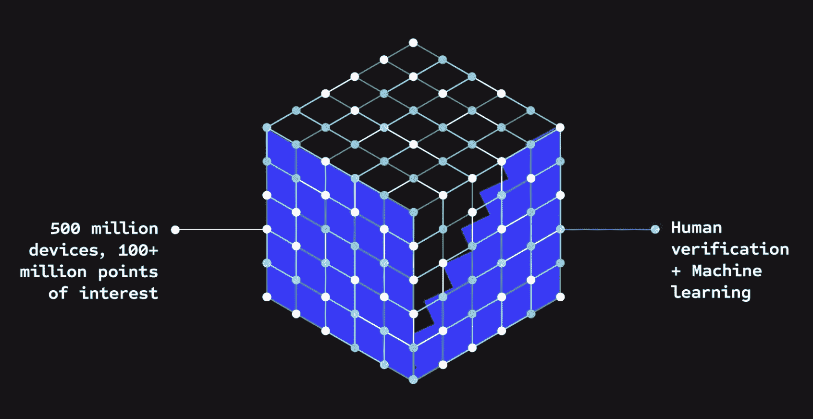

# Foursquare 如何通过机器学习实现自我转型

> 原文：<https://thenewstack.io/how-foursquare-transformed-itself-with-machine-learning/>

我上一次写 Foursquare 是十多年前的，当时它只是一个面向消费者的位置签到应用。那时，2012 年 7 月，它正试图在消费者推荐市场上挑战 Yelp。几个支点后，Foursquare 现在完全是一个企业服务。它将自己标榜为“释放地点和运动力量的领先的基于云的定位技术平台。”优步是它的客户之一，它使用 Foursquare 的 ML-enhanced 数据来帮助确定用户的确切位置。

为了更多地了解 Foursquare 如何使用机器学习，我采访了 Foursquare“地点数据科学”团队的负责人[齐西斯·彼得鲁](https://www.linkedin.com/in/zisispetrou/)。在该公司转向企业市场后不久，他于 2017 年加入该公司，担任数据科学家。也是在那一年，Foursquare 宣布了其 [Pilgrim SDK](https://web.archive.org/web/20170312233159/https://enterprise.foursquare.com/developers/pilgrim) ，这是一个基于其八年积累的数据的企业软件开发套件。此时，Foursquare 正在收集手机传感器数据和其他自动形式的位置跟踪(消费者可以选择加入)，此外还有人工签到。

“在 2010 年中期的某个时候，焦点转向了企业用户，”Petrou 解释道。“然后，当然，我们决定利用我们拥有的丰富的地方内容，以及识别用户的独特潜力——包括访问和获得用户的反馈。”

如上所述，优步使用 Foursquare 数据来识别用户可能要求去的地方的精确位置。彼得罗站在一名优步司机的立场上帮助解释。

“因此，如果客户要求我去一个特定的景点，比如一家特定的餐厅或一家特定的剧院或其他地方，很有可能在引擎盖下，优步会调用我们的 API 或使用我们以平面文件形式提供的数据，并从那里获取位置坐标。”

## Foursquare 是如何进行机器学习的

Foursquare [最近宣布了它的地理摘要 ML 模型的增强版本](https://location.foursquare.com/resources/blog/developer/maximizing-data-accuracy-with-foursquare-geosummarizer/)，它声称“将兴趣点的准确性提高了 20%。”该公司解释说，Geosummarizer“是一种模型，它基于对其聚类中各种输入的地理编码的分析，为 POI(兴趣点)选择最终的纬度/经度。”

Foursquare 表示，其数据库中现在有超过 1.2 亿个兴趣点。根据 Petrou 的说法，这些数据来自各种来源。它继续从其应用程序的用户那里获取数据(稍后会有更多)，但它也从第三方购买数据，并在网上搜索更多信息。这就是 ML 的用武之地——它将这些独立的数据结合起来，得出 POI 的精确计算结果(纬度/经度)。

“为了获得一个地方的属性的最佳表示，如地址或地理编码——地理坐标——我们应用了一个我们称之为摘要的过程。也就是说，我们考虑了来自同一 POI 的不同来源的所有信息。我们达到了我们认为的最佳最终属性。”

图片来自 Foursquare

他继续说，在引擎盖下，是一个机器学习管道，“考虑到我们在仔细评估所有这些来源后赋予的信心，[并]考虑到我们拥有的地理空间信息。”他补充说，该算法“基于所有这些输入预测最佳纬度/经度。”

我特别问它为此使用了什么样的 ML 技术？Petrou 回答说，这是“一种监督学习算法——这是一个我们在引擎盖下作为回归问题制定的问题。”

因此，本质上，Foursquare 会给每个潜在的兴趣点分配一个预测分数，对它们进行排名，算法最终会选择“概率最高的一个作为该地点的最终代表。”

Petrou 表示，它使用了 scikit-learn 和 PyTorch 等 Python 库，以及“我们自己开发的库”

## Foursquare 的消费者应用程序仍在使用

回到数据来源，我很惊讶地听到 Foursquare 仍然从其消费者应用程序中收集重要数据。我很久以前就从手机上删除了最初的 Foursquare 签到应用，但在查看了 iOS 应用商店后，我发现它有两个最新的应用:Foursquare Swarm(其“生活日志”签到应用的当前名称)和 Foursquare City Guide(用于“附近的餐馆和酒吧”)。后者实际上是最初的应用程序，当我再次下载它并看到我的旧签到时，我发现了这一点——其中大多数都超过了十年。 ***更新:**我没有看到我所有的旧元数据——所有的照片和文字——直到我下载了 Swarm。*

重新安装 Foursquare 的应用程序，看到我上传的照片，让我想起了以前经常去的地方——我曾经是新西兰佩托内一家咖啡馆的“市长”，这家咖啡馆名叫 Go Bang Expresso。遗憾的是，那家咖啡馆已经不存在了(而且，我已经搬到了地球的另一边)。但实际上，Foursquare 不仅仅是关于像我这样的老前辈的回忆——它目前的应用程序仍然很受欢迎，Petrou 说。

“是的，我们仍然有消费者数据，”他说，听起来我的提问有点侮辱他。“我们发现这是 Foursquare 拥有的数据的独特元素之一——能够让地面上的人们自愿用数据支持我们，自愿找到他们想要签到的地方。如果他们注意到它稍微超出了他们的坐标范围，或者是隔壁的建筑，他们就会给我们投票(我们这样称呼他们)，让我们把这个地方移到建筑或街区的正确位置。因此，这是我们决定继续关注并继续使用的独特之处，因为这是我们区别于业内其他公司的地方。”

Foursquare 并未正式公布其消费者应用的使用数据，但去年美国消费者新闻与商业频道的一份报告称该公司“每月有超过 90 亿次来自 5 亿台不同设备的访问”

## 结论

不管你是否还在使用 Foursquare 的签到应用，毫无疑问，自 2009 年推出以来，Foursquare 已经积累了令人难以置信的位置数据。不仅如此，它还使用机器学习来增强底层数据，使其对优步等第三方更加有价值。

我从没想过我会写这个，但 Foursquare 是 2023 年的一家模范企业技术公司。当然，一个执行得很好的支点，加上一个在这个时代如何使用 ML 的很好的案例研究。

<svg xmlns:xlink="http://www.w3.org/1999/xlink" viewBox="0 0 68 31" version="1.1"><title>Group</title> <desc>Created with Sketch.</desc></svg>