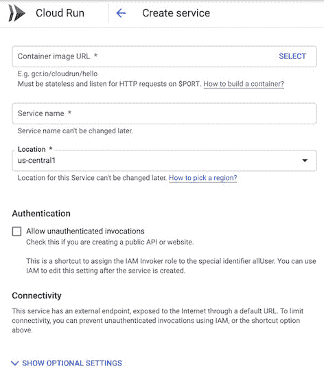

# Google Cloud Run 如何结合无服务器和按需 Kubernetes

> 原文：<https://thenewstack.io/how-google-cloud-run-combines-serverless-and-on-demand-kubernetes/>

谷歌新的[云运行](https://cloud.google.com/run/)服务是一个无服务器平台，建立在 [Knative](https://thenewstack.io/knative-enables-portable-serverless-platforms-on-kubernetes-for-any-cloud/) 和 [Functions Framework](https://github.com/GoogleCloudPlatform/functions-framework-NodeJS) 的运行时环境上，后者为无服务器工作负载扩展了 Kubernetes，谷歌今天也为 Node.js 10 开源了后者。但与其他无服务器功能不同的是， [Cloud Run](https://thenewstack.io/comparison-aws-fargate-vs-google-cloud-run-vs-azure-container-instances/) 允许您将现有代码打包到 Docker 容器中，在其他无服务器功能中，您通常会将专门编写的代码作为一个功能运行并由事件触发。

该容器可以在完全托管的无服务器云运行环境中运行，但因为它使用 Knative，所以它也可以在 Google Kubernetes 引擎上运行，因此您可以向现有的 Kubernetes 集群添加按需付费的代码。

你在部署而不是打包时决定在哪里运行容器，因为许多客户要求相同的无服务器功能，但一半客户寻求简单性，另一半客户寻求更大的灵活性，[产品管理总监](https://twitter.com/teich)[谷歌云](https://cloud.google.com/docs/overview/)总监柳文欢·泰奇向我们解释道。“我已经在使用 Kubernetes，我已经有了自己的集群，我的运营团队在管理它，可能还有监管方面的问题。我们希望避免‘因为我想要 X，所以我做不到 Y’的问题。”

“在 GKE 上运行云可以让开发人员在 GKE 的托管运营基础设施上获得完全相同的体验。开发人员可以使用他们编写的代码，在门户或 Gcloud 命令行中获得准确的体验，并锁定他们想要的目标。你可以使用同样的工具；您可以体验一下，学习 API 和用户界面的工作方式，然后将工作负载转移到任何 Knative 兼容集群上。”

这个想法是为了改善和简化开发人员的体验，他预计一些组织将混合使用无服务器和 GKE 部署，为不同的开发人员提供云运行。

“我们从客户那里了解到，他们喜欢无服务器的想法，他们喜欢托管基础架构，他们喜欢解决运营问题。但是他们希望能够运行任意的工作负载。他们希望能够使用专有软件或旧软件，如 15 年前的 Java 二进制文件，同时仍能获得[无服务器]的所有好处。”

云运行提供了 Docker 和无服务器的组合。“[Docker]是打包东西的标准化格式，两边都有一个生态系统，我们可以更容易地创建开发人员体验，以接触到下一代，并实现我们十年前的承诺，但具有人们运行真正东西所需的灵活性。”

## 在哪里运行云运行

您可以部署到 Cloud Run 的代码需要是一个无状态的 HTTP 容器，该容器在一个将被配置为(但不应该硬编码为)8080 的端口上侦听请求，在收到请求的四分钟内启动 HTTP 服务器，在请求超时内响应，并针对 64 位 Linux 进行编译。

“你的容器不应该依赖于地方政府，”谷歌无服务器团队的 Steren Gianni 在 Next 的一次会议上解释道。“你可以使用一致的存储，如数据库和云存储，但在容器内，你只能依靠临时状态。下次调用容器时，您创建的东西不一定还在。”这些限制在[容器运行时契约](https://cloud.google.com/run/docs/reference/container-contract)中指定。

如果容器中还没有您的代码，您可以用通常的方式构建它，并将其放入容器注册表中。

通过粘贴容器注册表的 URL 将容器部署到 Cloud Run，您得到的是一个 HTTPS URL。Google demoed Cloud 用 Python 脚本运行用 Python 脚本调用 LibreOffice(一个 Java 二进制)，安装字体，用 Flask 把 Word 文档转换成 PDF 这加起来就是一个 2Gb 的容器，通过会议 Wi-Fi 在 7 秒钟内部署完毕，启动需要 10 秒钟，但随后在一分钟内处理了 1000 个 pfd。

这是一个稳定的 HTTPS URL，如果你想把它用于一个网站、一个 API 端点、一个移动后端或一个 Webhook，你可以把它暴露给互联网。或者您可以在内部使用它来将一个整体重构为可独立扩展的微服务。

完全托管的云运行服务是最简单的选择。“你只需给我们一个容器，其他一切都会搞定。我们部署它，我们设置 HTTPS，我们设置端点，我们设置负载平衡，我们设置路由，我们设置扩展。没有要调整的参数。这不是一个复杂的编排系统，这是一个非常容易使用的开发人员友好的产品。”

云运行是按使用量付费，每使用 100 毫秒收费。“它从零开始扩展，所以您只需在收到请求时付费。这不是一个即使在没有流量的情况下，你也必须全天候运行并为之付费的网络任务；如果没有流量，我们会关闭一些东西，当有流量进来时，我们会运行它并扩大规模。”

在 Cloud Run 中，容器运行在 Google open 去年作为默认的 Kubernetes runc 运行时的可选替代的 [gVisor 沙箱](/google-launches-gvisor-an-open-source-sandboxed-container-runtime/)之上。这确实限制了 Cloud Run 可以运行的内容，因为它不支持所有的 Linux 系统调用，但 Teich 表示，在实践中这很少成为问题。“你可能会遇到一些零星问题，但我们为客户看到的现实是，只要他们是无状态 HTTP 容器(他们运行)…每次我们发现一个粗糙的边缘，我们通常会非常非常快地修复它。”如果你的代码在 gVisor 中有问题，在 GKE 上运行的 Cloud 不会使用容器沙箱。

对于某些工作负载来说，在 GKE 上运行云可能是更好的选择，但还有其他一些限制。Cloud Run 给一个容器分配一个 vCPU，你不能改变它；如果你想对资源进行更多的控制，在 GKE 上运行的云可以让你选择更多的机器大小和更多的 RAM 和 CPU，或者使用定制的机器类型，包括 GPU 和 TPU 来加速。工作负载可以与现有集群工作负载并行运行，并且它们还可以访问 VPC 和计算引擎网络。

GKE 上的 Cloud Run 具有相同的自动缩放功能，包括缩小到零，但它并不是以完全相同的方式付费使用。价格(尚未公布)来自您购买的 GKE 资源(您可以使用 GKE 使用计量向内部用户收费)。

因为 Cloud Run 是建立在 Knative 之上的，使用 Kubernetes [定制资源定义](https://kubernetes.io/docs/concepts/extend-kubernetes/api-extension/custom-resources/)提供必要的抽象，你可以从封装一个现有的应用程序并独立运行开始，然后把它转移到 GKE 作为 Kubernetes 部署的一部分运行，而不需要重新打包；当你填写想要运行的容器的 URL 时，你只需选择 GKE 集群作为云运行控制台中的位置，而不是选择谷歌区域。

如果您在 Google cloud 之外的另一个 Kubernetes 集群上使用 Knative，您可以向它添加函数框架，并能够将容器或无服务器代码迁移到 Cloud Run。事实上，Teich 建议，“通过 Knative 示例和这一切所基于的参考 API，任何实施 Knative 的云提供商都能够利用相同的优势。Knative 是云跑背后的参考植入。”

因为它下面是 Kubernetes，所以 Cloud Run 可以利用 Kubernetes 生态系统。Cloud Run 与 Stackdriver 集成用于监控和日志记录，但您也可以使用 Datadog 进行[监控(在 GKE 上使用 Datadog 代理进行云运行，在完全托管版本上使用标准的 Google 云监控 API)，或者在 GKE 上使用 NodeSource 的 N|Solid 运行时进行](https://www.datadoghq.com/blog/monitor-google-cloud-run-with-datadog/)[云运行](https://nodesource.com/blog/nsolid-available-google-cloud-run-serverless)以获得 Node.js 代码的实时性能指标和自定义通知。

如果你正在 GKE 上尝试云运行，值得注意的是，你不能在测试服务中禁用 GKE 上的云运行；要停止它的运行，您必须删除集群，所以选择一个不重要的集群进行试验。如果你没有想要在 Cloud Run 上尝试的现有应用程序，StackBlitz 正在进行集成，因此你可以使用其一键式系统创建一个新的应用程序 GitHub repo 和 Cloud Run endpoint，准备开始编码和测试。

最初，Cloud Run 仅在美国地区可用，但谷歌表示，它将很快进入欧洲地区。

谷歌在本周于三藩市举行的年度[谷歌下一届大会](https://cloud.withgoogle.com/next/sf)上推出了 Cloud Run。

<svg xmlns:xlink="http://www.w3.org/1999/xlink" viewBox="0 0 68 31" version="1.1"><title>Group</title> <desc>Created with Sketch.</desc></svg>