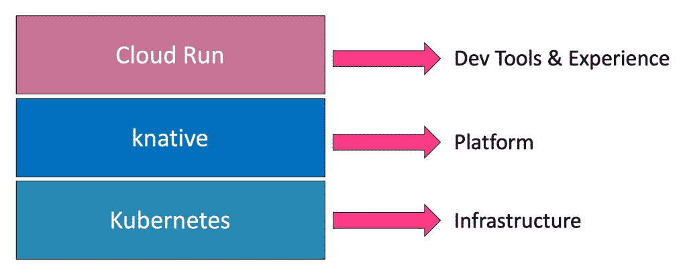

# Google Cloud Run 如何将无服务器与容器结合起来

> 原文：<https://thenewstack.io/how-google-cloud-run-combines-serverless-with-containers/>

Google Cloud Next 2019 最令人兴奋的发布之一是[云运行](https://cloud.google.com/run/)，这是一个基于容器和 Kubernetes 的无服务器环境。

Cloud Run 是一个无集群、无服务器的容器执行环境。一些与会者甚至将其与 [AWS Fargate](/aws-fargate-the-beginning-of-the-end-for-infrastructure-management/) 和 [Azure Container 实例](/microsoft-azure-container-instances-are-now-ready-for-production-workloads/)相比较。但是 [Google Cloud Run](https://thenewstack.io/comparison-aws-fargate-vs-google-cloud-run-vs-azure-container-instances/) 采用了不同于其他无服务器容器平台的方法。

让我们仔细看看这项技术。

## 致命的联系

在去年的 Next 活动上，谷歌宣布了 Knative，这是一个基于 Kubernetes 和 Istio 构建的开源平台。该项目是与 IBM、Red Hat、Pivotal 和 SAP 合作开发的。

在高层次上，Knative 增加了一个抽象层，简化了将代码部署到 Kubernetes 的工作流程。

由于 Kubernetes 是一个基础设施层，开发人员与运营团队合作部署和扩展应用程序。Knative 通过让开发人员直接面向 Kubernetes，去除了 ops 层。

> Knative 有一套用于在 Kubernetes 上构建无服务器平台的构建块。但是直接处理它并不能让开发人员变得高效或多产。虽然它充当运行在核心 Kubernetes 基础设施上的元平台，但开发人员工具和工作流留给了平台提供商。

Knative 有三个核心要素:

1.  Build:这个组件负责从源代码中生成一个容器映像。
2.  服务:该组件简化了应用程序的公开，无需配置入口和负载平衡器等资源。
3.  事件:事件提供了一种以发布/订阅方式消费和产生事件的机制。这对于基于外部或内部事件调用代码非常有用。

使用 Knative 的主要优势是 scale to zero，其中运行时会根据入站流量自动终止和调度 pod。如果没有活动的客户端，微服务可能会自动关闭，并在流量增加时扩展。

Knative 可以部署在任何 Kubernetes 集群上。它作为中间件，在核心基础设施服务和开发者体验之间架起了桥梁。

## 云运行——谷歌自己的 Knative 实现

谷歌是首批基于开源 Knative 项目提供商业服务的公共云提供商之一。就像它在任何其他提供商之前提供托管 Kubernetes 服务的方式一样，谷歌在通过云运行向开发者公开 Knative 方面行动迅速。

Cloud Run 是 Google 在 Knative 之上构建的一个层，用于简化在 [Google 云平台](https://cloud.google.com/)上部署无服务器应用。

Knative 有一套用于在 Kubernetes 上构建无服务器平台的构建块。但是直接处理它并不能让开发人员变得高效或多产。虽然它充当运行在核心 Kubernetes 基础设施上的元平台，但开发人员工具和工作流留给了平台提供商。

【T2

Cloud Run 是 Kubernetes 和 Knative 之上的一个抽象层，使开发人员可以访问这个平台。

## 云跑解决什么问题？

尽管容器已经成为打包代码和部署应用程序的 Kubernetes 的事实上的标准，但是在工作流程中涉及到多个步骤。

从开发人员提交代码以访问应用程序开始，她必须经历以下工作流程:

*   创建一个包含所有依赖项和安装步骤的 Docker 文件，
*   从 Docker 文件构建容器映像，
*   将图像推送到容器注册中心，
*   为容器的部署创建一个 Kubernetes YAML 文件，
*   创建另一个 YAML 文件以将部署公开为服务，
*   部署 Pod 和服务，
*   通过端点访问应用程序。

Google Cloud Run 缩短了提交代码和访问应用程序之间的路径。在 Cloud Code、Skaffold 和 Jib 等工具的帮助下，开发人员可以编写代码，在本地进行测试，并将代码部署到 Kubernetes，而无需 DevOps 团队的干预。

## 云运行的味道

目前处于测试阶段，Google Cloud Run 可以作为一个独立的环境在谷歌 Kubernetes 引擎 (GKE)中使用。

开发人员可以通过控制台或 CLI 将应用部署到云上。如果有一个安装了 Istio 的 GKE 集群，面向云运行的应用程序可以很容易地部署到现有的 Kubernetes 集群。

对服务的每次部署都会创建一个修订。修订版由特定的容器映像以及环境设置(如环境变量、内存限制或并发值)组成。

请求会尽快自动路由到最新的健康服务版本。

## 云运行— PaaS 做得好

我的初步观察是，Cloud Run 提供了与最初的 PaaS 相同的承诺。PaaS 和云运行的根本区别在于透明性。由于底层是基于 Knative 的，所以每一步都可以很容易地映射到 Istio 和 Kubernetes 的功能。

当 Cloud Run 在 GKE 本地和 Anthos 上可用时，客户将能够以一个具有可重复工作流的一致平台为目标来部署现代应用程序。

在即将发布的一篇文章中，我将介绍在 Cloud Run 上部署应用程序的步骤。敬请关注。

*贾纳基拉姆·MSV 的网络研讨会系列“[机器智能和现代基础设施(MI2)](https://mi2.janakiram.com/) ”提供了涵盖前沿技术的信息丰富、见解深刻的会议。[注册](https://mi2.janakiram.com/)参加即将到来的 MI2 网络研讨会，了解如何使用 Azure IoT Edge。*

<svg xmlns:xlink="http://www.w3.org/1999/xlink" viewBox="0 0 68 31" version="1.1"><title>Group</title> <desc>Created with Sketch.</desc></svg>