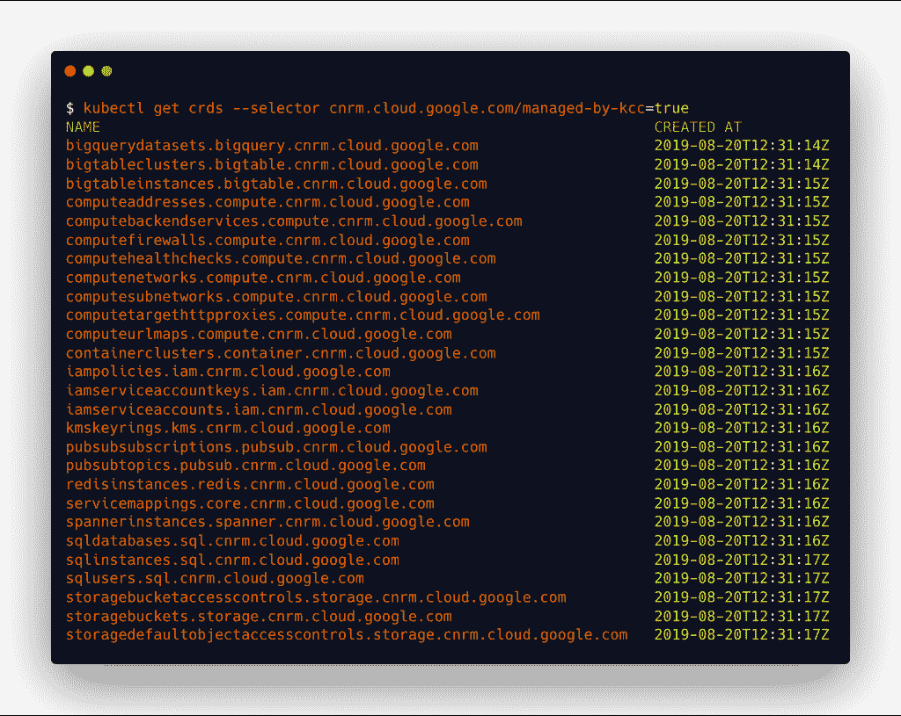
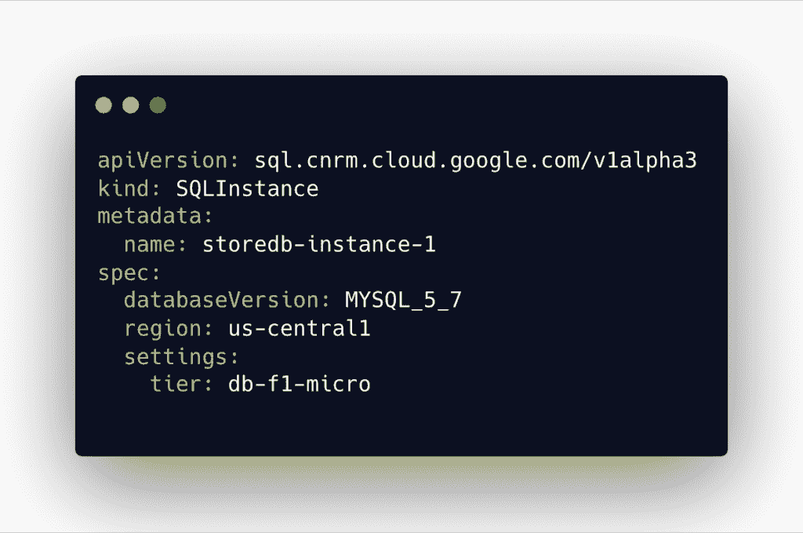
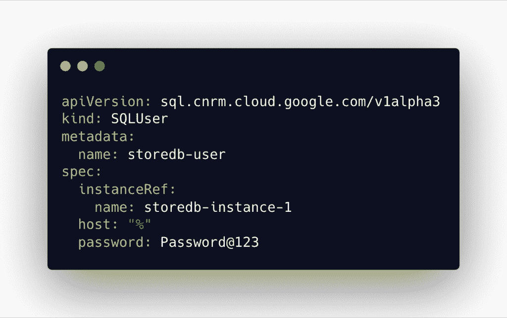

# 谷歌如何将 Kubernetes 变成一个控制平面来管理 GCP 资源

> 原文：<https://thenewstack.io/how-google-turned-kubernetes-into-a-control-plane-to-manage-gcp-resources/>

大约一年前，我写了一篇[文章](/how-kubernetes-is-transforming-into-a-universal-scheduler/)强调了 Kubernetes 向通用控制平面的转变。云原生社区一直在朝着这个方向稳步前进。

[定制资源定义](/kubernetes-1-15-aims-to-extensibility-with-custom-resource-definition-features/) (CRDs)的成熟使得将外部资源管理纳入 Kubernetes 范围成为可能。微软的[虚拟 Kubelet](https://thenewstack.io/tutorial-kubernetes-for-orchestrating-iot-edge-deployments/) 项目试图在 Kubernetes 控制平面和外部资源调度程序(如物联网中心和容器实例)之间架起一座桥梁。KubeVirt 通过 Kubernetes 调度器和控制器实现了虚拟机的编排。

谷歌正在大力推动 Kubernetes 成为谷歌云平台(GCP)的前沿和中心。其基于 Anthos 的混合云战略围绕 Kubernetes 展开。Migrate for Anthos 将工作负载直接转移和转换到在 Google Kubernetes 引擎(GKE)中运行的容器中。

> 尽管 Config Connector 是为 GKE 设计的，但它可以很容易地安装在任何 Kubernetes 环境中。

在 Kubernetes 引擎和相关产品上投入如此之多，谷歌希望 GKE 成为云原生和传统运营的首选管理层。它正缓慢但稳步地向使 Kubernetes 成为 GCP 运营和管理的前沿和中心迈进。 [Config Connector](https://cloud.google.com/config-connector/docs/overview) 是 Kubernetes 最近推出的一个插件，旨在使 GCP 资源成为云原生世界的一流公民:查看我上周的教程，在那里[我演示了如何安装和使用 Config Connector 来管理 Minikube](https://thenewstack.io/tutorial-use-google-config-connector-to-manage-a-gcp-cloud-sql-database/) 的 GCP 资源。

尽管 Config Connector 是为 GKE 设计的，但它可以很容易地安装在任何 Kubernetes 环境中。我可以使用运行在我的开发机器上的 Minikube 作为控制平面，在 GCP 配置和提供一个云 SQL 实例。

当 Azure 和 AWS 等其他云提供商正在使用开放服务代理 API 将云资源连接到 Kubernetes 时，Google 已经[弃用](https://cloud.google.com/kubernetes-engine/docs/concepts/google-cloud-platform-service-broker) it，转而支持 Config Connector。

Config Connector 利用 CRD 来注册映射到各种 GCP 资源的自定义对象。每个 GCP 服务，比如 Cloud Spanner、Cloud SQL、Cloud Pub/Sub，都被公开为一个自定义资源定义，可以像对待任何其他 Kubernetes 对象一样对待。熟悉的 kubectl 工具可以用来操作这些对象。

Config Connector 利用 GCP 原语(如服务帐户)结合 Kubernetes 原语(基于角色的访问控制(RBAC)和 secrets)的方式非常有趣。以下步骤解释了向 Kubernetes 注册 GCP 资源所涉及的工作流程:

1.  在 GCP 创建了角色为“所有者”的 IAM 服务帐户
2.  服务帐户密钥(一个 JSON 文件)作为秘密向 Kubernetes 注册
3.  配置连接器作为一组 CRD 安装在专用的 Kubernetes 名称空间中
4.  在 Kubernetes 中创建了一个与 GCP 项目名称相匹配的新名称空间
5.  映射到 CRD 的 GCP 资源在 YAML 文件中定义，并通过 kubectl 创建
6.  可以在 Kubernetes 中创建附加角色和角色绑定，以允许或限制对 GCP 资源的访问
7.  如果资源依赖于其他资源，则可以在 YAML 定义中引用它们

IAM 所有者角色和关联的服务帐户密钥为外部应用程序提供了与 GCP 对话所需的权限。当这个密钥作为一个秘密在 Kubernetes 注册时，CRDs 使用它来访问与 GCP 资源相关联的 API。这个秘密是充当库伯内特和 GCP 控制平面之间管道的关键环节。

谷歌创建了一组 CRD，映射到关键的 GCP 服务，如云存储、云 SQL、云扳手、BigQuery，甚至 GKE。注册 CRD 的 YAML 文件可以通过 kubectl create 命令下载并部署到任何 Kubernetes 集群中。

我们可以用下面的命令列出所有注册的 CRD:

```

kubectl get crds  --selector cnrm.cloud.google.com/managed-by-kcc=true

```

[](https://thenewstack.io/how-google-turned-kubernetes-into-a-control-plane-to-manage-gcp-resources/cnrm/) [](https://thenewstack.io/how-google-turned-kubernetes-into-a-control-plane-to-manage-gcp-resources/cnrm-sql/)

Google 强制执行一个约定来匹配 Kubernetes 名称空间和 GCP 项目 id。如果不想创建新的名称空间，也可以对现有的名称空间进行注释，这样配置连接器就可以在指定的名称空间中创建对象。

一旦完成以上所有步骤，我们就可以创建包含 GCP 资源定义的 YAML 文件。下面的 YAML 在美国中部地区创建了一个名为 storedb-instance-1 的云 SQL 实例。您可以看到诸如 region 和 tier 之类的参数是如何从 YAML 文件传递过来的。

[](https://thenewstack.io/how-google-turned-kubernetes-into-a-control-plane-to-manage-gcp-resources/cnrm-sql/)

类似于用 kubectl apply 修改 Kubernetes 对象，GCP 资源也可以更新。例如，您可以修改 YAML 文件来更改 SQL 数据库实例的区域，并应用新定义。该操作调用相应的云 SQL API 将数据库移动到新的区域。

一旦数据库实例启动并运行，我们需要创建一个用户来访问数据库。配置连接器允许对象通过引用现有资源来指定依赖关系。下面的 YAML 文件为上面的云 SQL 实例创建了一个 **DB 用户**。

[](https://thenewstack.io/how-google-turned-kubernetes-into-a-control-plane-to-manage-gcp-resources/cnrm-sql-user/)

*贾纳基拉姆·MSV 的网络研讨会系列“机器智能和现代基础设施(MI2)”提供了涵盖前沿技术的信息丰富、见解深刻的会议。在 [http://mi2.live](http://mi2.live/) 注册参加即将举行的 MI2 网络研讨会。*

<svg xmlns:xlink="http://www.w3.org/1999/xlink" viewBox="0 0 68 31" version="1.1"><title>Group</title> <desc>Created with Sketch.</desc></svg>