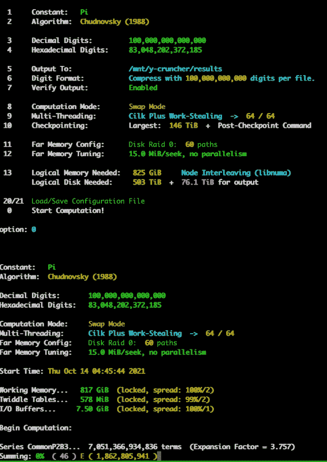
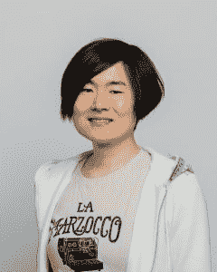

# 谷歌的艾玛·相户爱·伊沃是如何帮助创造圆周率新纪录的

> 原文：<https://thenewstack.io/how-googles-emma-haruka-iwao-helped-set-a-new-record-for-pi/>

在她西雅图公寓客厅的一角——离她的钢琴不远——艾玛·相户爱·Iwao 正准备一睹历史的风采。在将近 158 天的时间里，一项可能创造新的世界纪录的计算一直在进行。

使用行业标准的圆周率计算软件 y-cruncher，然后[将其连接到最新的现代云基础设施](https://thenewstack.io/how-google-cloud-enabled-a-record-calculation-of-pi/)，Iwao 和谷歌的其他三名云开发人员组成的团队——[本·布莱特辛](https://www.linkedin.com/in/bleything/)、[萨拉·福特](https://cloud.google.com/developers/advocates/sara-ford)和[史蒂夫·麦克格](https://www.linkedin.com/in/stevemcghee/)——试图计算圆周率到小数点后 1000 亿位。

这将是人类历史上计算圆周率的最高位数…

周二，Iwao 分享了那次经历的所有细节——那是什么感觉，一路上她学到了什么，以及她对下一代技术工作者的希望。

当那个重要的时刻到来时，你到底看到了什么？

这是 y-cruncher 的一个输出。它在数据中心的一台远程机器上，所以你需要 *ssh* 连接并登录到远程机器…它有多少秒，它计算了多少位数等等。最后，它显示了圆周率的最后一百位数。

最后一个数字是…零！回到 2019 年，当你[创造了一个更早的记录](https://thenewstack.io/google-clouds-haruka-iwao-sets-a-new-record-for-calculating-pi/)，计算圆周率为 31，415，926，535，897 位，它的最后一位也是……零。你对第二次出现同样的最后一位数字感到惊讶吗？

有点惊讶。我知道这只是巧合。数学上只是证明了这只是巧合。所以我很惊讶——我觉得它很特别——但从数学上来说，它只是其中一个数字。

**你写了[一篇博文，解释了创建集群来存储大量最终结果的技术细节](https://cloud.google.com/blog/products/compute/calculating-100-trillion-digits-of-pi-on-google-cloud)。看起来你不得不在开始之前指定要计算多少位数？**

这是专门针对 [y-cruncher](http://www.numberworld.org/y-cruncher/) 的。有不同的方法，但 y-cruncher 要求你输入你要计算的位数，然后 y-cruncher 确定内部精度和它需要多少存储空间。它实际上告诉你对于一个特定的组合，你需要多少磁盘和你想要多少内存。

那你为什么选择 100 万亿呢？你如何决定何时停止计算？

因为 100 万亿是一个容易记忆和说出的数字…上次我们做了 31，415，926，535，897。这正好是圆周率的前 13 位，因为我觉得这很酷。这次我选择了 100 万亿——因为我觉得这很酷。

成为世界纪录保持者是什么感觉？

我们采访谷歌云倡导者艾玛·相户爱 Iwao 的截图——2022 年 6 月 7 日

太激动人心了……这是我儿时的梦想，让梦想实现两次对我来说真的是莫大的荣幸。

与此同时，我真的想表明，有了云和更快的计算机，你可以做更多的事情。这是其中的一个例子，但是还有其他的科学领域和其他的问题和挑战我们可以用计算机来解决。我认为，能够展示我在现实生活中做过的事情，并从个人经历中谈论它，真的是一个很好的机会。

**云计算社区的其他人对你有什么有趣的反应吗？**

下周三，我和 Kelsey Hightower 将有一场关于这项世界纪录的网络研讨会……Kelsey 是我的同事。上次他很激动。他说成为世界纪录保持者很好。在日常生活中展示云的能力是件好事。比如圆周率。

所以你在 3 月 21 日完成了——接着是几个月来与 y-cruncher 的开发者核实数字，然后计划最终的公告。在这段时间里，对这次胜利保密很难吗？

是的，它是。

你之前说过，你甚至还没能告诉你妈妈第二项世界纪录的事。你保守了这个秘密将近三个月。回到 2019 年你第一次破纪录的时候，你妈妈是什么反应？

上次我妈妈对此很兴奋… *(Iwao 笑)*她变得过度兴奋了。她开始在社交媒体上发帖，我不喜欢这样。

我的一些同事，他们的孩子很兴奋。他们告诉他们的孩子，他们的同事是世界纪录保持者……我有机会访问美国和日本的学校，向学生们谈论纪录和计算机科学。我参观了我自己的高中——我在日本的 Yosaka 上的高中。我想学生们不知道谁会来…我真的很享受这一刻。

作为一名学生，我真的希望有更多的机会去了解别人在做什么。例如，当你开始在*真实的*生活中工作时，我们在学校学到的所有数学或科学、物理将会被用到。所以我很高兴我能够向学生展示例子。也展示了你如何在高中毕业、上大学、开始工作后建立自己的事业。

这个职业和旅程是我和学生们多次谈到的。我很高兴有这个机会。

那么，你对这些即将成为下一代的学生有什么希望呢？

我真的希望每个人都能追求自己热爱的东西。对我来说，它是关于计算机的。当我 11 岁开始使用电脑时，那在日本并不常见…但我真的很喜欢学习电脑。如果一个学生发现任何有趣的东西——比如计算机科学、数学、文学，任何东西——我真的希望他们能继续追求并坚持学习。也许他们可以成为专业工程师或工业专家，或者也许他们可以成为学术界的研究员。我认为有很多机会。只要他们能坚持下去，我认为这很好。

**人们对技术领域的多元化和包容性有很多担忧。希望你作为世界纪录保持者所获得的知名度将有助于产生影响。**

我认为存在一些性别差距，对于边缘化的人来说肯定存在挑战……我听到许多有着相似背景的人说，他们很高兴看到像他们这样的人创造世界纪录。所以我很高兴我能够展示一些东西——任何人都可以做他们真正想做的事情。同样，这些成就给了我传递信息和谈论的机会，例如，多样性，融入技术和工作场所或社区。这也是我想继续做的事情，我想利用这个机会向需要的人传递不同的信息和新的信息。

我的意思是，有时需要时间来认识到你真正热爱的是什么，有时需要时间来学习技能和获得机会。我想计算圆周率到 20 年的记录，但是我没有超级计算机。我只是一个普通的学生。我的父母曾经告诉过我，就像‘你为什么想学计算机科学——你是个女孩…" *(Iwao 笑)*但是我很高兴我决定学习计算机科学。

我不知道我什么时候有时间去计算圆周率。它只是同时发生在我身上。我碰巧在谷歌工作，我的团队和我的经理支持计算π到万亿的想法，我们也有一个程序，y-cruncher，任何人都可以用它来计算π。所以我刚好可以接触到计算圆周率所需的所有工具和资源。但同时，你仍然需要激情。谷歌是一家大公司，有很多工程师可以使用相同的资源。但是是我的想法和热情让这些唱片成为可能。

所以，是的，你可能需要等待机会，但要保持激情。

对于像我这样的人来说，有时在被边缘化的少数群体中，有*有*人想要支持你。不一定是同一背景，而是不同背景的人，有时是高层领导中的人——总有*人想要支持你。如果你能找到一个好的导师，一个好的赞助商，我认为这是成功的关键。我很高兴我能够见到很多这样的人，不是少数人。*

我问更广泛的团队是否有人想加入这个项目并再次计算圆周率——三个人说‘嘿，我想这么做！’我们有不同的专业，例如，我们中的一个人在站点可靠性工程方面有很强的背景，他提出了对存储系统的改进，并做了更多我没有想到的实验。所以这真的是一个协作的努力！

对我来说，这是一次很好的经历和学习机会。上次更像是个人项目。领导一个团队，并向他们解释我的想法，实际上帮助我把这些想法变得更好。同时，这也是一个很好的学习如何成为一个好的团队领导的机会。对我来说，这是宝贵的一课。

**那么你从领导团队的经历中学到了什么？**

我真正学到的一件事是——显然我认为核心想法是我的，但没有所有团队成员的帮助，我不可能想到很多细节。是的，有时候做一些事情需要更长的时间，比如开会和让每个人都在同一页上。但通过这样做，我认为我们能够走得更远。这就是团队合作的力量。

对于博客，一些可视化是由团队成员完成的，一些性能改进是由另一个团队成员提出的，一些操作技术是由其他团队成员提出的。所以总体来说，我认为我们做得比我自己做的要好得多…

你不了解整体情况。你在向其他人学习。作为领路人，你需要展示愿景，你需要展示目标，但你的旅行方式与你的预期不同。作为一名新的团队领导，我学会了保持耐心，迎接惊喜。

听起来这是一次很好的经历。

是的。绝对的。

<svg xmlns:xlink="http://www.w3.org/1999/xlink" viewBox="0 0 68 31" version="1.1"><title>Group</title> <desc>Created with Sketch.</desc></svg>