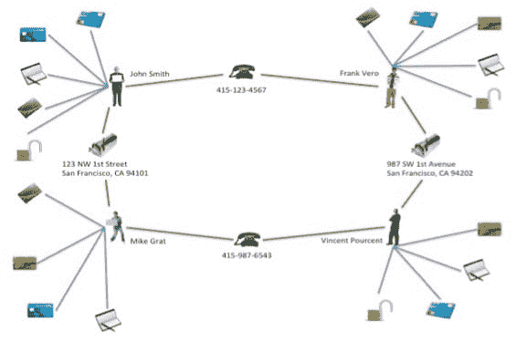
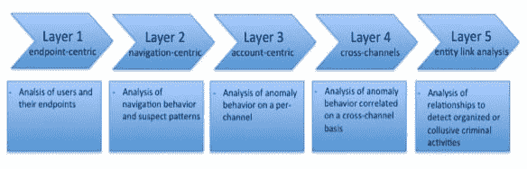
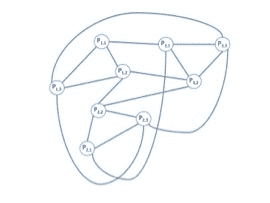
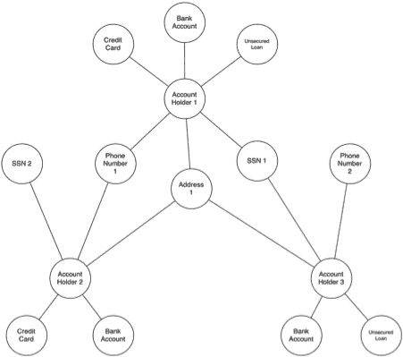

# 图表数据库如何揭示瓦解有组织犯罪的模式

> 原文：<https://thenewstack.io/how-graph-databases-uncover-patterns-to-break-up-organized-crime/>

编者按:图数据库如何检测事件以帮助预测结果的一个例子——AW。

银行和保险公司每年因欺诈损失数十亿美元。传统的欺诈检测方法在最大限度地减少这些损失方面发挥着重要作用。然而，越来越老练的欺诈者已经开发出各种逃避发现的方法，既有合作的，也有利用各种其他手段构建虚假身份的。

图形数据库提供了揭露欺诈团伙和其他复杂骗局的新方法，具有高度的准确性，并能够实时阻止高级欺诈场景。

虽然没有任何欺诈防范措施是完美的，但通过超越单个数据点，着眼于将它们联系起来的联系，可以获得重大的改进机会。通常，这些联系会被忽视，直到为时已晚——这是不幸的，因为这些联系往往掌握着最好的线索。

理解数据之间的联系，并从这些联系中获得意义，并不一定意味着收集新的数据。从一个人现有的数据中可以得出重要的见解，只需重新构思问题，并用一种新的方式来研究它:作为一个图表。

与大多数其他显示数据的方式不同，图表旨在表达关联性。图形数据库可以揭示使用传统表示(如表格)时难以发现的模式。越来越多的公司正在使用图形数据库来解决大量互联数据问题，包括欺诈检测。

## 示例:第一方银行欺诈

第一方欺诈包括申请信用卡、贷款、透支和无担保银行信贷额度的欺诈者，他们无意偿还任何贷款。对于银行机构来说，这是一个严重的问题。美国银行每年因第一方欺诈损失数百亿美元，估计占美国消费者信贷冲销总额的四分之一或更多。据进一步估计，美国和欧洲主要银行 10-20%的无担保坏账被错误分类，实际上是第一方欺诈。

这些损失的惊人规模可能是两个因素造成的。首先是第一方欺诈极难被发现。欺诈者的行为很像合法客户，直到欺诈者“越狱”，清空所有账户并迅速消失。第二个因素是欺诈团伙中的参与者数量与该行动控制的总美元价值之间的指数关系，这也将在后面进行更详细的探讨。这种相互关联的爆炸是有组织犯罪经常利用的一个特征。然而，尽管这一特征使得这些方案具有潜在的极大破坏性，但也使得它们特别容易受到基于图形的欺诈检测方法的影响。

## 典型场景

虽然每个第一方欺诈勾结背后的确切细节因业务而异，但以下模式说明了欺诈团伙通常是如何运作的:

1.  由两个或两个以上的人组成的诈骗团伙。
2.  该团伙共享合法联系信息的子集，例如，
phone 号码和地址，将它们组合起来以创建一个号码
of 合成身份。
3.  团伙成员用这些假身份开户。
4.  在原有账户的基础上增加了新的账户:无担保信用额度、
credit 卡、透支保护、个人贷款等等。
5.  账户使用正常，定期购买，及时
payments.
6.  由于
observed 负责任的信贷行为，银行逐渐增加循环信贷额度。
7.  有一天，戒指“爆发”，协调成员的活动，最大限度地利用所有
of 戒指的信用额度，然后消失。
8.  有时，欺诈者会更进一步，在实施前一步——
doubling 损害——之前，使用假支票将他们所有的
balances 归零。
9.  收款过程随之进行，但代理商永远无法联系到
fraudster.
10.  无法收回的债务被注销。

为了说明这种情况，让我们来看一个(小的)两个人串通起来创建合成身份的环:

*   托尼·比住在加利福尼亚州旧金山市西北第一街 123 号，邮编 94101(他的真实地址),他有一部预付费电话，号码是 415-123-4567
*   保罗·法夫尔住在加利福尼亚州旧金山第一大道西南 987 号，邮编 94102(他的真实地址)，他有一部预付费电话，号码是 415-987-6543

仅共享一个电话号码和地址(两个数据)，他们可以将这些组合起来创建 22 = 4 个带有假名的合成身份，如下图 1 所示。

******

图 1 显示了由此产生的诈骗团伙，每个合成身份有 4-5 个账户，总共有 18 个账户。假设每个账户的平均信用风险敞口为 4K 美元，银行的损失可能高达 7.2 万美元。

在上面概述的过程中，电话号码在越狱后被删除，当调查人员来检查这些地址时，Tony Bee 和 Paul Fabre(欺诈者，真实生活在那里)都否认认识 John Smith、Frank Vero、Mike Grat 或 Vincent Pourcent。

## 侦查犯罪

抓住诈骗团伙并在他们造成损害之前阻止他们是一项挑战。其中一个原因是，传统的欺诈检测方法要么不适合寻找正确的东西:在这种情况下，由共享标识符创建的环。标准工具——如与正常购买模式的偏差——使用离散数据，而不是关联。离散方法对于抓获单独行动的欺诈者是有用的，但它们在检测团伙的能力方面有所欠缺。此外，许多这样的方法容易出现假阳性，这在客户满意度和收入机会损失方面产生了不希望的副作用。

Gartner 提出了一个防止欺诈的分层模型，如下所示:

它从简单的离散方法(左边)开始，发展到更复杂的“大图”类型的分析。最右边的一层是“实体链接分析”，利用连接的数据来检测有组织的欺诈。如以下部分所示，使用图形数据库在客户生命周期的关键点进行实体链接分析，可以非常容易地发现上述类型的共谋，而且准确率极高。

## 实体链接分析

我们之前讨论了欺诈者如何使用多个身份来增加其犯罪收入的总体规模。随着诈骗团伙的壮大，不仅影响的美元价值会增加，而且抓捕该团伙所需的计算复杂性也会增加。当人们考虑到随着环的增长而发生的组合爆炸时，这个问题的严重性就变得清楚了。在下图中，我们可以看到第三个人是如何将合成身份的数量扩大到九个的:

> 共享 m 个数据元素(如姓名、出生日期、电话号码、地址、SSN 等)的 n 人(n≥2)环。)可以创建多达 nm 个合成身份，其中每个合成身份(表示为一个节点)链接到 m × (n-1)个其他节点，总共有(nm × m × (n-1)) / 2 个关系。

同样，四个人可以控制 16 个身份等等。假设有 100 个虚假身份，每个身份有三种金融工具，每种都有 5000 美元的信用限额，那么 10 人参与的欺诈行动的潜在损失是 150 万美元。

## 图形数据库如何帮助

使用传统的关系数据库技术发现环需要将上面的图建模为一组表和列，然后执行一系列复杂的连接和自连接。这种查询构建起来非常复杂，运行起来非常昂贵。以支持实时访问的方式扩展它们带来了巨大的技术挑战，不仅随着环的大小增加，而且随着总数据集的增长，性能会呈指数级下降。

图形数据库已经成为克服这些障碍的理想工具。像 Cypher 这样的语言提供了一个简单的语义来检测图中的环，在内存中实时导航连接。

下图 4 中的图形数据模型表示了图形数据库中的数据实际情况，并说明了如何通过简单地遍历图形来找到环:

通过使用图形数据库运行适当的实体链接分析查询，并在客户和账户生命周期的关键阶段运行检查，可以增强现有的欺诈检测基础设施以支持 ring 检测，例如:

1.  在创建帐户时。
2.  在一次调查中。
3.  一旦达到信用余额阈值。
4.  当支票被退票时。

与正确的事件类型相关联的实时图形遍历可以帮助银行识别可能的欺诈团伙:在危机爆发期间甚至之前。

## 结论

老练的罪犯已经学会攻击他们薄弱的系统。传统技术虽然对某些类型的预防仍然适用和必要，但并不是为了检测复杂的欺诈团伙而设计的。

这就是图形数据库可以增加价值的地方。揭露欺诈团伙是任何欺诈检测策略的重要组成部分。使用图形数据库的关联分析是一种有用的发现环的技术:不仅在事后，而且在实时。

越来越多的公司使用图形数据库来解决各种互联数据问题，包括欺诈检测。

Philip Rathle 是 Neo4j 的产品副总裁。Neo4j 是领先的图形数据库，拥有 10 年的 24×7 生产部署历史。

戈尔卡·萨多夫斯基是 T2 一家提供技术和网络安全解决方案和服务的公司的创始人兼首席执行官。

<svg xmlns:xlink="http://www.w3.org/1999/xlink" viewBox="0 0 68 31" version="1.1"><title>Group</title> <desc>Created with Sketch.</desc></svg>