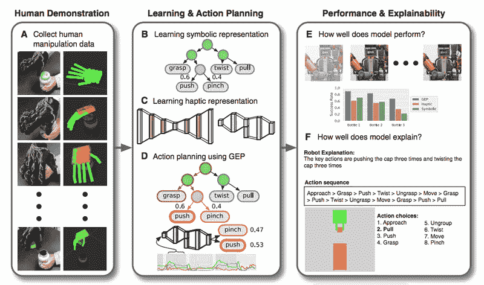
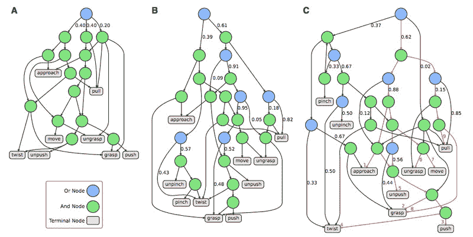

# 不同类型的“可解释人工智能”如何改变人类的信任

> 原文：<https://thenewstack.io/how-human-trust-varies-with-different-types-of-explainable-ai/>

由人工智能驱动的自主机器越来越多地出现在我们生活的各个角落，无论是在工厂车间进行[自动化制造](/human-workers-can-control-robots-virtual-reality-home/)，[开车送我们去目的地](/happens-nobody-owns-cars/)，[送货](/self-driving-grocery-delivering-robots-ready-roll-door/)，甚至是[协助精密手术](/autonomous-robot-surgical-cuts-better-human-surgeon/)。

但是，尽管人工智能和机器人技术的进步让我们的生活变得更加轻松，但我们许多人仍然对信任机器持怀疑态度，更不用说将我们的生活托付给它们了。毕竟，许多专家哀叹这样一个事实，即人工智能经常像某种“[黑匣子](https://www.kdnuggets.com/2019/03/ai-black-box-explanation-problem.html)”；它会自动做出关键决定，而不会真正揭示这些选择背后的*为什么*和*如何*。不足为奇的是，这种不透明会导致严重的问题，比如突然出现的[算法偏差](https://thenewstack.io/hidden-gender-racial-biases-algorithms-can-big-deal/)，从而强化了这种不信任感。

如果要培养人类对智能设备的信任，那么就必须解决机器预测背后缺乏透明度的问题——因此越来越需要所谓的[可解释的人工智能](https://thenewstack.io/explainable-ai-looking-into-the-black-box/) (XAI)。但是正如加州大学洛杉矶分校的研究人员最近证明的那样，信任不仅可以通过向人类提供更清晰的解释来获得，还可以通过信息呈现的方式来获得。

## 并非所有的解释都是平等的

正如加州大学洛杉矶分校计算机科学博士生、《科学机器人》杂志上发表的论文[的主要合著者](http://www.stat.ucla.edu/~sczhu/papers/A%20Tale%20Of%20Two%20Explanations%202019.pdf)的马克·埃德蒙兹告诉我们的那样，任何计算机做出有关人类安全的关键决策的领域都将从可解释的人工智能中受益匪浅。

“但是如果人们不信任这些系统，他们就不太可能采用它们，”他警告说。“因此，可解释人工智能的目标是产生更可解释、更透明和更可信的人工智能系统，这些系统比黑盒模型更容易诊断和修复，因此更健壮和可靠。”

为了开始他们的研究，该团队首先让一名人类演示者训练机器人使用触觉手套打开带有安全旋盖的药瓶。手套中的传感器记录手的位置和力度，这些数据被转换成两种不同的模型表示:第一种是“动作语法”模型，它分解了任务的分步结构；其次，一个[触觉](https://en.wikipedia.org/wiki/Haptic_technology)模型，根据机器人手爪的力感反馈预测机器人应该采取的下一步行动。该团队发现，通过结合语法和触觉模型，机器人在打开药瓶方面取得了最大的成功。

该团队研究的第二部分着眼于什么类型的机器决策解释人类会认为更可信。为此，研究小组要求 150 名加州大学洛杉矶分校的学生使用不同的解释来评估执行开瓶任务的机器人的可信度。为了建立一个基线，所有 150 名学生首先观看了机器人打开瓶子的视频。然后，给各组不同的机器人动作解释:一组使用基线，没有额外的解释；一个使用象征性的动作序列；另一种使用关于姿态和力的触觉信息；另一个融合了符号和触觉的解释。这些表述还与机器人动作的纯文本描述进行了比较。

概述实验的各个阶段，展示演示、学习、评估和可解释性。

“动作语法”模型的可视化表示，使用来自人类演示的数据。

研究小组发现，那些得到符号和触觉解释组合的人最信任机器人，而那些没有得到任何解释的人最不信任机器人。在后续测试中，该团队还发现，最信任机器人的人也是那些在打开另一个新药瓶时能够更准确地预测机器人接下来会采取什么步骤的人。令人惊讶的是，研究小组发现，基于文本的解释对培养人类的信任几乎没有帮助，事实上，与基线视频解释相比，差异并不大。

基于他们的发现，该团队认为，在人工智能方面，需要更加重视寻找增加人类信任的方法，特别是那些更全面和实时发生的方法。

埃德蒙兹说:“对于未来的工作，该领域应该进一步检查和优先制作既有性能又能提供解释的模型。”“这与当前大多数只关注性能的人工智能形成鲜明对比。我们的工作强调了在模型设计中优先考虑这两者的必要性。提供对人类认为值得信任的东西的理解，将有助于人工智能融入社会和我们的日常生活。在系统接管安全关键活动之前，人类可能希望信任系统。信任也是协作的基础:如果两个人工智能代理不信任彼此，他们为什么要一起工作？”

https://youtu.be/BChy2zeiMUQ

来自 Pixabay 的 silviarita 的特写图像；其他图片:加州大学洛杉矶分校

<svg xmlns:xlink="http://www.w3.org/1999/xlink" viewBox="0 0 68 31" version="1.1"><title>Group</title> <desc>Created with Sketch.</desc></svg>