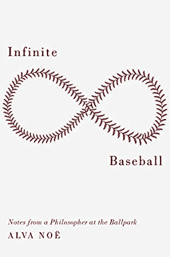

# 当人工智能开始裁判棒球时人类的反应

> 原文：<https://thenewstack.io/how-humans-reacted-when-ai-began-umpiring-baseball/>

“你出局了，”裁判加布·莫拉莱斯(Gabe Morales)在对旧金山巨人队(San Francisco Giants)内野手威尔默·弗洛雷斯(Wilmer Flores)的一次臭名昭著的判罚中示意道，这提前结束了这场比赛和本赛季 2021 年最佳球队的比赛。(在 2021 赛季，巨人队赢了 107 场比赛，输了 55 场。)

棒球迷抱怨道——就像他们做的那样…

随着世界职业棒球大赛于周二开始，一些球迷现在开始问是否是时候用机器取代那些容易犯错的人类裁判了。但随着我们技术的进步和人工智能(AI)的改善，一些较小的联盟——甚至其他一些运动——已经开始尝试自动化裁判。事实证明，我们的技术水平只是一个考虑因素。

这些测试让我们得以一瞥历史上独一无二的时刻，也为我们提供了一个迷人的机会来回答真正的终极问题:当机器最终也进入棒球运动时，人类会有什么样的反应？

## 足球、网球和棒球

《纽约客》在最近一篇题为[“入侵机器人裁判”](https://www.newyorker.com/magazine/2021/08/30/invasion-of-the-robot-umpires)的文章中指出，足球已经有了视频助理裁判。今年 2 月，在网球运动中，澳大利亚网球公开赛用鹰眼直播取代了人工裁判，ESPN [将](https://www.espn.com/tennis/story/_/id/30877297/hawk-eye-live-gains-more-support-australian-open)描述为“一个复杂的视觉系统，其中与计算机相连的摄像机用于跟踪球的轨迹，以确定球是否在界内，以及捕捉脚下失误。”

女单冠军大阪直美向 ESPN 承认“我一点都不介意。这省去了我试图质疑或思考‘他们的判断是否正确’的麻烦。这真的让我很专注。"

在澳大利亚网球公开赛上，自动系统似乎至少有一次吹错了——但在 5 月，美国网球协会在今年的美国网球公开赛上换成了同样的[。(《华盛顿邮报》指出，这消除了玩家过去要求的挑战，因为“没有必要去同一个系统推翻你刚刚不同意的系统。”)](https://www.espn.com/tennis/story/_/id/31503876/us-open-use-hawk-eye-line-calling-technology-all-courts-first)

甚至约翰·麦肯罗，这位前网球冠军，也许最出名的是与裁判争论，似乎也赞同这项技术。现在，他是一名 ESPN 分析师，他说如果他们在他 20 世纪 80 年代的全盛时期拥有这项技术，他“本可以专注于”并且“会赢得更多”。

也许我们会错过麦肯罗愤怒的场面——但麦肯罗自己说，当谈到自动化线路裁判时，“开香槟庆祝吧！没有巡边员。习惯就好！这是未来的潮流。”

据《悉尼先驱晨报》报道，单词“out”和“fault”现在是录音——不过，出于好意，12 个摄像头的系统使用了八名紧急服务人员的录音，他们被选为这项特殊荣誉的获得者。这家自动化公司的网球主管后来向该报暗示，有一天，财政拮据的赛事组织者[可以用赞助商的名字](https://www.smh.com.au/sport/tennis/you-could-have-rolex-being-shouted-out-sponsors-could-replace-out-calls-20210208-p570n8.html)来代替电话；导演没有听到这个词，而是指出，“你可以大声喊出‘拉尔夫·劳伦’。”

那么，当所有这些新奇的技术出现在不可预测的人类棒球运动中时，会发生什么呢？

## 点击与头盔

2019 年，TrackMan 机器人裁判员在淡季亚利桑那州秋季联赛的两支球队的主场进行了测试，这两支球队分别是色彩鲜艳的 Salt River Rafters 和 Scottsdale Scorpions。

“棒球场的球场跟踪系统读取球场，然后软件确定球场是否穿过好球带的任何部分，这可以根据每个球员的身高进行调整，”美国职业棒球大联盟的一份官方 2019 年新闻稿[解释道。《华盛顿邮报》将这一想法报道为“本质上，一套高度放置和良好编程的摄像机。”](https://www.mlb.com/news/mlb-tests-robo-umps-in-arizona-fall-league)

一名人类裁判然后简单地重复机器告诉他说的话——尽管这导致了技术上的困难，[回忆哥伦比亚广播公司体育](https://www.cbssports.com/mlb/news/robot-umpires-how-it-works-and-its-effect-on-players-and-managers-in-the-atlantic-league-plus-whats-to-come/)。

哥伦比亚广播公司报道，当大西洋联盟的裁判试图使用苹果 Airpod 耳机接听电话时，“他们在比赛结束前一直遇到电池续航时间低的问题。”

《纽约客》将这种猜谜游戏描述为“扮演他们以前的角色”，因为这些电话实际上是由“一个长着一只发光绿眼睛的黑色大披萨盒子”发出的，[安装在本垒板后面某处的体育场屋顶上](https://www.reviewjournal.com/sports/aviatorsbaseball/robot-umpires-make-debut-in-independent-atlantic-league-1708293/attachment/a-radar-device-is-seen-on-the-roof-behind-home-plate-at-peoplesbank-park-during-the-third-innin/)。

这一切都让 59 岁的弗兰克·维奥拉(Frank Viola)很不爽，他是前全明星投手，现在是高点摇滚乐队的投手教练。据 CBS 体育报道，[维奥拉在第一场由机器人裁判的比赛中没能挺过第一局:“维奥拉希望裁判蒂姆·德特韦勒(Tim Detweiler)裁定一些近距离判罚无效。德特韦勒拒绝了，事情就像滚雪球一样越滚越大。](https://www.cbssports.com/mlb/news/atlantic-league-coach-ejected-for-arguing-over-automated-strike-zone-just-one-inning-into-robot-umpire-era/)

德特韦勒扔了他的写字板，冲向裁判，并大喊了一些刺耳的话，根据一个视频的说明，是“做你的***工作。”

[https://www.youtube.com/embed/xwW4WpDMfnA?start=30&feature=oembed](https://www.youtube.com/embed/xwW4WpDMfnA?start=30&feature=oembed)

视频

棒球专员罗布·曼弗雷德(Rob Manfred)后来在 2020 赛季开始时说“我们相信从长远来看，它会更准确。会减少游戏中的争议，对游戏有好处。

他补充说，“目前的打击区设计实际上是三维的，相机比人眼更擅长调用三维打击区。”

虽然测试联盟已经转向了一套不同的技术，但在后来的采访中，Manfred [声称](https://money.yahoo.com/mlb-commissioner-robot-umpires-apos-182739401.html)“我们认为它比人站在那里更准确。”

一年后，维奥拉不满地向《纽约客》抱怨道，“曼弗雷德是个律师。”

MLB.com 的文章还包括了真实玩家的深思熟虑的反应的剪辑，这些玩家经历了机器人裁判的游戏，并且给了第一个系统一些褒贬不一的评价。

例如，小联盟成员罗伊斯·刘易斯(Royce Lewis)曾为其判断球是否太偏左或偏右而叫好，说他们“做得相当好”

但是一个下坠的曲球，它只是在好球带的顶部或底部刻痕呢？MLB 的文章指出，虽然这也符合罢工的技术定义，但裁判员传统上不认为这是罢工。“我认为这是一些需要调整的事情，”刘易斯说

在这样一个几乎脏兮兮的投球中三振出局后，外野手雅各布·海沃德仍然与裁判争论这个判罚——并且也被逐出比赛。

另一个[片段](https://twitter.com/MLBPipeline/status/1175450239584677893?ref_src=twsrc%5Etfw)展示了当另一名球员因所谓的第三击而怒视裁判时发生的事情。裁判只是指了指他的头盔，然后耸了耸肩。

但值得注意的是，投手[阿什顿·古多](https://en.wikipedia.org/wiki/Ashton_Goudeau#Kansas_City_Royals)表示，人类和机器之间也存在明显的分歧。“有些球我们的捕手会向裁判提出意见。比如，‘我认为那是一个好球’，甚至裁判也会同意。”

## 裁判员的时代

那么，裁判们对他们新的自动化裁判搭档感觉如何呢？在 2019 年大西洋联盟赛季初，裁判弗雷迪·德杰苏斯告诉[哥伦比亚广播公司体育](https://www.cbssports.com/mlb/news/robot-umpires-how-it-works-and-its-effect-on-players-and-managers-in-the-atlantic-league-plus-whats-to-come/)“这太棒了。”DeJesus 称之为“一个很好的机会，对比赛有好处”，认为这是所有大联盟棒球场有一天的可能性。(CBS Sports 补充说，在德杰苏斯担任使用 TrackMan 技术的第一场比赛的裁判后，“他的耳机被国家棒球名人堂博物馆要求，现在驻留在库珀斯敦。”)

今年 8 月，德杰苏斯在长岛鸭子队的一场比赛中担任裁判，仍然转播了更多的田径裁判呼叫。一场比赛后，他告诉《纽约客》，“有六个判罚我不同意。”但更有趣的是，在那些电话之后，没有人从休息区跑出来和他争论。“我怀念战斗，”他说。

正如《纽约客》(the New Yorker)所言，“争论就像库存车的残骸:怪诞、道德上站不住脚，而且是许多人暗中支持的东西。”(尽管他们也记得，早在 19 世纪，“少数早期裁判员被杀。”)

就连德杰苏斯也告诉该杂志，当他第一次听说自动投球和击球时，“我非常生气。”然而，随着时间的推移，他不得不承认这个系统比他更擅长裁判。

大西洋联盟的主席还告诉《纽约客》，早期，不是鹦鹉学舌般地回应系统的呼叫，“我们有一些裁判变得无赖，”这意味着他们而是大声喊出自己的呼叫。

但是，自动化裁判员也保护他们的人类同行免于犯错的耻辱吗？2017 年，在一次比赛结束罢工后，芝加哥小熊队经理乔·马登说，他为裁判马克·韦格纳感到遗憾，因为他不得不在余生中忍受这个错误。

“我真的知道马克知道他搞砸了，”经理告诉 ESPN。“我想现在没有人比他更难受了。显然，这是一个球。”被叫出来的球员(前世界大赛 MVP 本·佐布里斯特)补充道，“他可能会看着它，对自己不太满意。”

佐布里斯特——机器人裁判员的长期倡导者——简明扼要地向 ESPN 说明了他们的理由:“既然我们有了技术，我们也许应该把它做好。”

 [《棒球场上的哲学家笔记》的作者，哲学教授阿尔瓦·诺伊](http://www.alvanoe.com/)告诉《纽约客》有一个更大的趋势。“这是一场运动的一部分，这场运动利用算法来做出生活以外的艰难选择。”

诺最终认为这是一场关于客观性本身性质的争论，其前提是基于可测量的物理线索，所有答案*都是已知的*。

《华盛顿邮报》提出了一个终极问题:粉丝们真的会对额外的准确性感到满意吗？或者有没有另一种可能性——过于人性化的主观性是“让公共领域，或者至少是棒球，成为一个充满活力和有趣的地方的原因。”

“换句话说，弗洛雷斯遏制了摇摆，抓住了贯穿许多创新的问题:仅仅因为我们可以，就意味着我们应该吗？”

或者，正如《新闻日报》专栏作家[本周](https://www.newsday.com/lifestyle/retirement/the-column-robot-umpires-bad-call-1.50394661)所言，“失误是游戏的一部分——从地球到棒球！—以及我们如此热爱它的原因。这逃过负责的人了吗？”

* * *

# WebReduce

<svg xmlns:xlink="http://www.w3.org/1999/xlink" viewBox="0 0 68 31" version="1.1"><title>Group</title> <desc>Created with Sketch.</desc></svg>