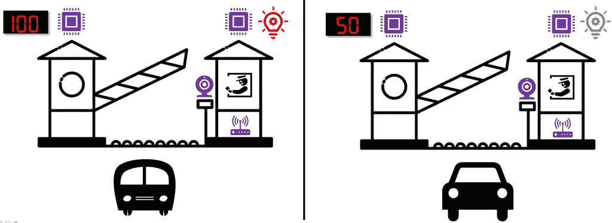
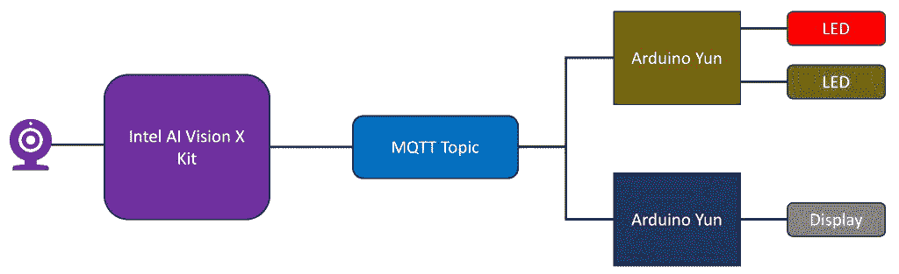

# 我如何使用英特尔 AI Vision X 开发套件和 Arduino Yun 构建“AIoT”项目

> 原文：<https://thenewstack.io/how-i-built-an-aiot-project-with-intel-ai-vision-x-developer-kit-and-arduino-yun/>

物联网和人工智能是两种独立的技术，对多个行业垂直领域产生了重大影响。物联网是数字神经系统，而人工智能则成为做出控制整个系统决策的大脑。人工智能和物联网的致命结合为我们带来了 AIoT(人工智能物联网)，它提供了智能和互联的系统，能够自我纠正和自我修复。

在过去的几年里，人工智能已经变得非常容易被开发人员使用。从简单的认知 API 到 AutoML，再到训练复杂的深度学习算法所需的基础设施，AI 不仅可及，而且负担得起。工业物联网是受益于人工智能融合的关键领域之一。

为了展示 AIoT 不断发展的概念，我选择了[英特尔 AI Vision X 套件](https://software.intel.com/en-us/iot/hardware/up-squared-ai-vision-dev-kit)和 [Arduino Yun](https://store.arduino.cc/usa/arduino-yun-rev-2) 的组合。为了推导 ML 模型，我使用了英特尔 OpenVINO Toolkit。关于英特尔 OpenVINO Toolkit 的介绍，请参考我的[上一篇文章](https://thenewstack.io/intel-openvino-brings-ai-inferencing-to-the-desktop/)。

连接到 Vision AI X Kit 的摄像头充当智能图像传感器，可以通过 OpenCV 和 OpenVINO Toolkit 检测物体。它将检测到的对象的标签发布到 Arduino 云设备订阅的 MQTT 主题。当检测到感兴趣的对象时，Yun 通过改变致动器的状态来采取行动。它可以像改变 LED 的颜色或控制继电器一样简单。

当它部署在收费站时，LED 的颜色和显示屏上显示的值会根据车辆类型而变化。

[](https://thenewstack.io/how-i-built-an-aiot-project-with-intel-ai-vision-x-developer-kit-and-arduino-yun/aiot-1/)

这个场景也展示了 AI Vision X Kit 是一个强大的边缘计算平台。在硬件方面，该套件由英特尔凌动 x7-E3950 CPU、8GB RAM 和 64 GB eMMC 提供支持。该套件最棒的一点是，它配备了嵌入式英特尔 Movidius Myriad X 视觉处理单元(VPU)，以加速人工智能模型。OpenVINO 工具包被配置为通过推理引擎插件与 VPU 对话。

作为一台 x86 机器，AI Vision X Kit 运行完全成熟的 Ubuntu 18.04，其上安装了 OpenVINO Toolkit。我还安装了 Mosquitto MQTT 服务器，它充当连接基于 Arudino Yun 的微控制器的消息总线。所有设备都连接到本地 WiFi 接入点，该接入点提供与 AIoT 设置的连接。

以下是本项目中使用的项目列表:

由于英特尔 AI Vision X Kit 充当负责对象检测的边缘计算设备，我们运行了一个由英特尔 OpenVINO Toolkit 支持的基于 OpenCV 的应用程序，该应用程序分析来自连接的摄像机的反馈。

用于对象检测的深度学习模型基于 MobileNet SSD Caffe 模型。我们将使用 OpenVINO Toolkit 提供的下载器工具下载模型文件。

下图描述了该解决方案的高级架构。
[](https://thenewstack.io/how-i-built-an-aiot-project-with-intel-ai-vision-x-developer-kit-and-arduino-yun/aiot-0/)

```
$  mkdir  AIot
$  cd  AIoT
$  /opt/intel/openvino/deployment_tools/open_model_zoo/tools/downloader/downloader.py  --name mobilenet-ssd  -o  model

```

您可以在**中找到 MobileNet SSD V1 咖啡模型。/model/object _ detection/common/mobilenet-SSD/caffe/**目录。

下一步是使用 OpenVINO Toolkit 的模型优化工具来优化这个模型。

```
$   /opt/intel/openvino/deployment_tools/model_optimizer/mo_caffe.py  \
--input_model model/object_detection/common/mobilenet-ssd/caffe/mobilenet-ssd.caffemodel  \
--output_dir model/FP16

```

FP16 目录下。/model 目录有一个优化的 Caffe 模型，可以与 OpenVINO Toolkit 的推理引擎插件一起使用。您会发现由模型优化器生成的以下文件:

```
$  ls  ./model/FP16/
mobilenet-ssd.bin mobilenet-ssd.mapping mobilenet-ssd.xml

```

我们现在准备好利用 OpenCV 的优化模型。

```
from  imutils.video import  VideoStream
from  imutils.video import  FPS

import  numpy as  np
import  argparse
import  imutils
import  time
import  cv2

import  paho.mqtt.client as  mqtt

prototxt="./model/FP16/MobileNetSSD_deploy.xml"
model="./model/FP16/MobileNetSSD_deploy.bin"

conf=0.5
font  =  cv2.FONT_HERSHEY_SIMPLEX
freq  =  cv2.getTickFrequency()
frame_rate_calc  =  1

broker_address="10.0.0.10"
client  =  mqtt.Client("smartcam")
client.connect(broker_address)

LABELS  =  ["background",  "aeroplane",  "bicycle",  "bird",  "boat",
  "bottle",  "bus",  "car",  "cat",  "chair",  "cow",  "diningtable",
  "dog",  "horse",  "motorbike",  "person",  "pottedplant",  "sheep",
  "sofa",  "train",  "tvmonitor"]

COLORS  =  np.random.uniform(0,  255,  size=(len(LABELS),  3))

net  =  cv2.dnn.readNet(prototxt,  model)
net.setPreferableTarget(cv2.dnn.DNN_TARGET_VPU)

vs  =  VideoStream(usePiCamera=False).start()
time.sleep(2.0)
fps  =  FPS().start()

while  True:
  frame  =  vs.read()
  frame  =  imutils.resize(frame,  width=400)
  t1  =  cv2.getTickCount()

  (h,  w)  =  frame.shape[:2]
  blob  =  cv2.dnn.blobFromImage(frame,  0.007843,  (h,  w),  127.5)

  net.setInput(blob)
  detections  =  net.forward()

  for  i  in  np.arange(0,  detections.shape[2]):
  confidence  =  detections[0,  0,  i,  2]

  if  confidence  >  conf:
  idx  =  int(detections[0,  0,  i,  1])
  box  =  detections[0,  0,  i,  3:7]  *  np.array([w,  h,  w,  h])
  (startX,  startY,  endX,  endY)  =  box.astype("int")

  label  =  LABELS[idx]
  print(label)                        
  cv2.rectangle(frame,  (startX,  startY),  (endX,  endY),
  COLORS[idx],  2)
  y  =  startY  -  15  if  startY  -  15  >  15  else  startY  +  15

  if  label  ==  'bus'  or  label  ==  'car':
 client.publish('cam/infer',label)
  else:
  client.publish('cam/infer',"none")

  cv2.putText(frame,  label,  (startX,  y),font,  0.5,  COLORS[idx],  2)
  cv2.putText(frame,"FPS: {0:.2f}".format(frame_rate_calc),(30,50),font,1,(255,255,0),2,cv2.LINE_AA)

  cv2.imshow("Frame",  frame)
  key  =  cv2.waitKey(1)  &  0xFF

  t2  =  cv2.getTickCount()
  time1  =  (t2-t1)/freq
  frame_rate_calc  =  1/time1 

  if  key  ==  ord("q"):
  break
  fps.update()

cv2.destroyAllWindows()
vs.stop()

```

下面几行代码加载优化的模型，并将推理委托给 Movidius Myriad X VPU。

```
net  =  cv2.dnn.readNet(prototxt,  model)
net.setPreferableTarget(cv2.dnn.DNN_TARGET_CPU)

```

当检测到的对象碰巧是一辆汽车或一辆公共汽车时，一条带有实际标签的消息被发布到 MQTT 主题。

```
if label  ==  'bus'  or label  ==  'car':
    client.publish('cam/infer',label)
else:
    client.publish('cam/infer',"none")

```

基于发布到 MQTT 主题的消息，Arudino 的一个控件控制 LED。

```
#include 
#include 
#include 

BridgeClient net;
MQTTClient client;

unsigned long lastMillis  =  0;
const int RED_LED=2;
const int GREEN_LED=4;

void connect()  {
  Serial.print("connecting...");
  while  (!client.connect("bulb"))  {
    Serial.print(".");
    delay(1000);
  }

  Serial.println("\nconnected!");
  client.subscribe("cam/infer");
}

void messageReceived(String  &topic, String &payload) {

  Serial.println(payload);

  if  (payload  ==  "bus")  {
    digitalWrite(RED_LED,  HIGH);
    digitalWrite(GREEN_LED,  LOW);
  }

  if  (payload  ==  "car")  {
    digitalWrite(GREEN_LED,  HIGH);
    digitalWrite(RED_LED,  LOW);
  }

  if  (payload  ==  "none")  {
    digitalWrite(GREEN_LED,  LOW);
    digitalWrite(RED_LED,  LOW);
  }

}

void setup()  {  
  Bridge.begin();
  Serial.begin(115200);  

  pinMode(GREEN_LED,  OUTPUT);  
  pinMode(RED_LED,  OUTPUT);  

  client.begin("10.0.0.10",  net);
  client.onMessage(messageReceived);

  connect();
}

void loop()  {
  client.loop();

  if  (!client.connected())  {
    connect();
  }

}

```

另一台 Arduino 设备在 7 段显示屏上显示收费站费用。

```
#include 
#include 
#include 

#include "TM1637.h"
#include 
#include 

const int  CLK  =  6;
const int  DIO  =  7;
TM1637 tm1637(CLK,DIO);

BridgeClient net;
MQTTClient client;

void connect()  {
  Serial.print("connecting...");
  while  (!client.connect("display"))  {
    Serial.print(".");
    delay(1000);
  }

  Serial.println("\nconnected!");

  client.subscribe("cam/infer");
}

void messageReceived(String  &topic, String &payload) {
  Serial.println(payload);  
  tm1637.clearDisplay();  

  if  (payload  ==  "bus")  {
    tm1637.displayNum(100);
  }

  if  (payload  ==  "car")  {
    tm1637.displayNum(50);
  }

  if  (payload  ==  "none")  {
    tm1637.displayNum(0);
  } 
}

void setup()  {
  Bridge.begin();
  Serial.begin(115200);

  tm1637.init();
  tm1637.set(BRIGHT_TYPICAL);
  client.begin("10.0.0.10",  net);
  client.onMessage(messageReceived);

  connect();
}

void loop()  {
  client.loop();

  if  (!client.connected())  {
    connect();
  }

}

```

本教程利用人工智能和物联网来展示现实世界的场景。

*贾纳基拉姆·MSV 的网络研讨会系列“机器智能和现代基础设施(MI2)”提供了涵盖前沿技术的信息丰富、见解深刻的会议。在 [http://mi2.live](http://mi2.live/) 注册即将到来的 MI2 网络研讨会。*

来自 Pixabay 的 SplitShire 特写图片。

<svg xmlns:xlink="http://www.w3.org/1999/xlink" viewBox="0 0 68 31" version="1.1"><title>Group</title> <desc>Created with Sketch.</desc></svg>