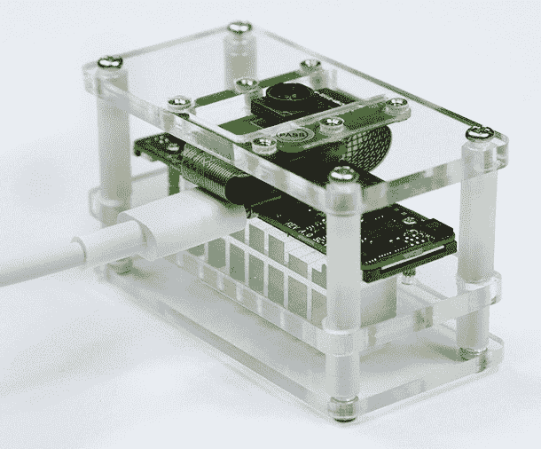

# 我如何用有角的 Sungem AI 相机构建 AWS DeepLens 克隆

> 原文：<https://thenewstack.io/how-i-built-an-aws-deeplens-clone-with-the-horned-sungem-ai-camera/>

当我第一次在 re:Invent 2017 上看到 AWS DeepLens 的演示时，我对智能相机的可能性感到兴奋。整整一年后，我遇到了 Horned Sungem，这是一款由英特尔的 Myriad Vision Processing Unit (VPU)驱动的微型相机。

有了 Raspberry Pi Zero 和 [Horned Sungem](https://www.waveshare.com/horned-sungem-ai-vision-kit.htm) 相机的组合，我可以快速构建一个 AWS DeepLens 克隆体。我移植了一个我最初的 [DeepLens 演示](https://youtu.be/ScYKqja-jdc)，它可以自动识别车辆类型并在收费站计算费用。由于没有附加显示器，我使用了 Amazon Echo 来提供对话式用户体验。

在最近的[基于 Horned Sungem 的演示版本](https://youtu.be/yDBaIf_NANE)中，我方便地用谷歌 Home 设备替换了亚马逊 Echo，以提供相同的体验。我还添加了一个按钮，向用户发送带有车辆类型和通行费的 WhatsApp 消息。

以下是我在演示中使用的硬件设备列表:

*   树莓派零度 W
*   Grove Pi Zero 帽子
*   Grove LEDs
*   Grove 按钮
*   Horned Sungem 智能摄像机
*   谷歌主页
*   电力银行

## 认识一下有角的 Sungem，人工智能摄像机

Horned Sungem (HS)是一家专注于人工智能的中国公司。这款 AI 相机专为开发者、学生、业余爱好者和爱好者打造，让他们轻松创建自己的 AI 应用。

[](https://thenewstack.io/how-i-built-an-aws-deeplens-clone-with-the-horned-sungem-ai-camera/hs-cam/)

该设备有一个 USB-C 连接器，可以插入 Raspberry Pi 或任何其他计算设备，如 PC 或 Mac。它原生支持通过 CSI 接口连接的 Raspberry Pi 摄像头。这款相机有两个端口——USB-C 和 micro-USB。USB-C 型连接器用于将相机连接到计算设备，而微型 USB 用于外部电源。当连接到像 Raspberry Pi Zero 这样的低功耗设备时，相机无法从主机获得足够的电力。外部电源有助于 HS 以最佳性能工作。

我最喜欢 HS 的一点是运行在 ARM 或英特尔主机计算设备上的 Python SDK。SDK 极大地简化了推理机器学习模型的实现。基于 CIFAR-10 和 PASCAL-VOC 等流行数据集的经过充分训练的对象检测和人脸识别模型只是一个方法调用。

开发者要做的就是导入 HS API，通过传递模型名来调用一个方法。输出返回检测到的对象的标签。

我使用 PASCAL-VOC 数据集训练的对象检测模型来识别公交车和汽车。有关使用 SDK 的更多详细信息，请参考 Github 上的 HS SDK。

```
from __future__ import print_function
from future.standard_library import install_aliases
install_aliases()

from urllib.parse import urlparse,  urlencode
from urllib.request import urlopen,  Request
from urllib.error import HTTPError

import json
import os

from flask import Flask
from flask import request
from flask import make_response

import memcache

shared=None

app  =  Flask(__name__)

@app.route('/',  methods=['POST'])
def webhook():
    req  =  request.get_json(silent=True,  force=True)

    print("Request:")
    print(json.dumps(req,  indent=4))

    res  =  processRequest(req)

    res  =  json.dumps(res,  indent=4)
    print(res)
    r  =  make_response(res)
    r.headers['Content-Type']  =  'application/json'
    return  r

def processRequest(req):
    res  =  makeWebhookResult()
    return res

def makeWebhookResult():
    speech=shared.get("Prompt")

    print("Response:")
    print(speech)

    return  {
        "speech":  speech,
        "displayText":  speech,
        "source":  "Smart Toll Gate demo with Horned Sungem"
    }

if __name__  ==  '__main__':
    port  =  int(os.getenv('PORT',  8080))

    print("Starting app on port %d"  %  port)
    shared  =  memcache.Client(['127.0.0.1:11211'],  debug=0)
    app.run(debug=False,  port=port,  host='0.0.0.0',  threaded=True)

```

## 通过 Twilio API 发送 WhatsApp 消息

当其中一个 led 亮起时，可以按下按钮来发送 WhatsApp 消息。我利用 Twilio 消息传递的最新特性来实现这个特性。使用 WhatsApp API 和 Twilio SDK 的经典短信 API 差别不大。

下面的代码通过 Twilio 发送消息:

|  | )(我)(们)(都)(没)(想)(到)(这)(样)(,)(我)(们)(就)(是)(这)(样)(了)(,)(我)(们)(都)(没)(想)(到)(这)(样)(了)(,)(我)(们)(就)(没)(想)(到)(了)(。留言【创建】( to =“whatsapp:, from_ = “whatsapp:SRC_PHONE_NO” , body = 车辆 get 【Prompt】】

【打印】【车辆】【Prompt】 【打印】sid  |

在不到 150 行代码中，我可以实现一个模拟 AWS DeepLens 的端到端智能相机应用程序。

你可以从这个 [Github Gist](https://gist.github.com/janakiramm/8142f4d435dd5306e6744bc1d2b67ed5) 获得完整的源代码。

<svg xmlns:xlink="http://www.w3.org/1999/xlink" viewBox="0 0 68 31" version="1.1"><title>Group</title> <desc>Created with Sketch.</desc></svg>