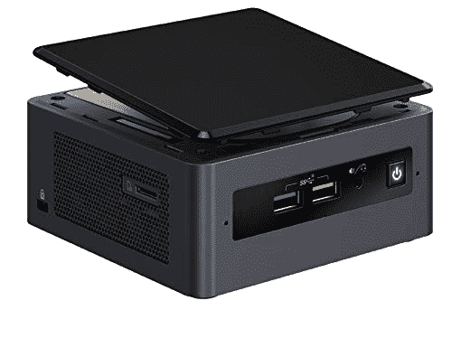
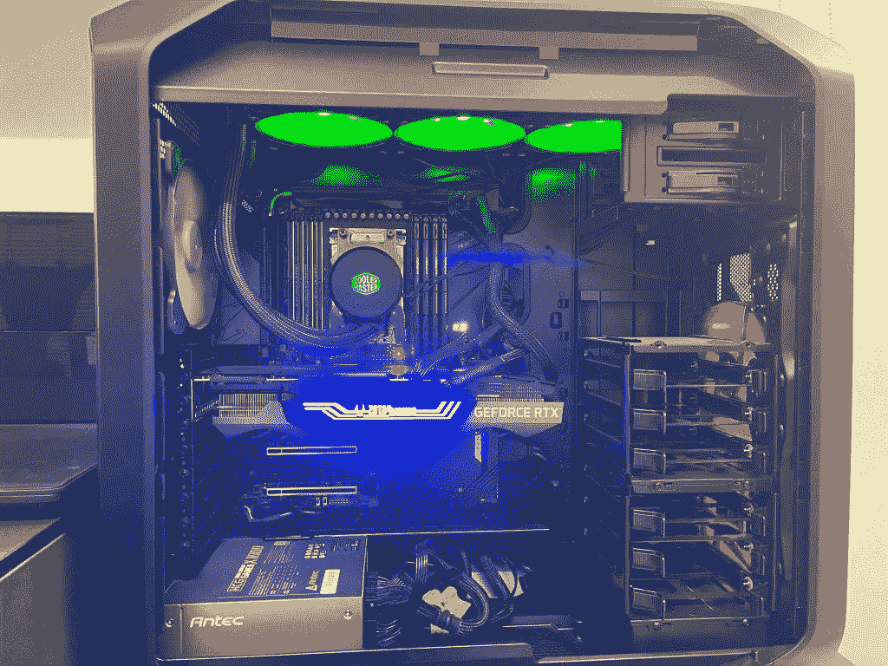
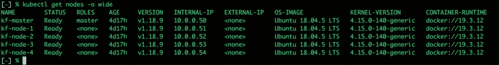
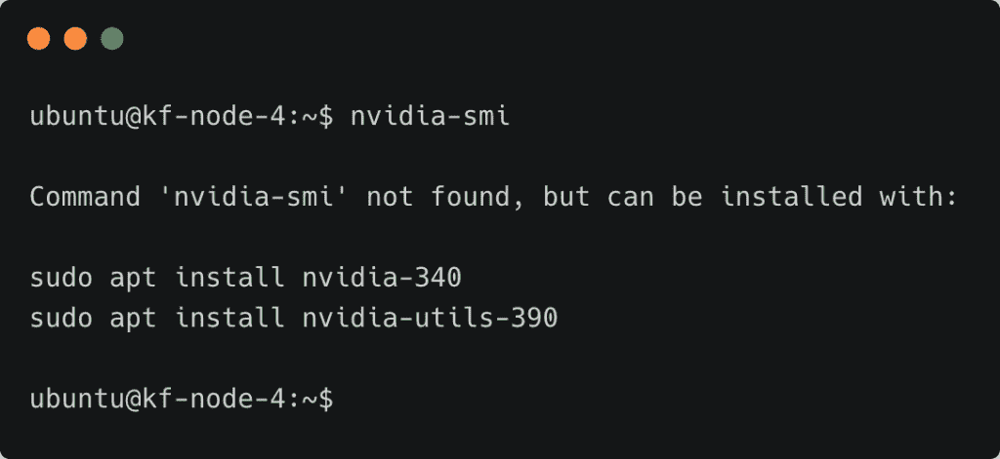
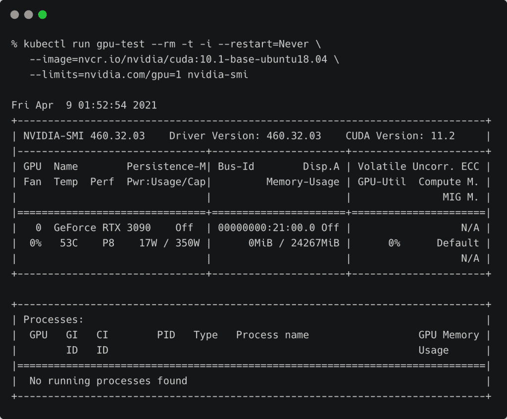
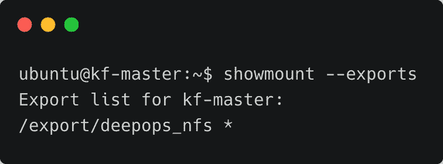
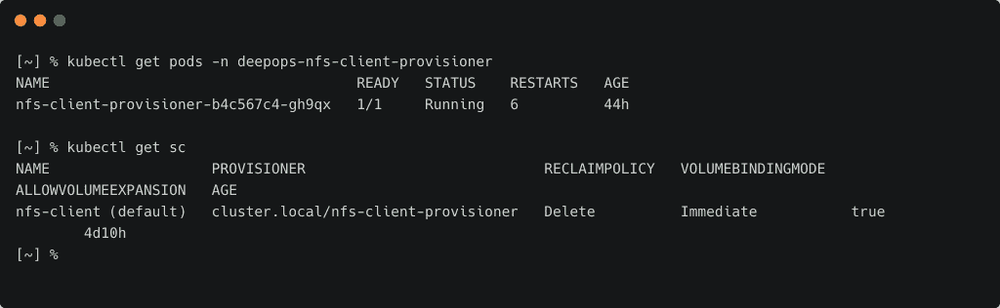
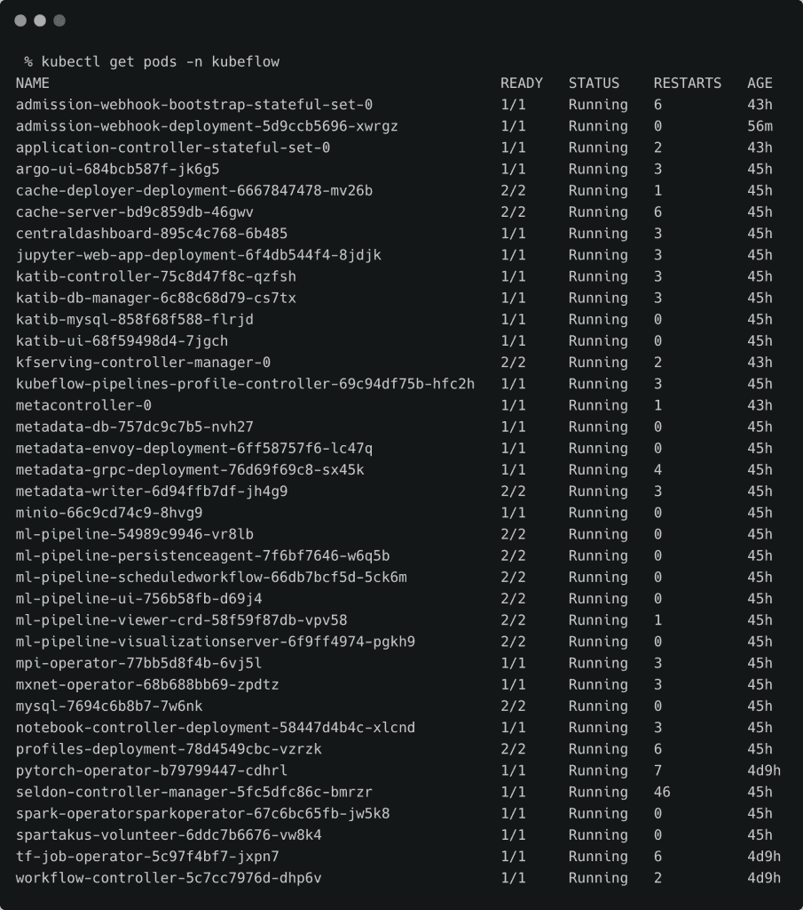

# 我如何使用 Kubernetes 和 Kubeflow 构建内部人工智能培训测试平台

> 原文：<https://thenewstack.io/how-i-built-an-on-premises-ai-training-testbed-with-kubernetes-and-kubeflow/>

本文是探索 Kubeflow 机器学习平台系列文章的第四篇。请每周五回来查看未来的分期付款。（

[Part 1](https://thenewstack.io/kubeflow-where-machine-learning-meets-the-modern-infrastructure/)

,

[Part 2](https://thenewstack.io/tutorial-install-kubernetes-and-kubeflow-on-a-gpu-host-with-nvidia-deepops/)

，以及

[Part 3](https://thenewstack.io/a-closer-look-at-kubeflow-components/)

).

我最近为我的所有人工智能实验构建了一个由 CPU 和 GPU 主机组成的四节点裸机 Kubernetes 集群。尽管利用公共云来配置基础设施具有经济意义，但我在我视线范围内的人工智能测试床上投资了一大笔钱。

首先，公有云中的 GPU 是稀缺资源。不能保证您能够在需要时配置 GPU 主机。其次，在云中运行 GPU 基础设施是昂贵的。人工智能加速虚拟机的成本是 CPU 的 5 倍。最后，我想拥有一个裸机集群，其中的节点我可以当作牛而不是宠物来对待。

我计划通过快速配置和取消配置来试验多种配置。例如，我想通过交换底层容器运行时来了解 Nvidia Container Toolkit 如何与 Docker Engine 和 Containerd 配合工作。同样，我很好奇使用 Nvidia GPU 设备插件和 Nvidia GPU 操作符之间的权衡。我还想运行各种工具来服务和优化 edge 的模型，包括 Nvidia Triton 推理服务器、英特尔 OpenVINO 工具包和 ONNX 运行时。

在尝试了各种配置之后，我终于找到了构建和管理 AI 测试平台的理想工具和软件。

通过这篇文章，我想让你深入了解我在建立梦想时所做的选择。

## 硬件:带有 CPU 和 GPU 主机的混合集群

由于这不是一个生产设置，而是一个实验室，我想优化成本。该集群运行四个 CPU 节点和一个 GPU 节点，由最先进的人工智能加速器 [GeForce RTX 3090 GPU](https://www.nvidia.com/en-in/geforce/graphics-cards/30-series/rtx-3090/) 提供支持。

CPU 节点是一个由四核八线程 i7 CPU 驱动的[英特尔 NUC](https://ark.intel.com/content/www/us/en/ark.html#@Intel%C2%AENUC) 。我为每台主机添加了 32 GB 的 DDR4 内存和 1TB 的 NVMe 存储。对于开发来说，这是一个不错的配置。

GPU 节点是一款定制的 PC，基于最新的 64 核 AMD 锐龙 Threadripper 3990X CPU、24 GB 和 10496 CUDA 内核的 Nvidia GeForce RTX 3090 GPU、128 GB RAM 和 3 TB NVMe 存储。

所有主机都通过专用子网和静态 IP 地址连接到受管理的千兆交换机。

这个集群的集体力量为我提供了 80 个 CPU 核心、256 GB RAM 和 7tb NVMe 存储，以及一个具有 10496 个 CUDA 核心和 24 GB 内存的 GPU。

## 软件:运行在 LTS Ubuntu 18.04 上的 Kubernetes 1.18

鉴于 Nvidia GPUs 的支持和驱动程序兼容性，我选择 Ubuntu 18.04.5 LTS 服务器作为基本操作系统。

虽然我想尝试多个版本的 Kubernetes 和容器运行时，但 Kubernetes 的基础版本是 1.18.9，它是稳定的，并且与 [Kubeflow 1.2](https://www.kubeflow.org) 兼容。

因为我想像管理一组运行在云中的虚拟机一样管理这个基础架构，所以我将主机配置为通过 PXE 进行网络引导。我使用 [Clonezilla Live 服务器](https://clonezilla.org/livepxe.php)来管理集群的映像和克隆。

PXE 启动过程允许我快速地从一种配置切换到另一种配置。NAS 服务器维护可引导映像，其中包含主机的各种预配置映像。例如，从 1.18.9 迁移到最新版本的 Kubernetes，只需要 20 分钟就可以部署好一个集群。

为了创建集群的基线映像，我使用了 [Kubespray](https://github.com/kubernetes-sigs/kubespray) 或 Nvidia [DeepOps](https://github.com/NVIDIA/deepops) 。要了解如何使用 DeepOps 配置 GPU 主机，请参考本[教程](https://thenewstack.io/tutorial-install-kubernetes-and-kubeflow-on-a-gpu-host-with-nvidia-deepops/)。

配置远程引导、克隆、映像和管理各种版本的过程值得另写一篇文章，我计划在将来讨论。

## 配置 GPU 节点

Nvidia 提供了两种机制来将 GPU 暴露给 Kubernetes 工作负载。第一种方法是通过安装 Nvidia 驱动程序、CUDA 运行时和 cuDNN 库来准备主机。本质上，你配置主机就好像它是一台独立的深度学习机器。在 Kubernetes 中，您可以安装 Nvidia [设备插件](https://github.com/NVIDIA/k8s-device-plugin)，该插件与您配置的软件堆栈进行对话，以使容器和容器可以访问 GPU。

最优雅的方法是使用 Nvidia [GPU 运营商](https://github.com/NVIDIA/gpu-operator)，除了有一个 GPU 连接到机器上之外，没有任何先决条件。你甚至不需要安装驱动程序。Nvidia 已经容器化了所有东西，包括驱动程序，它在每个节点上作为守护进程运行。

Nvidia GPU Operator 极大地简化了 Kubernetes GPU 主机的配置和准备工作。虽然您可能在主机上没有所需的软件和工具，比如`nvidia-smi`，但是您可以通过容器访问一切。操作员配置 Nvidia 容器运行时工具包，以弥合物理 GPU 和容器运行时之间的差距。

但是，您可以通过 Kubernetes pod 访问 GPU 和工具。下面的截图显示了一个访问 GPU 的 pod。

Nvidia GPU Operator 使您无需手动安装和配置驱动程序、运行时和其他访问 GPU 所需的工具。

如果您使用 Nvidia DeepOps 的最新版本设置集群，GPU Operator 是默认选项。当使用 Kubespray 或 kubeadm 设置集群时，从[舵表](https://github.com/NVIDIA/gpu-operator)安装操作器。

## 容器本地网络和存储选择

我为 Kubernetes 选择的 CNI 网络堆栈是 [Calico](https://www.google.com/search?client=safari&rls=en&q=Calico&ie=UTF-8&oe=UTF-8) 。这是一款成熟、安全、可靠的软件，用于配置和保护在 Kubernetes 上运行的云原生工作负载。

说到存储，您需要覆盖存储层，它支持 RWX 支持的共享卷。这是因为作为 Kubeflow 的一部分运行的多个工作负载需要共享数据集、配置文件和模型等工件。

我更喜欢将纯存储的 Portworx 作为我所有工作负载的实际存储引擎。您可以尝试免费版本 [PX-Essentials](https://portworx.com/products/features/) 来配置您的集群。在本系列接下来的部分中，我将深入研究如何安装和配置 Portworx 来运行 ML 工作负载。

如果您想选择支持 RWX 卷和声明的存储后端，请在主服务器上配置 NFS，然后使用 [NFS 客户端供应器](https://github.com/kubernetes-sigs/nfs-subdir-external-provisioner)进行动态供应。

下面的屏幕截图显示了从主服务器导出的 NFS 共享，通过 NFS 客户端置备程序提供。

NFS 客户端供应器的[掌舵图](https://github.com/kubernetes-sigs/nfs-subdir-external-provisioner)还将为动态供应创建默认存储类别。

在研究 Kubeflow 笔记本电脑服务器时，我们将进一步了解存储配置以及对 RWX 卷的需求。

## Kubeflow:云原生 ML 平台

有了所有的先决条件，我终于安装了 Kubeflow，这是 Kubernetes 上所有 ML 的平台。

你可以通过`kfctl`工具直接安装，也可以依靠 Nvidia DeepOps 安装程序。我选择后者是因为它的简单性以及与栈中其他组件的集成。

有关 Kubeflow 组件的快速概述，请参考本系列的[上一部分](https://thenewstack.io/a-closer-look-at-kubeflow-components/)。

在本系列的下一部分中，我们将利用这个基础设施来配置执行数据准备、训练和推理的 Kubeflow 笔记本服务器。敬请关注。

<svg xmlns:xlink="http://www.w3.org/1999/xlink" viewBox="0 0 68 31" version="1.1"><title>Group</title> <desc>Created with Sketch.</desc></svg>