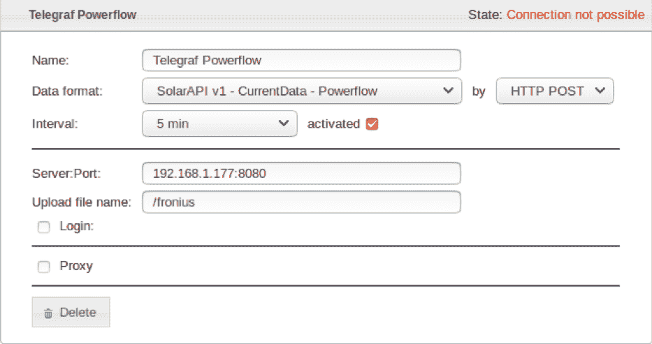
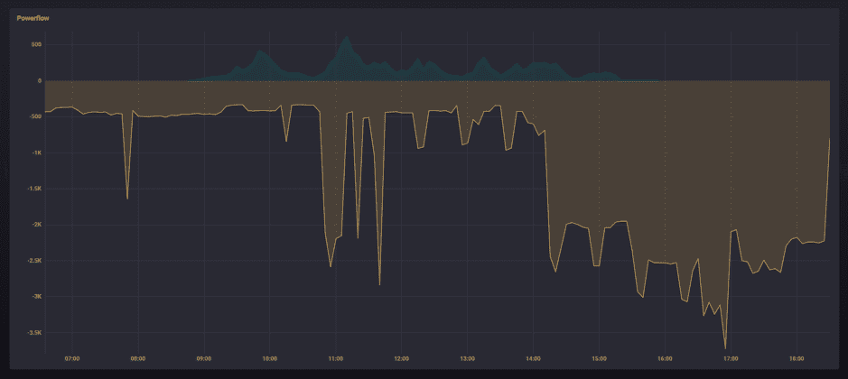
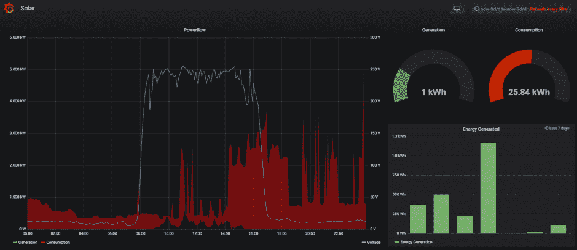

# 我如何创建一个 Telegraf 插件来监控太阳能电池板

> 原文：<https://thenewstack.io/how-i-created-a-telegraf-plugin-to-monitor-solar-panels/>

 [朱利叶斯·马罗扎斯

朱利叶斯是立陶宛考纳斯科技大学体育馆的学生。他对家庭自动化、物联网以及函数式编程感兴趣。去年，他完成了在 NFQ 学院的学业，在那里他提高了自己的网页开发技能。他在 Synology NAS 服务器上使用家庭助手，让他的家变得更加智能。](https://www.linkedin.com/in/julius-marozas/?originalSubdomain=lt) 

一年多前，我设法在家里安装了太阳能电池板，但很快意识到我遇到了一个问题:我想更多地了解某些指标是如何显示的，例如电池板能够从太阳产生多少电力和能量。我还对将这些数据与温度、云量和太阳强度联系起来感兴趣。

作为从太阳能电池板检索这些指标的一种方式，我发现 [Fronius](https://www.fronius.com/en/photovoltaics/products) [太阳能逆变器](https://www.fronius.com/en/photovoltaics/products)，它将来自太阳能电池板的 DC 电力转换为电网兼容的交流电，具有推送服务。这个 push 服务可以配置为定期向所提供的端点发送 HTTP POST 或 FTP 请求，这些请求包含用 JSON 编码的数据——这正是我所需要的。

我也已经在使用 [InfluxDB](https://www.influxdata.com/time-series-platform/influxdb/) 数据库来存储来自物联网设备的其他指标，并认为将逆变器产生的数据保存在那里会很酷。然而，当时[tele graf](https://www.influxdata.com/time-series-platform/telegraf/)(InfluxDB 的官方数据收集器软件)不支持解析通过 HTTP POST/PUT 请求发送的 JSON(和其他数据格式)数据。由于这些类型的请求是事实上的标准，我决定贡献并创建一个 [http_listener_v2](https://github.com/influxdata/telegraf/tree/master/plugins/inputs/http_listener_v2) 插件来支持这个用例。

本质上，该插件注册 HTTP POST/PUT 请求。来自请求的数据以指定的格式解析，然后转发到 InfluxDB 或其他支持的数据库。

在这篇博文中，我将解释我现在如何能够使用我创建的[http _ listener _ v2](https://github.com/influxdata/telegraf/tree/master/plugins/inputs/http_listener_v2)tele graf 插件来记录和分析我家太阳能电池板产生的电力。通过跟随，您将了解 InfluxDB 的 TICK 栈的基本架构，并理解如何自己设置插件。

## Fronius 变频器设置

Fronius 变频器的设置可通过其 WiFi 接入点获得。我感兴趣的部分是推送服务。该服务通过 HTTP 定期向指定的端点发送数据(电力、能量和电压)。以下是我的配置:

保存后，界面显示无法连接，因为 Telegraf 尚未监听指定的服务器端口。我将在接下来的段落中解决这个问题。

## 设置刻度堆栈

启动和运行 Telegraf 最简单的方法是使用[沙盒](https://github.com/influxdata/sandbox)，它会在 Docker 中旋转整个 TICK 堆栈( [Telegraf](https://www.influxdata.com/time-series-platform/telegraf/) 、 [InfluxDB](https://www.influxdata.com/time-series-platform/influxdb/) 、 [Chronograf](https://www.influxdata.com/time-series-platform/chronograf/) 和 [Kapacitor](https://www.influxdata.com/time-series-platform/kapacitor/) )。TICK 堆栈的所有组件都可以通过调用。/在命令行中用沙箱保护。但是，在此之前，我需要在 docker-compose.yml 文件中公开 Telegraf 的端口:8080:

## 配置电话

在下一步中，我们需要配置 [Telegraf](https://www.influxdata.com/time-series-platform/telegraf/) 服务器监听变频器发送的输入 JSON 数据。

下面是我如何在 Telegraf 的配置中设置 [http_listener_v2](https://github.com/influxdata/telegraf/tree/master/plugins/inputs/http_listener_v2) 插件:

注意:如果你使用的是[沙箱](https://github.com/influxdata/sandbox)，配置文件应该位于 telegraf/telegraf.conf(文件是 [toml 格式](https://github.com/toml-lang/toml))。在对配置进行任何更改之后，不要忘记使用。/沙盒重启。

http_listener_v2 插件的所有选项都可以在[这里](https://github.com/influxdata/telegraf/tree/master/plugins/inputs/http_listener_v2)找到。

为了理解 json_time_format 是如何被解释的，请阅读 Go 文档的这个[段落中关于日期和时间解析的更多内容。](https://golang.org/pkg/time/#pkg-constants)

## 处理输入数据

收到 HTTP POST 请求后，http_listener_v2 插件根据 data_format 选项解析数据(所有可用的格式都可以在这里[找到](https://github.com/influxdata/telegraf/blob/master/docs/DATA_FORMATS_INPUT.md))。在我的例子中，它是 [JSON](https://github.com/influxdata/telegraf/tree/master/plugins/parsers/json) [解析器](https://github.com/influxdata/telegraf/tree/master/plugins/parsers/json)。解析器将每个 JSON 对象展平成一个 [InfluxQL](https://docs.influxdata.com/influxdb/v1.7/query_language/spec/) 查询。扁平化是通过用下划线“_”连接 JSON 键来完成的。例如:

这个 JSON 对象被扁平化为 Body_P_PV=764.0，Body_P_Load=258.0。

为了简化数据字段的命名，可以使用 [processor.rename](https://github.com/influxdata/telegraf/tree/master/plugins/processors/rename) 插件删除测量字段名称中不必要的前缀:

## 使用 Chronograf 检查数据系列

最后，我们可以用 [Chronograf](https://www.influxdata.com/time-series-platform/chronograf/) 观察采集到的时间序列数据。默认情况下，Chronograf 应该位于 localhost:8888 上。

很容易在 Explore 选项卡中获得所有数据的概览。在那里，您可以点击数据库、测量值和字段，或者自己编写一个 InfluxQL 查询。你也可以选择 [Flux](https://docs.influxdata.com/flux/) ，这是一种专门为处理数据序列而设计的新编程语言。如果您想再次查看您的可视化效果，您可以在仪表板选项卡中创建一个仪表板。查看现成的例子，寻找灵感。

下面是我的太阳能逆变器发送的数据的可视化。绿线代表产生的能量，黄线代表消耗的能量。我们可以清楚地看到，在隆冬时节没有多少能量产生。

虽然在 Chronograf 中创建数据可视化快速而轻松，但您可以查看 [Grafana](https://grafana.com/grafana) 以获得更高级的图形解决方案。它与 InfluxDB 配合得非常好。

## 结论

概括地说，我为 Telegraf 创建了一个新的输入插件 http_listener_v2，并演示了它如何与 Fronius solar inverter 的推送服务一起使用。来自逆变器的 JSON 数据被解析、处理，然后在 Chronograf 和 Grafana 中可视化。

该插件也可以在其他情况下使用。它可以被配置为将非数字值保存为标签或解析其他[数据格式](https://github.com/influxdata/telegraf/blob/master/docs/DATA_FORMATS_INPUT.md)如 CSV。

<svg xmlns:xlink="http://www.w3.org/1999/xlink" viewBox="0 0 68 31" version="1.1"><title>Group</title> <desc>Created with Sketch.</desc></svg>