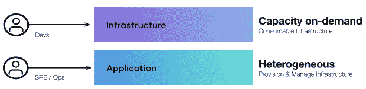
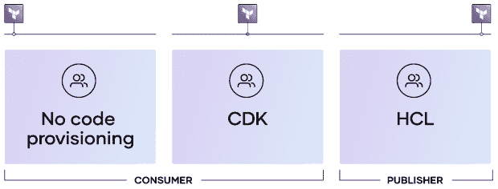

# IaC 如何满足开发人员和运营人员的不同基础设施需求

> 原文：<https://thenewstack.io/how-iac-meets-the-differing-infrastructure-needs-of-dev-and-ops/>

根据 2022 年 HashiCorp 的“云战略状况调查”，企业对多云的采用持续增长，这是一件好事。事实上，90%的调查受访者表示[多云正在帮助他们实现业务目标](https://www.hashicorp.com/state-of-the-cloud#9-out-of-10-say-multi-cloud-is-working-for-them)。然而，与此同时，管理多种基于云的技术、应用和 API 的复杂性，更不用说围绕它们开发标准化流程了，滋生了深刻的运营挑战。

在这种环境下，手动管理 IT 基础架构根本无法扩展。首先，HashiCorp 的调查也证实了云专业人员的持续短缺。事实上，[技能短缺是使运营多云](https://www.hashicorp.com/state-of-the-cloud#skills-shortages-ranked-as-top-multi-cloud-barrier)的能力复杂化的头号因素。然而，尽管技能短缺是一个众所周知的问题，但另一个相关的问题却没有得到应有的关注:不同的基础设施用户面临不同的挑战。

您不必深究就能看到与供应工作流交互的两个不同的角色——基础设施生产者和基础设施消费者有着非常[不同的关注点](https://thenewstack.io/sres-wish-automation-solved-all-their-problems/)并且需要来自其基础设施自动化解决方案的非常不同的功能。

## 基础设施生产者与基础设施消费者

首先，基础设施的生产者或发布者是创建基础设施供他人使用的人。基础设施生产者可能是站点可靠性工程师(SRE)或运营商，主要关心如何最有效地提供和管理基础设施。他们负责调配云资源，并为几个团队提供可重复性，并且必须有办法在整个生命周期内管理调配的资源。

其次，基础设施消费者是负责实际构建应用程序的人。这些人通常是开发人员，他们主要关心的是部署应用程序。基础设施消费者通常不关心基础设施，他们只想轻松地使用基础设施，这样他们就可以专注于部署他们的应用程序。

作为基础设施供应过程中的两个主要利益相关者，这两个角色具有不同的需求和职责。与此同时，两个团队之间的紧密合作是优化开发运维流程不可或缺的一部分。

## 生产者-消费者基础设施模型

基础设施生产者需要供应和管理基础设施，因此他们需要一个可重用的基础设施，以便基础设施消费者能够轻松访问。

基础设施消费者关注运营团队提供的工作流。他们只是希望能够自助使用运营商创建和发布的资源，为开发、测试和生产阶段建立一个资源工作区。

那么如何同时满足这两个群体的需求呢？答案是生产者-消费者模型，看起来是这样的:

1.  基础设施生产者定义并发布基础设施，然后使基础设施消费者可以发现它。
2.  基础设施消费者发现并提供基础设施。

更具体地说，基础设施生产者需要一种可以被编码、以可重用的方式建立并被基础设施开发者使用的语言。他们不想手动配置单个服务器，也不想处理随之而来的复杂性。

同时，基础设施消费者需要能够构建和维护业务所基于的应用程序。他们需要可靠的基础设施来执行，并且需要用他们喜欢的语言灵活地编程。他们应该能够在根本不需要编码的情况下进行供应。

为了满足这两个群体的需求，供应商必须提供灵活的基础设施作为代码解决方案。这意味着为一个传统上不是编码员的运营商服务，但也采取一种程序化的方法来创建和管理基础设施。这还意味着支持需要部署基础设施但可能不熟悉编码的基础设施消费者。

Hashicorp Terraform 提供了一个单一的工作流，无缝地统一了生产者-消费者模型，以自动化整个组织的基础设施。Terraform 以代码的形式提供了基础设施生产者和消费者开始使用基础设施所需的一切。更重要的是，Terraform 提供了一个基础设施代码解决方案，考虑到了两个角色不同的专业水平，满足了他们的需求。

*   基础设施生产商可以使用 HashiCorp 配置语言(HCL)来创建和发布经批准的基础设施。
*   如果基础设施消费者喜欢将他们自己的基础设施编码为代码，他们可以使用 Terraform 的云开发工具包。
*   基础设施消费者还可以通过 Terraform Registry 访问无代码配置工作流。

很明显，不同的角色在供应基础架构方面有不同的需求，生产者-消费者模型满足了这两类用户在各自的[基础架构自动化旅程阶段的需求。](https://thenewstack.io/the-3-phases-of-infrastructure-automation/)

<svg xmlns:xlink="http://www.w3.org/1999/xlink" viewBox="0 0 68 31" version="1.1"><title>Group</title> <desc>Created with Sketch.</desc></svg>