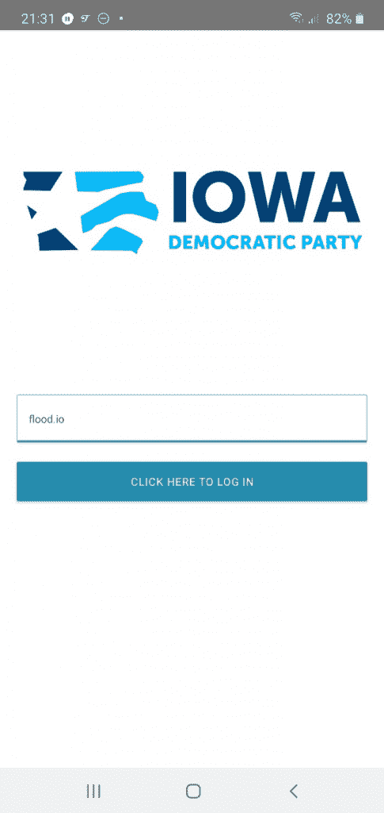
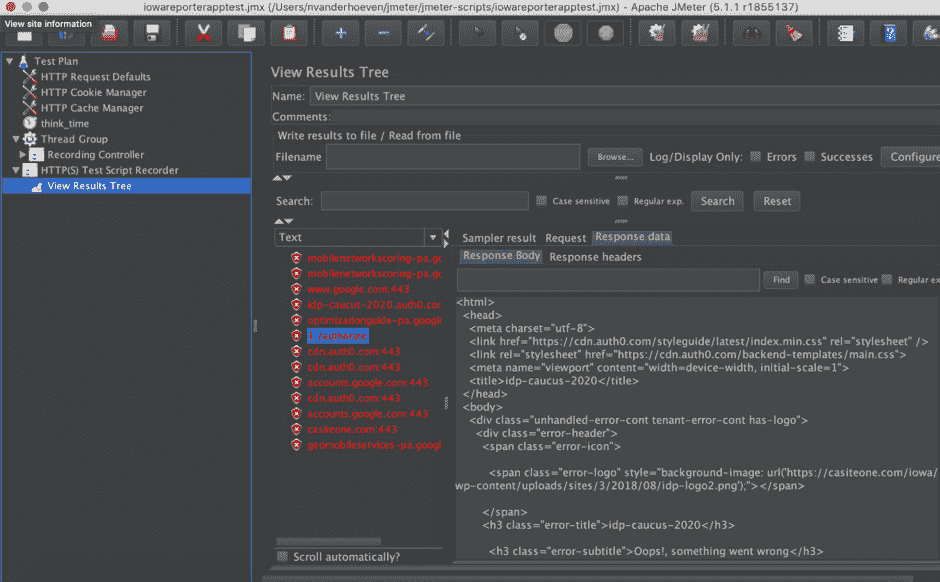
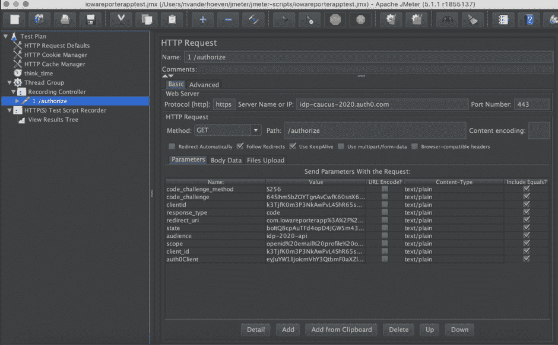

# 我将如何对爱荷华州党团会议应用程序进行负载测试

> 原文：<https://thenewstack.io/how-id-load-test-the-iowa-caucus-app/>

Tricentis 赞助了这篇文章。

一家名为 Shadow，Inc .的公司上周成为头条新闻，当时其 IowaReporterApp 旨在统计和报告美国爱荷华州民主党党团会议期间的选票，最终在几个方面失败，导致[在公布总票数方面延迟了长达数天的](https://www.nytimes.com/2020/02/06/upshot/iowa-caucuses-errors-results.html)，在此期间不得不采用人工方法。

这种延迟导致了来自软件测试行业以及公众的大量批评。一些开发者对应用程序的[代码质量提出了质疑。应用程序](https://www.vice.com/en_us/article/3a8ajj/an-off-the-shelf-skeleton-project-experts-analyze-the-app-that-broke-iowa)[错误地报告了投票总数](https://twitter.com/iowademocrats/status/1225170253778444291)，即[与民主党自己的手动报告](https://twitter.com/lib_crusher/status/1225167351617712128)不同，这表明功能测试存在问题，尤其是系统集成测试。影子内阁拒绝接受国土安全部在安全测试方面的帮助也令人惊讶。然而，也许最致命的问题是[当更便宜和更有效的解决方案存在时，这样的应用程序是否有必要摆在首位](https://twitter.com/zeynep/status/1224545350364672001)。

然而，我最感兴趣的是应用程序面临的负载问题。让我们倒回到党团会议之前。我将如何对 IowaReporterApp 这样的应用程序进行负载测试？

## **测试计划**

在计划负载测试时，首先要弄清楚的事情之一是负载测试是否有必要。

### **这个应用需要负载测试吗？**

 [尼科尔·范德胡芬

Nicole 是 Tricentis Flood 客户成功团队的一员。她有超过八年的软件测试经验，包括功能性和非功能性的，她喜欢分享她所学到的东西。她最初来自菲律宾，现在居住在荷兰，她热衷于帮助不同背景的人开始负载测试。当她没有对客户的 JMeter 脚本进行故障诊断时，她正在编写内容和制作关于软件性能的视频。](https://www.tricentis.com/products/distributed-load-testing/) 

为了回答这个问题，我必须找到更多关于这个应用的信息。

在党团会议上，登记为民主党选民的爱荷华州居民聚集在一起，投票决定他们认为谁应该成为该党今年晚些时候总统选举的候选人。

我认为有几件事让这个应用程序成为负载测试的完美候选:

*   这是**高度宣传**。党团会议一直是国际关注的事件，但围绕电子投票的大肆宣传进一步增加了媒体对党团会议的关注。
*   这是**的关键任务**。选区主席将使用该应用程序作为获取选票的主要设备。
*   它需要处理**大量的同时负载**。组织了一千多个选区会议，每个会议都有一个使用该应用程序的选区主席。

出于这些原因，答案是响亮的“是”。

### **底层技术是什么？**

了解一个应用程序的最好方法是询问它的开发者。在这种情况下，我选择自己做一点研究，通过[下载。apk 归档了主板(Vice)提供的](https://www.vice.com/en_us/article/z3b3g9/here-is-a-link-to-the-shadow-inc-app-that-blew-up-the-iowa-caucus)并亲自查看了代码。

这款应用是一款仅适用于 Android 和 iOS 设备的移动应用，主要使用脸书的 React 原生包编写。该应用的主要功能是将投票总数发送到影子公司的谷歌云功能服务器。

所涉及的技术值得注意，因为它可以帮助确定使用哪个负载测试工具。由于 Iowa Reporter 应用程序像大多数移动应用程序一样，向 RESTful API 发送请求，JMeter 或 Gatling 这两个经过良好测试的健壮的开源协议级工具拥有庞大的用户群，非常适合这项工作。我决定使用 JMeter，这是我个人选择的工具。

### **预期负载是多少？**

现在让我们来谈谈工作负载模型，这是一个关于我们生成的负载需要看起来如何的计划。这里的目标是模拟尽可能与预期的真实负载相匹配的负载。

此时，我通常会查看历史数据，试图了解负载量和负载概况。如果我在使用 Google Analytics 或 APM 工具等工具发布之前的应用程序后获得了服务器流量指标，我会使用该数据作为此次发布的工作负载模型的起点。然而，在这种情况下，该应用程序之前没有公开发布，所以我需要做出一些有根据的猜测。

[根据维基百科](https://en.wikipedia.org/wiki/2020_Iowa_Democratic_caucuses)的数据，总共有 1777 个爱荷华选区党团会议，其中 99 个是为暂时无法参加当地党团会议的爱荷华居民设立的全球卫星党团会议。

在民主党党团会议中，实际的投票过程一般需要[大约两个小时](https://www.theguardian.com/us-news/2020/feb/03/iowa-caucuses-2020-elections-candidates)。在爱荷华州党团会议上，选区主席会使用该应用程序两次——每轮投票一次。大约两个小时后，每个主席的应用程序会将包含每个候选人总票数的主要有效载荷发送到后端服务器。所有这些都是在 1777 个选区同时进行的。

至少，这里有两个主要事件:

1.  **登录**:选区主席需要登录这个应用程序，大概在投票过程开始的时候，所有选区的主席都会同时登录这个应用程序，因为这个应用程序还包含了如何举行党团会议的说明。
2.  提交(submission):这是每个候选人的总票数的传输，发送到谷歌云功能，也可能发生在同一时间。

在这两个事件之间，应用程序可能还发送了其他请求，但是由于没有有效的登录，应用程序的大部分都是不可访问的，所以我将重点关注初始登录请求。

在这种情况下，我没有以前的数据来显示这些请求是如何分布的，这是一种谨慎的做法。假设辖区主席在 10 分钟内触发了这些请求，并将请求数四舍五入以留有余地，我估计 10 分钟内会有 1，800 个登录请求。

我决定在 10 分钟内测试用户的逐渐增加。

### **脚本**

好了，该写剧本了。由于我没有机会向开发人员询问登录请求的格式，所以我做了退而求其次的事情，试图通过记录运行中的应用程序流量来找到自己。

### **用 JMeter 在笔记本电脑上记录移动流量**

下面是我如何从移动应用程序中看到请求的:

*   我用上面的 APK 链接把这个应用程序下载到了一个备用的安卓手机上。
*   我在我的笔记本电脑上用端口 8888 在 JMeter 上设置了一个 HTTP(S)测试脚本记录器。我还确保我的笔记本电脑连接到我的无线网络。
*   我将我的手机设置为使用网络上我的笔记本电脑的本地 IP 地址和端口 8888 来使用代理。
*   然后，我回到我的笔记本电脑上的 JMeter，启动 HTTP(S)测试脚本记录器。
*   最后，我导航到应用程序，在辖区 ID 字段中键入 [io](https://flood.io) (显然不是真实 ID)，然后点击“点击此处登录”按钮。

下面是 JMeter 的视图结果树监听器后来看到的流量:

这是记录控制器中记录的请求:

### **分析请求**

看起来至少初始登录请求是对 Auth0 服务的 GET，在主体中传递了几个参数。它还有一些授权头。

参数值看起来也可能是动态的，这意味着它们会随着会话的不同而变化。此时，我通常会将其中一些值从硬编码值更改为动态值，以便应用程序以正确的格式接收请求，并且我可以查看 [Auth0 的 API 文档](https://auth0.com/docs/api/authentication)以找出应该如何制定认证消息。

因为我没有用于测试目的的有效登录，所以我跳过了这一步，只使用原始请求进行演示。

### **准备运行**

思考时间是请求之间的延迟，用来模拟用户在采取另一个动作之前思考的时间。如果没有思考时间，JMeter 会一个接一个地发出请求，这通常是不现实的，而且会消耗资源。我不想那样，所以我加了一个 JMeter 定时器。有很多定时器可用，但我选定了一个统一的随机定时器。

Shadow 的首席执行官告诉 Motherboard ,许多分局主席对登录过程感到困惑，因为他们必须按正确的顺序输入三串数字。所以，我决定用计时器把它写进剧本里。我设置了两分钟的恒定延迟和一分钟的随机延迟，以便延迟在两分钟到三分钟之间变化，以模拟一名分局局长尝试登录几次。

### **执行**

[据 Motherboard 报道，](https://www.vice.com/en_us/article/z3b3g9/here-is-a-link-to-the-shadow-inc-app-that-blew-up-the-iowa-caucus) Shadow 已经将应用服务器下线。然而，对不属于您的端点运行满负载测试并不是一个好主意，所以我决定不运行测试。

不过，通常我希望从 10 个用户左右的测试开始，然后逐渐增加用户负载，直到达到 1，800 个用户的峰值。我还会尝试改变负载模式，比如增加或减少上升或稳态持续时间，进行压力测试和浸泡测试，并添加来自另一个可用性区域的流量来模拟全球 99 个卫星区域。如果你想使用物理机器，运行多个负载生成器会很快失控，所以我会在云上用类似 [Flood](https://flood.io/) 的东西运行负载测试。所有这些微小的变化都会提供有价值的数据，帮助我评估应用程序在类似生产环境中的性能。

## **结论**

构建高质量的软件不是一项简单的任务。有许多移动部分需要考虑，在应用程序开发的每个阶段都可能出现严重错误。虽然负载问题不是 IowaReporterApp 失败的罪魁祸首，但像我在这里描述的一个简单的负载测试可能会提高应用程序的稳定性和可靠性。即使在负载测试似乎没有必要的情况下，它仍然可以发现在截止日期前开发的应用程序在配置、可用性或安全性方面的重大问题。

新的堆栈从提供测试自动化软件的 TNS 赞助商 Tricentis 那里请求了这篇文章。

特写图片由来自 Pixabay 的 mohamed Hassan 提供

<svg xmlns:xlink="http://www.w3.org/1999/xlink" viewBox="0 0 68 31" version="1.1"><title>Group</title> <desc>Created with Sketch.</desc></svg>