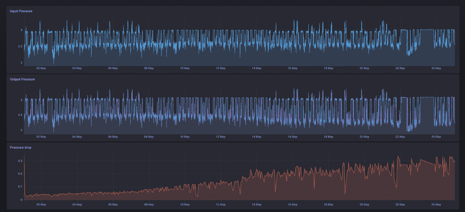
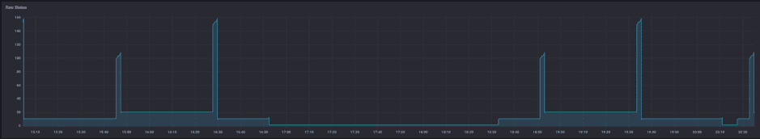
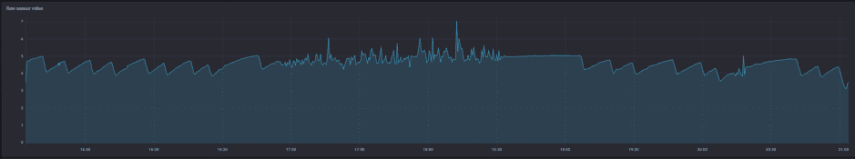
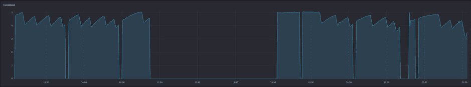
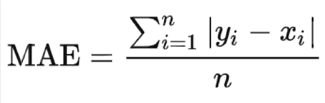

# InfluxDB 和 Flux 如何从时间序列数据中收集有意义的见解

> 原文：<https://thenewstack.io/how-influxdb-and-flux-gather-meaningful-insights-from-time-series-data/>

[](https://www.linkedin.com/in/frederikvl/?originalSubdomain=be)

 [弗雷德里克·范·利克维克

弗雷德里克是 Factry.IO. Factry 的联合创始人兼业务发展经理。IO 是一个解决方案，它为工厂环境中的每个人提供实时和历史的见解，从工厂经理到操作员都使用开源技术。他在工业物联网行业的多年经验使他意识到该行业需要一种全新的控制和自动化方法。](https://www.linkedin.com/in/frederikvl/?originalSubdomain=be) [](https://www.linkedin.com/in/frederikvl/?originalSubdomain=be)

自 2016 年以来， [Factry.io](https://www.factry.io/) 历史数据收集平台一直在工业环境中使用 [InfluxDB](https://www.influxdata.com/products/influxdb-overview/) 。这始于一个[开源 OPC-UA 收集器](https://github.com/coussej/node-opcua-logger)的开发，该收集器在全球范围内使用。OPC-UA 协议在工业环境中非常重要，因为它可以用来收集传感器数据，这是一种时间序列数据。传感器数据通过可编程逻辑控制器(PLC)和监控与数据采集(SCADA)系统从制造设备中收集，然后存储到 InfluxDB 中。传感器数据包括从设备收集的测量值，有助于确保制造过程有效运行。

在 InfluxDB 中，数据被设置为可视化。这是制造商最常见的使用案例——能够在一个位置集中查看所有传感器数据。

加入 Factry 后，我参加的第一个会议是与比利时的一位食品生产商的会议，他对我说，“如果你不能想象它，你就不能理解它。”虽然我不一定同意，但它触及了一个事实，即如果我们能够恰当地想象一个事件，理解和理解所说的事件就变得容易得多。当我们分析时间序列数据时，我们寻求的是来自数据的新见解，而不仅仅是数据本身。

因此，在本帖中，我们描述了三个真实世界的案例，Flux 为从工业设备收集的时间序列数据带来了新的、有意义的见解，最终支持改进决策。

## 背景

因此，我们收到了工程师和运营商对 InfluxDB 查询语言 [InfluxQL](https://docs.influxdata.com/influxdb/v1.7/query_language/) 在工业环境中的功能的积极回应。在 Grafana 出色的查询编辑器的帮助下，在他们的 dashboarding 产品中，它易于使用，易于学习，可读性很强。尽管如此，由于缺少上下文，高级功能还是经常缺乏。

我们所说的上下文是什么意思？想象你正坐在一堂历史课上，你正在学习 1721 年的 X 事件，1857 年的 Y 事件等等。这门历史课很无聊，因为你所学的都是按顺序排列的事件发生的日期和时间。这与时间序列数据相当，即按日期和顺序显示的数据。

现在想象一下，不仅仅是学习日期和时间，你接收到了生活在那个时代的人们的信息，他们如何思考，他们的生活是什么样子，他们周围的环境是什么样子，等等。这就是语境。这些信息为你提供了历史和事件背后的背景，所以现在你可以开始理解为什么人们会做出这样的决定。虽然日期和时间很重要，但对人、时间段和事件的了解会教会你更多。同样，时间序列数据是至关重要的，但当结合上下文数据时，它的信息量要大得多，反之亦然。

在工业环境中，从技术角度看有两个层次的背景。第一层从时间序列数据数据库中可用的其他数据中导出上下文。这方面的例子包括了解传感器的价值仅在机器处于生产状态而非维护状态时才重要。另一个例子包括在过程开始和结束时计算两个压力传感器之间的差值。简而言之，这可以归结为在引入新的查询语言 [Flux](https://www.influxdata.com/products/flux/) 之前，InfluxDB 版本中所缺少的功能。Flux 具有跨测量值执行数学运算的能力(测量值是收集的时间序列的容器)。

第二层功能来自与制造环境中其他 IT 系统的集成，通常称为制造执行系统或 mes 层。了解机器中某个传感器的压力或温度变化会告诉你一些东西，但如果你知道生产的是什么产品、哪个操作员负责生产线、轮班是什么、机器的设定值是多少等，它会告诉你更多。这些信息通常存在于支持制造过程的其他软件和数据库中。因为这通常是关系数据，所以这不在我们目前使用 Flux 所实现的范围之内。但是 Flux 将给我们带来将多个数据源整合在一起的能力，所以我们期待有趣的事情到来。

## 工业测量中的流量和数学示例

借助 InfluxDB 和 Flux，我们能够从收集的时间序列数据中提取更多的见解和价值。我们将更详细地回顾上面提到的几个用例。

### 用例 1:计算过滤器的压降

拥有水净化系统的公司需要确定何时更换净化过程中使用的过滤器。他们可以亲自走到过滤器前(如果可以接触到的话),检查过滤器，以确定是否需要更换，或者他们可以依靠数据。在下图中，上面的面板显示了在输入端收集的水压测量值，下面的面板显示了在输出端收集的水压测量值。如果你取两次测量的差值，你可以看到压差随着时间的推移而增加。这在下面描述。有了这些数据，你就可以看到，当压降超过某个阈值时，就需要更换滤芯了。



过滤器前输入侧 PT01(压力变送器 01)的原始压力传感器数据如上图所示。PT02 位于输出侧。计算出的压差绘制在底部图表中。

实现流量查询

```
// Create a generic function that can be reused to compute the 3m average
avg3m  =  (measurement)  =&gt;
from(bucket:  "historian")
|&gt;  range(start:2018-05-01T23:30:00Z,  stop:  2018-05-23T00:00:00Z)
|&gt;  filter(fn:  (r)  =&gt;  r._measurement  ==  measurement)
|&gt;  aggregateWindow(every:  3m,  fn:  mean)

// Use the function we just defined to get the data for the first
// and second pressure transmitters
pt01  =  avg3m(measurement:  "PT01")
pt02  =  avg3m(measurement:  "PT02")

// Join data and calculate the pressure drop
join(tables:  {pt01:pt01,  pt02:pt01},  on:  ["_time"])
|&gt;  map(fn:  (r)  =&gt;  ({
_time:  r._time,
_pressureDrop:  r._value_pt01  -  r._value_pt02
}))
|&gt;  aggregateWindow(columns:  ["_pressureDrop"],  every:  1h,  fn:  mean)  // to smoothen the graph a bit

```

### 用例 2:机器状态上下文中的传感器值

在某些情况下，您可能有一台 24/7 全天候运行的机器，但只在某些时候做有意义的工作。我们经常在分立的工作站中遇到这种情况，例如计算机数字控制(CNC)机器。在这些情况下，如果机器处于“生产”状态，而不是“等待操作员输入”或“维护”状态，您可能只对某些传感器的值感兴趣在这种情况下，我们添加了上下文(即机器状态)。让我们用四个步骤来构建这个图。

步骤 1:首先，我们检索原始机器状态。这对于每台机器都是不同的，因为供应商或自动化合作伙伴对每台机器的编程方式也是不同的。在这种情况下，我们有 200 多个状态代码。因此，生成的图表本身是没有意义的。



机器的原始状态代码。

实现流量查询

```
// Retrieve status data. We’re not downsampling here because status codes are only written to the database on change, which means this is a very small dataset.
from(bucket:  "historian")
  |&gt;  range(start:  dashboardTime,  stop:  upperDashboardTime)
  |&gt;  filter(fn:  (r)  =&gt;  r._measurement  ==  "Status")

```

第二步:每个状态码代表一个特定的机器状态。在我们的例子中，我们只对状态代码 5 和 10 感兴趣，因为它们表示机器正在生产中。所有其他代码都与我们的用例无关。因此，让我们将这些原始状态代码在机器处于生产状态时映射为 1，在所有其他情况下映射为零。



映射的状态代码。

实现流量查询

```
Status  =  from(bucket:  "historian")
  |&gt;  range(start:  dashboardTime,  stop:  upperDashboardTime)
  |&gt;  filter(fn:  (r)  =&gt;  r._measurement  ==  "Status")
  |&gt;  map(fn:  (r)  =&gt;  ({_time:  r._time,  _status:  float(v:  contains(value:  int(v:  r._value),  set:  [5,10])}),  mergeKey:  false)  // map to 0 or 1
// The statements below could probably be optimized. They work for our use case but should be improved.
// Because the raw status code is only written to the database on change but we want to join on time later, we need to create time windows and fill these with the last known 0 or 1\. So, we first create this windows with averages between 0 and 1.
  |&gt;  aggregateWindow(every:  30s,  fn:  mean,  columns:  ["_status"],  createEmpty:  true)
// Then we fill the empty windows with the previous values.
  |&gt;  fill(column:  "_status",  usePrevious:  true)
// We don’t have a previous value at the beginning of our time window, so we cheat by filling it with 0\. Ideally, we would fill with the last status value that falls just outside the start: dashboardTime range.
  |&gt;  fill(column:  "_status",  value:  0.0)
// Every window that contains a status &gt; 0 should be categorized as “in production”.
  |&gt;  map(fn:  (r)  =&gt;  ({_time:  r._time,  _status:  math.ceil(x:  r._status)}),  mergeKey:  false)

```

第三步:检索原始传感器数据。这是标准的通量功能。



我们注意到传感器在 17:00 到 18:30 之间有噪音。这是因为机器已打开，但不在生产中。因此，这些价值对我们来说毫无意义。

实现流量查询

```
NTU  =  from(bucket:  "historian")
  |&gt;  range(start:  dashboardTime,  stop:  upperDashboardTime)
  |&gt;  filter(fn:  (r)  =&gt;  r._measurement  ==  "S01")
  |&gt;  aggregateWindow(every:  30s,  fn:  mean)
  |&gt;  keep(columns:  ["_value",  "_time"])
// Like in Step 2, we first fill with previous and finally 0 at the beginning of our time window
  |&gt;  fill(column:  "_value",  usePrevious:  true)

```

第四步:最后，我们准备好把所有的部件组装在一起。从第 2 步开始，我们有 0/1 数据告诉我们机器何时生产，何时不生产。从第 3 步开始，我们得到了原始传感器数据。现在，让我们将这些数据集连接在一起。生成的图表显示了机器处于生产状态时的传感器值。


机器处于生产状态时的原始传感器数据。

实现流量查询

```
Sensor  =  from(bucket:  "historian")
  |&gt;  range(start:  dashboardTime,  stop:  upperDashboardTime)
  |&gt;  filter(fn:  (r)  =&gt;  r._measurement  ==  "S01")
  |&gt;  aggregateWindow(every:  30s,  fn:  mean)
  |&gt;  keep(columns:  ["_value",  "_time"])
  |&gt;  fill(column:  "_value",  usePrevious:  true)
  |&gt;  fill(column:  "_value",  value:  0.0)

Status  =  from(bucket:  "historian")
  |&gt;  range(start:  dashboardTime,  stop:  upperDashboardTime)
  |&gt;  filter(fn:  (r)  =&gt;  r._measurement  ==  "Status")
  |&gt;  map(fn:  (r)  =&gt;  ({_time:  r._time,  _status:  float(v:  contains(value:  int(v:  r._value),  set:  [5,10])}),  mergeKey:  false)
  |&gt;  aggregateWindow(every:  30s,  fn:  mean,  columns:  ["_status"],  createEmpty:  true)
  |&gt;  fill(column:  "_status",  usePrevious:  true)
  |&gt;  fill(column:  "_status",  value:  0.0)
  |&gt;  map(fn:  (r)  =&gt;  ({_time:  r._time,  _status:  math.ceil(x:  r._status)}),  mergeKey:  false)

join(
  tables:  {n:Sensor,  s:Status},
  on:  ["_time"]
)
  |&gt;  map(fn:  (r)  =&gt;  ({
  _time:  r._time,
// All raw sensor values get multiplied by 0 when the machine is not in production
  _filteredValue:  r._value *  r._status
  }))
  |&gt;  yield()

```

### 用例 3:计算预测值和测量值之间的误差

第三个也是最后一个用例涉及计算[平均绝对误差](https://en.wikipedia.org/wiki/Mean_absolute_error) (MAE)以评估预测与测量值相比的准确性。例如，在您的服务依赖于天气预报的情况下，这可能会有所帮助。此公式返回单个值。

MAE 的计算方法如下:


实现此流量查询:

```
WINDSPEED  =  from(bucket:  "meteo")
  |&gt;  range(start:  dashboardTime,  stop:  upperDashboardTime)  // same window from which we have forecast data
  |&gt;  filter(fn:  (r)  =&gt;  r._measurement  ==  "WindSpeed")
  |&gt;  aggregateWindow(every:  10m,  fn:  mean)
  |&gt;  keep(columns:  ["_value",  "_time"])
  |&gt;  fill(column:  "_value",  value:  0.0)  // fill nulls (in the future) with 0
  |&gt;  map(fn:  (r)  =&gt;  ({_time:  r._time,  _real:  r._value}))  // map value column to new name

WINDSPEED_FORECAST  =  from(bucket:  "meteo_forecast")
  |&gt;  range(start:  dashboardTime,  stop:  upperDashboardTime)
  |&gt;  filter(fn:  (r)  =&gt;  r._measurement  ==  "WindSpeed")
  |&gt;  keep(columns:  ["_value",  "_time"])
  |&gt;  aggregateWindow(every:  10m,  fn:  mean)
  |&gt;  fill(column:  "_value",  usePrevious:  true)
  |&gt;  fill(column:  "_value",  value:  0.0)
  |&gt;  map(fn:  (r)  =&gt;  ({_time:  r._time,  _forecast:  r._value}))

RES  =  join(tables:  {curr:  WINDSPEED,  forecast:  WINDSPEED_FORECAST},  on:  ["_time"],  method:  "inner")
NUMERATOR  =  RES  |&gt;  map(fn:  (r)  =&gt;  ({_time:  r._time,  _diff:  math.abs(x:  r._forecast  -  r._real)}))  |&gt;  sum(columns:  ["_diff"])
DENOMINATOR  =  RES  |&gt;  count(columns:  ["_real"])
MAE  =  join(tables:  {num:  NUMERATOR,  denom:  DENOMINATOR},  on:  ["_start"],  method:  "inner")
  |&gt;  map(fn:  (r)  =&gt;  ({_value:  float(v:  r._diff)  /  float(v:  r._real)}))
MAE  |&gt;  yield()

```

## 一些评论

我们遇到的主要缺点是功能性和简单性之间的权衡，至少对于非技术用户来说是这样。虽然我们认为 Grafana 中的 InfluxQL 是一个在工业环境中很容易教给非技术人员的功能，但 Flux 的情况却远非如此。

社区成员可以通过提供例子来减少这一缺陷，例如本文中描述的例子，其他人可以在此基础上进行构建。此外，Flux 的可扩展性将使构建预定义的函数来覆盖制造业中最常见的用例成为可能。

我们确信，随着功能变得更容易获得，语言得到更广泛的支持，我们将会遇到更多的 Flux 用例。

<svg xmlns:xlink="http://www.w3.org/1999/xlink" viewBox="0 0 68 31" version="1.1"><title>Group</title> <desc>Created with Sketch.</desc></svg>