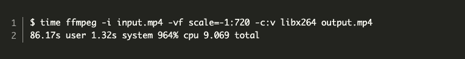
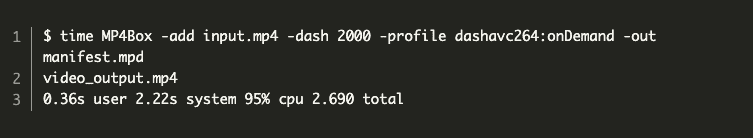
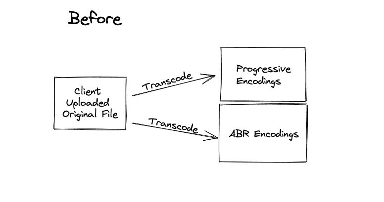
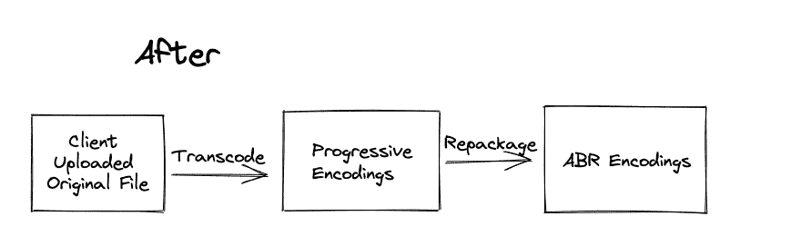
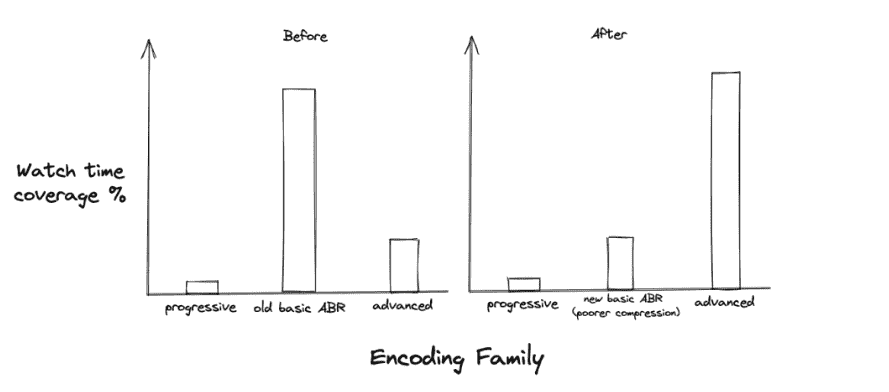
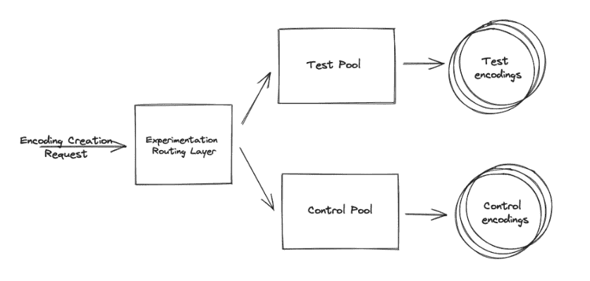

# Instagram 如何为高清视频做准备

> 原文：<https://thenewstack.io/how-instagram-prepared-for-a-tsunami-of-high-definition-video/>

社交媒体 Instagram 将计算支出从基本的视频编码转移到更高级的编码。据该公司称，最终结果是提高了用户的视频质量，提高了 Instagram 的计算资源效率。

Instagram 软件工程师瑞安·彼得曼和 Instagram 软件工程师史写的一篇博文解释说，根据 Instagram 自己在 2021 年初的预测，在不到一年的时间里，它的机器计算能力就会耗尽，无法为所有用户提供视频上传。为了继续扩展和优先考虑计算效率，Instagram 工程师深入研究了计算资源的使用情况，并确定了节省资源的重要方法。

通过重新调整最昂贵的最低功能编码的用途，工程团队能够将最低功能编码的计算支出大幅降低 94%，并继续利用现有机器进行扩展。除了节省计算资源之外，最终用户还获得了更多高级编码实例。

随着 Instagram 大力鼓励其 20 亿用户录制更多视频，这些工程师的工作可能对该平台未来的成功至关重要。

## Instagram 如何编码视频

Instagram 生成两种类型的视频编码。

最低功能编码兼容所有 Instagram 客户端。效率较低的压缩更容易被旧设备解码和播放。

高级编码与人们所期望的类似，使用更新的压缩技术来实现更高质量的回放。

上图用更少的比特展示了更清晰的细节。

但这个问题听起来可能令人惊讶。Instagram 花费超过 80%的资源处理最低功能编码。这种轨迹将导致最小功能编码在一年内垄断它们的资源。最好的情况下，发布视频需要更长的时间。最糟糕的情况是失败率明显更高。

随着时间的推移，高级编码只覆盖了总数的 15 %, insta gram 的预测是，当最低功能编码需要更多资源时，高级编码将很快被完全扼杀。

## 为什么最小功能如此昂贵？

Instagram 为每个视频创建了两种最低功能编码。

基本自适应比特率(ABR)编码是他们最受关注的最低功能类型。这使用了一种称为自适应比特率流的技术，允许客户选择最适合他们连接的版本。它有助于防止带宽变化引起的延迟，并且通常提供最稳定的回放。

第二种类型是渐进式编码，很少提供，但 Instagram 继续生产它们，以保持与不支持 ABR 播放的 Instagram 应用程序的旧版本的兼容性。从原始文件创建 ABR 和渐进式编码进行备份是标准的工作流程。

但是 86.17 秒转码一个 23 秒的视频 720p 确实有改进的空间。

深入研究这两组编码，会发现除了 profile 和 preset 之外有更多的相似之处，而且总体质量会更低。

一个解决方案出现了。他们可以用渐进编码的视频帧替换基本的 ABR 结尾，方法是将它们重新打包成支持 ABR 的文件结构。

对于相同的输入视频，生成清单文件并将视频帧重新打包成支持 ABR 的文件结构需要 0.36 秒。生成基本 ABR 编码的成本现在实际上已经消除了。

计算被释放出来用于高级编码产品，但代价是基本 ABR 编码的压缩效率。Instagram 理论上认为，生成更多的高级编码对使用 Instagram 的人来说是一个净利好。

## 检验理论

它必须先工作，然后才能投入生产。比较基本的 ABR 编码前后只会显示退步，所以这不是办法，因为 Instagram 需要衡量更高级编码的净效果。

图表概述了他们的假设。并且更先进的视频编码将大大弥补最低功能编码的较低质量。

该测试是通过工程师构建的测试框架执行的，该框架复制了测试池和控制池中的一小部分流量，每个池都具有相同的处理能力。来自每个池的编码被保存到不同的名称空间，用于以后作为视频的控制或测试目录的一部分进行识别。

在交付时，用户会看到来自某个目录的编码。这使得 Instagram 能够衡量新的编码方案是否对用户更好。

测试证明，虽然最低功能编码有所下降，但高级编码的更长观看时间是一个净积极因素。

## 推向生产

在启动优化后，他们看到了计算节省和更高的高级编码观看时间的主要收益。新的编码方案将生成基本 ABR 编码的成本降低了 94%。有了更多可用资源，该公司能够将高级编码的整体观看时间覆盖率提高 33%。

<svg xmlns:xlink="http://www.w3.org/1999/xlink" viewBox="0 0 68 31" version="1.1"><title>Group</title> <desc>Created with Sketch.</desc></svg>