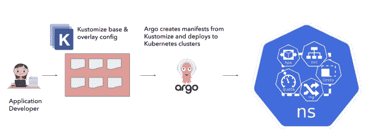
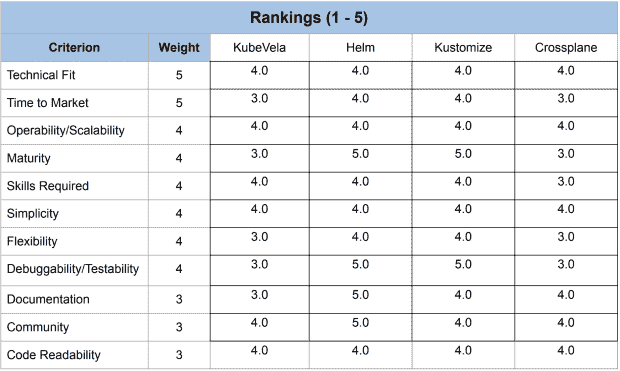

# Intuit 的平台工程团队如何选择应用程序定义

> 原文：<https://thenewstack.io/how-intuits-platform-engineering-team-chose-an-app-definition/>

底特律——当 Intuit 的[平台工程](https://thenewstack.io/platform-engineering-what-is-it-and-who-does-it/)团队着手选择应用程序定义时，他们最终决定需要一种以数据为中心的方法。

它支持 5000 多名开发人员开发 TurboTax、QuickBooks、Credit Karma 和 Mailchimp 等产品，希望通过抽象出底层 [Kubernetes](https://thenewstack.io/category/kubernetes/) 平台的复杂性来提高开发人员的速度和自助服务。

有太多的工具需要评估，包括建立自己内部的前景，它选定了四种开源的可能性: [Helm](https://helm.sh/) ， [Kustomize](https://kustomize.io/) ， [KubeVela](https://kubevela.io/) 和 [Crossplane](https://github.com/crossplane/crossplane) 。

但事实证明，即使这样也令人望而生畏，首席软件工程师阿努沙·拉古纳坦和软件工程师凯文·唐尼在 kube con+Cloud Native North America 的一次演讲中解释道。

最初，它的[部署管道](https://thenewstack.io/a-step-by-step-guide-to-continuous-deployment-on-kubernetes/)看起来是这样的，开发人员使用 Kustomize base 和 overlay 配置进行部署，然后由 Argo CD 提取，Argo CD 是 Intuit 将部署清单部署到 Kubernetes 生产集群的主要工具。它们都是使用名称空间隔离的。

但是这产生了许多问题:

**第一——Kubernetes 和[云复杂性](https://thenewstack.io/cloud-native-deployments-bring-new-complexities-to-the-developer/)直接暴露给应用开发者**。应用程序开发人员通常会担心如何设置水平缩放。minReplicas 和 max Replicas？对于我的应用程序负载平衡入口对象，15 秒的握手间隔是否太短？我的 pod 中断预算的最大可用容量是多少？对于我的服务，什么是好的 CPU 和内存限制？我应该为我的应用程序的命名空间设置多少配额？

所以现在，他们担心的不仅仅是构建他们的节点或 Java 应用程序，他们还非常担心 Kubernetes 对象和云的复杂性，Ragunathan 解释道。

**第二名——Kubernetes 被曝光**。开发人员现在必须理解，例如，ingress v1beta 可以很好地部署在 Kubernetes 1.21 集群上。但是到了 Kubernetes 1.22 就要破了。因此，平台团队与应用程序开发人员密切合作，将他们从一组废弃的 API 迁移到一组新的 API，但这只是导致摩擦和降低开发速度的又一个因素。

**第 3 点——在应用程序定义中缺少操作输入**,比如我如何使用应用程序定义在我的服务中实现高可用性？如何启用主动灾难恢复？如果我的一些服务需要外部流量怎么办？我该如何指定呢？

“我们需要一个理想的目标状态，应用程序开发人员可以在其中指定应用程序的意图。仅此而已。Ragunathan 说:“我们在幕后施展一些魔法，然后将这些魔法部署到 Kubernetes 集群中合适的云资源上。

## 描述意图

[应用程序定义](https://www.chef.io/blog/what-is-application-definition)是一个操作手册，它用代码描述了构建、运行和管理应用程序所需的一切。

“我们希望采取一种系统的方法来理解我们如何实际解决现有工具的问题，这些工具也将符合我们的 Intuit 工具链和我们的用例，”她说。

“我们对应用规范的主要要求需要以应用为中心；不应该有任何云或 Kubernetes 资源泄漏到应用程序规范中。它必须满足应用程序的部署和操作需求，”她说。

“我们有两个选择，一个是[开放式应用模型](https://github.com/oam-dev/spec)，它非常适合我们的需求。或者我们可以使用模板风格的模型，你必须提供一堆输入参数。但是也有很多抽象泄漏到应用程序规范中。所以对我们来说，采用应用程序 OAM 风格的规范很容易。”

在高层次上，开发人员应该能够描述他的意图，“这是我想要的图像；以下是我的横向和纵向尺寸需求。我有办法超越这些特征，取决于我的环境，并能够产生库伯内特资源。”

## 评估四

在研究了 Helm、Kustomize、KubeVela 和 Crossplane 的优缺点后，他们派出开发团队为每一个产品创建概念证明，以评估底层实用程序并适合组织。

“我们有多个开发人员阵营，我们发现每个解决方案都很受欢迎。所有的开发者都回来支持他们提出的解决方案。所以我们真的需要找到一种更好的方法来获得结果并相互比较，”唐尼说。

因此，以数据为中心的方法应运而生。平台团队向其开发团队发送了一份调查，根据公司优先级对不同方面进行了加权，包括上市时间、学习曲线和实施所需的工作

他们着眼于控制器、实现逻辑、模板、可伸缩性、技术适应性和灵活性等方面。这样，他们就把选择范围缩小到了赫尔姆和库什米泽。

“如果我们只选择原始数据，我们会选择 Helm。但是我们真的想用一种定性的方法来分析为什么我们会选择一种解决方案。

所以，他们又组织了一个团队，问，“Helm 或 Kustomize 的学习曲线是怎样的？有多大的努力？”该公司已经在使用 Kustomize，所以没有学习曲线。

“这是真正的关键区别。我们已经采用了 Kustomize 今天，我们的整个控制平面和 CI/CD 管道都基于 Kustomize。…在 Helm 中做所有的模板将是一项非常大的工作，或者其他一些工作将是根据我们的需要采用元素包并在整个[组织]中进行宣传，”他说。

尽管 Kustomize 仍处于 alpha 阶段，文档很少，但平台团队已经将更多的重量放在了上市时间和所需的工作上。所以最终他们选择了 Kustomize 作为它的验证器插件，支持它的声明性规范和兼容 GitOps。

“这对我们来说非常重要；我们想要一个真实的来源，”唐尼说。

Ragunathan 展示了一个演示，展示了应用程序开发人员只需使用应用程序的 YAML 文件，就可以更改垂直或水平大小。其余的由部署管道负责，云和 Kubernetes 的复杂性都被抽象掉了。

Ragunathan 说，使用系统的数据驱动方法可以让你选择一个适合你的解决方案，并补充说将 Kubernetes 的复杂性从开发者那里抽象出来是可行的。

“当我们开始谈话时，我们谈了很多关于开发人员的速度，但使用应用程序抽象也有助于平台团队更快地修改，因为他们不必担心编写技术服务公告来确保开发人员团队迁移到新的解决方案。我们可以推出新的服务网格或新的 CRI[容器运行时接口]或 CSI[容器存储接口],而不必让开发人员直接接触它。

“因此，对我们来说，快速获得收益至关重要。她说:“了解什么对你的组织最重要，并努力找到下一个解决方案。”

<svg xmlns:xlink="http://www.w3.org/1999/xlink" viewBox="0 0 68 31" version="1.1"><title>Group</title> <desc>Created with Sketch.</desc></svg>