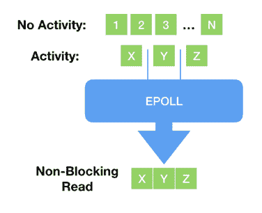
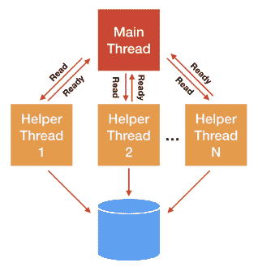
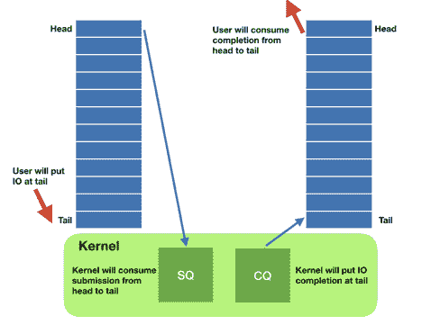
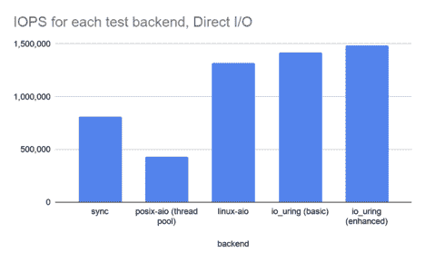
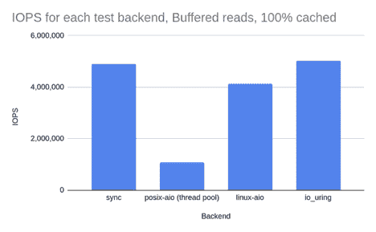

# io uring 和 eBPF 将如何革新 Linux 中的编程

> 原文：<https://thenewstack.io/how-io_uring-and-ebpf-will-revolutionize-programming-in-linux/>

[Glauber Costa](https://www.linkedin.com/in/glommer/?originalSubdomain=ca)

[Glauber Costa 是 ScyllaDB 的现场工程副总裁。他在工程部门和帮助客户成功之间分享他的时间。在 ScyllaDB 之前，Glauber 在 Linux 内核的虚拟化领域工作了 10 年，贡献范围从 Xen 和 KVM 虚拟机管理程序到各种来宾功能和容器。](https://www.linkedin.com/in/glommer/?originalSubdomain=ca)

尘埃落定后，一切都不会再一样了。是的，我说的是 Linux。

当我写这篇文章时，由于新冠肺炎，世界大部分地区都被封锁了。很难说这件事结束后事情会变成什么样子(会结束的吧？)，但有一点是肯定的:世界已经不一样了。这是一种奇怪的感觉:就好像我们在一个星球结束了 2019 年，在另一个星球开始了 2020 年。

当我们都在担心就业、经济和我们的医疗保健系统时，另一个发生了巨大变化的东西可能没有引起你的注意:Linux 内核。

这是因为时不时会出现用革命取代进化的东西。黑天鹅。一些令人高兴的事情，比如汽车的出现，它永远改变了世界各地的城市面貌。有时候是不太令人愉快的事情，比如 9/11 或者我们现在的死对头新冠肺炎。

我就把 Linux 的遭遇放在欢乐桶里。但这肯定是一场革命，一场大多数人还没有注意到的革命。这是因为两个令人兴奋的新接口: [eBPF](https://thenewstack.io/linux-technology-for-the-new-year-ebpf/) (或简称为 BPF)和 [io_uring](https://github.com/torvalds/linux/tree/master/tools/io_uring) ，后者于 2019 年添加到 Linux 中，仍在非常活跃的开发中。这些接口可能看起来是进化的，但它们是革命性的，因为它们将——我们敢打赌——完全改变应用程序使用和思考 Linux 内核的方式。

在本文中，我们将探索是什么使这些接口如此特别，如此具有强大的转换能力，并深入挖掘我们在 [ScyllaDB](https://www.scylladb.com/) 使用 io_uring 的经验。

## Linux I/O 系统调用是如何演变的？

在您熟悉并喜爱的 Linux 时代，内核提供了以下系统调用来处理文件描述符，无论是存储文件还是套接字:

那些系统调用就是我们所说的*阻塞系统调用*。当您的代码调用它们时，它将休眠并被带出处理器，直到操作完成。也许数据位于驻留在 Linux 页面缓存中的文件中，在这种情况下，它实际上会立即返回，或者可能需要通过 TCP 连接从网络上获取或从 HDD 中读取。

每个现代程序员都知道这有什么问题:随着设备越来越快，程序越来越复杂，除了最简单的事情之外，阻塞变得不受欢迎。新的系统调用，如 *select()* 和 *poll()* 以及它们更现代的对应函数 *epoll()* 开始发挥作用:一旦被调用，它们将返回一个准备好的文件描述符列表*。换句话说，读写它们不会阻塞。应用程序现在可以确保不会发生阻塞。*

 *

解释原因超出了我们的范围，但是这种准备机制确实只对网络套接字和管道有效——以至于 *epoll()* 甚至不接受存储文件。对于存储 I/O，经典的阻塞问题已经用 *[线程池](https://en.wikipedia.org/wiki/Thread_pool)* 解决了:执行的主线程将实际的 I/O 分派给助手线程，助手线程将阻塞并代表主线程执行操作。

随着时间的推移，Linux 变得更加灵活和强大:原来数据库软件可能[不想使用 Linux 页面缓存](https://www.scylladb.com/2018/07/26/how-scylla-data-cache-works/)。然后就可以打开一个文件，指定我们想要直接访问设备。直接访问，通常称为直接 I/O 或 O_DIRECT 标志，要求应用程序管理自己的缓存—数据库可能无论如何都要这样做，但也允许零拷贝 I/O，因为应用程序缓冲区可以直接发送到存储设备并从存储设备填充。

随着存储设备变得更快，上下文切换到助手线程变得更加不可取。今天市场上的一些设备，如英特尔 Optane 系列的延迟在一位数微秒范围内，与上下文切换的数量级相同。可以这样想:每一次上下文切换都是一次错过的分派 I/O 的机会。

在 Linux 2.6 中，内核获得了异步 I/O(简称 linux-aio)接口。Linux 中的异步 I/O 表面上很简单:您可以通过 io_submit 系统调用提交 I/O，稍后您可以调用 io_getevents 并接收准备好的返回事件。最近， [Linux 甚至获得了添加 epoll()的能力:现在你不仅可以提交存储 I/O 工作，还可以提交你想知道一个套接字(或管道)是可读还是可写的意图。](https://lwn.net/Articles/742978/)

Linux-aio 是一个潜在的游戏改变者。它允许程序员使他们的代码完全异步。但是由于它发展的方式，它没有达到这些期望。为了试着理解为什么，让我们听听托瓦尔兹先生本人以他一贯的乐观态度回应某人试图扩展接口[以支持异步打开文件](https://lwn.net/Articles/671657/):

*所以我觉得这丑得可笑。*

*AIO 是一个可怕的临时设计，其主要借口是“其他不太有天赋的人做出了那个设计，我们实现它是为了兼容，因为很少有品味的数据库人员实际上在使用它”。*

*—莱纳斯·托瓦尔兹(lwn.net)*

首先，作为数据库人员，我们想借此机会为我们缺乏品味向 Linus 道歉。但也要详述他为什么是对的。Linux AIO 确实有很多问题和限制:

*   Linux-aio 只适用于 O_DIRECT 文件，这使得它对于普通的非数据库应用程序几乎毫无用处。
*   该接口没有被设计成可扩展的。虽然这是可能的——我们确实扩展了它——但是每一个新的增加都是复杂的。
*   虽然接口在技术上是非阻塞的，[但是有许多原因会导致它阻塞](https://lwn.net/Articles/724198/)，通常是以无法预测的方式。

我们可以清楚地看到这种进化的一面:接口有机地增长，新的接口被添加进来与新的接口协同工作。阻塞套接字的问题通过一个接口来处理，以测试就绪性。存储 I/O 获得了一个异步接口——适合与当时真正需要它的应用程序一起工作，而不是其他。这就是事物的本质。直到……欧文出现。

## 什么是 iour ing？

Jens Axboe 是一位经验丰富的内核开发人员，他参与 Linux I/O 栈已经有一段时间了。[邮件列表考古告诉我们](https://lwn.net/ml/linux-fsdevel/20181221192236.12866-9-axboe@kernel.dk/)这项工作开始于一个简单的动机:随着设备变得极快，中断驱动的工作不再像轮询完成那样有效——这是一个支撑面向性能的 I/O 系统架构的常见主题。

但是随着工作的发展，它变成了一个完全不同的接口，从底层开始构思，允许完全异步的操作。这是一个与 linux-aio 接近的基本操作理论:有一个接口将工作推入内核，另一个接口检索已完成的工作。

但是有一些重要的区别:

*   通过设计，接口被设计成真正异步的。使用正确的标志集，它将永远不会在系统调用上下文中启动任何工作，而只会将工作排队。这保证了应用程序永远不会阻塞。
*   它适用于任何类型的 I/O:不管它们是缓存文件、直接访问文件还是阻塞套接字。没错:由于其异步设计的特性，不需要轮询+读/写来处理套接字。一个提交一个阻塞读，一旦准备好，它将出现在完成环中。
*   它是灵活的和可扩展的:新的操作码正在以一定的速度增加，这使我们相信它很快就会增长到重新实现每一个 Linux 系统调用。

io_uring 接口通过两种主要的数据结构工作:提交队列条目(sqe)和完成队列条目(cqe)。这些结构的实例存在于内核和应用程序之间的共享内存单生产者单消费者环形缓冲区中。

应用程序异步地将 SQE 添加到队列中(可能有很多),然后告诉内核有工作要做。内核完成它的工作，当工作准备就绪时，它在 cqe 环中发布结果。这还有一个额外的好处，即系统调用现在是批处理的。还记得[熔毁](https://www.scylladb.com/2018/01/07/cost-of-avoiding-a-meltdown/)吗？当时，我写道这对我们的锡拉 NoSQL 数据库影响很小，因为我们将通过 aio 批处理 I/O 系统调用。除此之外，现在我们可以批处理的不仅仅是存储 I/O 系统调用，任何应用程序都可以使用这种能力。

每当应用程序想要检查工作是否就绪时，它只需查看 cqe 环形缓冲区，并在条目就绪时使用它们。没有必要去内核消费那些条目。

以下是 io uring 支持的一些操作:读、写、发送、接收、接受、打开、统计，甚至更专业的操作，如 fallocate。

这不是进化的一步。尽管 io _ uring 与 aio 略有相似，但它的可扩展性和体系结构是破坏性的:它将异步操作的能力带给任何人，而不是将其局限于专门的数据库应用程序。

我们的 CTO Avi ki vity，[在 Core C++ 2019 大会上为 async](https://www.scylladb.com/2020/03/26/avi-kivity-at-core-c-2019/) 做了演示。底线是这样的:在现代多核、多 CPU 设备中，CPU 本身现在基本上是一个网络，所有 CPU 之间的相互通信是另一个网络，对磁盘 I/O 的调用实际上是另一个网络。有充分的理由说明为什么网络编程是异步进行的，并且您也应该为您自己的应用程序开发考虑这一点。

它从根本上改变了 Linux 应用程序的设计方式:不再是在需要时发出系统调用的代码流，不再需要考虑文件是否准备好，而是自然地成为一个事件循环，不断地向共享缓冲区添加内容，处理完成、清洗、重复的先前条目。

那看起来像什么？下面的代码块是一个示例，说明如何通过 io uring 接口将整个读取数组一次分派给多个文件描述符:

稍后，以事件循环的方式，我们可以检查哪些读取准备好了，并处理它们。最好的部分是，由于它的共享内存接口，不需要系统调用来消费这些事件。用户只需小心地告诉操作界面事件已被使用。

这个简化的例子只适用于读取，但是很容易看出我们如何通过这个统一的接口将各种操作批处理在一起。队列模式也非常适合它:您可以在一端对操作进行排队，在另一端分派和使用准备好的东西。

## 高级功能

除了界面的一致性和可扩展性之外，io ouring 还为特定的用例提供了大量的高级特性。以下是其中的一些:

*   **文件注册:**每次对文件描述符发出一个操作，内核都必须花费周期将文件描述符映射到它的内部表示。对于对同一个文件的重复操作，io _ uring 允许您预先注册那些文件，并在查找时保存。
*   **缓冲区注册:**与文件注册类似，内核必须为直接 I/O 映射和取消映射内存区域。如果缓冲区可以重用，io_uring 允许预先注册这些区域。
*   **轮询环:**对于非常快的设备来说，处理中断的成本是相当大的。io_uring 允许用户关闭这些中断，并通过轮询使用所有可用的事件。
*   **联动操作:**允许用户发送两个相互依赖的操作。它们同时被调度，但是第二个操作只有在第一个操作返回时才开始。

与界面的其他区域一样，新功能也在快速增加。

## 表演

正如我们所说的，io uring 接口在很大程度上是由现代硬件的需求驱动的。因此，我们可以期待一些性能提升。他们在这里吗？

对于像 ScyllaDB 这样的 linux-aio 用户来说，预期收益很少，主要集中在一些特定的工作负载上，并且主要来自于高级特性，如缓冲区和文件注册以及轮询环。这是因为 io_uring 和 linux-aio 并没有像我们希望在本文中阐明的那样不同:io_uring 首先是将 linux-aio 的所有优秀特性带给大众。

我们已经使用众所周知的 [fio](https://github.com/axboe/fio) 实用程序来评估 4 种不同的接口:同步读取、posix-aio(实现为线程池)、linux-aio 和 io_uring。在第一个测试中，我们希望所有读取都命中存储，并且完全不使用操作系统页面缓存。然后，我们用直接 I/O 标志运行测试，这应该是 linux-aio 的基础。该测试是在 NVMe 存储器上进行的，该存储器应该能够在 3.5 米的 IOPS 读取数据。我们使用 8 个 CPU 来运行 72 个 fio 作业，每个作业在 iodepth 为 8 的四个文件之间发出随机读取。这确保了所有后端的 CPU 都以饱和状态运行，并将成为基准测试中的限制因素。这使我们可以看到饱和状态下每个界面的行为。请注意，如果有足够的 CPU，所有接口都将能够在某个时间点达到完整的磁盘带宽。这样的测试不会告诉我们太多。

表 1:使用直接 I/O 在 100% CPU 利用率下进行 1kB 随机读取的性能比较，其中从不缓存数据:同步读取、posix-aio(使用线程池)、linux-aio 和基本 I/O 以及使用其高级特性的 I/O。

我们可以看到，正如我们预期的那样，io _ uring 比 linux-aio 快一点，但不是革命性的。使用像缓冲区和文件注册(io_uring enhanced)这样的高级功能给了我们额外的提升，这很好，但没有理由改变您的整个应用程序，除非您是一个试图挤出硬件可以提供的每个操作的数据库。io_uring 和 linux-aio 的速度大约是同步读取接口的两倍，而同步读取接口的速度又是 posix-aio 采用的线程池方法的两倍，这在一开始是令人惊讶的。

如果我们看一下表 1 中的上下文切换一栏，就很容易理解 posix-aio 最慢的原因:系统调用阻塞的每个事件都意味着一次额外的上下文切换。在此测试中，所有读取都将阻塞。posix-aio 的情况更糟。现在，不仅在内核和阻塞应用程序之间有上下文切换，应用程序中的各种线程也必须进出 CPU。

但是，当我们从另一个角度看问题时，就能理解写作的真正力量。在第二个测试中，我们用文件中的数据预加载了所有内存，并继续发出相同的随机读取。除了我们现在使用缓冲的 I/O 并期望同步接口永远不会阻塞之外，一切都与之前的测试相同——所有结果都来自操作系统页面缓存，而不是来自存储。

表 2:各种后端之间的比较。测试使用带预加载文件和热缓存的缓冲 I/O 文件发出 1kB 随机读取。测试以 100%的 CPU 运行。

在这种情况下，我们不期望同步读取和 io _ ur 接口之间有很大的区别，因为没有读取会阻塞。这确实是我们所看到的。但是，请注意，在实际应用中，除了一直读取之外，还会有不同，因为 io _ uring 支持在同一个系统调用中批处理许多操作。

然而，其他两个接口遭受了巨大的损失:posix-aio 接口中大量的上下文切换由于其线程池而完全破坏了饱和状态下的基准性能。Linux-aio 根本不是为缓冲 I/O 设计的，但当它与缓冲 I/O 文件一起使用时，实际上变成了一个同步接口。所以现在我们为异步接口付出了代价——不得不在分派和消费阶段拆分操作，却没有意识到任何好处。

真正的应用程序将介于两者之间:一些阻塞操作，一些非阻塞操作。除了现在不再需要担心会发生什么。io uring 接口在任何情况下都运行良好。当操作不会阻塞时，它不会强加惩罚，当操作会阻塞时，它是完全异步的，并且不依赖线程和昂贵的上下文切换来实现它的异步行为。更好的是:尽管我们的例子集中在随机读取上，但是 io _ uring 也适用于大量的操作码。它可以打开和关闭文件，设置定时器，传输数据和网络插座。都使用相同的界面。

## ScyllaDB 和 io uring(_ u)

因为 Scylla 在向外扩展之前可以扩展到 100%的服务器容量，所以它完全依赖于直接 I/O，我们从一开始就使用 linux-aio。

在我们的 io uring 之旅中，我们初步看到某些工作负载的性能提高了 50%。仔细观察，这清楚地表明这是因为我们的 linux-aio 实现没有达到应有的水平。在我看来，这突出了绩效的一个通常被低估的方面:实现它是多么容易。当我们根据我们发现的缺陷修复我们的 linux-aio 实现时，性能差异几乎消失了。但这需要努力，来修复一个我们已经使用多年的界面。对于 io uring 来说，实现这一目标是微不足道的。

然而，除此之外，I/O 不仅仅用于文件 I/O(在本文中已经多次提到)。它带有专门的高性能接口，如缓冲区注册、文件注册和无中断的轮询接口。

当使用 io _ uring 的高级特性时，我们确实看到了性能差异:我们观察到在英特尔 Optane 设备中从单个 CPU 读取 512 字节有效负载时，速度提高了 5%，这与表 1 和表 2 中的 fio 结果一致。虽然这听起来不算多，但对于试图充分利用硬件的数据库来说，这是非常有价值的。

io uring 接口正在快速发展。对于未来的许多特性，它计划依赖于 Linux 内核中另一个惊天动地的新特性:eBPF。

## eBPF 是什么？

eBPF 代表扩展的伯克利分组过滤器。还记得 [iptables](https://www.howtogeek.com/177621/the-beginners-guide-to-iptables-the-linux-firewall/) 吗？顾名思义，最初的 BPF 允许用户指定规则，这些规则将应用于流经网络的网络数据包。多年来，这一直是 Linux 的一部分。

但是当 *BPF 得到扩展后，**它允许用户在不同的执行点添加由内核安全执行的代码，而不仅仅是在网络代码中。***

我建议读者在这里停下来再读一遍这句话，以充分理解它的含义:现在，您可以在 Linux 内核中执行任意代码。做任何你想做的事情。

eBPF 程序有类型，这决定了它们将附加什么。换句话说，哪些事件将触发它们的执行。旧式的包过滤用例仍然存在。这是一个 BPF 程序类型的程序。

但是在过去十年左右的时间里，Linux 已经积累了一个巨大的性能分析基础设施，几乎在内核的任何地方都添加了跟踪点和探测点。例如，您可以将跟踪点附加到 syscall(任何 syscall)入口点或返回点。通过 BPF_PROG_TYPE_KPROBE 和 BPF_PROG_TYPE_TRACEPOINT 类型，你可以在任何地方附加 BPF 程序。

最明显的用例是性能分析和监控。这些工具中有很多是通过 [bcc 项目](https://github.com/iovisor/bcc)维护的。以前不可能将代码附加到这些跟踪点中:像 systemtap 这样的工具允许用户这样做。但是以前，这种探针所能做的就是以原始形式将信息传递给应用程序，然后应用程序会不断地在内核之间切换，这使得它非常慢。

因为 eBPF 探测器在内核空间中运行，所以它们可以进行复杂的分析，收集大量的信息，然后只向应用程序返回摘要和最终结论。潘多拉的盒子已经被打开了。

以下是这些工具的一些功能示例:

*   跟踪应用程序花费了多少时间睡眠，以及导致睡眠的原因。(唤醒正常运行时间)
*   找到系统中到达代码中特定位置的所有程序(跟踪)
*   分析按子网聚合的网络 TCP 吞吐量(tcpsubnet)
*   测量内核处理软中断花费的时间
*   捕获关于所有短期文件的信息，它们来自哪里，以及它们被打开了多长时间(filelife)

整个密件收藏是一座金矿，我强烈推荐读者去看一看。但是精明的读者现在已经注意到，主要的问题不是有新的工具。更确切地说，关键是这些工具建立在一个可扩展的框架之上，这个框架允许它们成为*高度专业化的*。

我们总是可以在 Linux 中测量网络带宽。但是现在我们可以把它按子网分开，因为那只是一个被编写并注入内核的程序。这意味着如果你需要插入你自己的网络和场景的细节，现在你也可以了。

拥有一个在内核中执行代码的框架不仅仅是性能分析和调试。我们无法确切知道 iour ing 和 bpf 之间的联姻会是什么样子，但这里有一些有趣的事情可能会发生:

io_uring 支持链接操作，但是没有办法将一个系统调用的结果传递给下一个系统调用。通过一个简单的 bpf 程序，应用程序可以告诉内核如何将 *open* 的结果传递给*read*——包括错误处理，然后分配自己的缓冲区并继续读取，直到整个文件被消耗并最终关闭:我们可以用一个*单一系统调用*对整个文件进行校验和、压缩或搜索。

## 这一切将走向何方？

io _ uring 和 eBPF 这两个新特性将彻底改变 Linux 中的编程。现在，您可以设计能够真正利用这些大型多核多处理器系统的应用，如[Amazon i3en“meganode”系统](https://www.scylladb.com/2019/05/28/aws-new-i3en-meganode/)，或者利用[英特尔 Optane 永久内存](https://www.scylladb.com/2017/09/27/intel-optane-scylla-providing-speed-memory-database-persistency/)的秒级存储 I/O 延迟。

您还将能够在内核中运行任意代码，这极大地增强了工具和调试的能力。对于那些只做过同步或 POSIX aio 线程池的人来说，现在有很多新功能可以利用。这些都是令人兴奋的发展——即使对于像我们这样不是数据库开发人员的人来说也是如此。

<svg xmlns:xlink="http://www.w3.org/1999/xlink" viewBox="0 0 68 31" version="1.1"><title>Group</title> <desc>Created with Sketch.</desc></svg>*