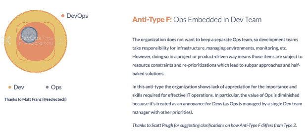
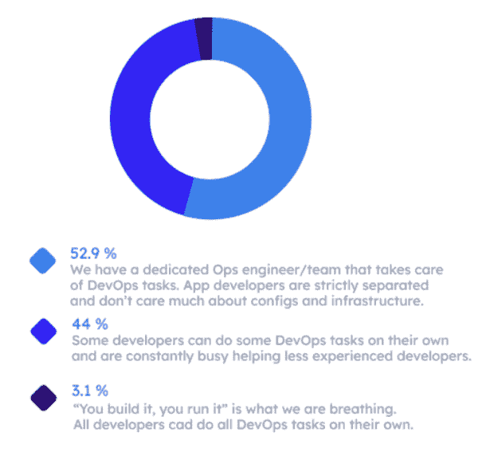
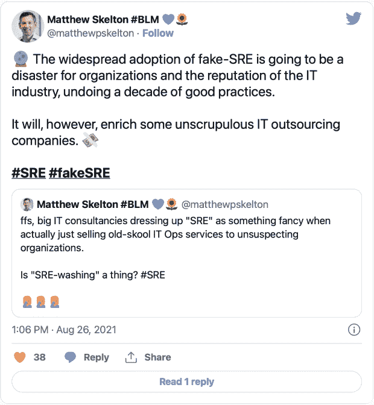
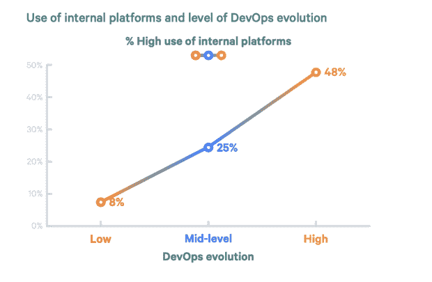

# 平台工程与 DevOps 和 SRE 有什么不同？

> 原文：<https://thenewstack.io/how-is-platform-engineering-different-from-devops-and-sre/>

随着平台工程的大肆宣传，关于它是什么，以及更重要的是，它与站点可靠性工程(SRE)和 DevOps 等更成熟的学科有何不同，存在许多困惑。事实上，随着许多 sre 和 [DevOps 专业人员进入平台工程角色](https://thenewstack.io/devops-is-dead-embrace-platform-engineering/)，很容易将他们误认为是同一个角色。

平台工程只是一个你可以用来加薪的头衔吗？是 DevOps 更名了吗？这些差异比您想象的更微妙，但它们也是平台工程如此重要的原因。

让我们开始吧。

## DevOps

“你建造它，你运行它。”2006 年，亚马逊的首席技术官沃纳·威格尔这样描述该公司的软件工程方法。亚马逊的开发者已经放弃了传统的“翻墙”运营模式。相反，他们端到端地部署和运行他们的应用和服务。就这样，DevOps 诞生了。

随着时间的推移，思想领袖为组织提出了不同的标准来衡量他们的 [DevOps](https://thenewstack.io/google-on-the-devops-elite-and-everyone-else/) 设置的成功。DevOps 圣经“[加速](https://itrevolution.com/accelerate-book/)”将交付周期、部署频率、变更失败率和平均恢复时间(MTTR)确立为标准指标。像 Puppet 的[devo PS State](https://puppet.com/resources/?refinementList%5Btype%5D%5B0%5D=Report&page=1&configure%5BhitsPerPage%5D=18)和 Humanitec 的[devo PS 基准研究](https://humanitec.com/whitepapers/2021-devops-setups-benchmarking-report)这样的报告使用这些指标来比较表现最佳的组织和表现不佳的组织，并推断哪些实践对他们的成功程度贡献最大。

DevOps 为一些软件工程团队带来了新的生产力和效率水平。但是对于许多组织来说，DevOps 的采用没有达到他们的崇高期望。

Manuel Pais 和 Matthew Skelton 在他们的书“[devo PS topology”中记录了这些反模式。](https://web.devopstopologies.com/#anti-types)“在一个场景中，组织试图实施真正的开发运维，并移除专门的运维角色。开发人员现在负责基础设施、管理环境、监控等。，除了他们以前的工作量。通常，高级开发人员在这种转变中首当其冲，要么自己完成工作，要么协助他们的初级同事。

这种所谓的“影子操作”反模式低效地分配了组织最昂贵和最有才华的资源。这是一个普遍存在于组织中的问题，这些组织都在为他们的 DevOps 设置而奋斗。Humanitec 的 DevOps 基准研究发现，虽然 100%的顶级组织报告说他们的开发人员可以独立完成所有 DevOps 任务，但 44%的低绩效组织有影子操作。

影子操作表明 DevOps 有一个更大的问题:开发人员的认知负担太重。认知负荷是一个人完成一项任务必须处理的信息量。当认知负荷过高时，开发人员无法保留和处理完成工作所需的所有信息。

一些组织使用 DevOps 将一切转移到开发人员身上，但是许多开发人员[不想做运营](https://www.reddit.com/r/devops/comments/wusvc9/devs_dont_want_to_do_ops/)或者不能应付额外的责任。对 DevOps 的随意采用增加了开发人员必须与之交互的工具和工作流的数量和复杂性。云原生设置中的微服务架构通常需要 Kubernetes、配置管理、基础设施供应等方面的知识。所有这些造成了[认知负荷](https://platformengineering.org/blog/cognitive-load)，并阻碍了开发人员完成最重要的任务:交付特性。

DevOps 文化证明了开发人员自助服务可以提高生产力和效率。与此同时，许多组织的开发人员的认知负荷突出了设置提供一些结构、标准化和正确的抽象级别的需要。

## 现场可靠性工程

谷歌发明了 SRE，推广了 T6。像 DevOps 一样，这是一种文化转变，受到了大量的炒作。

根据本杰明·特雷诺·斯洛斯的说法，服务工程师负责“服务的可用性、延迟、性能、效率、变更管理、监控、应急响应和容量规划”他们分别使用服务水平目标(SLO)和错误预算来设定对性能的共同期望，并平衡可靠性和创新。

理论上 SRE 没有错。但是[网站可靠性工程](https://thenewstack.io/where-the-site-reliability-engineer-role-overlaps-with-devops/)不正确的采用会导致很多问题，尤其是对于那些缺乏和谷歌一样的资源或人才的组织。

雇佣 SREs 既困难又昂贵。许多组织未能雇佣有足够经验的 sre 来满足其设置的需求。因此，一些运营人员承担了这些责任。这些组织中的 sre 被迫更加关注生存，而不是改善开发人员的体验。他们没有时间启用开发人员自助服务或改进架构或工具。

这个“假”SRE 变成了一个令人难以置信的限制性角色，让人想起 DevOps 之前的软件工程方法。" [DevOps 拓扑结构](https://web.devopstopologies.com/#anti-type-h)"很好地总结了这一点:"开发人员仍然把只有'功能完整'的软件扔给 SREs。软件的可操作性仍然受到影响，因为开发人员无法实际运行他们构建的软件，而且当问题出现时，软件工程师仍然没有时间与开发人员一起解决问题。”

## 平台工程

所有这些历史将我们引向平台工程。

[https://www.youtube.com/embed/WCyiUWIB1wU](https://www.youtube.com/embed/WCyiUWIB1wU)

视频

Luca Galante 将[平台工程](https://platformengineering.org/blog/what-is-platform-engineering)定义为“设计和构建工具链和工作流的学科，在云原生时代为软件工程组织提供自助服务能力。平台工程师提供一种集成产品，通常被称为“内部开发平台”，涵盖应用程序整个生命周期的运营需求。”

内部开发人员平台以及构建这些平台的团队非常重要，因为它们可以提高组织的绩效。在 Puppet 的 2020 年和[的 2021 年 DevOps 状态](https://puppet.com/resources/report/2021-state-of-devops-report)报告中说明了内部开发者平台的使用和 DevOps 发展程度之间的密切关系。

Humanitec 首席技术官 Chris Stephenson [将 IDP](https://platformengineering.org/talks-library/devops-is-dead-long-live-platform-engineering) 描述为“开发人员和平台团队之间的桥梁，这样开发人员就可以完成他们的工作，而不会受到运营的阻碍。另一方面，运营可以确保标准得到应用，事情可以扩展，而不必让开发人员承担责任。”

[好的平台可以缓解开发操作系统和 SRE 使用不当带来的问题](https://thenewstack.io/adobes-internal-developer-platform-journey-and-lessons/)。DevOps 给开发人员带来了太多的认知负担，平台工程试图通过找到正确的抽象层次和铺设黄金路径来减轻这种负担。假 SRE 会给开发者制造瓶颈，平台工程优先考虑[开发者自助服务](https://humanitec.com/blog/what-developer-self-service-shouldnt-look-like)和自由。

这种改进可以归功于平台工程的产品思维。在 PlatformCon 2022 的演讲中，“团队拓扑”的合著者 Manuel Pais 解释了[平台即产品](https://platformcon.com/talk/platform-as-a-product)方法。平台就像产品一样，它们依赖于自愿采用，设计为易于使用，并随着技术的发展而变化。因此，适用于产品的原则和流程也应该适用于平台。

在实践中，这意味着进行用户研究，创建产品路线图，定期征求反馈，迭代，推出平台，并在内部向开发人员营销。这个过程帮助平台团队避免常见的陷阱:成为一个美化的帮助台，未能获得足够的内部支持，构建开发人员不想使用的工具等等。它还迫使平台团队在开发人员自由和为他们的特定组织及其开发人员抽象出复杂性之间取得正确的平衡。

这种方法确保您的平台以一种真正让开发人员的生活更轻松的方式解决他们的问题。它还能让你意识到你的组织所面临的限制，防止仅仅因为 SRE 为谷歌工作就随意实施它。

平台工程是 DevOps 发展的下一个阶段。它包含了之前文化变迁的最佳意图。与 DevOps 一样，它支持开发人员自助服务。像 SRE 一样，它减少了错误，提高了运输的可靠性。

但是平台工程难道也做不好吗？当然可以。这就是[平台工程](https://platformengineering.org)社区创建的原因。通过网络研讨会、圆桌会议和像[平台大会](https://platformcon.com)这样的虚拟会议，这个全球社区找到了一种在平台之旅的每个阶段为团队发现和分享最佳实践的方法。

平台工程将是下一件大事。你们先在这里听到的。

*想参与炒作吗？加入我们社区的 5000 多名平台工程师 [Slack channel](https://platformengineering.org/slack-rd) 。*

<svg xmlns:xlink="http://www.w3.org/1999/xlink" viewBox="0 0 68 31" version="1.1"><title>Group</title> <desc>Created with Sketch.</desc></svg>