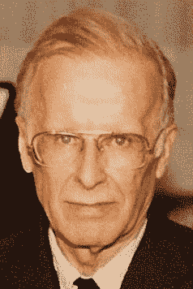
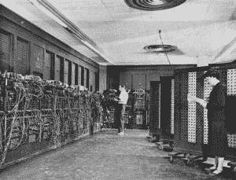

# 约翰·巴科斯的 Fortran 如何击败机器码“祭司”

> 原文：<https://thenewstack.io/how-john-backus-fortran-beat-machine-codes-priesthood/>

约翰·巴科斯是早期计算机编程的创始人之一，在许多方面为现代编程语言奠定了基础。

巴克斯领导的团队在 1957 年开发了 Fortran 编程语言，今天在 IBM 的网页上仍然被吹捧为“[第一种高级编程语言](https://research.ibm.com/interactive/frances-allen/)”。半个世纪后，美联社在[为巴克斯](https://www.nbcnews.com/id/wbna17704662)写的讣告中写道，“在 Fortran 出现之前，计算机必须小心翼翼地‘手工编码’——用原始的数字串编程，触发机器内部的动作。”

但是当 Fortran 出现时，这个世界是什么样的呢？而巴克斯和他的团队是如何实现这一历史性突破的？

虽然巴克斯在 2007 年去世，但世界神奇地再次看到他分享他帮助塑造的那段历史的记忆——在[硅谷](https://youtu.be/EylBknGtkqA)[计算机历史博物馆](https://computerhistory.org/)重新发现的一段罕见的 48 年前的视频。博物馆花了数年时间恢复传奇的洛斯阿拉莫斯会议的视频片段，该会议聚集了数十名世界顶尖的计算机科学家、工程师和软件先驱。

这次会议是一个活生生的历史时刻，ENIAC 的共同发明人约翰·莫奇里(John Mauchly)和理查德·布洛赫(Richard Bloch)都出席了会议。

上个月，博物馆展示了它丢失的珍宝，回顾了 1976 年——美国 200 周年纪念日——包括有机会观看巴克斯分享他对“20 世纪 50 年代美国编程”的回忆

也有机会看到其他计算机先驱对巴克斯所做的一切表示感谢。

## 我们曾经的样子

那天，巴克斯以回忆编程“真的很有趣”的时代开始了他的演讲——部分原因是当时的计算机用“荒谬的困难”挑战他们。

“程序员真的必须是某种足智多谋的发明家，才能使他的问题适应他正在编程的机器的奇怪特性。”

面对极小的存储空间和有限的指令集，像巴克斯这样的程序员“不得不使用他能想到的每一个技巧来使程序运行得足够快，以证明运行它的巨大成本是合理的。他必须靠自己的聪明才智完成所有这些，因为他真正拥有的唯一信息就是手头的问题和机器手册。”

巴克斯笑着回忆道，“有时甚至没有机器手册……”

但为了证明他的观点，巴克斯将它与 20 世纪 70 年代进行了对比，在那个世界里，程序员现在有一个知道如何做一项工作——以及应该花多长时间——的上司。因此，他的工作不再被视为艺术或神秘，他的生产能力在很大程度上取决于他在某个巴洛克式编程系统或操作系统的 6 英寸厚的手册中找到他需要使用的东西的能力。

相比之下，在 20 世纪 50 年代早期，编程在 T2 是一门黑色艺术，他说，称之为非常隐私和神秘的事情。通常它只是“涉及一个程序员、一个问题、一台计算机，有时还有一个小的子程序库，可能还有一个原始的汇编程序。”

这给了这个领域一种“至关重要的前沿热情”，巴克斯痛苦地说——尽管“像任何其他前沿团体一样，编程社区也有它的蛇油供应商。”巴克斯记得“一些早期的编程概念和系统享有一种虚幻的名声，这是它们被宣传的能量大于其他任何东西的结果……”

巴克斯笑了，并补充说“有时蛇油会起作用，有时则不会。”

然而，这导致了一种文化，这种文化也将继续对现实世界产生影响，因为编程界的许多人似乎*重视*的深奥。例如，关于数据应该用纯二进制编码还是用更容易使用的二进制编码的十进制数字进行激烈的争论。

他说:“正如西方人和其他拓荒者对他们的拓荒者身份产生了一种相当沙文主义的自豪感，以及随之而来的一种相应的保守主义，20 世纪 50 年代许多先驱程序员开始将自己视为神职人员，守护着对普通人来说过于复杂的技能和奥秘。”。

让编程面向大众的计划遇到了“相当大的敌意和嘲笑”，以及对这种异端观点的怀疑，即“一个机械过程可以做所有神秘的、创造性的事情来产生一个有效的程序”。

“所以他们真的反对那些少数疯狂的革命者，他们想让编程变得足够简单，让每个人都能做。”

这就是 Fortran 面对的世界。即使在认识到需求之后，“神职人员的阻力是如此之大，以至于整个事情都可能被忽略——除非你能把这个想法变成一个完全发展的系统，毫无疑问地证明这个想法的实用性。”

但幸运的是，巴克斯有不同的心态。美联社引用了巴克斯 1979 年对 IBM 员工杂志的自我评估,“我的大部分工作都来自于懒惰。我不喜欢写程序，所以……我开始开发一个编程系统，让写程序变得更容易。”

在他 1976 年的演讲中，巴克斯赞扬了他领导的团队为 FORTRAN 1 编译器解决了“大量非常困难的问题”，并补充道“我不是那些人中的一员。我坐在那里做着难以描述的事情……”

但是后来在 IBM 的一位巴克斯的同事纠正了这个记录。“我每天都和他在办公室。他没有像他说的那样乱涂乱画。他一直在那里指导军队。”

## 历史性的共识

Betty Holberton(右前景)在 BRL 宾夕法尼亚州费城 328 号楼(20 世纪 40 年代/50 年代)为 ENIAC 计算机编程

事实上，巴克斯的听众中充满了计算机先驱，他们带来了自己关于早期编程的内部知识。

第一个问题来自[贝蒂·霍尔伯顿](https://en.wikipedia.org/wiki/Betty_Holberton)，她自称是标准局(现为 NIST 国家标准与技术研究所)的一名工作人员。事实上，霍尔伯顿是编写世界上第一台通用电子数字计算机 ENIAC 的六名女性之一。

Holberton 要求 Backus 回忆一下 1954 年 IBM 的人如何在国内旅行描述 FORTRAN。“对我来说，这是真正的第一次，因为这是争取共识的一次尝试。我认为这是语言标准化的开始。”

巴克斯承认，当他见到那些潜在用户时，Fortran 受到了热情的接待，这确实让他感到*惊讶。*

“你知道，我预计会收到大量的反对意见和建议……”是的，他的团队为此做了大量工作，但当那些会议最终到来时，巴克斯开玩笑说，也许“他们要么不相信，要么不理解，因为我的陈述混乱。”

但是霍尔伯顿打断了他。“我记得在华盛顿的讨论。很有精神！”

1976 年，贝蒂·霍尔伯顿在约翰·巴科斯的演讲中对观众说。(截图来自 CHM 视频)。

另一个问题来自“斯坦福大学的克努特”——传奇计算机科学家唐纳德·克努特——他想知道是谁创造了“软件”这个词。另一个问题来自著名数学家[约翰·布里尔哈特](https://en.wikipedia.org/wiki/John_Brillhart)，他承认巴克斯对反对简单语言的神职人员的描述是准确的——但有一个额外的警告。“我会把在*对面*的人称为圣职的一部分。”也就是说，编写语言的优化者，“我接触过的人……他们中的许多人*表现得非常像他们是神职人员的一部分。”*

 *巴克斯回应道，他羞怯的微笑是一种承认，尽管他在观众会意的笑声中半开玩笑地说，“不用说，神职的社会学非常复杂。”

但几乎同时，数学家(也是图灵奖获得者)理查德·海明(Richard Hamming)也做出了回应，他在谈到巴克斯时说:“我认为他对所发生的事情过于谦虚。对 FORTRAN 和任何自动编码系统的反对在我看来非常非常强烈。我认为他坚持下去的勇气应该得到认可。他假装什么也没做。在使用[(IBM 最后一台 Fortran 之前的大型机)701](https://en.wikipedia.org/wiki/IBM_701) 时，我有幸定期与他共进午餐。我对他在面对神职人员的强烈反对时保持团队前进的勇气印象深刻。”

然后是自发的掌声。

但在下一个问题之前，巴克斯坚持打断了他的回答。“这不需要任何勇气。这太有趣了！”

[https://www.youtube.com/embed/EylBknGtkqA?feature=oembed](https://www.youtube.com/embed/EylBknGtkqA?feature=oembed)

视频

<svg xmlns:xlink="http://www.w3.org/1999/xlink" viewBox="0 0 68 31" version="1.1"><title>Group</title> <desc>Created with Sketch.</desc></svg>*