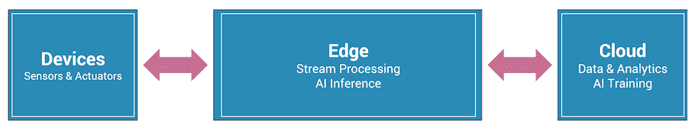
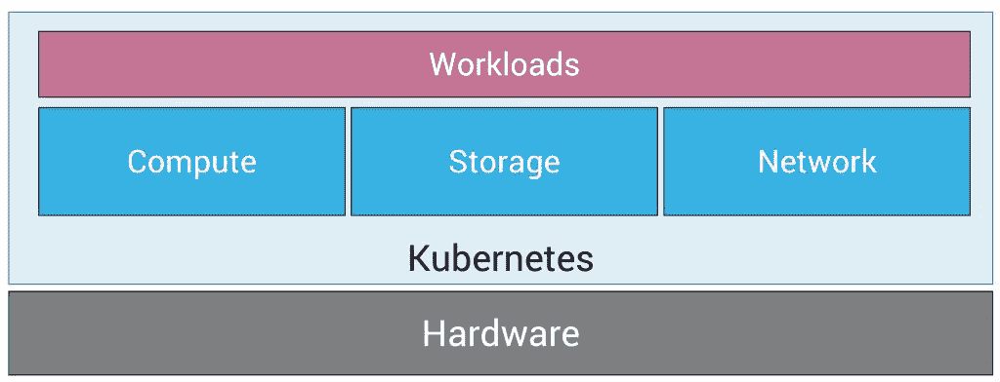
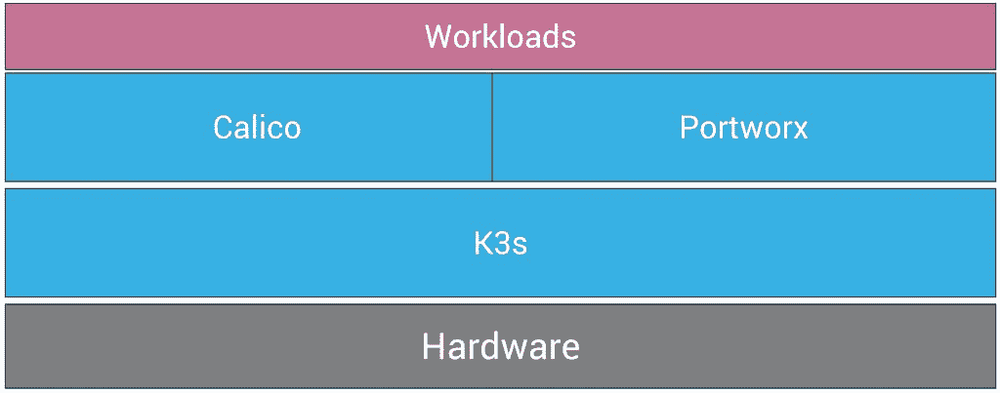

# K3s、Portworx 和 Calico 如何作为云原生边缘基础设施的基础

> 原文：<https://thenewstack.io/how-k3s-portworx-and-calico-can-serve-as-a-foundation-of-cloud-native-edge-infrastructure/>

Kubernetes 正在通过数据中心找到从云到边缘的道路。在早期，Kubernetes 被认为是在公共云中运行的超大规模工作负载。几年内，企业开始在数据中心采用 Kubernetes。它最终成为在混合云和多云环境中运行工作负载的一致和统一的基础架构层。

物联网和人工智能的兴起促使行业将计算能力向数据移动，这已经成为边缘计算层。

边缘计算是设备和云或数据中心之间的媒介。它将业务逻辑应用于设备获取的数据，同时提供实时分析。它充当数据源和云之间的管道，大大减少了由于往返于云而可能出现的延迟。由于边缘可以处理和过滤需要发送到云端的数据，因此也降低了带宽成本。最后，边缘计算将通过本地处理和存储来帮助组织实现数据的局部性和主权。

边缘计算公开了云平台的基本服务，如数据摄取、数据处理、流分析、存储、设备管理和机器学习推理。

Kubernetes 正迅速成为边缘计算的首选基础设施。敏捷性、可扩展性和安全性的承诺正在扩展到边缘基础架构。基于 CI/CD 和 GitOps 的现代软件交付机制使得管理在边缘运行的应用变得容易。部署在边缘位置的数万个 Kubernetes 集群由元控制平面管理，如 Anthos、Arc、Tanzu 和 Rancher。

## Edge 的构建模块

计划在边缘运行 Kubernetes 的客户没有太多选择。他们必须从同类最佳的开源软件和来自云原生生态系统的商业软件中组装堆栈。

商业 Kubernetes 发行版没有针对在资源受限的环境中运行进行优化。部署在边缘的 Kubernetes 发行版应该占用更少的内存，不会损害标准 API 的一致性和兼容性。

边缘存储是基础架构的关键构建块之一。它必须支持处理非结构化数据集、NoSQL 数据库和共享文件系统的有状态工作负载的各种需求。它应该能够定期拍摄数据快照，并将其存储在云中。迁移和灾难恢复等高级功能使边缘计算层具有弹性。

网络层应该为运行在边缘的工作负载提供安全性和隔离。在大多数情况下，边缘基础设施由多个组共享。例如，在智能建筑用例中，同一个边缘集群可能为建筑的每一层运行工作负载。集群管理员应该能够应用网络策略，防止在一个名称空间中运行的应用程序访问另一个名称空间中的应用程序数据。网络层应该通过入侵检测和声明性策略来提供安全性。

## k3s–边缘的 Kubernetes 分布

来自 Rancher Labs 的 K3s 是一种高度优化的库伯内特斯风味。尽管 K3s 是 Kubernetes 的一个简化的微型版本，但它并没有损害 API 的一致性和功能性。

从 kubectl 到 Helm 再到 Kustomize，几乎所有云原生生态系统的工具都与 K3s 无缝协作。事实上，K3s 是一个 CNCF 认证的、符合 Kubernetes 标准的发行版，可以随时部署在生产环境中。最近，K3s 加入了 CNCF，成为一个沙盒项目。在基于上游 Kubernetes 分布的集群中运行的几乎所有工作负载都保证在 K3s 集群上工作。

K3s 通过协调在边缘运行的基础架构和工作负载来有效处理计算层。

## portworx——容器本地存储层

[Portworx](https://portworx.com/) 是专为容器和微服务打造的软件定义存储平台。它将多个存储设备抽象化，向云本机应用程序展示一个统一的覆盖存储层。

Portworx 的一个关键区别因素是容器粒度存储容量。与其他存储产品不同，Portworx 提供了一个统一的覆盖存储层，可以适应不同的使用情况。例如，存储管理员可以定义一个存储类，用于在高可用性模式下运行 NoSQL 数据库，同时为共享卷创建另一个存储类。这两种情形都基于相同的存储后端，无需管理两个不同的存储层。

边缘计算层处理各种工作负载，包括流、数据存储、分析、复杂事件处理和人工智能推理。其中一些工作负载需要专用存储卷，而其他工作负载则需要共享卷。例如，服务于 AI 推理的多个 pod 将共享由 ML 模型填充的相同存储卷。同时，消息代理需要一个专用卷来保存消息。

Portworx 通过统一的方法消除了管理多个存储层的痛苦。一些功能，如快照、定时备份、迁移、集成 RBAC 和预测容量规划，使 Portworx 成为边缘的理想选择。

最新版本 Portworx 2.6 正式支持 K3s 集群。

## Calico 项目–边缘安全网络

[项目 Calico](https://www.projectcalico.org) 为 Kubernetes 带来了精细的网络政策。虽然 Kubernetes 广泛支持基于角色的访问控制(RBAC ),但上游 Kubernetes 发行版中的默认网络堆栈不支持细粒度的网络策略。项目 Calico 通过允许和拒绝 Kubernetes 工作负载的流量来提供细粒度控制。

对于 DevOps 来说，将应用程序逻辑分组到 Kubernetes 名称空间中是一种常见的做法。在边缘计算场景中，K3s 集群可能运行由名称空间分隔的多个工作负载。项目 Calico 通过声明性策略实现了名称空间的强隔离。通过这些策略，传感器传输的数据将由授权的应用程序接收和处理。

Project Calico 带有内置的入侵检测功能，可以识别可疑活动。采用多云联盟的多集群管理使从单一控制台管理分布式边缘基础架构变得非常容易。

只需对安装过程稍作修改，Calico 就可以轻松地与 K3s 集成。

在下一篇教程中，我将带您了解配置基于 K3s、Portworx 和 Calico 的边缘集群的步骤。在后续部分中，我们还将探索利用堆栈的 AIoT 部署。敬请期待！

贾纳奇拉姆·MSV 的网络研讨会系列“机器智能和现代基础设施(MI2)”提供了涵盖前沿技术的信息丰富、见解深刻的会议。在 [http://mi2.live](http://mi2.live) 注册即将到来的 MI2 网络研讨会。

<svg xmlns:xlink="http://www.w3.org/1999/xlink" viewBox="0 0 68 31" version="1.1"><title>Group</title> <desc>Created with Sketch.</desc></svg>