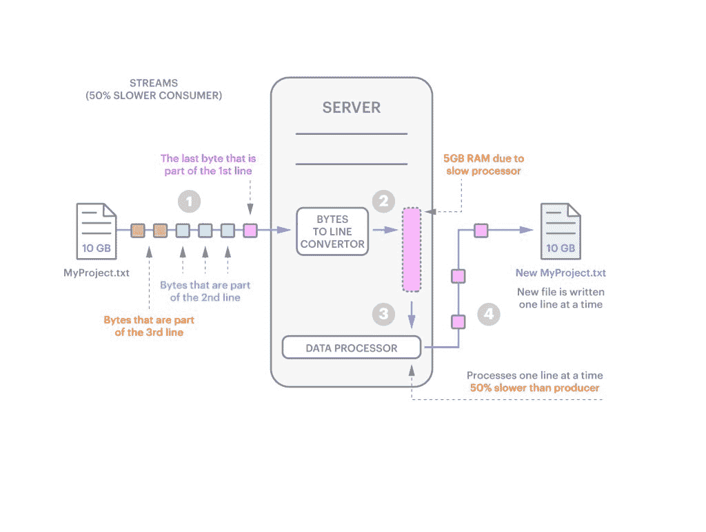
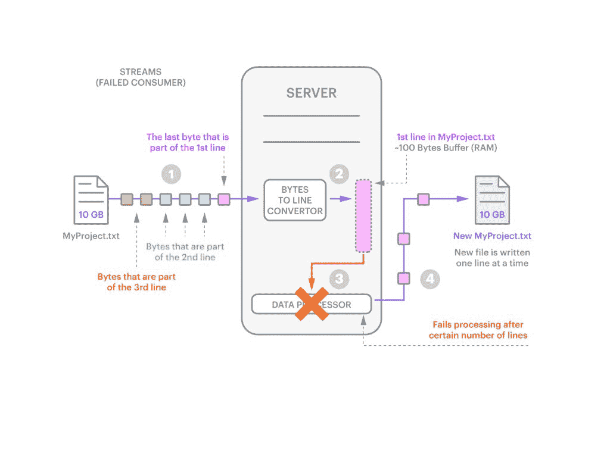
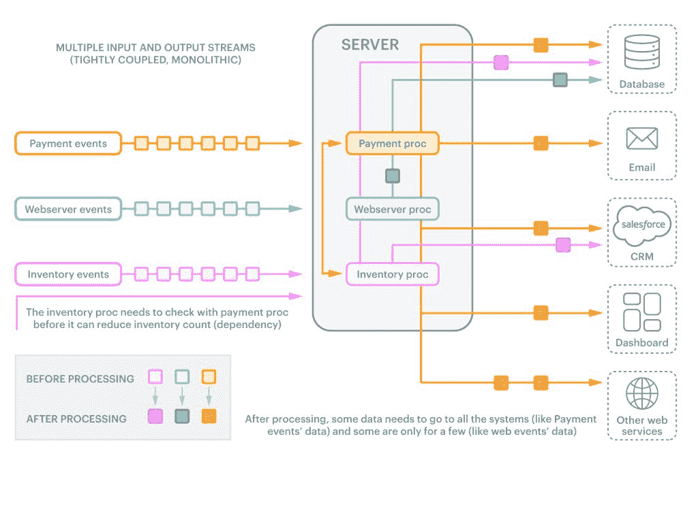
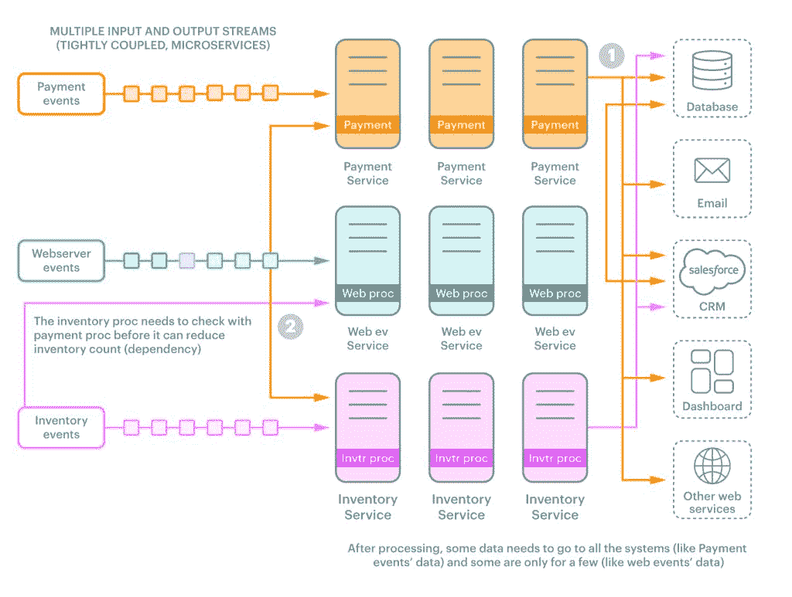
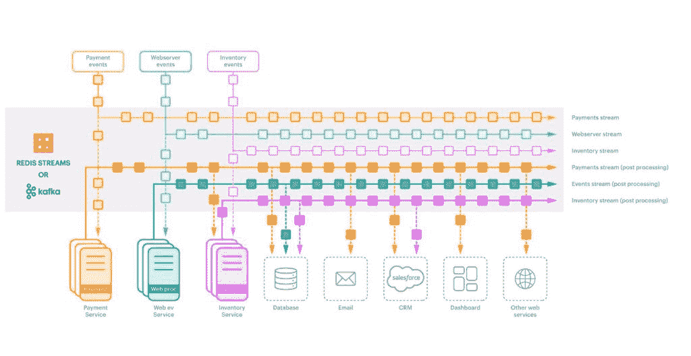

# 卡夫卡和 Redis 如何解决流处理挑战

> 原文：<https://thenewstack.io/how-kafka-and-redis-solve-stream-processing-challenges/>

编者按:这篇文章改编自新书《理解雷迪斯和卡夫卡中的流:视觉指南》。流处理是要理解的更复杂的系统之一，所以本书试图用 Redis Streams 和 Kafka 的 50 多个详细的图形和代码示例直观地解释这些概念。你可以下载一份免费的电子版

[*here*](https://redis.com/docs/understanding-streams-in-redis-and-kafka-a-visual-guide/?utm_medium=social&utm_source=twitter&utm_campaign=Growth-Learn-Streaming&utm_content=chapter1)

.

 [Raja Rao

Raja 是一名工程师、开发倡导者和技术作家，在软件行业工作了近 20 年。他现在已经转向成长型营销，主要写数据库和大数据。](https://www.linkedin.com/in/rajaraodv/) 

尽管流可以是处理大量数据的有效方式，但它们也带来了自己的一系列挑战。让我们来看看其中的几个。

1.如果消费者处理数据块的速度跟不上生产者创建数据块的速度，会发生什么？我们来看一个例子:如果消费者比生产者慢 50%怎么办？如果我们从一个 10GBs 的文件开始，这意味着当生产者处理完所有 10GBs 时，消费者只处理了 5GB。剩余的 5GB 在等待处理时会发生什么情况？突然之间，为仍然需要处理的数据分配的 50 到 100 字节必须扩展到 5GB。

**图 1:** 如果消费者比生产者慢，你就需要额外的内存。

2.这只是一个噩梦般的场景。还有其他人。例如，如果消费者在处理生产线时突然死亡，会发生什么？您需要一种跟踪正在处理的行的方法，以及一种允许您重读该行及其后所有行的机制。

**图二:**消费者失败时。

3.最后，如果您需要能够处理不同的事件并将它们发送给不同的消费者，会发生什么呢？此外，为了增加额外的复杂性，如果您有相互依赖的处理，当一个消费者的过程依赖于另一个消费者的动作时，该怎么办？有一个真正的风险是，你最终会得到一个非常难以管理的复杂的、紧密耦合的整体系统。这是因为这些需求会随着您不断添加和删除不同的生产者和消费者而不断变化。

例如(图 3)，让我们假设我们有一个大型零售店，有数千台服务器支持通过 web 应用程序和移动应用程序购物。

假设我们正在处理与支付、库存和 web 服务器日志相关的三种类型的数据，并且每种数据都有一个相应的消费者:“支付处理器”、“库存处理器”和“web 服务器事件处理器”。此外，两个消费者之间有着重要的相互依赖性。在处理库存之前，您需要先验证付款。最后，每种类型的数据有不同的目的地。如果是支付事件，您将输出发送到所有系统，如数据库、电子邮件系统、CRM 等。如果它是一个 web 服务器事件，那么您只需将它发送到数据库。如果是库存事件，您将它发送到数据库和 CRM。

可以想象，这会很快变得非常复杂和混乱。这还不包括慢消费者和我们需要为每个消费者处理的容错问题。

**图 3:** 由于多个生产者和消费者，紧耦合的挑战。

当然，所有这些都假设您正在处理一个整体架构，您有一个单一的服务器来接收和处理所有的事件。你会如何处理微服务架构？在这种情况下，许多小型服务器(即微服务)将处理事件，并且它们都需要能够相互通信。突然间，你不只是有多个生产者和消费者。你把它们分散在多台服务器上。

微服务的一个关键优势是，它们解决了根据不断变化的需求扩展特定服务的问题。不幸的是，虽然微服务解决了一些问题，但它们没有解决其他问题。我们的生产者和消费者之间仍然紧密耦合，我们保留了库存微服务和支付微服务之间的依赖关系。最后，我们在原始流示例中指出的问题仍然存在:

1.  我们还不知道当消费者崩溃时该怎么办。
2.  我们还没有想出一种方法来管理缓慢的消费者，这种方法不会迫使我们大幅增加缓冲区的大小。
3.  我们还没有办法确保我们的数据不会丢失。

这些只是主要挑战的一部分。让我们来看看如何解决这些问题。

**图片 4:** 微服务领域紧耦合的挑战

## **专业流处理系统**

正如我们已经看到的，流可以很好地处理大量数据，但也带来了一系列挑战。新的专门系统，如 Apache Kafka 和 Redis Streams 的引入是为了解决这些挑战。在 Kafka 和 Redis 流的世界中，服务器不再是中心，而是流，其他一切都围绕着它们。

数据工程师和数据架构师经常分享这种以流为中心的世界观。也许这并不奇怪，当溪流成为世界的中心，一切都是流线型的。

图 5 显示了您之前看到的紧耦合示例的直接映射。让我们看看它在高层次上是如何工作的。

**图 5:** 当我们让溪流成为世界的中心，一切都变得流线型。

1.  在这里，流和数据(事件)是一等公民，而不是处理它们的系统。
2.  任何对发送数据(生产者)、接收数据(消费者)或同时发送和接收数据(生产者和消费者)感兴趣的系统都连接到流处理系统。
3.  因为生产者和消费者是解耦的，所以您可以随意添加额外的消费者或生产者。你可以听任何你想听的事件。这使得它非常适合微服务架构。
4.  如果消费者慢，可以通过增加更多的消费者来增加消费。
5.  如果一个消费者依赖于另一个消费者，您可以简单地监听该消费者的输出流，然后进行处理。例如，在上图中，在处理库存事件之前，库存服务从库存流(紫色)和支付处理流(橙色)的输出中接收事件。这就是你解决相互依赖问题的方法。
6.  流中的数据是持久的(像在数据库中一样)。任何系统都可以在任何时候访问任何数据。如果由于某种原因数据没有被处理，您可以重新处理它。

许多曾经看起来难以应付，甚至不可逾越的流媒体挑战，只要把流媒体放在世界的中心，就能迎刃而解。这就是为什么越来越多的人在他们的数据层使用 Kafka 和 Redis 流。

这就是为什么数据工程师将流视为世界的中心。

*了解 Kafka 和 Redis 如何应对这些复杂的数据挑战。* [*下载这本免费的书*](https://redis.com/docs/understanding-streams-in-redis-and-kafka-a-visual-guide/?utm_medium=social&utm_source=twitter&utm_campaign=Growth-Learn-Streaming&utm_content=chapter1) *，里面有 50 多幅插图，以有趣和吸引人的方式帮助你理解这个复杂的话题。*

<svg xmlns:xlink="http://www.w3.org/1999/xlink" viewBox="0 0 68 31" version="1.1"><title>Group</title> <desc>Created with Sketch.</desc></svg>