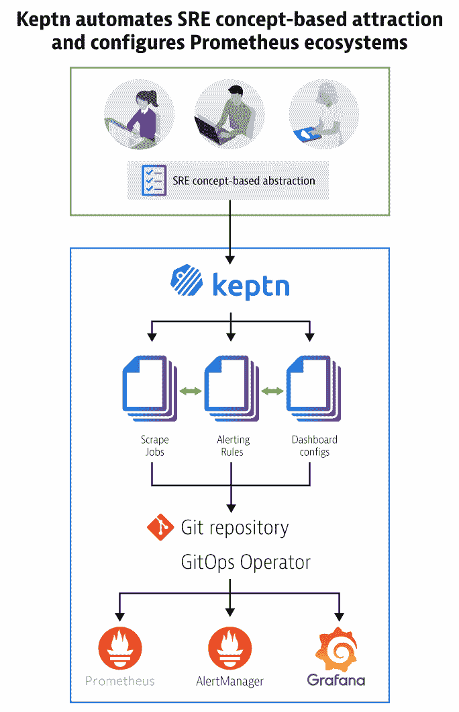
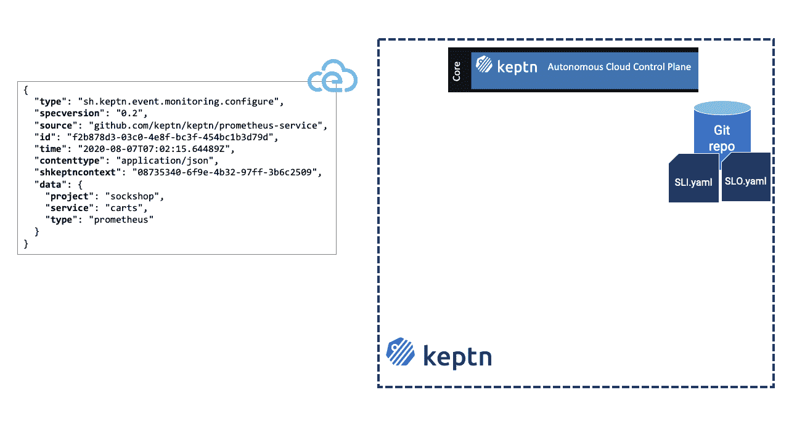

# 保持面向未来的 Kubernetes 监控的 3 种方式

> 原文：<https://thenewstack.io/how-keptn-automatically-configures-prometheus-ecosystems/>

[Dynatrace](https://www.dynatrace.com/) 赞助了这篇文章。

 [于尔根·埃兹尔斯托弗

于尔根是 Dynatrace 的技术策略师。他对云技术、自我修复应用和自动化充满热情。在 Dynatrace 创新实验室，他研究新兴技术以及如何在日常工作中利用这些技术。当他不工作时，你可以发现他在户外，骑自行车，徒步旅行或跑步。可以关注他@jetzlstorfer](https://www.linkedin.com/in/juergenetzlstorfer/) 

在[我之前的文章](https://thenewstack.io/3-key-configuration-challenges-for-kubernetes-monitoring-with-prometheus/)中，我强调了平台运营商面临的三个普遍的 Kubernetes 监控挑战，并提出了 Prometheus 解决方案。

但是，在根据这些建议实现自己的解决方案之前，问问自己，如果每个读者都建立自己的解决方案，会产生多少新的解决方案？对！你最终会得到和读者一样多的解决方案。这对于解决手头的问题可能是好的，但是它不能扩展到新的用例，或者其他团队不得不面对的新环境，或者存在于开发人员、DevOps 和 sre 之间的“关注点分离”。此外，不仅围绕 SRE 概念配置 Prometheus 及其生态系统工具，而且在[软件开发生命周期](https://en.wikipedia.org/wiki/Systems_development_life_cycle)的其他部分利用它们，例如在 CI/CD 系统中，可以实现更多。

您可以设想更多的扩展。为什么不集成像 JMeter 这样的测试工具，并为每个测试运行提供开箱即用的专用仪表板呢？为什么不为每次测试运行自动查询 Prometheus metrics，并在每次触发测试时向用户报告呢？

最终的根本问题:构建这样一个系统本身需要时间，并且是一项复杂的工作。

**终极解决方案:**使用基于行业标准的现成开源框架。

我们在 [Dynatrace](https://www.dynatrace.com/news/blog/what-is-keptn-how-it-works-and-how-to-get-started/?_ga=2.14127860.233219330.1599759579-600174741.1582830930) 启动了 [Keptn](https://keptn.sh/) ，这是一个云计算本地计算基础沙盒项目，为连续交付和自动化操作提供了一个可插拔的、基于事件的控制平面，来回答这个问题:如何在 Kubernetes 上构建一个经得起未来考验的、可扩展的平台，为配置和管理监控工具提供开箱即用的支持，并将它们集成到一个更大的工作流中？

Keptn 提供了一个现成的框架来解决我们之前讨论过的挑战。

## **1。GitOps 相关方法**

Keptn 将其所有配置存储在一个内部 Git 存储库中，该存储库可以与 GitHub、Gitlab、Bitbucket 和其他存储库连接，并将 Git 存储库中的更改应用到您的环境中。Keptn 有一个 API 和 CLI 来触发这些变化。不需要成为 Git 专家，因为您可以使用 Keptn 在 Git 存储库中添加或更改配置。

## **2。代码生成和抽象**

Keptn 以 SRE 最佳做法为基础，根据服务水平指标(SLI)和服务水平目标(SLO)进行配置。这些概念也是 Keptn 或连接到 Keptn 的工具生成的所有代码的输入。因此，Keptn 帮助您专注于确保服务级别的质量，而不是处理 API。

## **3。工具集成**

Keptn 是一个基于事件的控制平面，其他工具(如 Jenkins、Chef、Puppet、吉拉、Jmeter 或 Ansible)可以连接到它并被它触发，或者可以自己触发 Keptn。与 Keptn 的交流是通过使用 [CloudEvents](https://cloudevents.io/) 来完成的，这是一个正在孵化的 CNCF 项目。

作为一个例子，考虑一个简单的云事件，一个 SLI 和 SLO 文件，以及 Keptn 如何自动化连接的工具。

**步骤 1:** 云事件将通过 Keptn CLI——或从前述工具之一，如吉拉或木偶——发送到 Keptn 控制平面。

**第二步:**从那里，它将被分发到所有已订阅此类事件的连接工具。Keptn 为持续交付和配置管理提供了 20 多种不同类型的云事件，并触发自动修复操作，以覆盖广泛的不同使用案例。记住，[规范](https://github.com/keptn/spec/)是开源的，可以由社区扩展。

**步骤 3:** 注册的工具接收云事件，并且可以使用它们在事件中接收的信息直接执行动作，或者接触由 Keptn 管理的附加配置——例如，SLI 和 SLO 文件。

下图说明了 Keptn 如何自动化连接工具的过程。

这种基于事件的方法确保:

1.  配置始终受版本控制；
2.  通过将代码生成器插入到一个更大的工具集中，可以最有效地利用它们；和
3.  生成的代码在其他工具中是同步的，因为所有工具都接收相同的输入信息。

下面是一些例子，说明使用 Keptn 触发的工具集成还可以做些什么:

*   监控数据可以自动提取并用于 CI/CD 系统中的质量关评估。
*   质量门评估可以发送到其他连接的工具，比如 Slack，以通知开发人员他们最近提交的性能影响。
*   通过连接补救或自动化工具来保持，可以启动自动补救来补救生产环境中的问题。

无论您是想自动化 Prometheus 及其生态系统工具的扩展和设置，还是想全力以赴采用事件驱动的控制平面方法，Keptn 都可以帮助您自动化连接的工具。

想了解更多关于 [Keptn](https://keptn.sh) 和[的知识试试](https://tutorials.keptn.sh)？观看我们点播的 Keptn [表演诊所](https://www.youtube.com/watch?v=0vXURzikTac&list=PLqt2rd0eew1YFx9m8dBFSiGYSBcDuWG38&index=5&t=20s)并加入 Keptn 社区；构建你自己的服务，然后告诉我们，这样整个 Keptn 生态系统都可以受益！

一定要参加 Keptn [社区会议](https://github.com/keptn/community)，在那里团队会定期提供来自 Keptn 总部的实时更新。

通过 Pixabay 的特征图像。

<svg xmlns:xlink="http://www.w3.org/1999/xlink" viewBox="0 0 68 31" version="1.1"><title>Group</title> <desc>Created with Sketch.</desc></svg>