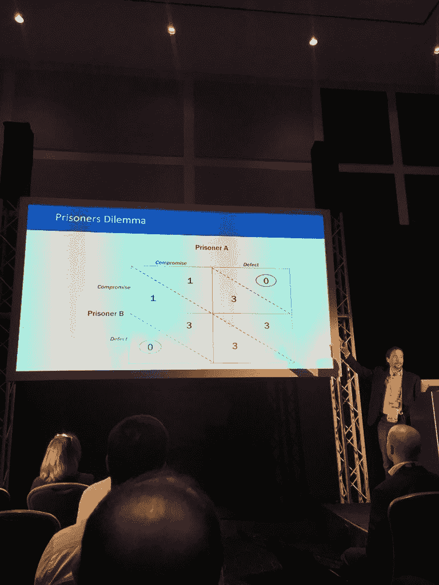
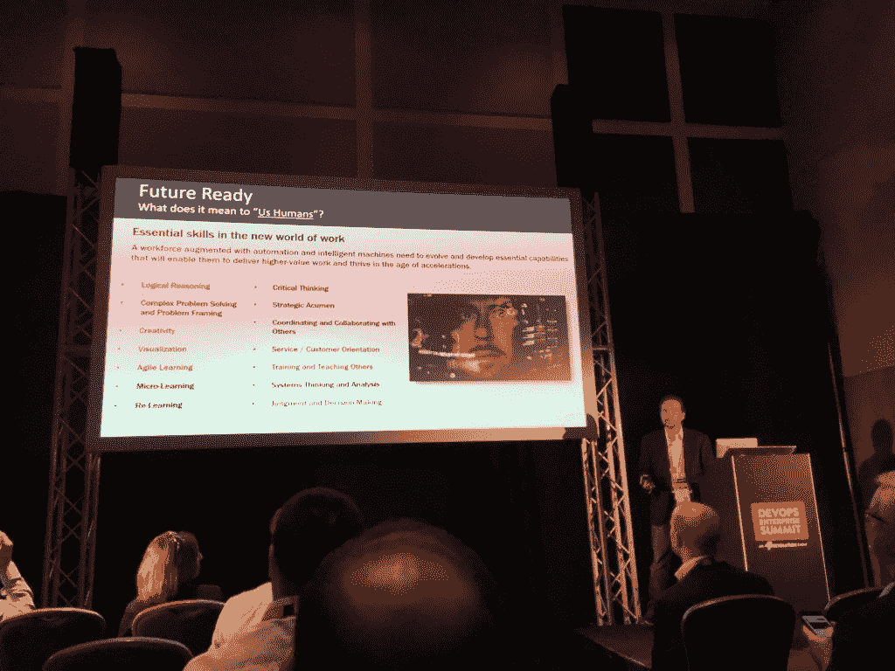

# KeyBank 如何使用 DevOps 来克服成本、复杂性和遗留限制

> 原文：<https://thenewstack.io/how-keybank-used-devops-to-overcome-cost-complexity-and-legacy-constraints/>

两百年了。这是一个很大的遗留问题。现在，可能只有四分之一的时间可以使用传统软件，但拥有近 20，000 名员工、美国前 15 大银行之一、1370 亿美元资产的 KeyBank 已经感受到了传统的痛苦，并利用 DevOps 推动业务进入 21 世纪。KeyBank 负责技术基础设施的高级副总裁 [John Rzeszotarski](https://www.linkedin.com/in/john-rzeszotarski-6113814/) 在今年的[欧洲 DevOps 企业峰会](https://events.itrevolution.com/eur/)上分享了他对银行如何应对成本、复杂性和遗留问题的观察。

## 一年的采购、容器和每周发布

公司内部突然的架构变化通常有两个原因——文化需求或业务需求。在 KeyBank，肯定是后者。回到 2015 年秋天， [KeyBank 宣布了一项收购 First Niagara](https://www.key.com/about/articles/keybank-first-niagara-agreement-103015.jsp) 的交易。Rzeszotarski 说，这种将一个新的数字应用程序放在适当的位置，然后快速安全地迁移尼亚加拉的客户的需求，见证了 KeyBank 的技术方面的快速发展。该项目始于 2015 年 12 月，到 2016 年 7 月，该银行在一个新的、有点大胆的基础设施上建立了在线和移动银行。

“早在 2016 年，没有一家银行在 Kubernetes 和 Docker 上运行[其]在线银行，”Rzeszotarski 在他的演讲中说。

此次收购推动该银行经历了一年的快速变化，直到 2016 年 10 月，在应用发布的前四天，它能够安全稳定地进行 12 项更改，从而快速修复用户体验等问题。Kubernetes 使 it 能够进行滚动部署。Rzeszotarski 说，主要的好处是 Kubernetes 允许他们安装新版本的应用程序，同时仍然管理其他应用程序。

Rzeszotarski 的演讲建立在 KeyBank 的故事基础上，该故事在之前的演讲中已经分享过，这一次的重点是，在快速增长期之后，它如何像往常一样找到新业务。

## 经过一段时间的快速变化后，你如何决定下一步？

在尼亚加拉的第一次收购完成后，这些应用程序被发布，Rzeszotarski 说:“因为我们没有这些催化剂，我们发现快速移动很有挑战性。”

该银行仍然有许多可以从这些最佳实践中受益的应用程序，并且它仍然有遗留系统，它依赖于需要一些关注的集成。

根据 Rzeszotarski 的说法，这一切都归结为“我们很难看到随着不同群体拥有主导策略，会发生什么变化。”

对他来说，在银行业，这又回到了运营、安全、开发、风险和架构向前发展的需要，并在可能的情况下找到妥协，但只是努力避免相互阻碍。

考虑到这一点，Rzeszotarski 和他的团队在 KeyBank 的技术运营中选择了以下限制领域:

*   **成本**——如何做到事半功倍？
*   **复杂性** —你如何管理可以通过许多不同的复杂集成高度细分的大型企业？
*   **遗留系统** —您如何更新和处理遗留系统，包括一些没有路线图的系统？

通过组织银行如何看待其约束，它能够更好地组织克服这些约束的优先级，同时仍然让安全方面满意。

## 如何改变成本游戏

好了，这是所有公司都有的逻辑约束。Rzeszotarski 表示，大多数企业基础设施预算正在下降，但这至少部分是因为基础设施资源通常会随着时间的推移而变得越来越便宜，包括削减成本的虚拟化和容器，因此银行能够在现有资源上获得更多容量。

此外，开源开始主导新技术的采用决策。

“不是因为开源是免费的——因为它无论如何都不是免费的，”Rzeszotarski 解释道。“它确实允许你在没有大量投资的情况下开始创新。它确实让我们支付了企业所需的费用，而不是超出我们的需求。”

世行仍然为企业支持付费，但他表示，典型的开源订阅模式对其购买的产品来说“相对于通常与专有软件一起提供的长期不公平许可协议”，更具有公平的市场价值。

## 如何改变复杂的游戏

这里的头号游戏改变者无疑是集装箱和 Kubernetes。

Rzeszotarski 强调了容器的重要性，因为“与其让 15 个团队参与解决方案的发布，还不如让它们都构建在代码中。它是可重复使用的。你将这一责任推给了应用团队来管理它，我们正在使它可测试，我们正在使用 Kubernetes 来保护它，并确保它的高可用性和高可靠性。”

他继续说道，“对于应用程序框架和平台，您已经消除了修补、升级和热修复解决方案，因为您只是在应用程序之上进行部署。它消除了跨组织团队的复杂性。

Rzeszotarski 告诉新堆栈关于容器和 Kubernetes 的好处:“它使它更准确——无论你构建一次，我们都可以在较低的环境中测试，然后该映像在其他步骤中不会改变。”

他确实说过，虽然这种组合很棒，但它仍然没有为他们提供一种简单易行的管理基础架构的方法。克服复杂性限制的下一步无疑是解决与遗留基础设施的集成。

## 如何改变遗留系统的游戏

为此，KeyBank 的团队遵循马丁·福勒的建议走了传统路线，用[进化数据库设计](https://www.martinfowler.com/articles/evodb.html)、[断路器](https://martinfowler.com/bliki/CircuitBreaker.html)和[扼杀者应用](https://www.martinfowler.com/bliki/StranglerApplication.html)。

作为敏捷方法的分支，进化数据库设计是为连续交付而构建的，并且允许数据库和应用程序在没有任何停机时间的情况下进行更改。进化数据库设计的规则如下:

*   数据库管理员与开发人员密切合作。
*   所有数据库工件和应用程序代码都是受版本控制的。
*   所有数据库更改都是迁移。
*   每个人都有自己的数据库实例。
*   开发人员不断地集成数据库变更。
*   数据库由模式和数据组成。
*   所有数据库更改都是数据库重构。
*   这些重构是自动化的。
*   开发人员可以按需更新他们的数据库。
*   所有的数据库访问代码都是明确分开的。
*   释放经常发生。

Rzeszotarski 说，在 KeyBank，遵循 Fowler 的做法意味着“我们现在已经成功地测试了一个数据库更改，然后才发布我们如何在容器世界中使用它”。

现在，这是 KeyBank 正在进行的一个过程，这意味着许多数据库环境还没有达到这些标准，Rzeszotarski 说，它并不总是在银行业工作，这涉及到与如此多的外部合作伙伴的集成。

“如果我不得不与一家不提供版本化服务的供应商进行集成，该怎么办？”

他表示，该银行经常针对其合作伙伴为自己辩护。为了做到这一点，银行遵循断路器模式——就像当某个东西关闭时，我们通常只打开一个电路的开关，而不会切断整个房子的电力供应。KeyBank 的应用程序集成了许多外部合作伙伴，包括账单支付、个人对个人支付和信用卡服务。

Rzeszotarski 说:“我们在断路器中捍卫我们的应用程序，而不是一个应用程序开始失败甚至变慢。”

银行用网飞的开源工具 [Hystrix](https://github.com/Netflix/Hystrix) 实现了自动化。他说，这个工具寻找闭合和开放电路，如果请求失败，它将关闭与该部分的连接。它将继续每秒尝试一次请求，直到可以安全地打开为止。这意味着，虽然一项服务可能会暂时关闭，但客户仍然可以检查他们的余额并进行转账。

该银行还遵循福勒的扼杀者模式，安全高效地更换遗留系统。以一种最终会使树木窒息而死的澳大利亚藤蔓命名，这涉及到慢慢去除遗留应用程序，直到它消失——而不是重写它。Rzeszotarski 说，如果你试图一次完成所有工作，你会产生太多你可能不明白的风险，而且你永远不会完成任何遗留工作，因为你总是想用新功能更新它。

在有问题的伴侣方面，他说要运用扼杀者模式,“这是一点点与伴侣逐步淘汰，并在时间表上协调，与双方互让。毫无疑问，与我们的供应商合作对我们来说非常重要。”

Rzeszotarski 指出，他的观点是他自己的，不代表 KeyBank 的观点。

照片:[欧洲 DevOps 企业峰会推特](https://twitter.com/DOES_EUR/status/1011568996725018624)

<svg xmlns:xlink="http://www.w3.org/1999/xlink" viewBox="0 0 68 31" version="1.1"><title>Group</title> <desc>Created with Sketch.</desc></svg>