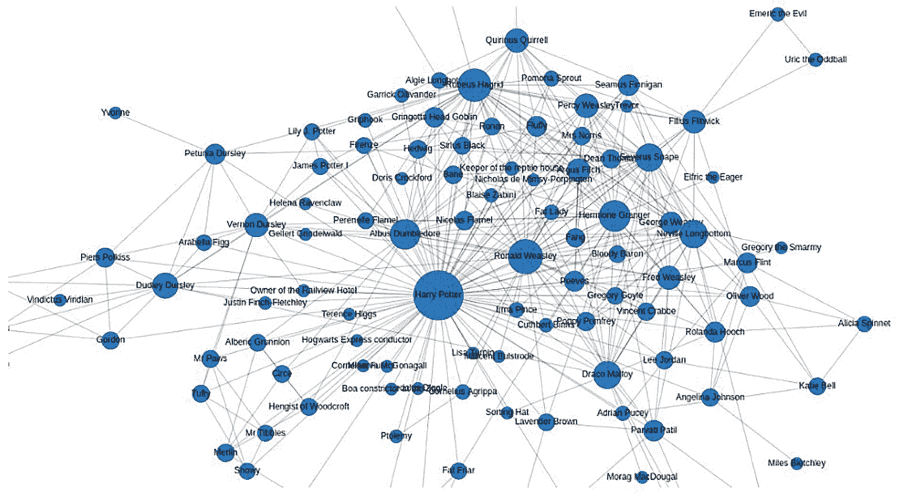
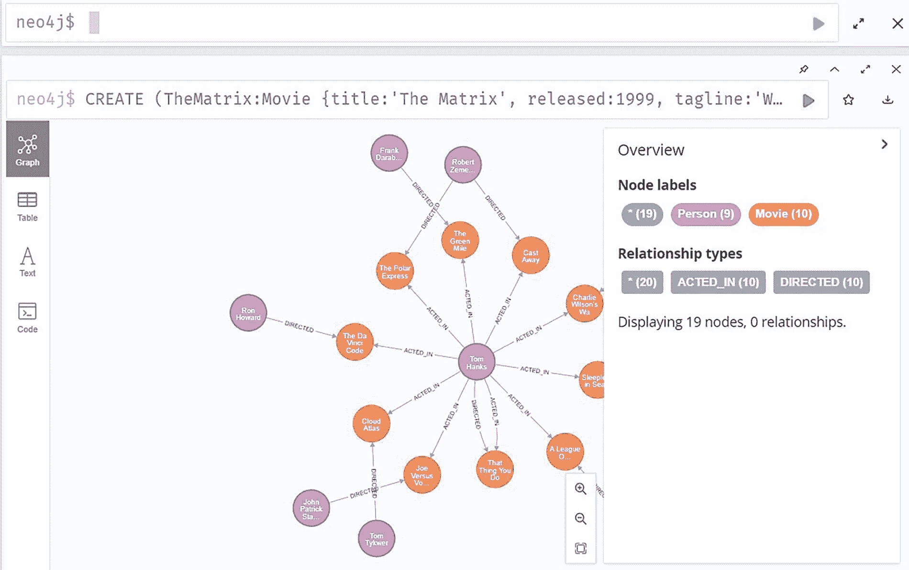

# 知识图表如何让数据对组织更有用

> 原文：<https://thenewstack.io/how-knowledge-graphs-make-data-more-useful-to-organizations/>

知识图表已经成为支撑[数据科学](https://thenewstack.io/data-analytics-and-ai-what-will-happen-in-2023/)革命的重要组成部分。机器学习和[人工智能(AI)](https://thenewstack.io/ai-short-term-overhype-but-underhyped-for-the-long-haul/) 可以用来推断最初看起来完全不同的一组数据点中对象之间的关系。在知识图中，这些推理是可视化的——有或没有人工智能——并被设计成人类大脑可以轻松处理它们。

知识图可以进行的推理和分析通常是其他类型的数据可视化所不具备的，它们通常可以揭示业务洞察力。

对于供应链，知识图可以揭示复杂的分销模型。例如，它们可以清楚地显示库存项目与其在世界另一端制造汽车的用途之间的路径和联系。

但是他们不仅仅擅长绘制供应链。凭借其揭示不同数据点和数据集之间联系的能力，知识图可以帮助支持 IT 和 DevOps，并在运输、硬科学、医疗保健、社会学、犯罪调查、金融科技和许多其他行业中证明是有用的。

企业管理协会(Enterprise Management Associates)的分析师[托尔斯滕·沃尔克](https://www.linkedin.com/in/torstenvolk)告诉《新书库》(New Stack)，知识图中的关系网允许企业用户“对现实世界中发生的事情做出更广泛的结论”。

例如，他补充说，你可以“根据看似不相关的数据点预测某人喜欢什么风格的精酿啤酒，这些数据点显示了此人的工作经历、此人最近购买的汽车以及他或她注册投票支持的政党等细节。”

事实上，知识图可以被认为是“主数据管理解决方案的增强模型视图”， [Jesús Barrasa，](https://www.linkedin.com/in/jbarrasa/?originalSubdomain=uk)Neo4j 的 EMEA 销售工程高级总监，告诉 New Stack。

“所以，你有关于你的客户和你的产品的信息——你的企业中的关键实体被表示为连接的实体，这些实体变成了一个图表。这是一个知识库，但以图表的形式存在。”

## 图形技术正在崛起

一般来说，知识图也代表了数据图和可视化景观的主要部分，这是一个呈指数增长的市场。根据 Gartner 的数据，到 2025 年，[图表技术将用于 80%的数据和分析创新，](https://www.gartner.com/en/newsroom/press-releases/2021-03-16-gartner-identifies-top-10-data-and-analytics-technologies-trends-for-2021)高于 2021 年的 10%，该分析师预测，“促进整个企业的快速决策”。

沃尔克说，人脑对知识图表的处理特别好，因为它们包含了现实世界和抽象环境(如代码或科学理论)中实体之间的真实关系和依赖关系。

“这减轻了深度学习模型的巨大压力，因为我们现在可以提供这些关系作为输入因素，而不是让模型的概率算法根据大量的例子来计算这些关系，”他说。

“这种大幅减少训练人工智能模型的例子数量的能力是一件大事，图形数据库以简单的方式揭示并可以部分解释看似不相关的数据点之间的因果关系也是如此。”

尽管如此，人工智能仍然可以在知识图形中发挥至关重要的作用，特别是当它们被用于现代智能商业应用，更具体地说，过程增强， [Gartner 在 2021 年 10 月关于新兴技术和趋势的报告](https://info.cambridgesemantics.com/hubfs/Emerging_Technologies.pdf?hsCtaTracking=bd648e66-df3f-4374-b48c-ea14d46a54be%7Cd88abf5e-afea-432e-bbd2-105d6858570e)中写道。像知识图这样的人工智能技术——以及[机器学习、](https://thenewstack.io/how-machine-learning-works-an-overview/) [决策智能](https://thenewstack.io/how-to-cut-through-the-noise-with-decision-intelligence/)和[可解释人工智能](https://thenewstack.io/explainable-ai-looking-into-the-black-box/)——通过更智能地可视化数据，为商业用户提供更多价值。

“在未来，过程增强可以进一步扩展，以识别工作模式，从中可以建立和执行过程模型，”Gartner 报告称。“当流程或建议因人工智能而发生变化时，负责流程和决策的业务用户必须了解变化的原因，因此需要使用可解释的人工智能。”

## 为什么知识图表很重要？

是什么让知识图表如此独特？为什么数据科学家、数据分析师和开发者社区对它们如此感兴趣？

要回答这个问题，我们可以从定义什么是知识图开始。但是，尽管人们通常在看到知识图时会认出它，但定义却各不相同。

出于本文的目的，知识图是不同数据集的连接性质的可视化。

举个例子，看看这张哈利波特人物之间的联系图。

哈利波特人物世界，如知识图表所示。(图片来源:Neo4j)

沃尔克指出，通过将《哈利·波特》故事中的这些人物与来自不同数据源的物体联系起来，这个图表甚至会变得更加有趣。这些数据来源可能包括咒语，所有在哈利波特书中被查过名字的各种药剂，或者所有在书中提到的食物和餐馆。

“这为我们提供了一个统一的数据模型，可以立即揭示可操作的见解，否则这些见解将一直被隐藏，”Volk 说。“将这个模型与其他‘世界’的数据模型连接起来将是合乎逻辑的下一步，因为我们可以通过深度学习模型预测《权力的游戏》或《指环王》中巫师的行为或特征，基于这些其他世界巫师的异同。”

这样，知识图就建立在一个图形平台上，在这个平台上创建和部署知识图。

“你可能会发现自称为‘知识图表提供商’的公司，”Barrasa 说。“我的观点是，知识图是一种方法，与其说是一种产品，不如说是一种数据解决方案。”

## 研究数据模式以创建可视化

将知识图提供的数据类型和推理类型概念化是很简单的。例如，通过脸书和 LinkedIn，一个用户可能直接与 100 个人联系，而这些用户中的每一个又与另外 200 个人联系。一些可能属于用户共享的群组，并且在每个群组中有超过 25 个共同的朋友。

通过节点，知识图可以说明这些人之间的联系。

“在这种情况下，脸书和 LinkedIn 使用人工智能算法来研究图表中的模式，并利用这些模式来个性化你的体验，并为你提供建议，”Barrasa 说。“这正是 Neo4j 所提供的，通过提供一个环境，您可以用一种非常简单直接的方式复制这些类型的解决方案和数据产品。”

开始创建知识图并从中得出推论是很容易的，因为对于初学者或普通开发人员来说存在许多可能性。

以 Neo4j 的[沙盒](https://neo4j.com/sandbox/)为例，可以使用该公司的 Cypher 语言在 2000 年后发布的知识图表电影中进行可视化。使用它，您可以将结果限制在特定的数量，如五部电影，同时还可以可视化演员、制片人和其他与这些电影的联系。这个数据图可以在沙盒网站上几分钟内生成。

一个容易上手的电影数据库知识图的例子，用的是 Neo4j 的沙盒平台。(图片来源:Neo4j)

Barrasa 说，尽管知识图的结果简单易懂，但计算——以及 Neo4j 算法如何在幕后挖掘数据集——却一点也不简单。

“数据集相当复杂，但在知识图中看起来很简单，因为这是我们在将它放入表格或为数据集创建 SQL 环境之前的思考方式，”他说。"但是，这些间接联系分析仍然是复杂的."

## 可视化复杂的关系

除了公民开发者可以创建的非常简单类型的知识图表之外，Neo4j 的平台还用于数千种场景。考虑到规模的复杂性以及整合在一起的看似不同的数据类型和来源，最初设置它们可能具有挑战性。

在 11 月举行的 Neo4j 年度开发者虚拟会议上， [NODES 22，](https://neo4j.com/blog/nodes-2022/)展示了几个更有趣、更复杂的项目。

DeepMind 的基础设施和安全工程师 [Alex Kaskasoli](https://uk.linkedin.com/in/alexkaskasoli) 在 [NODES 22、](https://thenewstack.io/what-i-learned-at-neo4js-nodes-22-conference/)上做了一个特别的演示，强调了 GitOPs 知识库有多不安全，以及知识图表如何提供关于攻击者活动的秘密和信息的入侵访问的见解。

在 Kaskasoli 为他的演示创建的场景中，攻击者使用名为“Alice”的管理员的权限来访问 GitHub 存储库中的机密文件。通过使用 GitHub 令牌，创建了一个地图，并使用 Neo4j 知识图可视化了数据。这允许查询攻击路径。

“我们可以看到我们有不同类型的节点，我们在这里有标签来帮助我们识别它们是什么，”Kaskasoli 在会议上说，并指出他在“Alice”例子中创建的知识图的细节。

作为一个雄心勃勃的项目的一部分，该项目涉及对体育竞赛的“纵向调查”，数据来自 60 多个体育联盟的 30，000 多名受访者，[两名研究人员在 NODES '22 演示了 Neo4j 查询和知识图分析](https://www.youtube.com/watch?v=DE_9PD8o7kM&list=PL9Hl4pk2FsvW1NtrhILyptfFnLMjg5Vmc&index=18&ab_channel=Neo4j)。

据主持人 [B .大卫·泰勒，](https://www.linkedin.com/in/drbdt/)马萨诸塞大学阿默斯特分校副教授，[乔·科布斯，](https://www.linkedin.com/in/joebcobbs/)北肯塔基大学海尔商学院教授兼系主任介绍，知情者竞争研究项目将不同的数据源联系起来，并对体育联盟不一致的层级结构进行建模。

在许多方面，知识图数据建模是大量信息和推理的跳板，一旦建立了模型就可以访问这些信息和推理。“建模是我们花费大量时间和精力的地方，Neo4j 做得很好，”泰勒说。“但我们可以做得非常好的另一件事是与其他系统的数据库集成。”

数据源包括一些数据库和调查结果以及外部数据源，如维基数据。“假设我们想知道不同场馆的容量，”泰勒说。“我们可以对此进行查询。我们可以获得不同的场馆及其容量，并将其整合到我们的数据库中。”

要了解知识图表并了解它们如何帮助您的组织可视化数据点之间的联系并增强您的数据分析能力，请查看 Neo4j 的[沙盒。](https://neo4j.com/sandbox/)

<svg xmlns:xlink="http://www.w3.org/1999/xlink" viewBox="0 0 68 31" version="1.1"><title>Group</title> <desc>Created with Sketch.</desc></svg>