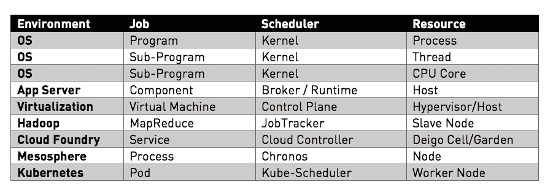
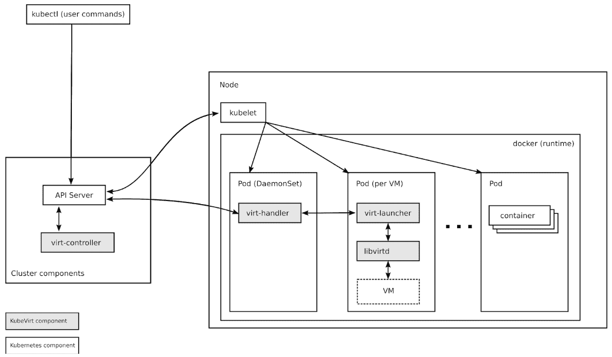
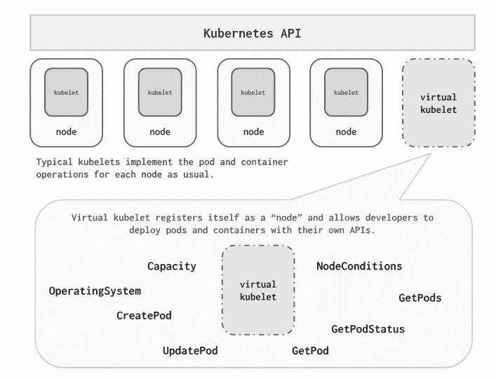
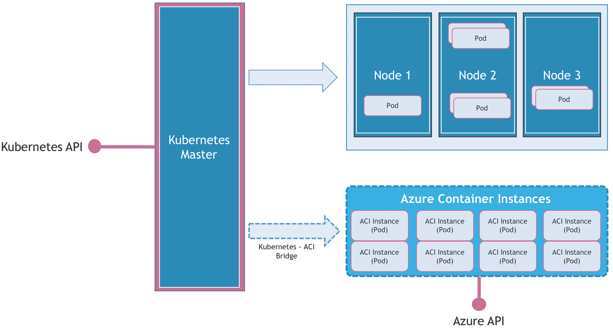

# Kubernetes 如何转变为通用调度程序

> 原文：<https://thenewstack.io/how-kubernetes-is-transforming-into-a-universal-scheduler/>

在计算机科学中，调度是指一种方法，通过这种方法，通过某种方式指定的工作被分配给能够完成该工作的资源。这是一个自 20 世纪 60 年代引入 IBM S/360 以来就存在的老问题。

每当有一项工作可以由一组资源来完成时，调度就变得至关重要。在操作系统的上下文中，作业可以是一个简单的程序，而资源可以是一个 CPU 内核。类似地，操作系统中的调度器可以负责将代码行与线程或信号量相关联。

分布式计算将调度器的领域从内部进程和线程扩展到了一个物理机器集群。在 90 年代，CORBA、DCOM 和 J2EE 等分布式平台解决了在应用服务器集群中调度组件的挑战。

最近，Amazon EC2、Azure Fabric 和 OpenStack Nova 等 IaaS 控制平面处理在物理主机上运行的虚拟机管理程序中调度虚拟机。每个虚拟机都必须根据请求的资源放置在适当的主机上。

基于 Apache Hadoop 和 MapReduce 算法的大数据工作负载严重依赖于成熟的调度算法。HDFS，Hadoop 的文件系统确保集群的所有节点都可以访问数据集。该架构直接关注资源的可靠性和可用性。

Cloud Foundry 和 Heroku 等 PaaS 实施拥有复杂的放置逻辑，可以在隔离的环境中调度服务。每个服务被打包并部署到在虚拟机或物理主机内运行的执行环境中。

容器的兴起迫使业界重新审视资源调度器的设计。简单性和可伸缩性成为新调度器的主要考虑因素。传统的应用服务器处理少量的服务器，而容器管理平台的工作节点可能在从一个到几千个的任何地方。

Kubernetes 和 Mesosphere 是资源调度器的现代体现。两者都是为了抽象底层基础设施，使调度任务对用户透明。

## Kubernetes 中的计划

Kubernetes 调度程序是该平台的关键组件之一。它运行在主节点上，与 API 服务器和控制器密切合作。调度程序负责匹配——一个 pod 与一个节点。你可以在这篇文章中全面了解 [Kubernetes 建筑](https://thenewstack.io/kubernetes-an-overview/) 。

调度器基于诸如可用资源之类的多个因素来确定 pod 的适当节点。也有可能 [通过节点关联影响调度器](https://kubernetes.io/blog/2017/03/advanced-scheduling-in-kubernetes/) ，其中 pod 请求具有特定特征的节点。例如，运行高 I/O 数据库的有状态 pod 可能会为具有 SSD 存储后端的节点请求调度程序。还可以确保将一组 pod 放在同一个节点上，以避免延迟。这就是 pod 亲和力。Kubernetes 还支持定制调度器，其中放置逻辑完全由第三方调度器驱动。

Kubernetes scheduler 最大的优点就是简单。大多数上述布局策略实现起来非常简单。它只需要在 pod 和节点中适当地包含或排除一组标签和注释。一组节点和单元上的简单键/值对可以提供复杂的放置策略。

## **超越 pod 和节点的 Kubernetes 调度器**

Kubernetes 正在成为我们这个时代最好的资源调度程序之一。强大的调度器，简单且可扩展，使我们能够解决传统分布式系统中存在的许多问题。

Kubernetes 正迅速成为高度分布式环境中调度和管理作业的首选控制平面。这些工作可能包括在物理主机上部署虚拟机，在边缘设备上放置容器，甚至将控制平面扩展到其他调度器，如无服务器环境。

Kubernetes 的虚拟机管理插件 KubeVirt ，旨在允许用户在他们的 Kubernetes 或 OpenShift 集群中与容器一起运行虚拟机。它通过 Kubernetes 的 [自定义资源定义](https://kubernetes.io/docs/concepts/api-extension/custom-resources/#customresourcedefinitions) (CRD) API 为虚拟机和虚拟机集添加资源类型，从而扩展了 Kubernetes。KubeVirt 虚拟机在常规的 Kubernetes pods 中运行，它们可以访问标准的 pod 网络和存储，并且可以使用标准的 Kubernetes 工具进行管理，如 *kubectl* 。

Mirantis 的 [Virtlet](https://github.com/Mirantis/virtlet) 项目使得在 Kubernetes 集群上运行虚拟机成为可能，就像它们是普通的 pod 一样。它使运营商能够使用标准的 *kubectl* 命令来管理虚拟机，并将它们作为一等公民带入集群网络。使用 Virtlet，可以构建更高级别的 Kubernetes 对象，包括部署、statefulsets 或 daemonSets。

微软的 [虚拟 Kubelet](https://github.com/virtual-kubelet/virtual-kubelet) 项目是利用 Kubernetes 的最有趣的调度程序。虚拟 Kubelet 是一个在外部环境中运行的代理，它在 Kubernetes 集群中注册为一个节点。代理通过 Kubernetes API 创建一个节点资源。通过利用 [污染和容忍](https://kubernetes.io/docs/concepts/configuration/taint-and-toleration/) 的概念，它通过调用其本机 API 在外部环境中调度 pod。

 虚拟 Kubelet 与 [ Azure 容器实例](https://azure.microsoft.com/en-us/services/container-instances/) 、 [ Azure 物联网边缘](https://azure.microsoft.com/en-us/services/iot-edge/) 、以及 [ AWS Fargate ](https://aws.amazon.com/fargate/) 控制平面协同工作。

请参考我之前的文章，了解虚拟 Kubelet 的 [架构](https://thenewstack.io/lightning-fast-container-provisioning-with-microsofts-azure-container-instances/) 和 [部署指南](https://thenewstack.io/explore-multicloud-deployments-aci-connector-kubernetes/) 。

## 未来之路—自定义调度程序和自定义资源定义

上面讨论的项目只是冰山一角。随着 Kubernetes 成为现代基础设施的基础，它正在准备运行各种工作负载，包括传统的业务线应用程序，如 ERP 和 CRM。

应用程序供应商将严重依赖 Kubernetes 的两个新兴功能——定制调度程序和定制资源定义(CRD)。

如前所述，Kubernetes 中的定制调度程序允许开发人员定义定制的调度逻辑。pod 的声明可以包括定制调度器的名称，暗示控制平面绕过默认调度器。这是一种控制集群中 pod 放置的强大机制。

云原生存储公司 Portworx Portworx Portworx Portworx Portworx Portworx Portworx Portworx Portworx，Portworx Portworx，Portworx，Portworx，Portworx，Portworx，Portworx，Portworx，Portworx，Portworx，Portworx，Portworx，Portworx，Portworx，Portworx，Portworx，Portworx，Portworx，Portworx，Portworx，Portworx。它确保有状态的 pod 总是放在具有 Portworx 驱动程序和存储的节点上。这有助于实现作为容器部署的数据库工作负载的高可用性。

Kubernetes 中的 [自定义资源](https://kubernetes.io/docs/concepts/extend-kubernetes/api-extension/custom-resources/) 将对象生命周期管理的简单性和强大功能扩展到了自定义类型。自定义资源是一个对象，它扩展了 Kubernetes API，或者允许开发人员将他们自己的 API 引入到项目或集群中。自定义资源定义(CRD)文件定义自定义对象种类，让 API 服务器处理整个生命周期。将 CRD 部署到集群中会导致 Kubernetes API 服务器开始为指定的定制资源提供服务。

一旦创建了 CRD，运营商就可以使用 *kubectl* 或第三方工具来管理第三方资源的生命周期，就像他们在 Kubernetes 中处理 pod 和部署的方式一样。ISV 可以将他们的软件作为一组 CRD 进行打包和部署。

Kubernetes 的可扩展性使它成为一个通用的调度和管理工具。

<svg xmlns:xlink="http://www.w3.org/1999/xlink" viewBox="0 0 68 31" version="1.1"><title>Group</title> <desc>Created with Sketch.</desc></svg>