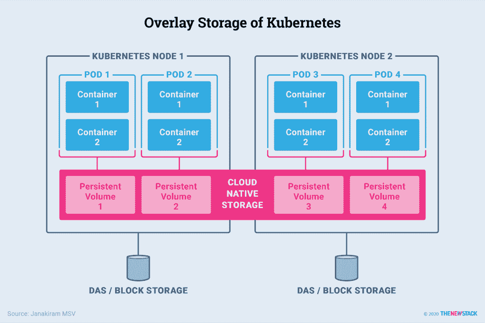

# Kubernetes 如何为应用程序提供网络和存储

> 原文：<https://thenewstack.io/how-kubernetes-provides-networking-and-storage-to-applications/>

计算、存储和网络[是任何基础设施服务](https://thenewstack.io/how-do-applications-run-on-kubernetes/)的基础。在 Kubernetes 中，节点代表计算构建块，它为集群中运行的 pod 提供基础网络和存储资源。网络和存储服务由为 Kubernetes 设计的软件定义的容器原生插件提供。

网络组件支持单元到单元、节点到单元、单元到服务以及外部客户端到服务的通信。Kubernetes 遵循插件模型来实现网络。Kubenet 是默认的网络插件，配置起来很简单。它通常与云提供商一起使用，云提供商为节点之间或单节点环境中的通信设置路由规则。

Kubernetes 可以支持大量基于[容器网络接口](https://github.com/containernetworking/cni) (CNI)规范的插件，该规范定义了容器的网络连接性，并在容器被删除时处理网络资源。CNI 的实现有很多，包括[印花布](https://github.com/projectcalico/calico)、[纤毛](https://github.com/cilium/cilium)、 [Contiv](https://github.com/contiv) 、[织网](https://github.com/weaveworks/weave)等等。CNI 规范也支持公共云中可用的虚拟网络，这使得将网络拓扑和子网扩展到 Kubernetes 集群成为可能。

一些符合 CNI 标准的网络插件，如 Calico，通过隔离 pod 来实施严格的路由策略。它们为 Kubernetes 集群的 pod 和名称空间带来了类似防火墙的规则。

## 库伯内特仓储公司

持久存储通过持久卷暴露给 Kubernetes。pod 通过永久卷声明来消耗卷。存储管理员通过从现有的网络连接存储(NAS)、存储区域网络(SAN)、直连存储(DAS)、固态硬盘(SSD)、非易失性快速内存(NVMe)或闪存磁盘阵列创建永久卷来调配存储。开发人员和 DevOps 团队通过与 pods 相关的持久卷声明获得了一大块持久卷。

Kubernetes 附带了存储原语来公开现有节点的存储。一个这样的原语是卷类型，它使底层存储可被 pod 访问。卷类型的示例包括 emptyDir 和 hostPath。它们用于特定的用例:emptyDir 用于暂存空间，hostPath 使本地卷可供 pod 使用。但是由于与节点的紧密耦合，它们不具备高可用性和容错性。覆盖存储层从块设备、NAS 和 SAN 中汇集存储卷，以向 Kubernetes 对象公开外部存储。

为了提供高可用性和容器原生存储功能，Kubernetes 为存储供应商引入了插件，以将其平台暴露给容器化的工作负载。来自公共云提供商的块存储，基于 NFS 和 GlusterFS 的分布式文件系统，以及一些商业存储平台都有包含在 Kubernetes 开源上游发行版中的插件。存储管理员根据性能和速度为每种类型的存储引擎创建存储类。可以从这些存储类中为不同类型的工作负载创建持久卷和声明。例如，关系数据库管理系统(RDBMS)可以与具有更高的每秒输入/输出操作(IOPS)的存储类相关联，而内容管理系统(CMS)可以通过不同的存储类将分布式存储引擎作为目标。

Kubernetes 的覆盖储存:暴露储存在豆荚和容器中

与 CNI 类似，Kubernetes 社区已经通过容器存储接口(CSI)定义了存储规范，该接口鼓励采用标准、可移植的方法来通过容器化的工作负载实现和使用存储服务。

## 为扩展而构建的轻量级网络堆栈

Kubernetes 源于 Borg，专为超大规模工作负载而设计。其现代架构确保了基础设施资源的最佳利用。额外的工作节点可以很容易地添加到现有集群中，几乎不需要更改配置。工作负载将能够立即利用新节点的 CPU、内存和存储资源。

将一组相关的容器组合在一起作为一个 pod，并将其视为一个部署和扩展单元，这种想法可以提高性能。例如，将 web 服务器和缓存容器放在同一个 pod 中可以减少延迟并提高性能。pod 中的容器共享相同的执行上下文，使它们能够使用进程间通信，这减少了开销。

属于相同复制集和部署的 pod 可以快速扩展。将部署扩展到数百个单元只需几秒钟。基于资源能力和期望的配置状态在节点上调度单元。通过配置水平 Pod 自动缩放器(HPA)，Kubernetes 可以自动缩放部署。

在弹性基础设施环境中运行时，Kubernetes 可以使用集群自动缩放器在集群中添加和删除节点。结合 HPA，这种技术可以有效地管理工作负载和基础架构的动态自动扩展。

Kubernetes 的轻量级网络堆栈和服务发现是为扩展而设计的。它们可以处理由服务公开的成千上万个端点，供内部和外部使用。

Kubernetes 生态系统和社区不断创新，使平台适合超大规模工作负载。

<svg xmlns:xlink="http://www.w3.org/1999/xlink" viewBox="0 0 68 31" version="1.1"><title>Group</title> <desc>Created with Sketch.</desc></svg>