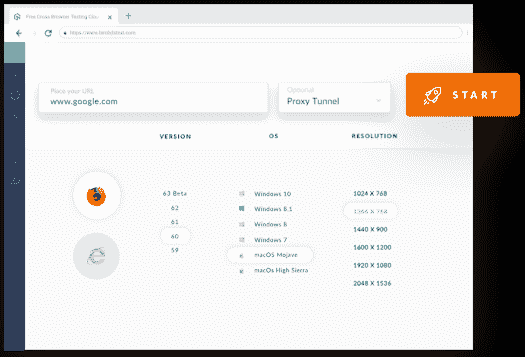
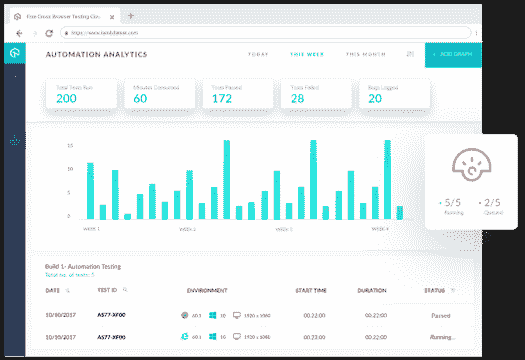

# LambdaTest 如何从云中自动化跨浏览器测试

> 原文：<https://thenewstack.io/how-lambdatest-automates-cross-browser-testing-from-the-cloud/>

 [朱奈德·艾哈迈德

朱奈德·艾哈迈德是最值得信赖的跨浏览器测试平台之一 LambdaTest 的营销传播专员。他在管理印度其他几家领先公司的营销和传播活动方面拥有超过七年的丰富经验。在业余时间，朱奈德喜欢旅游、吃饭和阅读。](https://www.lambdatest.com/) 

跨浏览器测试是在多种浏览器上一致运行 web 应用程序的基本组件之一。这是一种测试技术，它允许您在互联网上跨各种浏览器检查 web 应用程序的功能和其他依赖性。

现在，您一定在想，对一个 web 应用程序执行[跨浏览器测试](https://www.lambdatest.com/)真的有必要吗？

您可能知道，市场上有各种各样的 web 浏览器，最终用户根据自己的方便程度使用不同的浏览器来访问 web 应用程序。因此，web 应用程序或网站必须能够在所有浏览器上有效运行。

一个 web 应用程序通常有多个客户端组件，如 Flex、JavaScript、Flash、Applets 等等。根据渲染引擎的不同，所有这些组件在不同的 web 浏览器中的行为会有所不同。[跨浏览器测试](https://www.softwaretestingclass.com/cross-browser-compatibility-testing/)确保您的 web 应用程序能够在所有浏览器上可靠运行，而不会影响其质量。它允许开发人员和测试人员识别不同浏览器和设备中网页的再现或外观是否相同。

## 如何进行跨浏览器测试？

通常有两种方法可以执行跨浏览器测试——手动和自动。让我们清楚地看看这两种方法。

*   **手动跨浏览器测试**

手工方法包括使用多台机器、多种操作系统、各种浏览器，并在不同的浏览器上反复运行相同的测试用例。在手动方法中，开发人员和测试人员首先确定他们希望应用程序正确支持的浏览器。然后，他们在不同的浏览器上重新运行相同的测试用例，以观察 web 应用程序的行为并找出其中的任何错误。

使用手动方法，不容易在每个浏览器上执行跨浏览器测试，因为这需要相当多的时间。此外，也不能保证应用程序可以在主流浏览器版本上手动测试。这里的主要挑战是覆盖所有你想测试你的网站或网络应用的浏览器和设备。然而，在一个合适的跨浏览器测试策略的帮助下，通过选择最好的跨浏览器测试工具，你可以覆盖最多的浏览器。

即使这是一个有点耗时的挑战仍然存在。那么，自动化跨浏览器测试在这里就有帮助了。

*   **自动跨浏览器测试**

自动化测试几乎类似于手工测试；它还包括在不同的浏览器上多次运行相同的测试用例。然而，唯一的区别是它使用了一个自动化工具来使整个跨浏览器测试过程更易于管理。

在自动化测试中，测试人员自己编写测试脚本，并使用合适的软件来测试 web 应用程序。它提高了跨浏览器测试过程的效率和有效性。

简而言之，自动化的跨浏览器测试挑战性更小，耗时更少，成本也更低。

然而，自动化跨浏览器测试中最具挑战性的事情是选择满足您所有基本需求的正确的自动化工具。市场上有很多可用的工具，比如 TestComplete、Ranorex、SoapUI 等等。这些工具中有些很贵，而另一些则有复杂的测试过程。

然而，Selenium 被认为是自动化测试的最佳测试框架，因为它支持几乎所有的编程语言。此外，它不是一个单一的工具，它由四个主要工具组成——Selenium IDE、RC、WebDriver 和 Selenium Grid。我认为，在这四个工具中， [Selenium Grid 是从](https://dzone.com/articles/why-selenium-is-still-the-best-tool-for-testing-br)中选择的最佳工具。

Selenium Grid 允许您在不同的机器上针对不同的浏览器和浏览器版本并行运行测试。但是这里的主要挑战是在您的本地系统中安装和维护这些浏览器。然而，如果你已经安装了一个版本的浏览器，那么在同一浏览器的其他版本(更高或更低)上进行测试就变得非常困难。

在这种情况下，在线 Selenium 网格会有所帮助。LambdaTest 就是这样一个在线 Selenium 网格，它在云端提供所有的浏览器和操作系统。因此，没有必要在您的本地系统中下载或安装浏览器。使用 LambdaTest selenium grid，您可以在云浏览器中测试跨浏览器兼容性。

让我们更详细地了解一下 LambdaTest 以及它如何帮助您！

## 什么是 LambdaTest？

LambdaTest 是一个基于云的跨浏览器测试工具，允许您在 2000 多种浏览器、操作系统和设备上对 web 应用程序进行跨浏览器测试。您可以使用 LambdaTest 执行手动和自动跨浏览器测试。

例如，您可以在大多数公认的 web 浏览器上测试您的 web 应用程序，如 Chrome、Safari、Firefox、Edge、Internet Explorer、Opera 和 Yandex。

这是一个可扩展的测试平台，通过将您的软件评估需求带到云基础设施来帮助您的团队。通过使用 LambdaTest 执行实时跨浏览器兼容性测试，您可以确保您的 web 应用程序或网站与市场上几乎所有可用的浏览器和设备兼容。它使组织能够测试其 web 应用程序的响应能力，并在执行测试时获取完整的屏幕截图。

## LambdaTest 的特点

LambdaTest 嵌入了一些很棒的特性，使其从其他跨浏览器测试工具中脱颖而出。这里我们提到了这个工具的一些广泛的特性。

*   **在线浏览器兼容性测试**

使用 LambdaTest，您可以跨多个浏览器、浏览器版本、操作系统和分辨率执行实时跨浏览器兼容性测试。除了现场测试，它还提供屏幕录制和截图工具，这意味着你可以用 LambdaTest 录制实时浏览器兼容性测试。

*   **跨最新桌面浏览器测试**

Windows 和 Mac 操作系统上都有大量的浏览器。LambdaTest 提供了在最新的桌面浏览器上测试 web 应用程序的方法，比如 Google Chrome、Internet Explorer、Edge、Mozilla Firefox、Safari、Opera 等等。它还支持 Windows、Mac、Android、iOS 等最新版本的操作系统。

*   **测试所有屏幕尺寸的响应度**

只需一次点击，您就可以在各种屏幕尺寸上测试您的 web 应用程序的响应能力。此外，您可以使用 LambdaTest **安全外壳隧道**测试本地托管网站的响应能力。

*   **测试期间持续协作**

测试人员经常在执行跨浏览器测试时无法与他们的团队成员合作。但是，作为一个基于云的测试工具，LambdaTest 允许您在 web 应用程序测试期间记录问题，并通过 slack、电子邮件共享问题，或者您可以直接在不同的跟踪工具中记录问题。到目前为止，LambdaTest 提供了将近 13 个 bug 管理工具的集成。

LambdaTest 还提供了一个 Chrome 扩展，使测试人员只需点击一下，就可以在多个桌面和移动浏览器上截取网页的完整页面截图。这些截图有助于快速跟踪网页和 web 应用程序的跨浏览器兼容性测试。

开发人员在解决与图标大小、布局、填充、文本、元素位置等相关的问题时经常会遇到问题。使用 LambdaTest，您可以轻松地分析 web 应用程序的视觉吸引力。视觉测试包括在不影响网站外观质量的情况下检查不同屏幕尺寸的响应能力。此外，它允许您执行自动化的视觉回归测试，以确保网页布局是完美的，并确定任何可能影响网站性能的错误。

有了 LambdaTest，你就不用买第三方管理工具来检测 web 应用的 bug 了。LambdaTest 工具内置的问题跟踪器允许您有效地管理已识别的 bug。从 LambdaTest 控制台可以很容易地管理这些错误。内置的问题跟踪器提供了对错误的完全控制，例如分配、跟踪、导出到 pdf 或与其他用户共享。此外，它非常灵活，易于使用。

技术专家的持续支持是每个用户都在寻求的。LambdaTest 为其客户提供 24×7 支持，以处理与该工具相关的任何查询以及跨浏览器测试。

LambdaTest 的高级特性使测试人员和开发人员更容易对 web 应用程序进行跨浏览器测试。

## LambdaTest 如何帮助你测试更多的浏览器？

目前，只有少数浏览器，如 Chrome、Firefox、IE 和 Safari，占据了市场上最大的浏览器使用份额。但是，市场上有许多其他浏览器可用于不同的设备，如桌面、移动、平板电脑和操作系统，如 Android、Mac、iOS 和 Windows。用户可以在任何浏览器、任何操作系统或任何设备上访问您的网站。因此，有必要对几乎所有设备、操作系统和浏览器进行跨浏览器兼容性测试。使用 LambdaTest，您可以在几乎所有浏览器、设备和操作系统上执行跨浏览器兼容性测试。

这是一个基于云的[在线 selenium grid](https://www.lambdatest.com/selenium-automation) ，允许您在 2000 多种浏览器、操作系统和设备上执行跨浏览器兼容性测试，其中包括:

*   Windows XP/7/8/8.1 和 Windows 10，包括 Chrome、Firefox、Safari、Edge、Internet Explorer 和 Opera 浏览器的每个版本。
*   MAC Mojave/High Sierra/Sierra/EL Capitan/Mavericks 和 Lion，包括 Chrome、Firefox、Opera 和 Safari 浏览器的每个版本。
*   多种 Android 设备，如三星、谷歌、LG、一加、Vivo、HTC、Oppo、金立、华为、小米、亚马逊、摩托罗拉等等。
*   它支持各种 iOS 设备，如 iPhone 和 iPad，包括其最新和早期版本。

除了这些特性和优点，它还允许您为移动和桌面设备调试 web 应用程序。通过跨浏览器兼容性测试，LambdaTest 还为所需的任何浏览器和浏览器版本提供了调试工具。

## 结论

让我们面对现实吧——跨浏览器测试对于每个商业网站或 web 应用程序来说都是至关重要的，以保持其跨多个平台的一致性和灵活性。但是，组织主要关心的是如何执行跨浏览器测试。手动方法既耗时又昂贵。因此，自动化跨浏览器测试是一个适合每个业务需求的选项，LambdaTest 被证明是实时跨浏览器测试的最佳工具。

<svg xmlns:xlink="http://www.w3.org/1999/xlink" viewBox="0 0 68 31" version="1.1"><title>Group</title> <desc>Created with Sketch.</desc></svg>