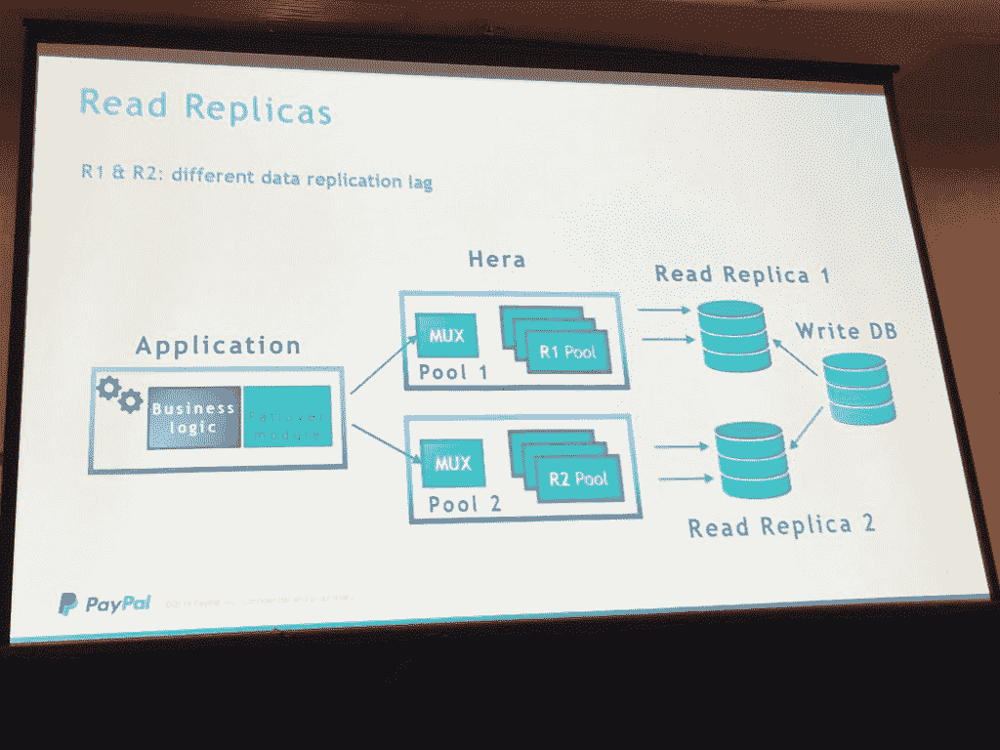
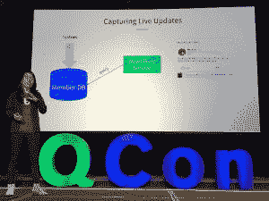
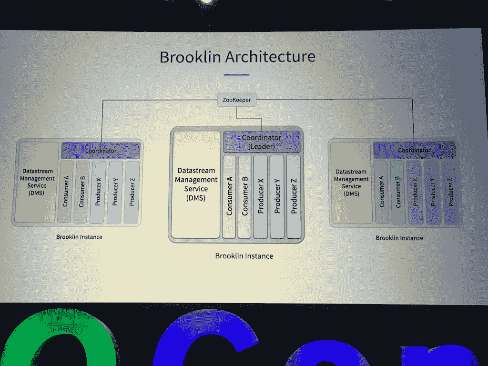

# LinkedIn 和 PayPal 如何通过自制开源软件战胜数据库滞后

> 原文：<https://thenewstack.io/how-linkedin-paypal-each-beat-database-lag-with-home-built-open-source/>

在上个月的 QCon New York 上， [PayPal](https://www.paypal.com/us/home) 和 [LinkedIn](https://www.linkedin.com) 各自发布了旨在加速和简化数据传输的新软件项目。两者都是内部设计的，以更好地管理每个互联网服务获得的大量数据和交易，两者都以开源包的形式发布。

PayPal 最近开源发布的 Hera 是一个专门为微服务池化和管理数据库连接而构建的数据库代理。LinkedIn 的 Brooklin 是该公司计划不久后作为开源软件发布的，它是该公司的中央数据总线，将许多后端数据库和数据存储与面向用户的应用程序连接起来。

希望简化和加速后端数据源和面向用户的应用程序之间的数据移动的组织应该检查这两个项目。

## 嘿赫拉

贝宝员工工程师彼得里卡·沃伊库(左)和肯尼斯·康。

在线支付公司 Paypal 严重依赖数据库:目前，该公司有 2000 个数据库实例，共存储 74PB 数据，最繁忙的数据库每小时处理近 10 亿次呼叫。与任何在线服务一样，响应时间至关重要，其中最大的问题是数据库连接时间，每次连接时间可达 100 毫秒。更糟糕的是，每个数据库实例一次可以处理的连接数是固定的。数据库实例的连接数越多，其性能就越差。

一种可能的性能平滑方法是建立一个连接池，它对多个微服务的请求进行处理和排队。根据 PayPal 员工工程师[佩特里卡·沃伊库](https://www.linkedin.com/in/voicu/)和[肯尼斯·康](https://www.linkedin.com/in/ksykang/)的介绍，这就是 PayPal 的 Hera 所做的，位于微服务和数据库之间，汇集连接，并提供额外的服务。

Hera 已经在生产环境中运行了一年，并且位于数百个数据库实例的前面。

Hera 管理读和写。它选择一个特定的节点来发送所有的写入，从而减少了大量的来回握手，从而加快了所有其他实例的流量，这些实例可以专注于完成读取请求。虽然应用程序本身不需要修改，但是需要一些额外的功能来与 Hera 通信，以指定要与哪些数据库碎片通信。于是团队为 C++、Java、Python、Node.js 和 Go 调用创建了库。

Hera 还带有一些内置的弹性和恢复保护措施:当一个节点断开时，它可以平衡其余节点之间的连接。在过载时，它会立即终止 SSL 连接，因此应用程序可以立即启动到故障模式，而不会在没有清晰的数据路径时让用户挂起。它还提供了迁移功能，即使在事务仍在处理的情况下，也能方便地将数据库碎片从一个节点安全地迁移到另一个节点。

Hera 的代码[可以在 GitHub](https://github.com/paypal/Hera) 上获得。

【T2

## 不到布鲁克林不睡觉

LinkedIn 对数据流延迟也不陌生:八年前，这家社交媒体巨头开源发布了 Kafka，这是一个流媒体数据平台，作为创建数据流的集中式发布-订阅机制。现在，该公司负责管道集团的领英工程经理[龚婉慈](https://www.linkedin.com/in/celiakkung/)说，该公司的一个新项目 Brooklin 是关于将多个数据源连接到多个目的地。

Brooklin 解决了当数据来自多个来源时，如何将数据流传输到多个终端节点的难题。今天，LinkedIn 使用 Brooklin 来支持 200 多个应用程序。光是卡夫卡，它每天就要传递超过 2 万亿条信息，涵盖数万个主题。这些功能可以由开发人员单独配置并动态部署，无需手动更改配置文件或手动部署到群集。

首先说一下这个名字:布鲁克林并不是以纽约区命名的。相反，它是两个词的聚合:“brook”(像小溪)和一个缩写的“LinkedIn”。该软件就像一条缓缓流动的数据小溪，为近乎实时的应用程序提供来自后端数据库的素材。例如，LinkedIn 用户会自动在自己的日程表上看到他们联系的人获得新工作或晋升的时间。Brooklin 将这些数据从后端数据库转移到产生每个用户时间表的应用程序中。

虽然最初 LinkedIn 将其大部分用户数据存储在 Oracle 中，但此后它采用了更广泛的数据存储系统，特别是自 2006 年微软收购 LinkedIn 以来。现在，用户和运营数据在 Kafka、MySQL、微软 Event Hubs、该公司自己的 [Espresso 数据存储](https://engineering.linkedin.com/espresso/introducing-espresso-linkedins-hot-new-distributed-document-store)和亚马逊 Kinesis 等平台上被捕获。最初，Kung 的团队创建了一个数据总线来捕获 Oracle 数据库中的任何更改，但该代码特定于这一个连接。他们希望构建一种数据总线，既能从多个来源接收数据，又能被多个接近实时的应用程序使用。

LinkedIn 将 Brooklin 用于各种用例，包括变更数据捕获(将数据库中的变更传播到应用程序)，消除针对数据源本身运行查询的开销。Brooklin 还可以刷新缓存并建立搜索索引。它可以作为一个流桥，将数据从一个数据源转移到另一个数据源，比如从 AWS 转移到 Microsoft Azure。它还可以用于对数据进行重新分区。它可以用于建立数据仓库，通过将数据传输到 Hadoop 文件系统(HDFS)来消除对提取、转换和加载(ETL)工具的需求。

<svg xmlns:xlink="http://www.w3.org/1999/xlink" viewBox="0 0 68 31" version="1.1"><title>Group</title> <desc>Created with Sketch.</desc></svg>