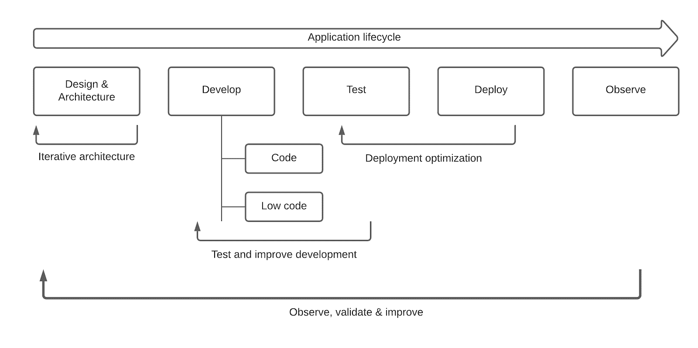
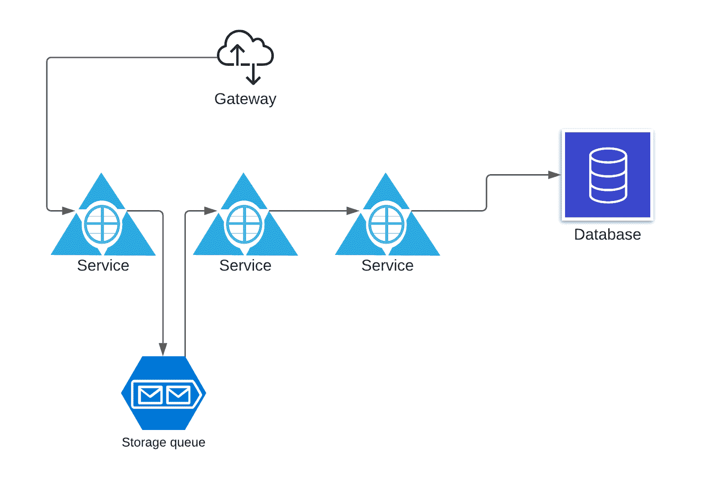
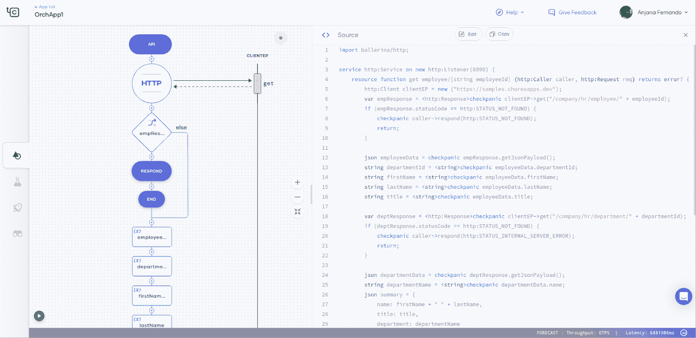
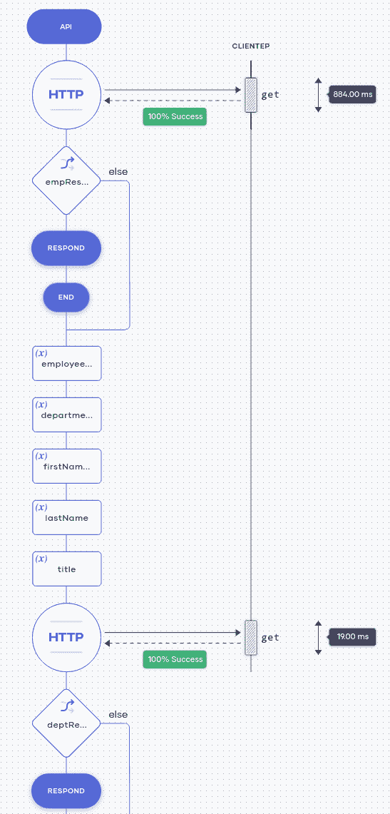

# 低代码如何帮助企业软件开发

> 原文：<https://thenewstack.io/how-low-code-can-help-enterprise-software-development/>

安贾纳·费尔南多

安贾纳是 WSO2 的开发者关系总监。他在 WSO2 领导了多种产品，积累了数据分析和企业集成方面的专业知识。他的最新项目是他在芭蕾舞演员项目中的角色，在那里他广泛参与了该语言及其运行时的设计和实现。他现在主要致力于生态系统工程和布道活动。

始于疫情的我们生活和工作方式的转变，为许多组织带来了跨云本地和分布式环境扩展运营的更大推动力。为了生存和发展，公司现在必须认真考虑云原生技术，如 API 管理和集成解决方案、云原生产品、集成平台即服务(iPaaS)产品以及易于使用、加快上市时间并实现重用和共享的低代码平台。

在本文中，我们将探讨在整个应用程序开发生命周期中，低代码开发平台如何交付增强的数字体验。

现代应用程序共享许多关键需求，例如身份验证/授权、日志记录、通知、监控和部署选项。随着这些应用程序的广泛使用和部署，确保可伸缩性和可用性也变得同等重要。

过去，大多数以技术为中心的公司从零开始实现这些应用程序需求，因为他们通常拥有这样做的技术专长和知识。问题是，今天的许多企业并不具备所有的技能和资源。数据显示，许多数字化转型项目因云复杂性、不可管理的基础架构占用空间和缺乏 IT 系统灵活性而失败。

举例来说，美国劳工统计局(U.S. Bureau of Labor Statistics)预计，从 2019 年到 2029 年，软件开发人员的就业率将增长 22%，远高于所有其他职业的平均水平。更令人担忧的是，该局预计 2021 年[将短缺 140 万名开发者](https://ncube.com/blog/software-engineer-shortage)。麦肯锡&公司 2018 年的一份报告发现，尽管 80%的企业已经尝试了数字化转型项目，[不到三分之一的](https://mck.co/2RF1Xna)企业成功提升了公司业绩。另一份报告，Standish Group 的 [2019 混沌报告](https://bit.ly/2z88651)发现，84%的技术项目部分或完全失败。

因此，显然需要让更多的人参与进来，并简化应用程序开发。

## 回车，低位码

云计算提供了一种全新的软件开发方法，其中一些常见的功能作为服务提供。这些系统都经过了良好的测试，可扩展且随时可用。这使得开发人员可以专注于业务问题，让其他服务处理系统的所有其他复杂问题，从而使应用程序可靠地运行。

最终，所需的应用程序代码可能只是现有服务的集合。开发人员可以将它们组合在一起，为用户提供所需的体验。这就是低代码软件开发所承诺的。

低代码平台增强了业务领域和技术专家之间的协作，他们都可以帮助创建应用程序。传统开发人员可以处理核心编码需求。其他高级工作流可以由领域专家建模和实现，他们可以使用图形形式来定义数据流和流程。

因此，对低代码开发的需求是真实的。然而，在过去，开发人员远离这种类型的开发，因为存在一些限制，如主要关注基于配置的特定领域语言(DSL)，与基于代码的方法相比，表达某些场景的选项有限，没有适当的 CI/CD 支持，缺乏调试和供应商锁定。

为了克服这些，我们提出了一个低代码软件开发生命周期，它将涵盖所有这些问题，并提供与传统的代码优先实践相同的功能，同时在低代码环境中提供更高的灵活性。这被分解为应用程序生产的以下阶段。

理想的低代码软件开发生命周期和平台应该解决这些问题，并提供与传统的代码优先方法相同的功能，同时在低代码环境中提供更高的灵活性。下面看这样一个命题。

图 1:低代码应用程序开发生命周期

上图显示了低代码开发生命周期的每个阶段是如何相互关联的。流程的主题是迭代开发。有一些特定的阶段或阶段的集合被反复使用，直到最终确定。

让我们深入细节。

## 设计和建筑

这是我们开发生命周期的第一步。在这里，我们收集了所有的系统需求，并提出了一个高级解决方案架构。通常，这一阶段由解决方案架构师完成，他们将绘制 L0 和 L1 架构图，以提供高级组件的详细信息。下面列出了其中的一些组件:

*   API 网关
*   服务
*   数据库服务器
*   消息队列

图 2:应用解决方案架构图

在我们的环境中，这一步的主要好处是，它与我们将在其中开发应用程序的低代码开发环境直接相关。它不再是开发人员稍后阅读的单独文档。相反，这被整合到每个人都参与的相同体验中。该解决方案架构在系统的其他方面被重用，例如定义系统的缩放需求、组件之间的通信链接以及定义可观测性需求。这些以声明的方式直接记录在我们的低代码平台中，它们实际上成为最终部署中的功能特性。

## 发展

在开发阶段，我们基本上从以前的设计和架构视图向下钻取，以进一步定义其组件。在典型的服务或 API 中，这将定义其功能或业务逻辑。应该为用户提供一个图形环境来定义它的执行流程。

图 3:低代码开发流程——图形化+代码

为了便于实现场景和选择开发人员的类型，我们应该对正在开发的逻辑有两个视图:代码和底层代码模式。低代码模式是大多数开发人员定义执行流程的地方。开发人员将看到一组连接器、操作和其他动作，如数据映射和验证。

低代码开发人员将能够使用图形化建模方法处理大部分业务逻辑。但是，在某些情况下，某些逻辑可以更容易地用直接代码来表达。这就是我们需要对正在实现的逻辑有一个直接的代码视图的地方。这样，我们可以快速切换到代码视图，并创建一个自定义函数来实现所需的行为。通过这样做，我们得到了两个世界的优点，并且由于图形模型和它的代码表示之间的无缝映射，没有任何一种方法的缺点。

在开发阶段，使用人工智能(AI)可以使某些活动对用户来说更加直观。诸如数据映射和流活动建议的方面可以通过使用历史使用数据和系统中动作的接口和输出的其他知识使用 AI 来完成。

## 试验

测试阶段与开发阶段密切相关。在这里，所有的执行流都使用单元和集成测试进行测试。系统应该提供集成的特性，以便根据前一阶段开发的服务和 API 自动生成测试场景。它应该允许创建测试计划来按顺序执行某些场景，并定义每个执行流之间的依赖关系。

测试将随着流程实现的每一个变化而持续执行，并在持续集成规则中定义。开发和测试阶段将一起经历一个迭代过程，直到代码流最终确定。

## 部署

在部署阶段，用户应该能够选择部署应用程序的部署环境。这可以是 AWS、Azure 或 Google Cloud 等云提供商，也可以是您自己的数据中心内的本地位置。混合云环境非常重要，因为由于安全和法规限制，并非所有企业都愿意将其所有应用程序托管在云中。

在选择了部署提供者之后，用户应该注意底层的细节，比如它是否使用 Kubernetes，它的配置是什么，或者是否使用了无服务器平台。详细信息还应该为自动伸缩、高可用性和服务发现等功能提供简单的配置。

在这个阶段，持续部署策略也应该是可配置的。可能的情况是，在执行流程中的每个变更之后，在测试被执行之后，一个新的部署版本将被部署到生产中。或者，我们可以使用另一个中间沙盒或生产前环境来手动测试更改，并将环境升级到生产环境。

测试和部署阶段迭代执行，直到我们优化部署参数，以确保一切都以最佳方式工作。

## 观察

该平台的可观察性特性使开发人员能够在应用程序部署后监控其行为。在我们这里定义的生命周期阶段中，这可以在多个级别上完成，首先是在设计和架构级别，以提供协同工作的组件的系统级视图。它可以提供诸如服务可用性、正常运行时间、请求/响应统计和错误率等信息。

图 4:低代码应用程序流的可观察性

然后，我们可以深入单个组件，以更好地了解实现的流程。低代码视图为此提供了一个自然的视图，在这里我们可以覆盖用户定义的流，以提供请求或事务级别的信息，如跟踪细节，或者流中每个操作的聚合信息，如成功率和平均执行时间。

从高级部署视图深入到流程中每个操作的能力为我们提供了调试、优化性能和实施系统预测性维护的强大功能。

## 结束语

各行各业的组织都不得不加快数字化转型的步伐，不仅要简化运营、提高运营效率，还要应对需求的大幅波动并提供增强的数字化体验。

在这篇文章中，我们讨论了每个组织成为数字化企业的必要性，以及我们在当前时代为实现这一目标所面临的挑战。基于低代码的开发策略以及合适的开发生命周期对于满足这些需求至关重要。

理想的产品应该带有低代码和代码混合开发环境，其中平台的图形建模生成干净的代码，并且更改是双向的，没有任何额外的代码级注释或额外的配置。它还应该支持混合云，没有供应商限制，如果需要，它的执行流代码可以在您自己的本地环境中独立编译和运行。

*如果您想了解关于 IPaaS 解决方案的更多细节，并希望看到一个实际的解决方案，请访问 [Choreo](https://wso2.com/choreo) ，这是一个低代码、云原生工程的综合平台。*

<svg xmlns:xlink="http://www.w3.org/1999/xlink" viewBox="0 0 68 31" version="1.1"><title>Group</title> <desc>Created with Sketch.</desc></svg>