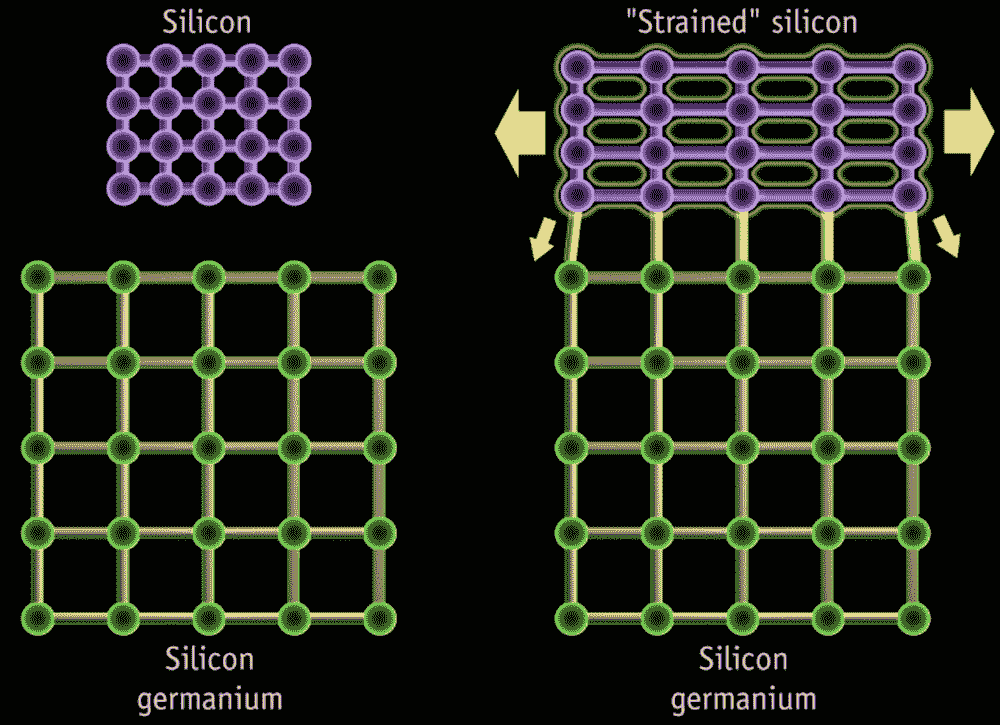

# 机器学习如何微调新材料

> 原文：<https://thenewstack.io/how-machine-learning-could-fine-tune-new-materials/>

随着各种先进技术的出现，对更高计算能力的需求越来越大，无论是[无人驾驶汽车](https://thenewstack.io/deep-learning-algorithm-helps-driverless-cars-recognize-pedestrians-better/)、[智能无人机群](https://thenewstack.io/deep-learning-drone-detects-fights-bombs-shootings-in-crowds/)，还是深度学习在[医学](https://thenewstack.io/deep-learning-ai-detects-rare-genetic-disorders-by-scanning-faces/)、[机器人](https://thenewstack.io/robot-can-visualize-immediate-future-deep-learning/)，甚至是[读心术](https://thenewstack.io/mind-reading-ai-optimizes-images-reconstructed-brain-waves/)。为了帮助满足这种需求，专家们提出了创新，如光子处理器和神经形态计算系统。

但是，除了这些诱人的替代品，还有可能优化处理器使用的半导体材料，以最大限度地提高计算能力，甚至创造全新的、非典型的属性，例如改变这些材料导热、导电或透光的方式，以提高处理器的性能。现在，来自麻省理工学院(MIT)、俄罗斯斯科尔科沃科技学院(Skolkovo Institute of Science and Technology)和新加坡南洋理工大学(Nanyang Technological University)的一组研究人员正在展示，通过使用人工智能来帮助预测和控制这些小规模的修改，将半导体材料推向极限确实是可能的。

在最近发表在《美国国家科学院院刊》上的一篇论文中，该团队详细介绍了他们在开发他们所谓的“深度弹性应变工程”方面的工作[应变工程](https://en.wikipedia.org/wiki/Strain_engineering)并不是什么新鲜事，因为市场上现有的处理器已经使用了某种应变工程材料，例如[应变硅](https://en.wikipedia.org/wiki/Strained_silicon)，制造商为了增强处理能力而故意将其变形。例如，在分子水平上，即使是硅结构的微小变化也会将处理能力提高 50%，因为这种偏离将有助于电子更快地流动。

## 用人工智能进行微调

但是，对于人类专家来说，确定弯曲这种材料的最佳方向可能是一个耗时的过程——考虑到应变可以施加在至少六个不同的方向上，并且在该范围内，许多不同的可能角度——导致数亿次潜在的计算需要梳理。

这就是为什么该团队对人工智能的使用将提供一种有用的替代方法，这种方法将大大简化这一过程，提供一种更有效和更准确的方法来确定精确的应变量和理想的物理配置，从而减少所需的复杂计算的数量。该团队认为，像这样的工具可以帮助专家发现新的方法来“调整”现有材料，以用于微电子学、光电子学、光子学和能源技术的未来创新。

“这项工作说明了如何将材料物理、人工智能、计算和机器学习等看似遥远的领域的最新进展结合在一起，以推进对行业应用有重大影响的科学知识，”[指出](http://news.mit.edu/2019/artificial-intelligence-engineer-microchips-0211)南洋理工大学教授兼论文合著者 Subra Suresh。

## 注意带隙

特别是，研究人员专注于使用人工智能来研究应变如何影响[带隙](https://en.wikipedia.org/wiki/Band_gap)——半导体的一种电子属性，指的是围绕原子的电子“带”之间的能量差异。在半导体和绝缘体中，这些带由带隙分隔，较大的带隙产生绝缘材料，较小或没有带隙产生导电材料，而在[半金属](https://en.wikipedia.org/wiki/Semimetals "Semimetals")中，带重叠。因此，通过使用他们的深度神经网络算法专注于这些带隙可能如何形成，可以改变和微调材料的内在特性，而没有其他选择可能出现的负面副作用(例如使用静电场、化学物质或添加微量的其他原子，称为[掺杂剂](https://en.wikipedia.org/wiki/Dopant))。

该小组的工作表明，未来的商业微芯片可以包含应变高达 10%的半导体材料，而没有破裂的危险。此外，这种新方法也可能意味着像钻石这样通常不适合的材料有朝一日可能会被最佳地过滤，然后用于制造超快速处理器。

该团队指出，他们的人工智能辅助深度弹性应变工程技术也可能适用于其他研究领域。“这种新方法可能会导致前所未有的材料特性的设计，”麻省理工学院核科学与工程教授兼论文合著者居里说。“但还需要做更多的工作，才能找出如何施加压力，以及如何扩大工艺规模，在一个芯片上的 1 亿个晶体管上做到这一点(并确保没有一个晶体管出现故障)。”

图片:[劳拉·奥克](https://unsplash.com/photos/pGVr8YRtQ80?utm_source=unsplash&utm_medium=referral&utm_content=creditCopyText)在[Unsplash](https://unsplash.com/search/photos/microchip?utm_source=unsplash&utm_medium=referral&utm_content=creditCopyText)；[维基百科](https://en.wikipedia.org/wiki/Strained_silicon)

<svg xmlns:xlink="http://www.w3.org/1999/xlink" viewBox="0 0 68 31" version="1.1"><title>Group</title> <desc>Created with Sketch.</desc></svg>