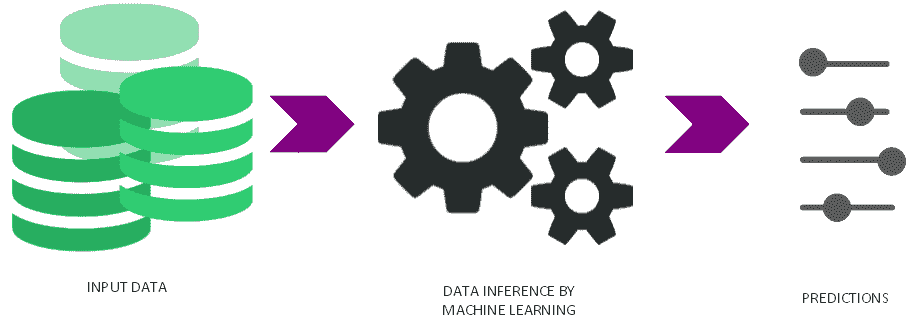

# 机器学习如何工作:概述

> 原文：<https://thenewstack.io/how-machine-learning-works-an-overview/>

假设我们想购买市场上最好的网络摄像机。在现实生活中，我们遵循的流程是查看几条描述我们考虑购买的型号质量的产品评论。例如，如果我们看到评论主要由“好”、“很好”、“非常好”等词语组成。然后我们会得出结论，网络摄像头是一个好产品，我们可以继续购买它。然而，如果像“不好”、“质量不好”、“分辨率差”这样的词，那么我们得出的结论是，最好再找一个网络摄像头。所以你看，这些评论帮助我们根据产品评论中的词汇“模式”做出“决定性的行动”。

因此，购买网络摄像头并撰写产品评论的买家之间的关系将影响其他买家，而他们的*产品评论反过来将影响未来的购买。因此，在已经购买产品的人和产品的未来购买者之间存在一种模式。*

机器学习试图将这种人类决策过程编码到算法中。

机器学习过程

## 考虑

从示例继续，让我们看看在将机器学习应用于问题之前必须满足的条件。

*   输入数据中必须存在有助于得出结论的模式。例如，如果我们认为产品评论是随机的，没有任何意义，那么使用它们很难做出决定。要解决机器学习的问题，机器学习算法必须有一个模式可以从中进行推断。
*   必须存在大量的数据(例子、样本)来将机器学习应用于问题。如果没有关于网络摄像头的产品评论，将很难做出是否购买该产品的决定。
*   我们很难用一个数学表达式来描述问题的行为。因此，机器学习被用来从数据中获得意义，并执行“结构化学习”以达到描述问题行为的数学近似。

因此，如果不满足上述三个条件，通过结构化推理学习将机器学习应用于问题将是徒劳的。但是如果我们满足了以上三个条件，那么我们就可以继续了。

## 机器学习组件

现在，让我们基于上面的产品购买问题来看看机器学习的一些组件。产品评论是机器学习算法的数据。有输出或决定是否值得购买的网络摄像头的基础上的评论。然后是由机器学习算法执行的结构化学习组件，以理解输入数据的模式，从而给出输出。

机器学习制定的表达式被称为“映射函数”，并用于学习“目标函数”机器学习算法形式化了将输入数据映射到输出的表达式。在我们的例子中，一个好的评论将帮助映射(或对应)到输出，“购买网络摄像头”，而一个坏的评论将映射到输出，“不要购买网络摄像头。”

目标函数对我们来说总是未知的，因为我们无法用数学方法确定它。这就是机器学习的魔力所在，通过逼近目标函数。

## 机器学习如何学习目标函数

因此，机器学习执行学习任务，当它被给定输入样本的新示例(x)时，它被用于对未来(Y)进行预测。

Y = f(x)

如你所见，我们不知道目标函数的任何性质，它的形式是什么？线性的，非线性的？所以我们用机器学习，通过学习例子(x)来近似这个函数。如果我们知道 *f* 的性质，那么就没有必要从数据中学习和使用机器学习。相反，我们可以通过解方程直接使用目标函数。但是在产品评论的例子中，目标函数的行为不能用等式来描述，因此机器学习被用来导出这个目标函数的近似。目标函数试图通过将每种产品评论输入映射到输出来捕获产品评论的表示。

为此，机器学习算法考虑关于目标函数的某些假设，并以一个假设开始目标函数的估计。因为目标函数是未知的，所以假设可能随时变化。因此，为了达到更好地逼近目标函数的更好的函数，进行假设的一些迭代以估计最佳输出。因此，该假设有助于机器学习算法在更短的时间内达到目标函数的更好近似，而不是让机器学习算法本身通过尝试无休止的计算来找出整个事情。这将需要很长时间才能做出预测。

## 摘要

因此，所有机器学习算法的目标是估计一个预测模型，该模型最好地概括特定类型的数据。因此，为了通过机器学习来解决问题，必须有大量的示例，这些示例可以被学习算法用来理解系统的行为，并且当机器学习算法被呈现新的数据示例时，系统可以生成类似的预测。虽然学习任务并不容易，但随着对机器学习的不同组件以及它们如何相互交互的更好理解，事情会变得更清楚。在随后的帖子中，我们将看看机器学习算法如何用于解决现实世界的问题。

<svg xmlns:xlink="http://www.w3.org/1999/xlink" viewBox="0 0 68 31" version="1.1"><title>Group</title> <desc>Created with Sketch.</desc></svg>