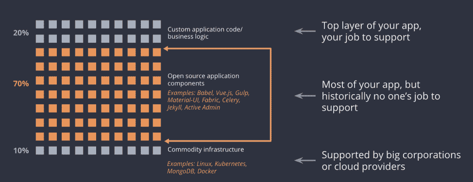
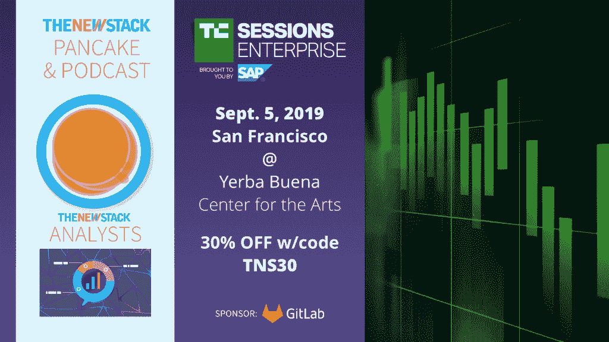

# 托管开源如何提高开发人员的工作效率并节省资金

> 原文：<https://thenewstack.io/how-managed-open-source-boosts-developer-productivity-and-saves-money/>

作为 TNS 赞助计划的一部分，Tidelift 赞助了这篇文章。

 [唐纳德·菲舍尔

唐纳德·费舍尔是 Tidelift 的联合创始人兼首席执行官。此前，他是 Red Hat 的产品经理和高管，也是十几家开源创业公司的投资者和董事会成员。](https://www.linkedin.com/in/donaldfischer/) 

开源已经成为现代应用开发平台。纵观各行各业，[如今超过 90%的专业应用程序](https://blog.tidelift.com/open-source-is-everywhere-survey-results-part-1)都是使用开源代码创建的。然而，许多这些开源组件是由个人或独立的、社区领导的组织维护的，而不是公司。Babel 编译器、Vue.js 框架、gulp 流构建系统、Active Admin 框架和漂亮的 Soup Python 库只是现代应用程序中广泛使用的数千个单独维护的组件中的几个例子。

虽然这些开源组件对企业应用程序开发至关重要，但没有报酬的社区维护者通常没有时间或动力来更新它们，应用安全补丁，并像企业用户希望的那样快速解决许可问题。数量惊人的开源软件包——根据某些标准在 10%到 20%之间— [完全没有人维护它们。这些并不是晦涩难懂的组件——例如，在样板文件 React、Angular 和 Vue 应用程序中，大约有 20%的依赖项无人维护。](https://blog.tidelift.com/up-to-20-percent-of-your-application-dependencies-may-be-unmaintained)

## 那么是谁**在让**保持这段代码健康呢？

可悲的事实是，今天大多数开发团队自己管理他们的开源依赖。如果您是一名使用开源组件的开发人员，您可能至少知道其中一些耗时的任务:

*   适应更新的依赖关系中的错误或中断更改。
*   迁移到框架或库的新的主要版本。
*   处理与未维护的依赖项相关的错误、安全或许可问题。
*   处理因缺少维护人员或维护人员反应迟钝而导致的问题。

这些问题是持续的时间拖延和不受欢迎的开发人员资源转移。开发人员没有花时间和精力编写有益于业务的原始代码，而是花时间争论开源组件。事实上，我们基于 2019 年[专业开源调查](https://blog.tidelift.com/developers-spend-30-of-their-time-on-code-maintenance-our-latest-survey-results-part-3)结果的研究表明，开发人员花在代码维护上的时间有整整四分之一与维护开源依赖相关——对于最大的开发团队来说，这一比例甚至更高。

## 外包复杂性:一个非常正常的想法

移交对公司堆栈中复杂的、不断变化的、无差异的部分的管理是软件领域由来已久的传统。毕竟，就在不久前，开发人员和基础设施工程师还主导着他们自己的数据中心。

回想一下云计算出现之前的时代，启动一个 SaaS 应用程序意味着在一个互联网商店附近的 colo 设施中租用空间，购买和安装服务器和网络设备，并配置所有的软件。当出现问题时，团队可能会首先尝试带外管理。如果失败了，他们会让一个不幸的人登上飞机，更换有故障的齿轮，然后重新安装和重新配置软件。

云提供商让事情变得无比简单。对开发人员业务的竞争推动了供应速度和功能的不断改进。这意味着应用程序开发人员可以专注于开发应用程序，而不是摆弄虚拟机、IO、互连和所有其他必要但无差异化的基础设施。

**这提出了一个问题:为什么我们仍然自己管理我们的开源依赖？**

## 实施受管理的开源战略

幸运的是，如今构建和维护应用的方式正在发生变革。正如云计算颠覆了公司处理应用程序托管的方式——通过将它交给云托管提供商——开发团队现在可以将他们的应用程序所依赖的开源组件的维护外包给专家，以更低的成本获得更好的结果。

这种努力被称为“管理开源”。正如托管云服务为共享 IT 基础设施的使用提供运营支持一样，托管开源也为通常用于构建应用程序的开源软件组件提供支持。

受管理的开源策略可以给大多数现代应用程序的“中间部分”带来同样的便利和秩序——70%的企业应用程序由开源组件组成。

大多数应用程序都是建立在 70%或更多开源代码的基础之上的。

## 它是如何工作的？

成功的托管开源战略的关键是找到合适的人来处理以前没有企业级产品支持的广泛的中间代码。在 Tidelift，我们发现最适合做这项工作的人是创建和维护项目的人——开源维护者自己。

我们对托管开源的态度是与独立的开源维护者合作，使他们能够通过与 Tidelift 合作获得直接收入，以确保他们监管的项目有统一的维护、安全和许可相关标准。我们的托管开源订阅涵盖了 1，000 多个最受欢迎的开源项目，包括 JavaScript、Ruby、Java、Python 等。NET 和其他常见的生态系统，每天都在增加。

[https://www.youtube.com/embed/pHogRODFge8?start=3&feature=oembed](https://www.youtube.com/embed/pHogRODFge8?start=3&feature=oembed)

视频

受管理的开源策略的美妙之处在于，当维护工作以标准的方式组织起来时，输出看起来就像你可能从商业软件提供商那里得到的一样。你得到明确、可靠的承诺，你正在使用的开源软件将会得到良好的维护，无论是现在还是将来。这有助于确保构建在这些开源组件之上的所有应用程序的代码健康。

公司不再需要在承担维护他们使用的所有开源软件的成本和承担没有验证的低效率和风险之间做出选择。正如云计算颠覆了企业处理应用程序托管的方式，他们现在可以将开源管理外包给专家。

转向受管理的开源方法允许开发团队致力于增加收入的新特性，而不是花费时间争论开源依赖。随着时间的推移，一个向维护者的贡献支付报酬以换取提供有价值的共享服务的托管开源策略会让开源更好地为每个人服务。

【T2

通过 Pixabay 的特征图像。

<svg xmlns:xlink="http://www.w3.org/1999/xlink" viewBox="0 0 68 31" version="1.1"><title>Group</title> <desc>Created with Sketch.</desc></svg>