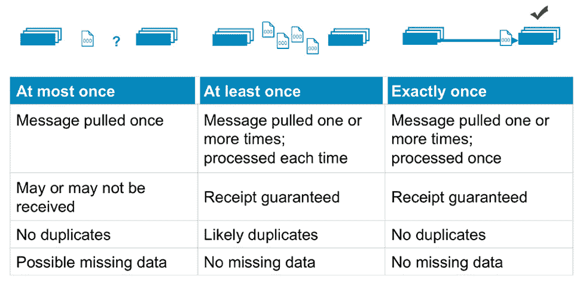
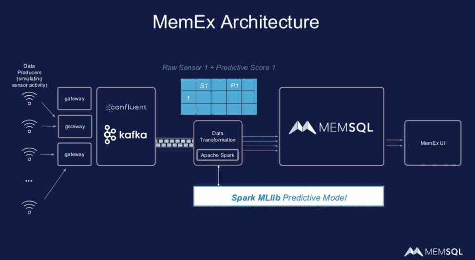

# MemSQL 如何使用 Apache Kafka 实现一次语义

> 原文：<https://thenewstack.io/how-memsql-enables-exactly-once-semantics-with-apache-kafka/>

MemSQL 是新堆栈的赞助商。

 [弗洛伊德·史密斯

负责 SingleStore 集客营销的策略和执行，包括 SingleStore 公司博客、电子书和网络研讨会博客帖子。分析和报告多渠道的成功推广。为营销团队的目标和实施做出贡献，包括需求挖掘、社交媒体互动和 SEO。策略、非小说写作和编辑专家。](https://www.memsql.com/) 

阿帕奇卡夫卡用法越来越普遍。随着公司处理的数据量激增，以及对数据的需求持续增长，Kafka 发挥了重要作用。由于几个关键属性，这包括将其用作标准化的消息传递总线。

Kafka 最重要的属性之一是它支持恰好一次语义的能力。使用恰好一次语义，您可以避免在传输过程中丢失数据，但也可以避免多次接收相同的数据。这避免了诸如重新发送旧的数据库更新覆盖第一次成功处理的较新的更新之类的问题。

然而，因为 Kafka 是用来传递信息的，它无法独自遵守一次到底的承诺。数据流中的其他组件必须协作——例如，如果一个数据存储多次进行相同的更新，这将违反 Kafka 流作为一个整体只更新一次的承诺。

## MemSQL 如何与 Kafka 一起工作

在 [MemSQL](https://www.memsql.com) ，我们开发快速、可扩展的关系数据库软件，并提供 SQL 支持。MemSQL 可以在容器、虚拟机和多个云中工作——在任何可以运行 Linux 的地方。

如果你不熟悉的话，这种相对新颖的属性组合——以前只有 NoSQL 才有的[可伸缩性，以及关系型 SQL 数据库的功能、兼容性和可用性——使 MemSQL 与亚马逊 Aurora、谷歌 Spanner 等一起，成为了](https://www.memsql.com/blog/why-nosql-databases-wrong-tool-for-modern-application/)[NewSQL](https://en.wikipedia.org/wiki/NewSQL)运动中的领军人物。将可扩展性能、ACID 保证和 SQL 数据访问相结合的能力适用于人们想要存储、更新和分析数据的任何地方，从古老的内部事务数据库到在微服务架构中运行的短暂工作负载。

当然，我们认为 NewSQL 很重要。NewSQL 允许数据库用户将 NoSQL 的主要优点(跨行业标准服务器的可伸缩性)和传统关系数据库的许多优点(可以概括为模式(结构)和 SQL 支持)结合起来。

作为 NewSQL 的忠实拥护者，Apache Kafka 是我们最喜欢的东西之一。一个主要原因是 Kafka 和 MemSQL 一样，支持恰好一次语义。事实上，卡夫卡在这方面有些名气，正如我最喜欢的新堆栈标题所示: [Apache Kafka 1.0 恰好发布了一次。](https://thenewstack.io/apache-kafka-1-0-released-exactly/)

## 到底是什么-一次？

简单地说，这是处理流事件或数据库更新的三种方法之一:

*   最多一次。这就是事件处理的“一发而不可收拾”。发起者将一个事件放在网络上，或者将一个更新发送到一个数据库，并且不检查它是否被接收。一些价值较低的物联网流以这种方式工作，因为更新量非常大，或者可能是不会被错过的类型。(不过，如果更新完全停止，您会想要一个警报。)
*   至少一次。这是检查一个事件是否着陆，但不确保它没有多次着陆。发起方发送一个事件，等待确认，如果没有收到确认，则重新发送，重复此过程，直到收到确认。但是，发起者并不检查是否处理了一个或多个未确认的事件，以及终止发送尝试的最终确认事件。(想想多次向一个数据库中添加相同的记录；在某些情况下，这将导致问题，在其他情况下，它不会。)
*   没错-就一次。这是检查一个事件是否登陆，如果没有，冻结和回滚系统。然后，它将重新发送并重复，直到事件被接受和确认。如果一个事件没有成功，那么流中的所有操作符都会停止并回滚到“已知良好”的状态。然后，重新开始处理。重复这个循环，直到错误事件被成功处理。



当连接到正确的消息代理时，MemSQL 管道提供恰好一次的语义。

## MemSQL 如何加入管道

Kafka 中恰好一次语义的可用性为处理流数据的其他参与者(如数据库制作者)提供了一个机会。MemSQL 很早就看到了这一点。MemSQL 管道功能于 2016 年秋季首次推出，作为 [MemSQL 5.5](https://www.memsql.com/blog/pipelines/) 的一部分；你可以在这里看到一段视频[。(在我们的文档中有更多关于管道特性的信息—](https://www.memsql.com/pipelines/) [原始的](https://docs.memsql.com/memsql-pipelines/v5.5/pipelines-overview/)和[更新的](https://docs.memsql.com/memsql-pipelines/v6.7/pipelines-overview/)。我们也有关于[连接管道到 Kafka](https://docs.memsql.com/memsql-pipelines/v6.7/kafka-extractor/) 的具体文档。)

管道的基本功能是通过连接到数据源，在数据流入时处理一些有限的更改，并将其加载到 MemSQL 数据库中，来实现众所周知的 ETL(提取、转换和加载)过程。

从一开始，管道就支持恰好一次语义。当您将具有恰好一次语义的消息代理(如 Kafka)连接到 MemSQL 管道时，我们支持数据库操作的恰好一次语义。

管道的主要特点是速度快。这对于“恰好一次”语义至关重要，因为它包含了一个承诺，即无论何时操作失败，都要备份并重试。

像生活中大多数值得拥有的东西一样，精确一次语义学对那些希望从中受益的人提出了某些要求。让一次性承诺有意义需要两件事:

*   很少有操作失败的。
*   快速运行每个操作，以便在需要时重试不会太长或太耗时。

如果这两个条件都满足，即使发生崩溃，您也可以在没有大量性能开销的情况下获得恰好一次语义的好处。如果这两个条件中的任何一个不满足，成本就会开始超过收益。

MemSQL 5.5 应对了这些挑战，管道功能很受我们客户的欢迎。但是为了帮助人们充分利用它，我们需要拓宽管道。但是，请注意上面的“有限”一词——管道“处理一些有限的数据更改”为了让管道真正取代整个 ETL 过程，我们需要，嗯，加宽管道。

因此，在最近的 MemSQL 6.5 版本中，我们宣布了[到存储过程](https://www.memsql.com/blog/6-5-pipelines/)的管道。这个特性实现了它在 tin 上所说的功能:您可以编写 SQL 代码并将其附加到 MemSQL 管道。添加定制代码极大地扩展了管道的转换能力。

存储过程既可以查询 MemSQL 表，也可以向其中插入数据，这意味着该特性非常强大。然而，为了满足恰好一次语义的需要，它有一些限制。存储过程是特定于 MemSQL 的；不支持第三方库，开发人员在使用存储过程时必须考虑整个系统的吞吐量。

因为 MemSQL 与 SQL 兼容，所以存储过程是用标准 ANSI SQL 编写的。因为 MemSQL 是非常快速的 T2，开发者可以在其中加入很多功能，而不会破坏一次完成的语义。

## 快速灵活

管道性能不仅快；无论是单独使用还是与其他工具一起使用，它都非常灵活。这是因为越来越多的数据处理组件可以支持恰好一次语义。

例如，这里有两种用外部数据丰富流的方法。第一个是创建一个存储过程来完成 MemSQL 中的工作。

以下存储过程使用现有的 MemSQL 表将一批传入的 IP 地址与其位置的现有地理空间数据连接起来:

```
CREATE PROCEDURE proc(batch query(ip varchar,  ...))

AS

BEGIN

     INSERT INTO  t

       SELECT batch.*,  ip_to_point_table.geopoint

       FROM batch

       JOIN ip_to_point_table

       ON ip_prefix(ip)  =  ip_to_point_table.ip;

END

```

(关于你可以用存储过程做什么的更多信息，请参见——等等——我们的[文档](https://docs.memsql.com/concepts/v6.5/procedural-extensions/)，其中也描述了如何[将 SSL 和 Kerberos](https://docs.memsql.com/memsql-pipelines/v6.7/kafka-kerberos-ssl/) 添加到 Kafka 管道中。)

您还可以使用 Apache Spark 处理转换，并且您可以通过支持恰好一次语义的方式来完成转换，如本文[中所述](http://shzhangji.com/blog/2017/07/31/how-to-achieve-exactly-once-semantics-in-spark-streaming/)。(正如作者张继说得很好:“但确切地说，知道如何实现——一次是一个很好的学习机会，而且非常有趣。”)

一旦 Apache Spark 完成了它的工作，就通过管道将结果传输到 MemSQL。(当我们第一次描述使用 Kafka、Spark 和 MemSQL 来为一个模型城市[提供动力时，这些都是不可用的。)](https://www.memsql.com/blog/modeling-the-city-of-the-future-with-kafka-and-spark/)



使用 Kafka、Spark、MemSQL 管道和存储过程，通过一次性语义(MemSQL)实现操作灵活性。

## 你自己试试

你可以自己尝试所有这些，又快又容易。MemSQL 软件现在[可以免费获得](https://www.memsql.com/blog/announcing-memsql-free-tier/)，有社区支持，直到一个相当强大的集群。这允许您免费开发、试验、测试，甚至部署。当您需要更多功能，或者想要专门的支持时，或者如果您想要讨论特定的使用案例，您可以[联系 MemSQL](https://www.memsql.com/contact/) 。

通过 Pixabay 的特征图像。

<svg xmlns:xlink="http://www.w3.org/1999/xlink" viewBox="0 0 68 31" version="1.1"><title>Group</title> <desc>Created with Sketch.</desc></svg>