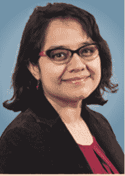

# 男人和女人对待开源的不同方式

> 原文：<https://thenewstack.io/how-men-and-women-approach-open-source-differently/>

[粉碎开源中的包容性缺陷:安妮塔·萨尔马博士分享她的研究](https://thenewstack.simplecast.com/episodes/squashing-inclusivity-bugs-in-open-source-dr-anita-sarma-shares-her-research)

随着开源软件越来越成为求职者的一项要求，求职者发现它对于成为这个社区的一部分至关重要。许多人更愿意看到 GitHub 的简介，而不是简历。

但是目前，只有大约 10%的开源贡献者是女性。

在这一集的 New Stack Makers 播客中，俄勒冈州立大学电子工程和计算机科学系的计算机科学副教授 Anita Sarma 博士和我们一起谈论她最近关于如何在开源中增加性别包容性的研究。

安妮塔·萨尔马博士，俄勒冈州立大学

她最近的研究集中在解决问题的方面，在这些方面，男性和女性在统计上有所不同。在她的研究中，她关注了男性和女性在解决问题上的五种统计差异。

通过理解这些不同的解决问题的方面，正如她所说的，我们可以开始理解如何变得更加包容。  从而产生更好的软件，增加利润。

注意:这些都是粗略的划分，并不是所有的男人和女人都这么容易被划分到这些类别中，所以，并不是所有的男人和女人，但是有足够的统计差异来产生影响。

例如，男性和女性在学习风格上有很大不同。女性倾向于过程导向，循序渐进地学习。他把男人描述为“修补匠”，在这里点击，在那里点击，以一种迂回的方式探索，找到他们想要的东西。

一种风格并不比另一种更好，但是开源应该适应这两种方法。因此，如果大多数开源项目没有关于软件做什么的步骤的文档，以面向过程的方式学习的人将很难对该项目做出贡献。

接下来是萨尔马所说的“信心-能力差距”  女性，总体来说，对工作的信心远不如同级别的男性。  这对开源来说意味着，如果出了问题，更多的女性比男性责怪自己，这往往导致他们退出。

尝试学习技术的女性比男性多，因为这是她们工作的一部分。男人想了解它，因为它很酷。

她研究的最后一个方面是对风险的态度。就像修补匠中男性多于女性一样，他们也不太反对尝试新事物。萨尔马说:“哦，让我试试这个新功能，哦，让我更新这个操作系统，看看会出什么问题。”。更多的女性可能会说，“哦，截止日期快到了，让我做我知道的，即使它不是最新的功能。”

Sarma 不是一个对纯学术研究感兴趣的人，他对一些小事有一些建议，可以用来提高开源项目的包容性。

## 如何让你的项目更具包容性？

萨尔马建议使用 [GenderMag](http://gendermag.org) 方法进行教学，该方法来自[人类互动项目](http://www.humaninteractionlab.com/)。  虽然这些原则不是为开源软件开发的，但是  将这些原则应用到开源项目中，可以使项目的可访问性得到改善。  通过创建一个通常被排除在外的人的角色，并对项目进行认知演练，被排除的领域就会浮出水面。

聆听围绕开源文档的更深入的探讨，为什么预编码贡献是至关重要的，什么是“推-ocracy ”,以及您可以做些什么来使您的项目更具包容性，从而增加其成功的机会。

### 在这个版本中:

[2:55:](https://thenewstack.simplecast.com/episodes/squashing-inclusivity-bugs-in-open-source-dr-anita-sarma-shares-her-research?t=2:55) 认知风格与个体性别间的统计、信息加工、问题解决。
[5:23:](https://thenewstack.simplecast.com/episodes/squashing-inclusivity-bugs-in-open-source-dr-anita-sarma-shares-her-research?t=5:23) 根据其他组织的研究，为什么开源应该更具包容性。
[10:01:](https://thenewstack.simplecast.com/episodes/squashing-inclusivity-bugs-in-open-source-dr-anita-sarma-shares-her-research?t=10:01) 文档、开源和“预编码贡献”
[17:46:](https://thenewstack.simplecast.com/episodes/squashing-inclusivity-bugs-in-open-source-dr-anita-sarma-shares-her-research?t=17:46) 探索 GenderMag 工具，来自人类交互项目。
[21:39:](https://thenewstack.simplecast.com/episodes/squashing-inclusivity-bugs-in-open-source-dr-anita-sarma-shares-her-research?t=21:39) 到底是谁在使用这个工具？
[25:11:](https://thenewstack.simplecast.com/episodes/squashing-inclusivity-bugs-in-open-source-dr-anita-sarma-shares-her-research?t=25:11) 信心对能力。

Raygun 赞助了这个帖子和播客，它们由 New Stack 独立制作。

通过 Pixabay 的特征图像。

<svg xmlns:xlink="http://www.w3.org/1999/xlink" viewBox="0 0 68 31" version="1.1"><title>Group</title> <desc>Created with Sketch.</desc></svg>