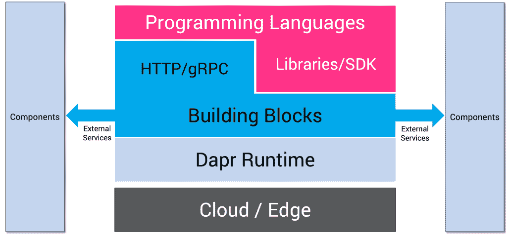
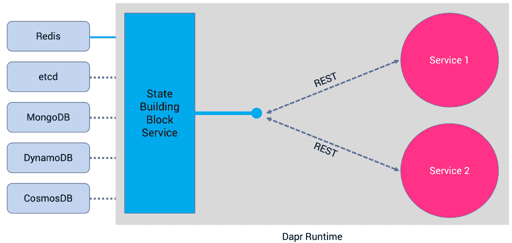

# 微软的 Dapr 如何简化微服务的开发和部署

> 原文：<https://thenewstack.io/how-microsofts-dapr-simplifies-developing-and-deploying-microservices/>

微服务和云原生应用是当季的风味。基于微服务设计模式的现代应用程序带来了一系列挑战。每个服务都必须实现一类数据存储，如关系数据库、键/值数据库、NoSQL 数据库和与功能一致的图形数据库。微服务需要一个健壮的服务发现机制来实现动态连接。为了自治和独立伸缩，它们需要松散耦合。微服务是多语言的，每个服务都用最合适的语言、框架和运行时来实现。

尽管采用诸如 Kubernetes 这样的容器和编排引擎解决了打包、部署和伸缩方面的挑战，但是开发过程仍然很复杂。

去年年底，微软宣布了一种基于[分布式应用运行时](https://dapr.io/) (Dapr)开发现代应用的新方法，这是一种针对微服务和云原生应用的平台和语言无关的运行时。

Dapr 的架构对开发人员来说很有吸引力，尤其是对那些熟悉 COM 或 90 年代的企业 Java Beans (EJB)的人来说。类似于 COM/DCOM 和 EJB 如何为运行在微软 Windows 和 Java 上的分布式应用提供管道，Dapr 完成了容器化、云原生、基于微服务的应用所需的繁重工作。

## 近距离观察 Dapr

Dapr 有三个元素——运行时、服务构建块、本地库和 SDK。

【T2

### Dapr 运行时

Dapr 运行时可以安装在任何可以运行 Docker 引擎的机器上。核心运行时是容器化的，可以部署在运行 Linux、Windows 或 Mac 操作系统的 x86/ARM 处理器上。它可以安装在多节点 Kubernetes 集群或资源受限的边缘设备上，如 Raspberry Pi Zero。唯一的要求是主机环境应该能够运行 Docker。查看 [Dapr 版本](https://github.com/dapr/dapr/releases)中支持的版本和平台。

### Dapr 构建模块

Dapr 使得消费在同一主机上运行的其他微服务、内部或外部数据服务以及基于发布/订阅模式的消息服务变得极其简单。参与者、事件驱动的资源绑定和分布式跟踪是初始版本中可用的其他构件。Dapr 构建块将内部消费者与外部服务分离开来。比如，不用修改一行代码，就可以从使用 Amazon DyanamoDB 切换到 Azure ComosDB。构造块通过标准 REST 或 gRPC 端点公开。

由于 Dapr 使用 sidecar 模式，因此可以很容易地集成运行在 Kubernetes 上的微服务，以利用构建块。当一个 pod 被标注了特定于 Dapr 的标签时，运行时会自动注入 sidecar。在下一节中，我们将进一步了解构建模块。

### 本地库和 SDK

为了让不同语言更自然地使用 Dapr，它还包含了针对 Go、Java、JavaScript、.NET 和 Python。这些 SDK 通过类型化的语言 API 而不是调用标准的 http/gRPC API 来公开 Dapr 构建块中的功能，如保存状态、发布事件或创建参与者。这使得开发人员可以用自己选择的语言编写无状态和有状态函数和角色的组合。当然，SDK 提供的功能也可以通过标准的 REST 和 gRPC 端点获得。

## Dapr 构建模块

Dapr 构建块充当配置为组件的内部/外部服务提供者和内部消费者之间的中间层。由于每个服务消费者总是与一个众所周知的端点对话，Dapr 只是将调用重定向到当前配置的组件。

组件封装了构建块 API 的实现。例如，state 构建块的实现可能包括 Redis、etcd、MongoDB、Amazon DynamoDB 和 Azure CosmosDB。许多组件都是可插拔的，因此一种实现可以很容易地替换成另一种实现。

目前，在 Dapr 的 alpha 版本中，支持以下构建块服务。随着 Dapr 的成熟，这个列表还会增加。

### 服务调用

弹性服务到服务调用支持远程服务上的方法调用，包括重试，无论它们位于受支持的宿主环境中的何处。这类似于流行的服务网格实现的功能，如 Istio 和 Linkerd。

### **国家管理**

通过存储键/值对的状态管理，可以在应用程序中轻松编写长时间运行、高度可用的有状态服务以及无状态服务。状态存储是可插拔的，可以包括 Azure CosmosDB、AWS DynamoDB 或 Redis 等。

### 发布/订阅消息

在服务之间发布事件和订阅主题使事件驱动的架构能够简化水平可伸缩性，并使它们对故障具有弹性。Dapr 提供至少一次消息传递保证。这个构建块抽象了 Redis、RabbitMQ、Azure Service Bus 和 NATS 等服务。

### 事件驱动的资源绑定

带有触发器的资源绑定通过从任何外部资源(如数据库、队列和文件系统)接收和发送事件，扩展了事件驱动的体系结构的规模和弹性。资源绑定提供了一种声明性的机制来发送和接收标准云事件规范中的事件。

### **分布式跟踪**

Dapr 支持分布式跟踪，以便使用 W3C 跟踪上下文标准轻松诊断和观察生产中的服务间调用。由于 Dapr 具有对调用链的可见性，它可以提供对跟踪信息的洞察，这些信息可以以 OpenTelemetry 格式导出。

### 演员

Actors 是有状态和无状态对象的模式，它通过方法和状态封装使并发变得简单。Dapr 在其 actor 运行时提供了许多功能，包括并发性、状态、actor 激活/停用的生命周期管理，以及唤醒 actor 的计时器和提醒。开发人员可以轻松地为运行在 Dapr 之上的微服务实现 actor 模式。

## 摘要

Dapr 为微服务开发带来了一些成熟的技术和最佳实践。它做了 ODBC 和 JDBC 在 20 世纪 90 年代对数据驱动的客户端/服务器应用程序所做的事情，通过一个即插即用的模型来消费现代云原生应用程序所需的最常见的服务。

在 Dapr 系列的下一部分中，我将带您浏览一个使用 Redis 和 etcd 作为后端来处理有状态微服务的教程。敬请关注。

*贾纳基拉姆·MSV 的网络研讨会系列“机器智能和现代基础设施(MI2)”提供了涵盖前沿技术的信息丰富、见解深刻的会议。在 [http://mi2.live](http://mi2.live) 注册即将到来的 MI2 网络研讨会。*

<svg xmlns:xlink="http://www.w3.org/1999/xlink" viewBox="0 0 68 31" version="1.1"><title>Group</title> <desc>Created with Sketch.</desc></svg>