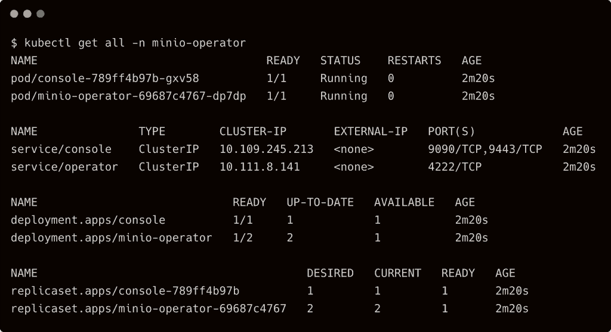

# MinIO 如何为 Kubernetes 带来对象存储服务

> 原文：<https://thenewstack.io/how-minio-brings-object-storage-service-to-kubernetes/>

MinIO 是一个流行的开源对象存储服务，它公开了一个 S3 兼容的端点。它最初是作为一个用 Golang 编写的小二进制文件提供的，在早期，它可以将主机文件系统上的任何目录转变为对象存储端点。最终，它被容器化并支持 Docker 引擎。今年早些时候，MinIO 转变为一个高度可扩展、高性能、云原生、多租户对象存储引擎，与 Kubernetes 紧密集成。

本文将探讨 [MinIO](https://min.io/?utm_content=inline-mention) 如何利用 [Kubernetes](https://thenewstack.io/category/kubernetes/) 以多租户模式提供云原生对象存储服务。

我目前正在使用 MinIO on [Rancher RKE2](https://docs.rke2.io/) 作为 [Nvidia Triton 推理服务器](https://developer.nvidia.com/nvidia-triton-inference-server)的模型注册表。它是 Triton 存储和检索机器学习模型以执行推理的高级用例。在接下来的教程中，我将带您完成在 RKE2 上安装 MinIO 以及配置 Triton 推理服务器以利用 MinIO 作为边缘的模型注册表的步骤。

### MinIO Kubernetes 运营商

MinIO operator 有三个组件—控制面板、CLI 客户端和控制台。可以通过 CLI 访问控制平面，CLI 是 kubectl 的扩展，也可以通过作为 Kubernetes 服务公开的 GUI 来访问。

操作员的安装部署了一个名为*tenances . minio . min . io*的 CRD。这个 CRD 包含定义租户的规范。每个租户在相同的 Kubernetes 集群上运行一个安全的、隔离的 MinIO 实例，但是在不同的名称空间中。在下一节中，我们将进一步了解租户。

安装操作符很简单——下载并安装与 kubectl 集成的二进制文件，并初始化控制平面。

`wget https://github.com/minio/operator/releases/download/v4.2.7/kubectl-minio_4.2.7_linux_amd64 -O kubectl-minio
chmod +x kubectl-minio
mv kubectl-minio /usr/local/bin/
kubectl minio init` 

操作员部署在专用的名称空间`minio-operator`中。

正如我们所看到的，它有几个部署和服务，为客户端提供控制台和 API。

我们可以通过运行显示 JWT 安全令牌的代理来访问控制台。

此时，我们已经配置了操作员，但是还没有租户。在调配租户之前，我们需要为 MinIO 配置存储后端。

## MinIO 的存储注意事项

从技术上讲，MinIO 是另一个运行在 Kubernetes 上的有状态工作负载。它依赖于相同的原语，如存储类、持久卷和卷声明的持久性。

MinIO 的唯一先决条件是支持动态预配置的存储类。当在配备高性能 SSD 和 NVMe 磁盘的裸机服务器上运行时，MinIO 建议使用自己的 CSI 驱动程序，名为 [DirectCSI](https://github.com/minio/direct-csi) 。与[本地卷提供商](https://kubernetes.io/blog/2019/04/04/kubernetes-1.14-local-persistent-volumes-ga/)和[主机路径卷](https://kubernetes.io/docs/concepts/storage/volumes/#hostpath)不同，DirectCSI 支持动态配置，也支持热、冷、热访问层的分层卷。您可以将 DirectCSI 指向连接到群集节点的磁盘，以创建专用驱动器。它对驱动器进行格式化，并准备将其用于存储类。我将在接下来的教程中介绍 DirectCSI 的架构和配置。

为了构建模型注册中心，我使用了 Rancher 的[本地路径供应器](https://github.com/rancher/local-path-provisioner)，它支持动态供应。您可以使用任何支持`WaitForFirstConsumer`绑定的覆盖存储。

### 配置租户

将每个租户视为一个专用的 S3 帐户，可以包含一个或多个存储桶。您可以通过运行以下命令来创建租户:

`kubectl minio tenant create tenant1 \
--servers 1 \
--volumes 4 \
--capacity 1Gi \
--namespace tenant1
--storage-class local-path`

创建一个租户会导致配置 PV 和 PVC，并部署一个状态集。因为我们提到了租户的最大容量为 1gb，分布在四个卷上，所以 MinIO 创建了 4 个 PV、4 个 PVC 和一个 statefulset。

访问控制台确认租户的创建。

minio 客户端可以访问暴露在`tenant1`名称空间中的 MinIO 端点上的 API。

在 RKE2 上运行 AI 推理系列的下一部分中，我将介绍 MinIO 的端到端安装和使用对象存储服务。敬请关注。

<svg xmlns:xlink="http://www.w3.org/1999/xlink" viewBox="0 0 68 31" version="1.1"><title>Group</title> <desc>Created with Sketch.</desc></svg>