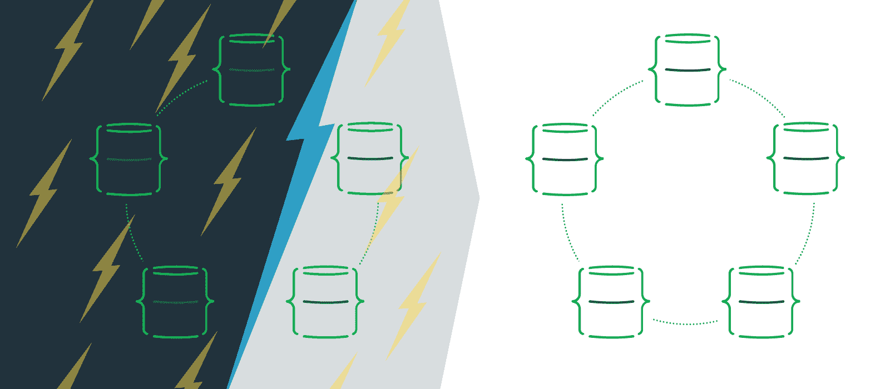
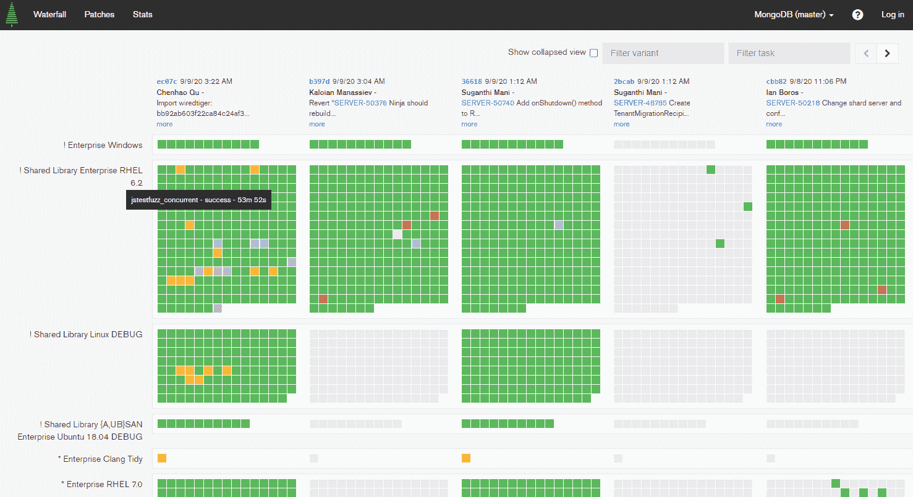
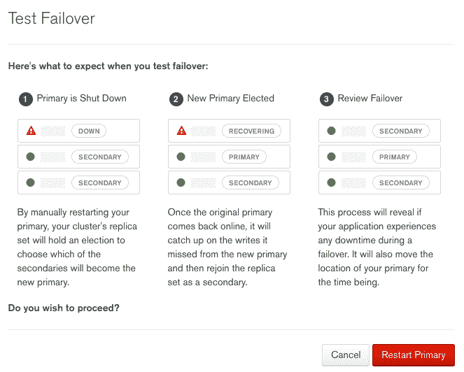
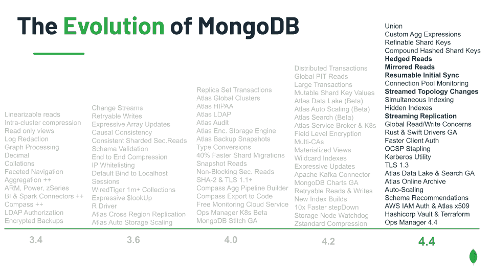

# MongoDB 如何在混乱中茁壮成长

> 原文：<https://thenewstack.io/how-mongodb-thrives-in-chaos/>

[MongoDB](https://www.mongodb.com/cloud/atlas/) 赞助本帖。

 [马克·史密斯

Mark 是 MongoDB 的高级开发人员。自 90 年代中期以来，他一直从事开发工作；这些天专门研究 Python 和 Rust。当他不坐在电脑键盘前时，你可能会发现他正在从头开始焊接一个新的。](https://www.linkedin.com/in/bedmondmark/) 

如果你在 10 月 6-8 日的[混沌会议](https://www.chaosconf.io/)的赞助商名单上看到 MongoDB，你的第一个想法可能是，“*为什么 MongoDB 要赞助一个关于混沌工程的会议？*

答案很简单。构建了世界上最流行的分布式数据库之后，我们对构建在高度竞争的网络环境中运行良好的系统略知一二。

如果您正在构建高度可伸缩的分布式系统，那么您需要一个在这些环境中运行良好的数据库——我们已经有了。

混沌工程是一项高投入、高成本的事业。这并不意味着只有一台 web 服务器和一个数据库的环境。只有当您使用运行大量服务和复制数据库的大型服务器集群时，它才是有价值的，最好是跨多个主机提供商或可用性区域。

在这样的环境中，服务会上下旋转来处理您的需求，[冗余是最基本的](https://youtu.be/CZ3wIuvmHeM?t=1771)。因为你故意在网络中制造混乱，或者仅仅是因为，在这种规模下，*混乱发生了*，你真的需要一个默认分布和自我修复的数据库。

MongoDB 被设计为可以在多台服务器上运行您的数据的多个副本。在服务器或网络出现故障的情况下——假设有足够的服务器可用——集群将选择一个新的主服务器，而*将继续运行*。如果可用的服务器太少，群集将进入只读状态，直到网络问题得到解决，服务器可以再次达到法定数量。

在出现网络分区的情况下，MongoDB 会保护您的数据安全，直到集群被自动重新组合

MongoDB 集群可以跨多个可用性区域运行，甚至可以跨托管平台运行，以获得额外的冗余。如果您曾经做过失去整个可用性区域而让您的服务保持可用的噩梦，MongoDB 将能够帮助您。事实上，如果您希望所有这一切都为您解决，MongoDB 的托管数据库解决方案 [MongoDB Atlas](https://www.mongodb.com/cloud/atlas) 支持多个可用性区域，而无需您付出任何努力——只需选择选项。

## 在困难的网络条件下得到验证

我们全力以赴运行复杂的网络测试，作为我们发布过程的一部分——以至于我们建立了自己的工具， [Evergreen](https://engineering.mongodb.com/post/evergreen-continuous-integration-why-we-reinvented-the-wheel) 来做这件事。

Evergreen 的公共仪表板显示了 MongoDB 集成测试的结果

在网络分区或节点故障的情况下，MongoDB 优先考虑一致性而不是可用性。该服务自动支持[可重试写入](https://docs.mongodb.com/manual/core/retryable-writes/)，提高了集群暂时不可用时的可用性——例如在集群内选举期间——而无需手动将该特性添加到您的应用程序代码中。

作为每个版本的一部分，我们都会运行 [Jepsen](https://www.mongodb.com/jepsen) 测试，这些测试会引发难以重现的错误，并评估数据在极端故障情况下的正确性和安全性——包括同时发生的网络分区、漂移的系统时钟和重复的节点崩溃。其设计是这样的，在任何情况下，当网络分区结束时，群集会重新组合在一起，不会丢失任何数据。

MongoDB 是一个广泛的产品。为了确保我们的数据库符合需求的正确行为，我们构建了一个[JavaScript fuzzing framework](https://engineering.mongodb.com/post/mongodbs-javascript-fuzzer-creating-chaos)，它采用我们现有的测试套件并对其进行启发式变异，创建混乱的输入以揭示未经测试的代码路径中的错误。

MongoDB Atlas 甚至包括一个[特性](https://www.mongodb.com/blog/post/planning-for-chaos-with-mongodb-atlas-using-the-test-failover-button)来强制进行节点故障转移，这样您就可以确保您的服务在出现可用性问题的情况下发挥作用。

MongoDB Atlas 允许您针对主要故障转移明确测试您的软件

尽管 MongoDB 一直是按设计分发的，但 MongoDB 4.4 的最新版本引入了新的特性，确保这一核心特性比以往任何时候都更好。*镜像读取*意味着在发生故障转移的情况下，辅助服务器可以使用预热的缓存。*可恢复的初始同步*确保添加到集群中的新服务器能够稳健地处理间歇性网络错误，同时跟上集群其余部分的速度。*流式拓扑更改*确保在节点故障或维护事件后选择新的主节点时，集群拓扑更改会实时流回驱动程序。因此，客户端可以立即对集群状态变化做出反应，根据需要切换打开的连接。

在许多新特性中，MongoDB 4.4 包括几个弹性特性

## 设计成分布式的

在混乱的环境中，无处不在的监控是必不可少的。在 MongoDB 的情况下，实例、集群，甚至 [MongoDB Atlas](https://engineering.mongodb.com/post/evergreen-continuous-integration-why-we-reinvented-the-wheel) ，都可以很容易地在较低的级别进行监控。数据库为您提供了更改流—对针对您的数据执行的操作的直接、流式访问。MongoDB Atlas 甚至提供了在这个平台上构建的无服务器功能，允许开发人员基于这个特性构建和部署 JavaScript 触发器。

MongoDB 的无模式设计适合敏捷的微服务架构，因此您的服务的数据模型可以更改以适应不断变化的需求，而没有大型数据库模式迁移的风险、困难或成本。当然，如果您需要的话，它也支持模式验证。

最后，使用 MongoDB Realm 数据库的同步功能，您可以构建移动或其他边缘应用程序，这些应用程序可以处理不可靠的网络，继续保持可用并在本地存储数据，直到下次联机，数据再次与服务器同步。

因此，如果您需要一个分布式数据库，能够处理部分不可用的集群，能够在世界各地的节点上托管您的数据，并且能够以最精细的粒度进行监控，那么您绝对应该考虑在下一个项目中使用 MongoDB。

简而言之，MongoDB 在混乱中茁壮成长——这就是为什么我们选择成为[混乱会议](https://www.chaosconf.io/)的一部分。

通过 Pixabay 的特征图像。

*目前，新堆栈不允许在该网站上直接发表评论。我们邀请所有希望讨论某个故事的读者通过 [Twitter](https://twitter.com/thenewstack) 或[脸书](https://www.facebook.com/thenewstack/)访问我们。我们也欢迎您通过电子邮件发送新闻提示和反馈: [feedback@thenewstack.io](mailto:feedback@thenewstack.io) 。*

<svg xmlns:xlink="http://www.w3.org/1999/xlink" viewBox="0 0 68 31" version="1.1"><title>Group</title> <desc>Created with Sketch.</desc></svg>