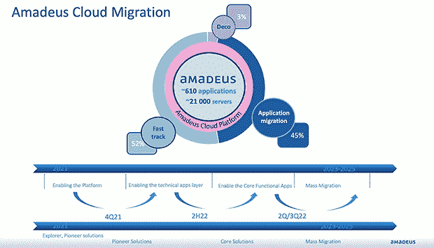

# MongoDB 的 Atlas 如何帮助 Amadeus 重新设计一个重要的应用程序

> 原文：<https://thenewstack.io/how-mongodbs-atlas-helped-amadeus-reengineer-a-crucial-app/>

Amadeus 是一家旅游技术公司，业务遍及 190 多个国家，拥有约 16，000 名员工，在行业中有着巨大的影响力。2019 年是新冠肺炎疫情之前旅游业的最后一个“正常”年份，该组织在其分销平台上记录了超过 6.46 亿次预订。

但该公司的领导人知道，停滞不前不会帮助 Amadeus 跟上竞争对手的步伐，也不会让客户长期满意。它需要更低的延迟，使其数据中心离用户更近。它需要更强的弹性、持续的创新和更快的最新功能上市时间。它想要更严格的安全措施，遵循 T2 的零信任原则。

所有这些都需要转向[云](https://thenewstack.io/category/cloud-services/)。

在这个过程中，该公司需要更新一个关键的遗留应用程序 Amadeus Revenue Integrity (ARI)。这个独一无二的应用程序通过在通过 Amadeus 预订的机票的后处理阶段应用一套规则来管理和保护 Amadeus 的收入，标记和解决重复预订等错误。

它还需要在两年的时间内迅速进行更新。ARI 混合使用了 MariaDB、 [Oracle](https://developer.oracle.com/?utm_content=inline-mention) 和 Elasticsearch，并在亚利桑那州的一个内部数据中心部署了近十年。该公司希望在 2023 年初关闭数据中心。

正是在这个时间表上，Amadeus 转向了 MongoDB 的 Atlas，这是一个完全托管的云数据库，可以处理在云上部署、管理和修复部署的复杂性。

Amadeus 的 MongoDB DevOps 部门经理 Angelika Gross 在 6 月的 MongoDB World 2022 期间的一次演讲中证实，“Atlas 对于满足云迁移的时间限制是必要的。

## 庞大的项目，紧迫的时间表

紧张的两年时间表包含了一个大规模的项目:Amadeus 运行超过 610 个应用程序和 21，100 台服务器。下图显示了将被快速跟踪到云的应用程序的百分比，以及将被淘汰的应用程序的百分比。

由于迁移中包含的应用程序和数据是 Amadeus 生态系统的一部分，而不是它自己的独立实体，因此它使用的中间件和依赖项也需要迁移到云。安全问题源于中间件和那些依赖性，导致团队对其操作模型进行了相当大的改变。

Atlas 是云原生的和生产就绪的，但这里突出的特点是它的透明可伸缩性。然而，Amadeus 仍然继续进行自己的性能测试和定制。

Amadeus 部署了三个运营经理。它们在 MongoDB 4.2+上支持分布在 550 个节点上的 110 个集群，总数据量为 170。最大的集群有 64 个节点和 170 个碎片，构成 48 TB 的数据。它最繁忙的集群有 9 个节点，9 TB 的数据，处理大约 20，000 个查询，其中 99%的查询耗时不到 5 毫秒，还有 35，000 个更新，其中 99%的更新耗时不到 5 毫秒。

为了确保适当的扩展和调整以获得最佳的查询性能，Amadeus 使用随机的生产流量样本进行了注入测试，并咨询了 MongoDB 工程师。

这产生了一个可靠的迁移计划，逐月扩展集群，并发现了一个主要的应用程序瓶颈，该瓶颈消耗的 CPU 大约是该规模的服务器操作所需 CPU 的 10 倍。

该系统包括一些没有完全使用 SSL 的工具。虽然它是功能性的，但它没有使用云。

“Amadeus 进行了几项修改，以确保它在任何地方都使用 DNSserv 连接方案，以便能够轻松隐藏 Atlas 集群的拓扑结构，”Amadeus 云原生应用开发和 SRE 负责人 Florent Coquelet 在 MongoDB World 2022 的一次演讲中说。

## 使用 Atlas 创建自定义解决方案

以下是 Amadeus 为满足 Atlas 的需求而进行的一些定制:

### 安全性

数据安全总是很重要，但 Amadeus 尤其意识到这一点，因为它存储着乘客的航班数据。该公司与 Atlas 的文件加密一起工作，以确保数据安全。

Atlas 在数据静止时提供文件级加密，在数据传输时提供 TLS v 1.2。Amadeus 更进了一步，增加了自定义密钥管理以及密钥标识符和密钥库凭证的轮换。Amadeus 增加了双因素识别、日志认证和审计过滤器。

### 连通性

对于 Amadeus 的团队来说，数据中心的连接从来都不是一个大话题，但迁移到云是一种全封闭的方法，这意味着所有类型的连接都需要一个请求。这就产生了一个新的问题:如何向这个环境中添加一个外部提供者？

下图说明了与数据中心的连接。

据 Gross 说，Amadeus 认为专用链路是连接数据库的最佳方式，因为它更喜欢出站流量而不是入站流量，因为出站流量更容易保护和控制。

连接到 API 以实现所有自动化的唯一方式是通过互联网。Amadeus 保持流量安全的策略是保持 IP 访问列表极其有限。

Amadeus 使用所有网络选项连接到密钥库，因为这是唯一可行的选项。虽然还不可用，Gross 说旅游公司期待 MongoDB 为其提供私有端点支持。可以通过互联网和数据库访问活动目录。Amadeus 正在探索是否需要虚拟网络对等，或者是否可以通过 DNS 解析来实现。

### 自动化

Terraform 用于基础设施，负责配置。MongoDB Atlas Terraform provider 用于创建托管在 Microsoft Azure 中的 Atlas 集群，以创建私有链接并配置备份。Azure Terraform provider 用于创建私有端点并管理存储帐户和密钥库。

## 经验教训

尽管云迁移仍在进行中，Amadeus 团队已经学到了许多宝贵的经验。

当该公司遇到 CPU 瓶颈时，它将服务器从 M30 扩展到 M80 集群，实施代码更改并发现显著的改进，将响应时间从 250 毫秒降至 50 毫秒。

当在 IOPS 上发现一个瓶颈时，该团队调用了从 4TB 到 16，000 IOPS 的存储并解决了这个问题。

在将新模块添加到生产中之前，会进行一个测试生产周期。例如，团队备份、恢复和关闭集群，以观察应用程序的行为。团队总是在部署之前让应用程序执行。

到目前为止，Amadeus 和 MongoDB Atlas 合作推出了 MongoDB Atlas 的开箱即用和定制云解决方案，这是一个良好的开端。

Amadeus Group 平台服务负责人 Luc Choubert 告诉 New Stack:“我们对交付速度、解决方案带来的灵活性及其集成到我们自己的运营生态系统中的能力感到满意。”。“这绝对是成功开始我们的云之旅的好方法！”

<svg xmlns:xlink="http://www.w3.org/1999/xlink" viewBox="0 0 68 31" version="1.1"><title>Group</title> <desc>Created with Sketch.</desc></svg>