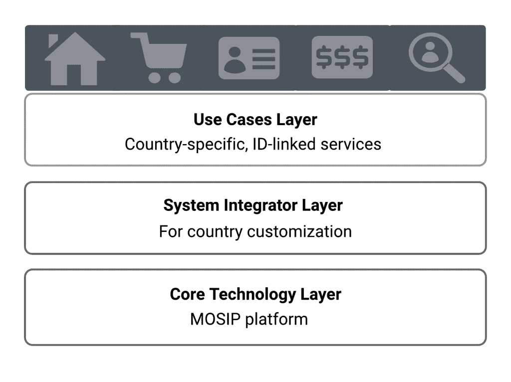
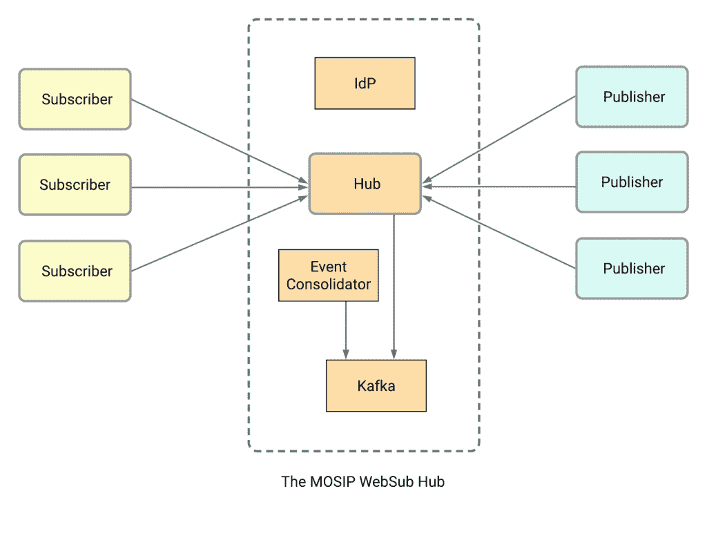

# MOSIP 如何使用 Ballerina WebSubHub 进行事件驱动的集成

> 原文：<https://thenewstack.io/how-mosip-uses-ballerina-websubhub-for-event-driven-integration/>

[Ballerina](https://ballerina.io/) 是一种面向云的开源编程语言，使得使用、组合和创建网络服务变得更加容易。除了强大的语言功能，它还带有丰富的[标准库](https://lib.ballerina.io/#stdlibs)，涵盖网络数据、消息和通信协议。让我们来看看模块化开源身份平台( [MOSIP](https://mosip.io/) )，一个目前被多个国家采用来管理其民事登记数字化的开源身份平台，如何使用芭蕾舞演员 WebSubHub 模块进行事件驱动的通信。

## 模块化开源身份平台(MOSIP)

 [达克希什塔·拉特纳亚克

Dakshitha 是 WSO2 的开发者关系倡导者。她在软件开发、解决方案架构和中间件技术方面拥有超过 10 年的经验。](https://www.linkedin.com/in/dakshitha-ratnayake-3197181a/?originalSubdomain=lk) 

一个国家的个人身份识别系统是有效提供公共和私人服务的基础。有了多用途基本身份识别系统，公民从政府处获得一个唯一的标识符，可用于身份声明和验证。

MOSIP 由比尔和梅林达·盖茨基金会、拉坦·塔塔爵士信托基金和奥米迪亚网络资助，是一个基础身份平台，帮助政府和其他组织以经济高效的方式实施数字和基础身份系统。

各国可以自由使用 MOSIP 来构建自己的身份系统，并解决常见的实施挑战，如确保系统的唯一性、互操作性、设计隐私性、可扩展性、无供应商锁定和可负担性。通过一个国家的身份数据库，MOSIP 可以用于身份发布和验证，并与向组织和国家等提供广泛产品和解决方案的多个服务提供商集成。

由于其模块化架构，MOSIP 在政府如何在 MOSIP 之上实施和配置其基础 ID 系统方面提供了灵活性，如下图 1 所示。

图 1–MOSIP 的模块化架构

## 对事件驱动集成的需求

在典型的用户注册场景中，必须通知民事登记处来注册新生儿的出生。这一事件在身份平台中创建了一个数字角色，并将用于各种场合，从提供涉及疫苗接种、教育和人的一生中的其他方面的服务，包括对其死亡的登记。最初，性别、出生日期和生物特征等一组最基本的属性可用于形成身份，并与其父母和出生证明相关联。此事件是核心身份注册事件。

随后，政府在向其他政府实体提供各种服务以及可靠、及时的信息和数据时，可以使用该平台对用户进行身份验证，这些政府实体包括卫生部、人口登记处、养老基金系统、选举和个人身份识别服务、研究机构等。

基本 ID 可以访问各种政府和私人服务。如果姓名、地址、婚姻状况或其他细节发生变化，或者如果所述人员死亡，多个系统必须对这些事件采取行动以执行各种任务。

因此，不同系统之间需要事件驱动的通信。因为这可能需要复杂的集成和 IP 白名单，MOSIP 团队决定这些事件必须通过 HTTP(而不是通过 Kafka 之类的消息代理)传输，以便外部系统使用它们，从而保持集成的简单性和外部系统部署的便利性。

## WebSub

作为分布式发布/订阅通信的开放协议，WebSub 最初名为 PubSubHubbub，在 W3C 社交网络工作组中得到完善，随后作为 W3C 推荐标准发布。WebSub 被广泛采用来代替服务器轮询。WebSub 的一个主要优势是，它将实时数据的发布者和订阅者聚集在一起，允许以安全、可信的方式发布和更新内容，并可以避免对网络的定期请求。WebSub 的安全通信环境是通过发布者-集线器-订阅者数据传输链提供的。

这个模式中的三个主要实体是发布者、中心和订阅者。

*   发布者是制作内容并在线发布的制作方。
*   集线器充当发布者和订阅者之间的中介。它接受来自发布者的内容，并根据订阅者订阅的内容将其推送给订阅者。
*   订户是 WebSub 模式中的消费者一方。他们找到出版商的主题所宣传的中心，并订阅主题。

出版商向中心发布新内容或更新更改。通过 hub 注册这些主题的订阅者通过来自 hub 的 HTTP Post 调用安全地获得相关内容。订阅后，他们将安全地共享到集线器的 HTTP 回调端点。

## 利用芭蕾舞演员 WebSubHub

MOSIP 需要一个集成机制来交流一些关键事件。他们使用 Ballerina 的 [WebSubHub](https://github.com/ballerina-platform/module-ballerina-websubhub) 包通过 HTTP 进行事件驱动的通信——类似消息代理的功能通过 API 向外部方公开。

Ballerina WebSubHub 包/库为 WebSubHub 服务和 WebSub publisher 客户端提供 API。一个 [WebSubHub](https://www.w3.org/TR/websub/#hub) 是一个实现，它处理订阅请求，并在相应的主题 URL 更新后将内容分发给订阅者。如下图 2 所示，hub 是使用 Ballerina 实现的，事件传输通过 WebSub 进行。

单个发布者是在一个或多个资源 URL 上公布主题和中心 URL 的实现。订阅者是 Java 实现，因为它们必须与现有模块集成。

MOSIP 目前使用该 WebSub 实现在内部子系统之间进行基于事件的通信，如 ID 存储库和身份验证，并与打印合作伙伴通信，一旦创建或更新身份，该平台将把要打印在身份卡上的详细信息传送给打印合作伙伴。

## 为什么是芭蕾舞演员 WebSubHub？

MOSIP 需要一个现有的开源实现来为其特定需求执行定制。因此，芭蕾舞演员和 MOSIP 团队合作添加了额外的功能，如数据持久性、可靠的数据传输、安全性和附加的服务质量(QoS)，以根据 MOSIP 的要求在可用的软件包上实施。

## MOSIP 的 WebSubHub 实现

如上图所示， [MOSIP WebSub](https://github.com/mosip/websub) hub 包含与发布者和订阅者对话所需的关键组件，并执行以下功能:

*   执行标准操作，如注册、发布、订阅和取消订阅。
*   启用数据持久性，以便中心可以恢复，即使在重新启动后。
*   恢复消息传递，以防订户变得不可用，并在一段时间后再次可用。
*   处理集线器和订户之间的暂时性消息传递失败。
*   验证和授权中心操作，如发布到中心、订阅、取消订阅等。
*   基于订户数量进行扩展。

除了用于传输层安全性的标准 SSL/TLS 之外，身份提供者还用于处理带有 OAuth2 和 JWT 令牌的身份验证和授权请求。Kafka 消息代理支持消息持久性、订阅管理等。为了避免由于订阅和主题注册事件的重复而导致的竞争情况，事件合并器通过删除重复事件来更新系统的合并状态。

## 自定义

### 数据持久性和可靠交付

*   可能会出现订户长时间停机的情况(例如，超过六个小时)。在这种情况下，消息存储在 Kafka 中，一旦订户重新上线，就会提供一个 API 来检索它们。另一种选择是跟踪未送达的消息，并在它们返回并订阅后推送错过的更新。
*   出现暂时性错误或网络问题时允许重试。如果出现永久性错误(如无法联系到订阅者)，订阅者必须重新订阅，并从上次收到消息的地方继续。如果集线器崩溃，它必须通过消息代理(Kafka)提供的持久性来恢复最后的状态。

### 发布者和订阅者访问中心的 OAuth2 令牌验证

*   可能存在这样的情况，即只有给定的一组发布者被允许发布关于给定主题的帖子。所以需要 OAuth2 令牌和角色验证来确认发布者是否被授权发布某个主题。发布者必须具有用于发布的令牌，并且集线器将使用所呈现的令牌来验证角色。
*   当向订阅者发布事件时，WebSub 规范依赖于与订阅一起发送的秘密，根据该秘密来验证传入的更新。这里，订阅者在订阅时也需要 Oauth2 令牌和角色验证。订户将使用该秘密来确保每个事件都是由注册的集线器传递的。

### 计划的改进

*   在可伸缩性增强方面，团队正在考虑自动扩展中心，以便随着消息和订户数量的增加而更快地交付操作。
*   在取消订阅然后重新订阅的情况下，在此期间发布到主题的消息不应发送给订阅者。

## 当前部署

*   到目前为止，在菲律宾的部署已经生成了大约 2600 万个唯一识别码(uin ),每天大约有 25 万个应用程序被处理以生成 uin。该中心，没有卡夫卡集成，正在生产中。最新版本仍在测试中，预计将于 2022 年投入生产。
*   [摩洛哥](https://www.mosip.io/news-events/mou-between-government-of-morocco-and-iiit-b)有一个小的部署，在 Openshift 上的本地部署，在 AWS 上有一些组件。
*   在全球范围内，有超过八个针对开发、QA、测试和生产的内部部署。

点击此处阅读更多关于与国家[正在进行的合作的信息。](https://www.mosip.io/news-events.php?cat=announcements)

*要了解有关 Ballerina 的更多信息，以及它如何帮助您组合和创建符合您特定需求的网络服务，请点击* [*此处*](https://ballerina.io/) *。*

<svg xmlns:xlink="http://www.w3.org/1999/xlink" viewBox="0 0 68 31" version="1.1"><title>Group</title> <desc>Created with Sketch.</desc></svg>