# Apache Cassandra 4.0 快多少？

> 原文：<https://thenewstack.io/how-much-faster-is-apache-cassandra-4-0/>

[Juliusz Stasiewicz](https://www.linkedin.com/in/juliusz-stasiewicz-a401678a/?originalSubdomain=pl)

[Juliusz 是 ScyllaDB 的一名软件工程师。他还在许多公司从事 C++编程，包括 Samsung 和 DataStax。](https://www.linkedin.com/in/juliusz-stasiewicz-a401678a/?originalSubdomain=pl)

经过近六年的工作，Apache Cassandra 背后的工程师将其主要版本从三个增加到四个。六年包含了几乎整个技术周期，新的 Java 虚拟机，新的系统内核，新的硬件，新的库，甚至新的算法。这些领域的进步为 Cassandra 背后的工程师提供了前所未有的机会来实现新的性能水平。他们没收了吗？

作为 Cassandra 兼容的开源数据库 [ScyllaDB](https://www.scylladb.com/) 的工程师，我们对 Cassandra 4.0 的性能感到好奇。具体来说，我们想了解 Cassandra 4.0 的性能相对于 Cassandra 3.11 和 ScyllaDB 开源 4.4.3 有多高。所以我们对他们进行了测试。

彼得·格拉博斯基

从年轻时起，Piotr 就参加了许多竞争性的编程竞赛。他总是努力掌握最新的商业和科技新闻，没有一天不查看他的 RSS 阅读器。Piotr 拥有华沙大学的计算机科学学士学位，现在正在攻读硕士学位。

我们开始测试各种工作负载的延迟和吞吐量，以及常见管理操作的速度，如扩展集群和运行主要压缩。为了评估每个数据库的性能，我们在 Amazon EC2 上的相同硬件(3.4x 大型计算机(48 个 vCPUs))上，在 us-east-2 的单个可用性区域中，比较了三个数据库的三节点集群。

数据库集群服务器使用干净的 Amazon 机器映像进行初始化，运行 CentOS 7.9 和 ScyllaDB 开源 4.4.3 以及 Ubuntu 20.04 和 Cassandra 4.0 或 Cassandra 3.11。我们在 AWS 上选择了相对典型的当代服务器，以便其他人可以复制我们的测试，并反映真实世界的设置。

这篇文章对以下方面的关键性能发现进行了技术总结:

*   不同数据分布的吞吐量和延迟
*   添加新节点
*   集群规模翻倍
*   替换单个节点
*   执行大规模压缩

有关所有测试的完整细节，包括您自己可以用来执行测试的特定配置，请参见 43 页的 [Cassandra 4.0 基准测试报告](https://www.scylladb.com/wp-content/uploads/wp-apache-cassandra-4-performance-benchmark-3.pdf)。

## **吞吐量和延迟**

基准测试是用`CL=QUORUM`对`cassandra-stress`的一系列简单调用。在 30 分钟内，我们保持每秒发出 10，000 个请求，并监控延迟。然后，我们在 30 分钟内将请求速率再增加 10，000，以此类推(在吞吐量更大的情况下增加 20，000)。重复该过程，直到数据库不再能够承受流量，也就是说，直到`cassandra-stress`无法达到期望的吞吐量，或者直到 90%的延迟超过 1 秒。

 [凯罗尔·巴里拉

凯罗尔是 ScyllaDB 的一名初级软件工程师。他经常作为团队“Armia Prezesa”的成员参加安全 CTF (Capture the Flag)竞赛，在那里他解决 web 安全和逆向工程任务。他目前正在华沙大学攻读计算机科学硕士学位。](https://pl.linkedin.com/in/k-baryla) 

我们使用以下数据分布测试了数据库:

*   “真实”(高斯)分布，合理的缓存命中率为 30%到 60%
*   均匀分布，缓存命中率接近于零
*   “内存中”分布，预计将产生几乎 100%的缓存命中率

对于每个场景，我们运行了以下工作负载:

*   百分之百写
*   100%阅读
*   50%写入和 50%读取

下图突出显示了场景和工作负载样本中每个数据库实现的最大吞吐量，以每秒操作数衡量。

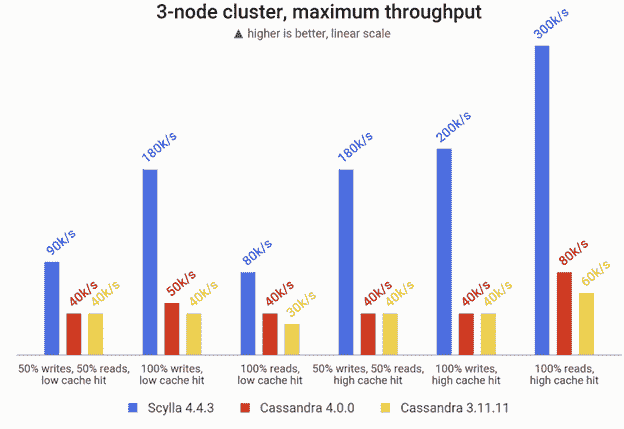

在 3 台 i3 . 4x 大型计算机(48 个 vCPUs)上实现的最大吞吐量(以每秒操作数衡量)

在几个场景中，Cassandra 4.0 比 Cassandra 3.11 的吞吐量提高了 10 到 20 千位/秒。ScyllaDB 处理的请求比 Cassandra 版本多两到五倍。

下表总结了我们测试的每个场景和工作负载组合的性能提升范围。第一列显示了从 Cassandra 3.11 到 4.0 的改进范围，第二列突出显示了 ScyllaDB 在 Cassandra 4.0 上实现的**额外的**性能改进。每行代表在总共 10 个基准测试中实现的最低和最高改进。

对于测试如何进行的具体示例，让我们来看看在均匀分布(磁盘密集型、低缓存命中率)的负载率范围内，90%和 99%的更新查询延迟的结果:

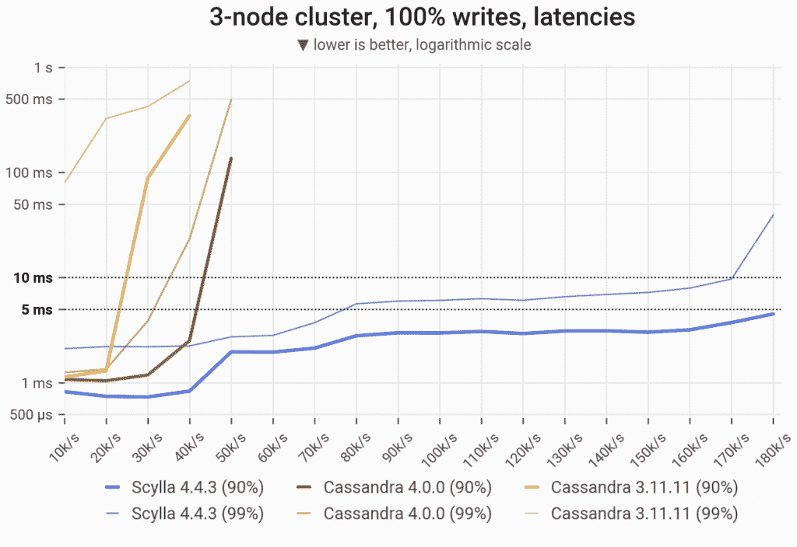

90%和 99%的更新查询延迟是在一系列负载率下在三台 3.4x 大型计算机(总共 48 个 vCPUs)上测量的

在这个场景中，我们发出的查询涉及整个数据集的随机分区(1 TB 数据集中的每个分区都有同等的机会被更新)。Cassandra 3.11 和 Cassandra 4.0 很快在功能上变得不可操作，为尾部延迟超过 1 秒的请求提供服务。ScyllaDB 保持了低且一致的写入延迟，最高可达每秒 170，000 到 180，000 次操作。

但这只是众多测试之一。如前所述，我们的基准测试涵盖了三种不同的场景(100%读取、100%写入以及 50%读取和 50%写入的混合),涵盖了三种数据分布:高斯分布、均匀分布和“内存中”分布，预计会产生几乎 100%的缓存命中率。[参见完整的基准测试报告](https://www.scylladb.com/wp-content/uploads/wp-apache-cassandra-4-performance-benchmark-3.pdf)了解每个数据库在特定测试中的读写表现。

## **行政操作**

除了原始性能的速度之外，考虑日常管理操作的速度也很重要，例如向不断增长的群集中添加节点或替换已失效的节点。以下测试对这些管理任务的性能进行了基准测试。

### **增加一个新节点**

在这个基准测试中，我们测量了向集群添加一个新节点需要多长时间。该群集最初在 RF=3 时加载了 1 TB 的数据。报告的时间是启动 Cassandra/ScyllaDB 节点和完全完成引导(CQL 端口打开)之间的时间间隔。

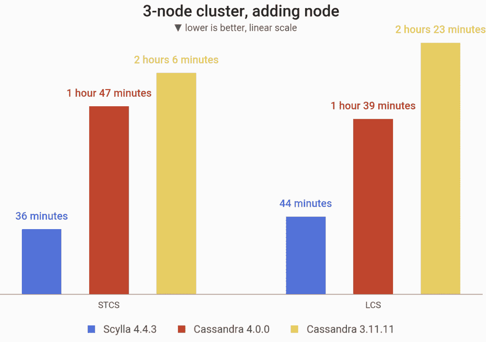

在 RF=3 时，向预加载了 1 TB 数据的现有三节点集群添加一个节点所需的时间(最终有 4 台 3.4x 大型机器)

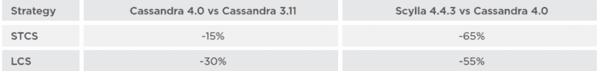

值得注意的是，Cassandra 4.0 包括一个新功能，零拷贝流(ZCS)，它允许整个表(排序字符串表)的有效流。如果一个表的所有分区都需要转移，则该表有资格获得 ZCS，这可能是启用了分级压缩策略(LCS)的情况。为了展示这一特性，我们使用通常的大小分层压缩策略(STCS)运行了下一个基准测试，并与 LCS 进行了比较。

### **集群规模翻倍**

在该基准测试中，我们测量了集群节点数量翻倍所需的时间，从 3 个节点增加到 6 个节点，最终得到 6 台 i3 . 4x 大型计算机。三个新节点是按顺序添加的，等待前一个节点完全启动，然后再启动下一个节点。报告的时间跨度从第一个新节点启动的时刻开始，一直到第三个新节点的引导完成。

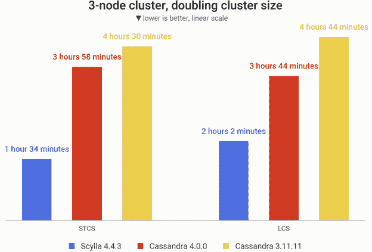

将三个节点添加到现有的 3.4x 大型计算机的三节点集群所需的时间，在 RF=3 时预加载 1 TB 的数据

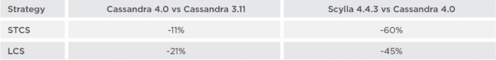

下面是向现有的三节点集群添加三个节点的时间表。

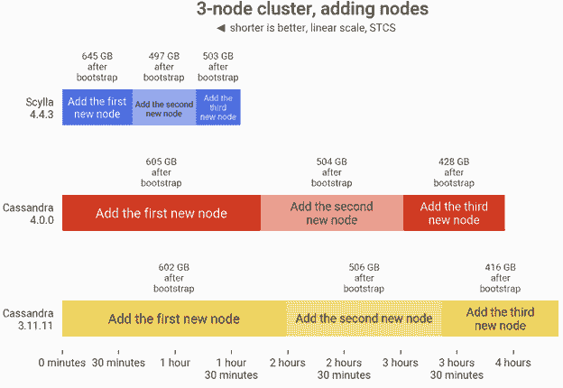

向现有的三节点集群添加三个节点的时间表(最终有六部 i3 . 4x 大型机器)

卡珊德拉 3.11 用了 270 分钟(4.5 小时)，而卡珊德拉 4.0 用了 238 分 21 秒(仅差 4 小时)。ScyllaDB 4.4.3 将集群大小翻倍的总时间是 94 分 57 秒。虽然 Cassandra 4.0 实现了对 Cassandra 3.11 的改进，但 ScyllaDB 在 Cassandra 的任一版本引导其第一个新节点之前就完成了整个操作。

### **更换单个节点**

在该基准测试中，我们测量了更换单个节点所需的时间。其中一个节点关闭，另一个节点在其位置启动。在整个过程中，集群在`CL=QUORUM`时刻受到 25，000 次操作的混合读/写后台负载的影响。

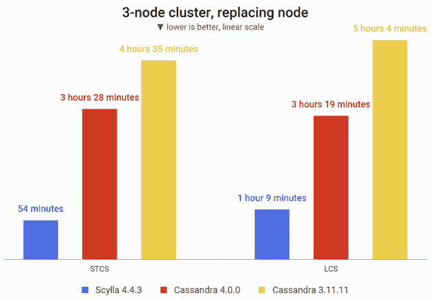

更换预装了 1 台 3.4x 大型计算机的三节点集群中的一个节点所需的时间

## 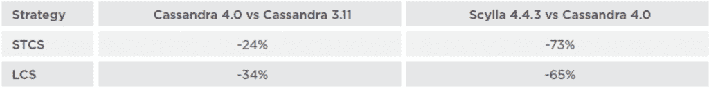

### **进行大压实**

在该基准测试中，我们测量了在加载了大约 1TB 数据的单个节点上执行主要压缩所需的时间。在 ScyllaDB 和 Cassandra 中，主要压缩的结果是相同的:一次读取由单个 SSTable 提供服务。

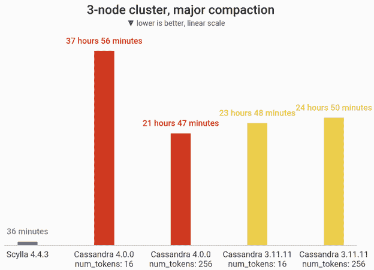

在 3.4x 大型计算机上，在 RF=1 的情况下，主要压缩 1 TB 的数据

*在 3.4x 大型计算机上，在 RF=1 的情况下对 1 TB 的数据进行大规模压缩*

ScyllaDB 使用分片架构，这使得它能够并发地在每个分片上执行主要的压缩。Cassandra 是单线程绑定的。

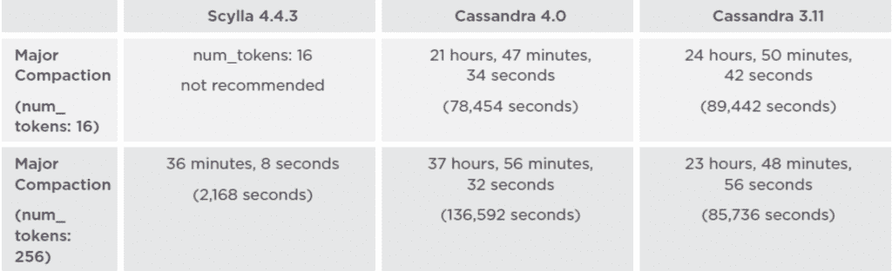

## **包装**

卡珊德拉 4.0 是卡珊德拉 3.11 的进步。很明显，Cassandra 4.0 很好地利用了 JVM 的进步，从 Cassandra 3.11 升级到 Cassandra 4.0 将有利于许多用例。

在我们的测试设置中，Cassandra 4.0 显示只写磁盘密集型工作负载的性能提高了 25%，在缓存命中率较低或较高的情况下，只读负载的性能提高了 33%。否则，两个 Cassandra 版本之间的最大吞吐量相对相似。

然而，大多数工作负载不会在最大利用率下执行，最大利用率下的尾部延迟通常不好。在我们的测试中，我们标记了 P90 和 P99 延迟低于 10 毫秒的服务级别协议的吞吐量性能。在这个服务级别，由新的 JVM/GC (JVM 垃圾收集)支持的 Cassandra 4.0 的性能是 Cassandra 3.0 的两倍。除了纯粹的性能，我们还测试了广泛的管理操作，从添加节点、加倍集群、节点移除和压缩，所有这些都是在模拟生产负载下进行的。Cassandra 4.0 将这些管理操作时间缩短了 34%。

但是对于要求超低延迟和极高吞吐量的数据密集型应用，可以考虑 ScyllaDB 等其他选项。ScyllaDB 提供了相同的 Cassandra 查询语言(CQL)接口和查询、相同的驱动程序，甚至相同的磁盘表格式，但采用了旨在消除 Cassandra 性能问题、限制和操作障碍的现代架构。在我们的基准测试中，ScyllaDB 持续且显著地优于 Cassandra 4.0。在相同的硬件上，ScyllaDB 在几乎所有测试场景中都能承受比 Apache Cassandra 4.0 高 5 倍的流量，并提供更低的延迟。ScyllaDB 完成管理任务的速度也比 Cassandra 4.0 快 2.5 到 4 倍。

而且， [ScyllaDB 的特性集在很多方面都超越了 Cassandra 的](https://www.scylladb.com/2021/11/17/cassandra-and-scylladb-similarities-and-differences/)。一句话:自 2008 年首次发布以来，Cassandra 的性能有所提高，但 ScyllaDB 凭借其[无共享、每核分片架构](https://www.scylladb.com/product/technology/)，充分利用了现代基础设施和网络功能，已经超越了 Cassandra。

<svg xmlns:xlink="http://www.w3.org/1999/xlink" viewBox="0 0 68 31" version="1.1"><title>Group</title> <desc>Created with Sketch.</desc></svg>