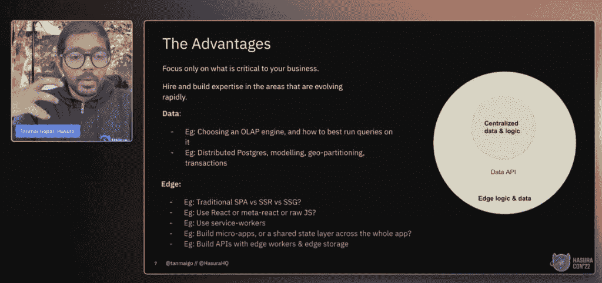
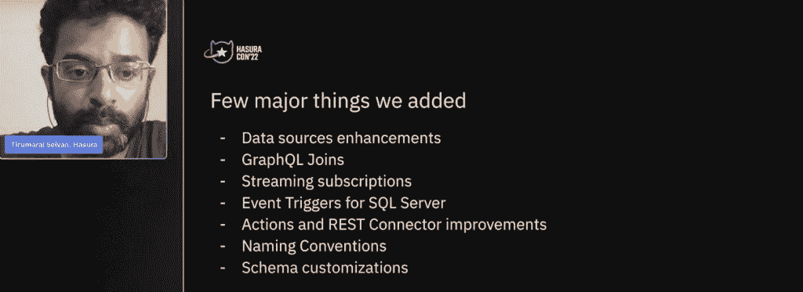
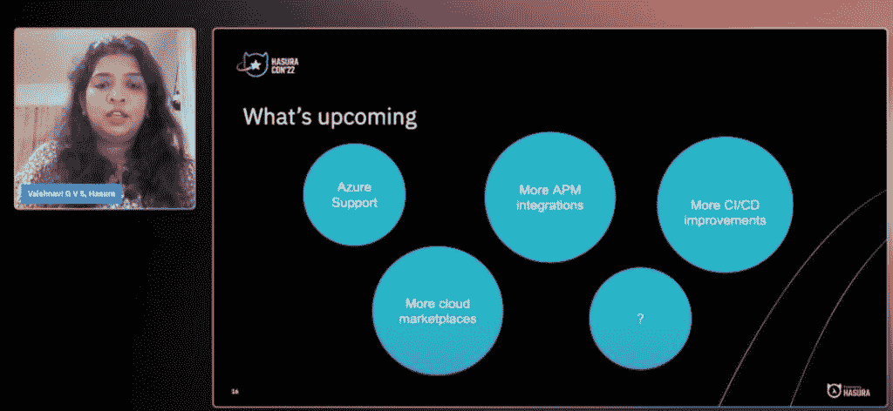
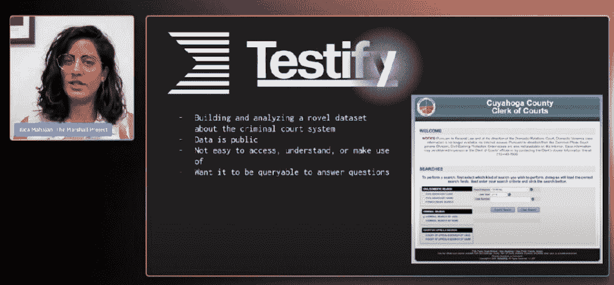
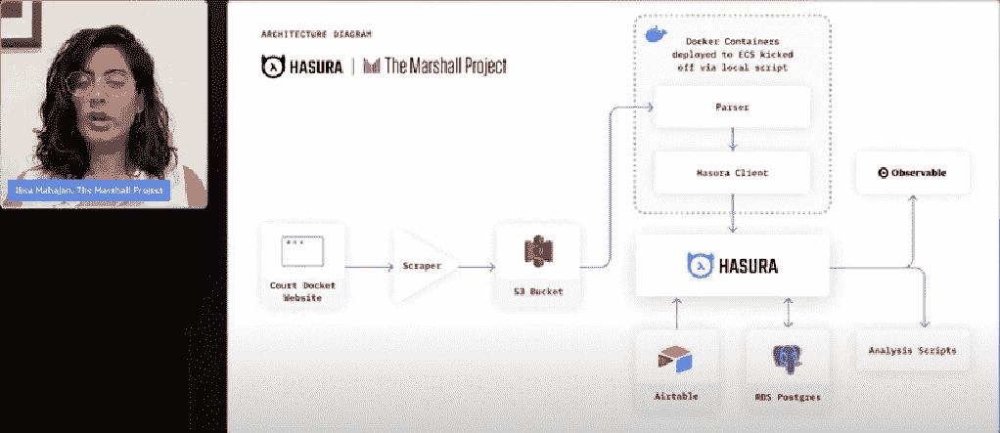

# 一个 GraphQL API 能超越其他 API 多少？

> 原文：<https://thenewstack.io/how-much-reach-can-a-graphql-api-have-over-other-apis/>

软件世界中某些被夸大的工具、过程和平台来来去去。但是，基于它们的采用和优点，我们可以合理地假设，在不久的将来，它们将继续成为软件过程、开发和操作工具的中流砥柱。这些技术中有许多可能属于可观察性、安全性和 API 类别。在 API 领域，需要做大量的工作和改进，以使它们更易于使用和管理，特别是在后端和前端应用程序开发和数据库管理的广泛需求中变得更加适用。为此， [GraphQL](https://graphql.org/) 至少值得一秒钟。

根据 GraphQL 文档，GraphQL 被定义为 API 的查询语言，以及使用您为数据定义的类型系统执行查询的服务器端运行时。它的创建者还强调 GraphQL 不依赖于任何特定的数据库或存储引擎，而是由您现有的代码和数据支持。GraphQL 的好处之一是可以通过一个请求加载数据，而不必访问几个不同的 URL，这与 REST APIs 的情况相同。

Hasura 的年度用户大会 [HasuraCon'22](https://app.konf.co/event/GwzCvenK) 于上周举行，表面上是关于 GraphQL 的，但许多会谈涵盖了 Hasura 为 GraphQL 提供的所有新支持。这些主题涵盖并讨论了 GaphicQL 是如何发展的，以及我们可以期待在未来看到什么。

随着 Hasura 在会议期间宣布推出新的 [Hasura GraphQL 数据连接器(GDC)](https://hasura.io/blog/hasura-graphql-data-connectors/) SDK，Hasura 表示，GraphQL 用户现在可以连接到“所有类型的数据”源。该公司宣布，Hasura Cloud Enterprise 现在可以在 AWS Marketplace 和谷歌云平台上使用。

虽然将 GraphQL 的自动化和兼容性扩展到更多的云环境是值得注意的，但一些会议讨论是从用户的角度面向现实世界的应用程序，以及带有 GraphQL 的 Hasura 层如何提供一些有趣的现实世界的好处。这些特性在讲座中被描述为不仅对后端和前端开发人员有用，而且对那些能够依靠 Hasura 可以说是低代码的特性来分析和通过 GraphQL 的单个 API 将各种不同的数据源分析汇集在一起的用户也有用(下面将详细介绍)。

## 数据端点

在主题演讲中，Hasura 首席执行官 [Tanmai Gopal](https://www.linkedin.com/in/tanmaig) 很好地描述了与组织和边缘共享的不同数据端点集成的数据 API 的上下文，他将其定义为最终用户交互和依赖于一个或多个数据端点运行的应用程序或逻辑的体验。这个简单的概念也代表了开发人员创建“边缘的惊人产品体验”的复杂性的增加 Gopal 说，数据端点、edge 用例以及中间的 API“高度并发”。

这些“高度并发”的数据端点、边缘用例以及 API trifecta 也可以为业务案例提供底层框架。“我们如何处理集中和共享数据，以及如何在多个用户之间处理共享数据，这是我们对产品体验的看法。这就是我们的终端用户消费产品的方式，无论产品是应用程序还是 API，”Gopal 说。“我们不想关注的是我们不得不(在数据端点和边缘用例之间)做的这种无差别的繁重工作——这就是数据 API 的用武之地。”

Hasura 在会议上宣布的新版本反映了该公司以 GraphQL API 为中心、高度自动化和简化的数据驱动应用交付愿景。根据 Hasura 的文档，Hasura 的 GDC 规范和 SDK 允许开发人员扩展 Hasura 的 GraphQL API 功能，而无需等待 Hasura 原生支持他们的数据源。虽然 Hasura 以前帮助将 GraphQL 扩展到多个数据源，而不需要插件，但现在它的范围包括更多的专有或遗留数据源。

“我们的使命是改善访问，所以我们需要去数据所在的地方，因为我们继续将我们的 API 扩展到更多的数据源，”[Hasura 的](https://in.linkedin.com/in/tirumarai-selvan-384a8517)产品经理 Tirumarai Selvan 在一次谈话中说。

这种联合可通过单个 GraphQL API 访问的数据的能力有几个含义。通过能够访问和连接“不同味道”的不同数据库，因此有可能将 GraphQL 的 Hasura 接口可以访问的 [PostgresQL](https://www.postgresql.org/) 和 [SQL Server](https://en.wikipedia.org/wiki/Microsoft_SQL_Server) 数据库、 [Praveen Durairaju、](https://www.linkedin.com/in/praveenonweb/?originalSubdomain=in)开发人员宣传内容经理结合起来。Durairaju 说，有许多用例显示了该功能的易用性，“无需实际修改任何底层代码”。

## 新功能

通过 Join 特性，可以在两个独立的 GraphQL 服务器之间组合数据。有了一个公共标识符，比如一个用户 ID，Hasura 现在可以声明性地配置两个服务器之间的关系，以及启动查询以在两个服务器之间获取数据的能力。Durairaju 说，因此可以将 GraphQL 服务器中的数据连接到数据库表中，“反之亦然”。

Hasura 传达的其他优势包括:

*   流订阅 API 允许用户构建应用程序，将数据批量传输到他们的客户端，并实时更新数据。
*   对 MS SQL Server 的事件触发器支持，允许用户将业务逻辑 API 与 Hasura 连接起来，通过对 SQL Server 数据源的插入/更新/删除等表事件调用 webhooks，将异步后端逻辑集成到他们的应用程序中。

Hasura 也将继续扩大其云覆盖范围。随着 Hasura 在 AWS Marketplace 和 Google Cloud 上的推出，其他云提供商服务上的数据库也将很快推出。虽然 Hasura 产品经理 Vaishnavi G V S 并没有站出来说微软 Azure T10 上的数据库将很快可以使用 Hasura，但她说“我们将考虑支持更多的云提供商，扩展到更多的地区，还将为云企业客户提供更多的集成和改进。”

## 你可以说‘低码’

Hasura 使用 GraphQL 为非工程师甚至是普通开发人员提供的大部分便利是利用 GraphQL API 进行数据库分析，甚至在某些情况下进行后端开发。

通常，后端开发人员会配置 GraphQL，以便非技术用户可以使用 API 来呈现数据库搜索和元分析，这要简单得多。记者在[马歇尔计划，](https://www.themarshallproject.org/)一个无党派和非盈利的新闻项目，它是为了保持美国刑事司法系统的国家紧迫感而创建的，就是一个例子。在那里，记者依靠 Hasura、GraphQL 和其他工具来核实和收集文章的信息和数据，否则涉及多个数据源的文章将需要数百小时(甚至数天)的时间。

例如，Marshal Project reporters 严重依赖 Hasura 接口、GraphQL 和其他数据库工具来帮助完成 evidence 项目。在她的演讲中， [Ilica Mahajan](https://twitter.com/IlicaMahajan) 参与了马歇尔计划，她在哥伦比亚大学完成了一个新闻和计算机科学的双硕士项目，描述了该测试项目如何试图在克利夫兰地区的凯霍加郡的法院系统中建立不公正的模式。Mahajan 说，从历史上看，当记者撰写关于法院系统的报道时，“它可能是一些小数据集的轶事，但我们真的希望获得一个更大的画面，以及在特定法院系统中发生的更大趋势”。

作证项目记者获取的数据是公开的，但数据所在的公开网站非常复杂，而且不便于用户访问和分析。此外，记者需要获得众多被告的数据，每个被告都可能涉及不同的法庭案件，并在刑事法庭受到不同的指控。还收集和分析了该地区法官的数据。

记者为 [Airtable](https://www.airtable.com/) 填写信息，这是一个用于应用程序开发的低代码工具，以便收集数据供 GraphQL API 访问。“Hasura 帮助我们在一个地方看到和可视化所有这些争论数据，”Mahajan 说。

在 API 之下，Mahajan 描述了如何将抓取的数据集转移到亚马逊 S3 桶中。解析完这些文档后，使用 Hasura 写入 PostgreSQL 表，并读取 Amazon RDS 上的 Airtable 表文件。Hasura 然后分析所有的数据，并将其传输到 [Observable，这是一个 JavaScript 笔记本环境](https://observablehq.com/)来分析或可视化数据。Mahajan 说，“一旦我们在一个地方有了所有的数据，这变得特别有用，例如，找到故事，”例如，为了找到可以说话的来源。

## 正在进行的工作

虽然会议涉及的新 Hasura 和 GraphQL 特性和有趣的用例有其优点，但我们仍然只是处于 GraphQL 和 API 在未来可以为数据分析和可视化提供的尖端。

戈帕尔说:“为了实现这样一种未来，即‘我们能否只关注集中式数据，能否只关注具有永远自动化的数据 API 的边缘’，还有大量的工作要做。”。“迈向未来需要做大量的工作。我们今天取得了一些进展，但还有大量工作要做。”

<svg xmlns:xlink="http://www.w3.org/1999/xlink" viewBox="0 0 68 31" version="1.1"><title>Group</title> <desc>Created with Sketch.</desc></svg>