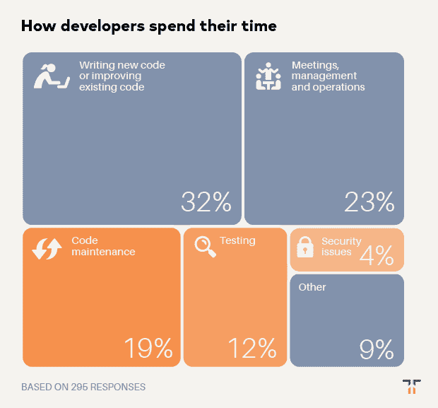
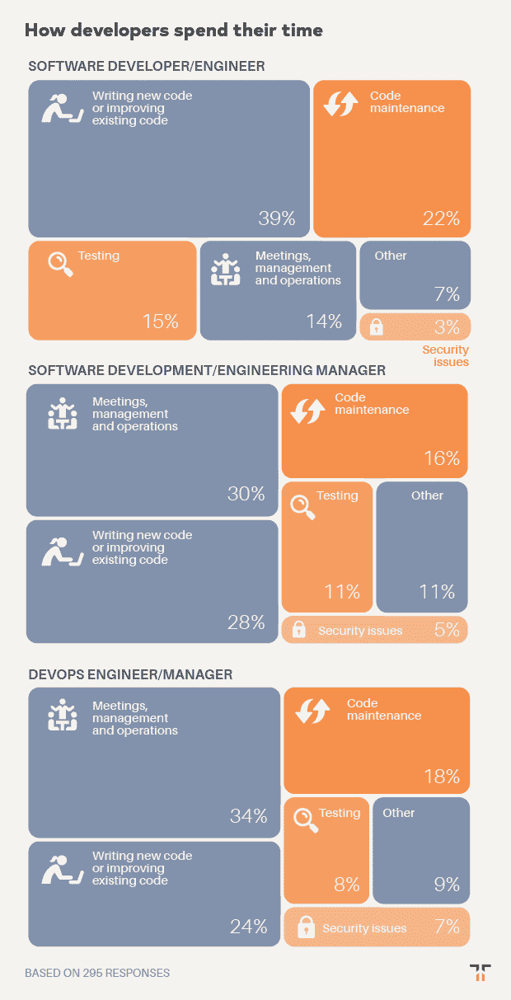
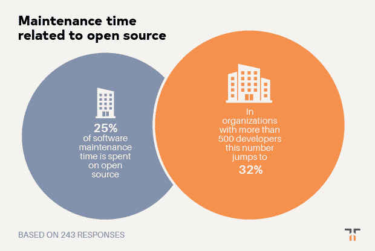

# 开发人员实际花多少时间写代码？

> 原文：<https://thenewstack.io/how-much-time-do-developers-spend-actually-writing-code/>

 [克里斯克

克里斯是 Tidelift 的营销主管。Chris 在创建开源技术公司方面拥有超过 20 年的经验，包括在 Red Hat 和技术品牌代理 New Kind 各工作了 10 年，在那里他帮助创建了 Ansible、NGINX 和 Anaconda 等品牌。](https://tidelift.com/) 

2019 年 6 月，Tidelift 和 New Stack 联合开展了一项专业软件开发人员调查。近 400 人回答了他们今天如何使用开源软件，是什么阻碍了他们，以及什么工具和策略可以帮助他们更有效地使用它。特别是，通过这次调查，我们有兴趣了解一个[管理的开源策略](/how-managed-open-source-boosts-developer-productivity-and-saves-money/)如何帮助开发人员节省时间、加快开发速度并降低风险。

在本帖中，我们分享八个关键发现中的第三个。如果你不想等待剩下的结果，你可以点击下面的链接下载完整的调查报告。

**发现 3:开发人员花在维护、测试和保护现有代码上的时间比他们写或改进代码的时间还多。**

我们想通过这个调查来详细了解开发人员是如何分配时间的。

我们给受访者六个类别来划分他们的时间，并要求他们估计他们在每个类别中投入的工作的百分比。

虽然这对开发人员来说可能并不奇怪，但看到受访者花费不到三分之一的时间编写新代码或改进现有代码(32%)可能会令人沮丧。受访者花费 35%的时间管理代码，包括代码维护(19%)、测试(12%)和应对安全问题(4%)。另外 23%花在会议、管理和运营任务上。

> 受访者花费 35%的时间管理代码，包括代码维护(19%)、测试(12%)和应对安全问题(4%)。

按职位描述细分数据让我们有了更清晰的认识。软件开发人员花 22%的时间做代码维护。他们花在编写新代码或改进现有代码上的时间比例更高(39%)，花在运营任务和会议上的时间比例低得多(14%)。

毫不奇怪，管理软件开发人员的人花在会议上的时间是他们管理的人的两倍。DevOps 工程师和经理在会议上花费的时间甚至更多(34%)，部分原因是他们在促进不同团队之间的沟通。他们还花费两倍的时间(7%)来应对安全问题，这对于熟悉 DevSecOps 趋势的人来说并不奇怪。

我们还要求受访者分享他们花在代码维护上的时间与其开源依赖相关的百分比。根据之前的调查结果(25%)，答案是正确的。但是一旦我们按照组织中开发人员的数量来看数据，它呈现了一个更加严酷的画面。在拥有超过 500 名开发人员的组织中，用于维护活动的时间比例上升到 32%，这可能是因为随着代码库和应用程序变得越来越大，维护问题变得越来越复杂。

这些数据清楚地表明了一件事:组织有很大的机会找到新的方法来增加开发人员花在编写代码上的时间。还能做些什么来提高开发人员的效率，从而减少他们在代码维护等活动上花费的时间？当谈到维护开源依赖时，一种[管理的开源方法](/how-managed-open-source-boosts-developer-productivity-and-saves-money/)将这些维护活动卸载给项目创建者，可能会对返回一些宝贵的开发时间产生很大的影响。

想在一份报告中获得完整的调查结果吗？现在就让他们过来。

<svg xmlns:xlink="http://www.w3.org/1999/xlink" viewBox="0 0 68 31" version="1.1"><title>Group</title> <desc>Created with Sketch.</desc></svg>